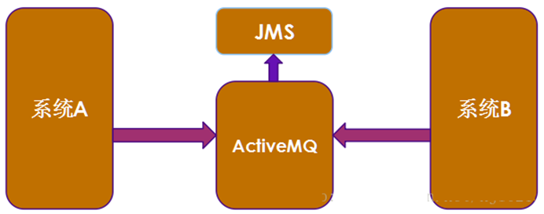
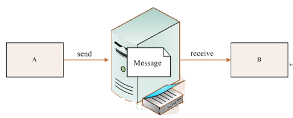
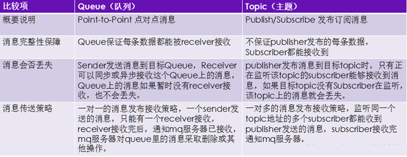

# ActiveMq

## **一.背景介绍**

### **1.1 java消息服务:**

不同系统之间的信息交换，是我们开发中比较常见的场景，比如系统A要把数据发送给系统B，这个问题我们应该如何去处理？ 1999年，原来的SUN公司领衔提出了一种面向消息的中间件服务--JMS规范（标准）；常用的几种信息交互技术(httpClient、hessian、dubbo、jms、webservice 五种).

### **1.2JMS概述:**

JMS即Java消息服务（Java Message Service的简称），是Java EE 的标准/规范之一。这种规范（标准）指出：消息的发送应该是异步的、非阻塞的。也就是说消息的发送者发送完消息后就直接返回了，不需要等待接收者返回后才能返回，发送者和接收者可以说是互不影响。所以这种规范（标准）能够减轻或消除系统瓶颈，实现系统之间去除耦合，提高系统的整体可伸缩性和灵活性。JMS只是Java EE中定义的一组标准API，它自身并不是一个消息服务系统，它是消息传送服务的一个抽象，也就是说它定义了消息传送的接口而并没有具体实现。

### **1.3ActiveMQ概述:**

我们知道JMS只是消息服务的一组规范和接口，并没有具体的实现，而ActiveMQ就是JMS规范的具体实现；它是Apache下的一个项目，采用Java语言开发；是一款非常流行的开源消息服务器.

### **1.4 ActiveMQ与JMS关系:**

我们知道，JMS只是定义了一组有关消息传送的规范和标准，并没有真正实现，也就说JMS只是定义了一组接口而已；就像JDBC抽象了关系数据库访问、JPA抽象了对象与关系数据库映射、JNDI抽象了命名目录服务访问一样，JMS具体的实现由不同的消息中间件厂商提供，比如Apache ActiveMQ就是JMS规范的具体实现，Apache ActiveMQ才是一个消息服务系统，而JMS不是。



## **二.ActiveMQ的使用**

### **2.1 ActiveMQ环境搭建:**

1.ActiveMQ运行需要Java的支持，首先需要配置Java环境变量；

3.切换到解压后的activemq的bin目录下 cd / usr / local / apache - activemq - 5.15.2 去启动

3.切换到bin目录下，启动：./activemq start ;关闭： . / activemq stop

4.启动后有两个端口号，一个是web控制台:8161，一个是消息服务broker连接端口：61616

5.web管理控制台admin URL地址：http : // localhost : 8161 默认登录账号 admin 密码 admin，注意：Linux防火前要关闭 ;通过这个地址可以即时访问交互信息.如下图:


消息服务broker URL地址 : tcp : // localhost : 61616

### **2.2 Java消息队列JMS整体设计结构**

#### 2.2.1 基本要素:

1、生产者producer ; 

2、消费者consumer ; 

3、消息服务broker



#### 2.2.2 交互模型:

#### 2.2.3 JMS两种消息传送模式

##### 点对点（ Point-to-Point）

专门用于使用队列Queue传送消息；基于队列Queue的点对点消息只能被一个消费者消费，如多个消费者都注册到同一个消息队列上，当生产者发送一条消息后，而只有其中一个消费者会接收到该消息，而不是所有消费者都能接收到该消息。

##### 发布/订阅（Publish/Subscribe）

专门用于使用主题Topic传送消息。基于主题的发布与订阅消息能被多个消费者消费，生产者发送的消息，所有订阅了该topic的消费者都能接收到。

### **2.3 Java消息队列JMS API总体概览:**

#### 2.3.1JMS API 概览

JMS API可以分为3个主要部分：

1、公共API：可用于向一个队列或主题发送消息或从其中接收消息；

2、点对点API：专门用于使用队列Queue传送消息；

3、发布/订阅API：专门用于使用主题Topic传送消息。

##### JMS公共API:

在JMS公共API内部，和发送与接收消息有关的JMS API接口主要是：ConnectionFactory / Connection / Session / Message / Destination / MessageProducer / MessageConsumer . 它们的关系是：一旦有了ConnectionFactory，就可以创建Connection，一旦有了Connection，就可以创建Session，而一旦有了Session，就可以创建 Message 、MessageProducer 和 MessageConsumer 。

##### JMS点对点API:

点对点（p2p）消息传送模型API是指JMS API之内基于队列（Queue）的接口：QueueConnectionFactory / QueueConnection / QueueSession / Message / Queue / QueueSender / QueueReceiver .

从接口的命名可以看出，大多数接口名称仅仅是在公共API接口名称之前添加Queue一词。一般来说，使用点对点消息传送模型的应用程序将使用基于队列的API，而不使用公共API 。

##### JMS发布/订阅API:

发布/订阅消息传送模型API是指JMS

API之内基于主题（Topic）的接口：TopicConnectionFactory / TopicConnection /

TopicSession / Message / Topic / TopicPublisher / TopicSubscriber . 由于基于主题（Topic）的JMS API类似于基于队列（Queue）

的API，因此在大多数情况下，Queue这个词会由Topic取代。

### **2.4 ActiveMQ点对点发送与接收消息示例**


#### 2.4.1 简单示例:

写一个采用Queue队列方式点对点发送接收文本信息的Demo,先写发送者,如下:

  ```
package com.kinglong.activemq.queue;

import org.apache.activemq.ActiveMQConnectionFactory;

import javax.jms.*;

/**
* 消息发送者
*
*/
public class Sender {

/**消息服务器的连接地址**/
public static final String BROKER_URL = "tcp://192.168.174.129:61616";

public static void main(String[] args) {
Sender sender = new Sender();
sender.sendMessage("Hello ActiveMQ.");
}

/**
* 发送消息
*
* @param msg
*/
public void sendMessage (String msg) {

Connection connection = null;
Session session = null;
MessageProducer messageProducer = null;

try {
//1.创建一个连接工厂
ConnectionFactory connectionFactory = new ActiveMQConnectionFactory(BROKER_URL);

//2.创建一个连接
connection = connectionFactory.createConnection();

//3.创建一个Session
session = connection.createSession(Boolean.FALSE, Session.AUTO_ACKNOWLEDGE);

//4.创建消息，此处创建了一个文本消息
Message message = session.createTextMessage(msg);

//5.创建一个目的地
Destination destination = session.createQueue("myQueue");

//6.创建一个消息的生产者（发送者）
messageProducer = session.createProducer(destination);

//7.发送消息
messageProducer.send(message);

} catch (JMSException e) {
e.printStackTrace();
} finally {
try {
//关闭连接释放资源
if (null != messageProducer) {
messageProducer.close();
}
if (null != session) {
session.close();
}
if (null != connection) {
connection.close();
}
} catch (JMSException e) {
e.printStackTrace();
}
}
}
}
  ```


再写接收者:

  ```
package com.kinglong.activemq.queue;

import org.apache.activemq.ActiveMQConnectionFactory;

import javax.jms.*;

public class Receiver {

/**消息服务器的连接地址**/
public static final String BROKER_URL = "tcp://192.168.174.129:61616";

public static void main(String[] args) {
Receiver receiver = new Receiver();
receiver.receiveMessage();
}

/**
* 接收消息
*
*/
public void receiveMessage () {

Connection connection = null;
Session session = null;
MessageConsumer messageConsumer = null;

try {
//1.创建一个连接工厂
ConnectionFactory connectionFactory = new ActiveMQConnectionFactory(BROKER_URL);

//2.创建一个连接
connection = connectionFactory.createConnection();

//3.创建一个Session
session = connection.createSession(Boolean.FALSE, Session.AUTO_ACKNOWLEDGE);

//4.创建一个目的地
Destination destination = session.createQueue("myQueue");

//5.创建一个消息的消费者（接收者）
messageConsumer = session.createConsumer(destination);

//接收消息之前，需要把连接启动一下
connection.start();

//6.接收消息
Message message = messageConsumer.receive();

//判断消息的类型
if (message instanceof TextMessage) { //判断是否是文本消息
String text = ((TextMessage) message).getText();
System.out.println("接收到的消息内容是：" + text);
}
} catch (JMSException e) {
e.printStackTrace();
} finally {
try {
//关闭连接释放资源
if (null != messageConsumer) {
messageConsumer.close();
}
if (null != session) {
session.close();
}
if (null != connection) {
connection.close();
}
} catch (JMSException e) {
e.printStackTrace();
}
}
}
}
  ```


总结:

创建过程中有几个重要的注意点,说明一下:

1. session =  connection.createSession(Boolean.FALSE, Session.AUTO_ACKNOWLEDGE);   // 其中:Boolean.FALSE表示本次会话不开启事务管理,假如需要开启事务管理,将其改为Boolean.TRUE即可   //同时需要在发送消息后添加session.commit(),否则,消息是不会被提交的.   //Session.AUTO_ACKNOWLEDGE表示消息确认机制   AUTO_ACKNOWLEDGE:自动确认   CLIENT_ACKNOWLEDGE:客户端确认   SESSION_TRANSACTED:事务确认,如果使用事务推荐使用该确认机制   AUTO_ACKNOWLEDGE:懒散式确认,消息偶尔不会被确认,也就是消息可能会被重复发送.但发生的概率很小   
2. connection.start();   //在消息接收端,接受消息前需要加入这段代码,开启连接,否则一样无法获取消息.   
3. Destination destination = session.createQueue("myQueue");   //创建目的地时,如果做测试收不到信息,可以将目的地名称修改一下,我用的是IDEA,不清楚为何,   //有时候收不到信息,修改一下就好了,猜测可能是缓存的原因吧  

发布与订阅的topic方式实际与点对点的queue方式,代码通用很多,只是在创建目的地Destination时候创建为

  Destination destination =  session.createTopic("myTopic  

#### 2.4.2Queue与Topic比较



#### 2.4.3拉模式与推模式

a.点对点消息，如果没有消费者在监听队列，消息将保留在队列中，直至消息消费者连接到队列为止。这种消息传递模型是

传统意义上的懒模型或轮询模型。在此模型中，消息不是自动推动给消息消费者的，而是要由消息消费者从队列中请求获得(拉模式)。

b.pub/sub消息传递模型基本上是一个推模型。在该模型中，消息会自动广播，消息消费者无须通过主动请求或轮询主题的方法来获得新的消息。

### 2.5 ActiveMQ消息类型

1、TextMessage 文本消息：携带一个java.lang.String作为有效数据(负载)的消息，可用于字符串类型的信息交换；

2、ObjectMessage 对象消息：携带一个可以序列化的Java对象作为有效负载的消息，可用于Java对象类型的信息交换；

3、MapMessage 映射消息：携带一组键值对的数据作为有效负载的消息，有效数据值必须是Java原始数据类型（或者它们的包装类）及String。即：byte , short , int , long , float , double , char , boolean , String

4、BytesMessage 字节消息 ：携带一组原始数据类型的字节流作为有效负载的消息；

5、StreamMessage 流消息：携带一个原始数据类型流作为有效负载的消息，它保持了写入流时的数据类型，写入什么类型，

则读取也需要是相同的类型；

需要注意的是:如果使用对象消息做Demo时,如果使用之前的连接创建方式可能会无法接收到消息,因为安全问题.所以,如果想要使用Demo测试对象消息,创建连接时建议改为这样(官网推荐的连接方式):

```			
  //创建对象消息连接工厂   

ActiveMQConnectionFactory activeMQConnectionFactory = new  ActiveMQConnectionFactory(BROKER_URL);   

List<String > list = new ArrayList<String>();   

list.add("com.kinglong.activemq.receiver");   

list.add("com.kinglong.activemq.model");   

activeMQConnectionFactory.setTrustedPackages(list);  
```


### **2.6 ActiveMQ事务消息和非事务消息**

消息分为事务消息和非事务消息

1、事务消息：创建会话Session使用transacted=true

  connection.createSession(Boolean.TRUE,  Session.AUTO_ACKNOWLEDGE);  

2、非事务消息：创建会话Session使用transacted=false

  connection.createSession(Boolean.FALSE,  Session.AUTO_ACKNOWLEDGE);  

事务消息必须在发送和接收完消息后显式地调用session.commit();

事务性消息，不管设置何种消息确认模式，都会自动被确认；与设置的确认机制无关,但官方推荐事务性消息使用事务确认机制.

### **2.7 ActiveMQ消息确认机制**

消息只有在被确认之后，才认为已经被成功消费，然后消息才会从队列或主题中删除。消息的成功消费通常包含三个阶段：


(1)、客户接收消息；

(2)、客户处理消息;

(3)、消息被确认；


确认机制前面提过一下,共有四种:

#### (1)、Session.AUTO_ACKNOWLEDGE；

客户（消费者）成功从receive方法返回时，或者从MessageListener.onMessage方法成功返回时，会话自动确认消息,然后自动删除消息.

#### (2)、Session.CLIENT_ACKNOWLEDGE；

客户通过显式调用消息的acknowledge方法确认消息,。 即在接收端调用message.acknowledge();方法,否则,消息是不会被删除的.

#### (3)、Session. DUPS_OK_ACKNOWLEDGE ；

不是必须确认，是一种“懒散的”消息确认，消息可能会重复发送，在第二次重新传送消息时，消息头的JMSRedelivered会被置为true标识当前消息已经传送过一次，客户端需要进行消息的重复处理控制。

#### (4)、 Session.SESSION_TRANSACTED；

事务提交并确认。

### **2.8 ActiveMQ持久化消息与非持久化消息**

messageProducer.setDeliveryMode(DeliveryMode.  NON_PERSISTENT);//不持久化   messageProducer.setDeliveryMode(DeliveryMode.  PERSISTENT);//持久化的，当然activemq发送消息默认都是持久化的  

说明:

设置完后,如果为持久化,那么消息在没有被消费前都会被写入本地磁盘kahadb文件中保存起来,即使服务器宕机,也不会影响

消息.如果是非持久化的,那么,服务一旦宕机之类的情况发生,消息即会被删除.

ActiveMQ默认是持久化的.

### 2.9 ActiveMQ消息过滤

ActiveMQ提供了一种机制，可根据消息选择器中的标准来执行消息过滤，只接收符合过滤标准的消息；

生产者可在消息中放入特有的标志，而消费者使用基于这些特定的标志来接收消息；

1、发送消息放入特殊标志：message . setStringProperty ( name , value ) ;

2、接收消息使用基于特殊标志的消息选择器:

  MessageConsumer createConsumer(Destination  destination, String messageSelector);  

注：消息选择器是一个字符串，语法与数据库的SQL相似，相当于SQL语句where条件后面的内容；

具体代码如下:

发送端代码:

  ```
package com.bjpowernode.activemq.selector;

import org.apache.activemq.Active

MQConnectionFactory;

import javax.jms.*;

/**
* 消息发送者
*
*/
public class Sender {

/**消息服务器的连接地址**/
public static final String BROKER_URL = "tcp://192.168.174.129:61616";

public static void main(String[] args) {
Sender sender = new Sender();
sender.sendMessage("Hello ActiveMQ.");
}

/**
* 发送消息
*
* @param msg
*/
public void sendMessage (String msg) {

Connection connection = null;
Session session = null;
MessageProducer messageProducer = null;

try {
//1.创建一个连接工厂
ConnectionFactory connectionFactory = new ActiveMQConnectionFactory(BROKER_URL);

//2.创建一个连接
connection = connectionFactory.

createConnection();

//3.创建一个Session
session = connection.createSession(Boolean.FALSE, Session.AUTO_ACKNOWLEDGE);


//5.创建一个目的地
Destination destination = session.create

Queue("myQueue");

//6.创建一个消息的生产者（发送者）
messageProducer = session.createProducer

(destination);

//设置发送的消息是否需要持久化
messageProducer.setDeliveryMode(Delivery

Mode.NON_PERSISTENT);//这里使用不持久化

//创建一个循环,测试消息标识的使用
for (int i=0; i<20; i++) {
//4.创建消息，此处创建了一个文本消息
Message message = session.createText

Message(msg+i);

//将消息设置一个特有的标识
message.setIntProperty("id", i);

//7.发送消息
messageProducer.send(message);
}
} catch (JMSException e) {
e.printStackTrace();
} finally {
try {
//关闭连接释放资源
if (null != messageProducer) {
messageProducer.close();
}
if (null != session) {
session.close();
}
if (null != connection) {
connection.close();
}
} catch (JMSException e) {
e.printStackTrace();
}
}
}
}
  ```


接收端代码:

  ```
package com.bjpowernode.activemq.selector;

import org.apache.activemq.ActiveMQ

ConnectionFactory;

import javax.jms.*;

public class Receiver {

/**消息服务器的连接地址**/
public static final String BROKER_URL = "tcp://192.168.174.129:61616";

public static void main(String[] args) {
Receiver receiver = new Receiver();
receiver.receiveMessage();
}

/**
* 接收消息
*
*/
public void receiveMessage () {

Connection connection = null;
Session session = null;
MessageConsumer messageConsumer = null;

try {
//1.创建一个连接工厂
ConnectionFactory connectionFactory = new ActiveMQConnectionFactory(BROKER_URL);

//2.创建一个连接
connection = connectionFactory.

createConnection();

//3.创建一个Session
session = connection.createSession

(Boolean.FALSE, Session.AUTO_ACKNOWLEDGE);

//4.创建一个目的地
Destination destination = session.createQueue("myQueue");

//5.创建一个消息的消费者（接收者）,

selector即为消息选择器,通过选择需要的标识,过滤消息接受id为10-15之 //间的消息
String selector = "id >=10 and id<=15";
messageConsumer = session.createConsumer

(destination, selector);

//接收消息之前，需要把连接启动一下
connection.start();

while (true) {
//6.接收消息 同步接收
Message message = messageConsumer.

receive();

//判断消息的类型
if (message instanceof TextMessage)

{ //判断是否是文本消息
String text = ((TextMessage) message).getText();
System.out.println("接收到的消息内容是：" + text);
}
}
} catch (JMSException e) {
e.printStackTrace();
} finally {
try {
//关闭连接释放资源
if (null != messageConsumer) {
messageConsumer.close();
}
if (null != session) {
session.close();
}
if (null != connection) {
connection.close();
}
} catch (JMSException e) {
e.printStackTrace();
}
}
}
}
  ```


### **2.10 ActiveMQ消息接收方式**

同步接收:receive()方法接收消息叫同步接收,就是之前的Demo代码使用的接收方式.在不使用循环方法时接收端代码执行

一次即结束.

异步接收:使用监听器接收消息，这种接收方式叫异步接收,接收端会一直处于监听状态,只要有消息产生,即会接收消息.

下面是异步接收代码:

  ```
package com.bjpowernode.activemq.listener;

import org.apache.activemq.ActiveMQConnectionFactory;

import javax.jms.*;

public class Receiver {

/**消息服务器的连接地址**/
public static final String BROKER_URL = "tcp://192.168.174.129:61616";

public static void main(String[] args) {
Receiver receiver = new Receiver();
receiver.receiveMessage();
}

/**
* 接收消息
*
*/
public void receiveMessage () {

Connection connection = null;
Session session = null;
MessageConsumer messageConsumer = null;

try {
//1.创建一个连接工厂
ConnectionFactory connectionFactory = new ActiveMQConnectionFactory(BROKER_URL);

//2.创建一个连接
connection = connectionFactory.createConnection();

//3.创建一个Session
session = connection.createSession(Boolean.FALSE, Session.AUTO_ACKNOWLEDGE);

//4.创建一个目的地
Destination destination = session.createQueue("myQueue");

//5.创建一个消息的消费者（接收者）
messageConsumer = session.createConsumer(destination);

//接收消息之前，需要把连接启动一下
connection.start();

//6.接收消息 同步接收
//Message message = messageConsumer.receive();

//异步接收，使用监听器接收消息
messageConsumer.setMessageListener(new MessageListener(){
public void onMessage(Message message) {
//判断消息的类型
if (message instanceof TextMessage) { //判断是否是文本消息
String text = null;
try {
text = ((TextMessage) message).getText();
} catch (JMSException e) {
e.printStackTrace();
}
System.out.println("接收到的消息内容是：" + text);
}
}
});
} catch (JMSException e) {
e.printStackTrace();
} finally {
/*try {
//关闭连接释放资源
if (null != messageConsumer) {
messageConsumer.close();
}
if (null != session) {
session.close();
}
if (null != connection) {
connection.close();
}
} catch (JMSException e) {
e.printStackTrace();
}*/
}
}
}
  ```


## **三.ActiveMQ的集成使用:*

### 3.1ActiveMQ与Spring集成(以下是一个简单的上手Demo):

鉴于发送端与接收端pom文件依赖相同,所以只写一份,依赖如下:

 ```
<!--spring-jms依赖-->
<dependency>
<groupId>org.springframework</groupId>
<artifactId>spring-jms</artifactId>
<version>4.3.13.RELEASE</version>
</dependency>

<!--activemq的jar依赖-->
<dependency>
<groupId>org.apache.activemq</groupId>
<artifactId>activemq-client</artifactId>
<version>5.15.2</version>
</dependency>

<!-- JMS规范的jar依赖 -->
<dependency>
<groupId>javax.jms</groupId>
<artifactId>javax.jms-api</artifactId>
<version>2.0.1</version>
</dependency>
 ```


发送端:(需要两个配置文件)

1. applicationContext.xml

  ```
<?xml version="1.0" encoding="UTF-8"?>
<beans xmlns="http://www.springframework.

org/schema/beans"
xmlns:xsi="http://www.w3.org/2001/XMLSchema

-instance"
xsi:schemaLocation="http://www.springframework.

org/schema/beans http://www.springframework.

org/schema/beans

/spring-beans.xsd">

<import resource="applicationContext-jms.xml"/>

</beans>
  ```


2. applicationContext-jms.xml

  ```
<?xml version="1.0" encoding="UTF-8"?>
<beans xmlns="http://www.springframework.

org/schema/beans"
xmlns:xsi="http://www.w3.org/2001/XMLSchema

-instance"
xmlns:context="http://www.springframework.org/

schema/context"
xsi:schemaLocation="http://www.springframework.

org/schema/beans http://www.springframework.

org/schema/beans/

spring-beans.xsd http://www.springframework.

org/schema/context http://www.springframework.org/schema/context/spring-context.xsd">

<context:component-scan base-package="com.kinglong.activemq.sender"/>

<!-- 配置一个连接工厂 -->
<bean id="connectionFactory" class="org.apache.activemq.ActiveMQConnection

Factory">
<property name="brokerURL" value="tcp://192.168.

174.129:61616"/>
</bean>

<!-- 配置JmsTemplate -->
<bean id="jmsTemplate" class="org.springframework.jms.core.JmsTemplate">
<property name="connectionFactory" ref="connection

Factory" />
<property name="defaultDestinationName"

value="springTopic" />
<!--指定消息传送模式，true表示发布订阅、

false表示点对点-->
<property name="pubSubDomain" value="true"/>
</bean>

</beans>
  ```


发送类:

 ```
package com.kinglong.activemq.sender;

import org.springframework.beans.factory.annotation

.Autowired;
import org.springframework.jms.core.

JmsTemplate;
import org.springframework.jms.core.

MessageCreator;
import org.springframework.stereotype.Component;

import javax.jms.JMSException;
import javax.jms.Message;
import javax.jms.Session;
@Component
public class Sender {

@Autowired
private JmsTemplate jmsTemplate;

public void sendMessage (final String msg) {
//发送消息
jmsTemplate.send(new MessageCreator() {
public Message createMessage(Session

session) throws JMSException {
return session.createTextMessage(msg);
}
});
}

}
 ```


下面是测试类:

 ```
package com.kinglong.activemq.sender;

import org.springframework.context.support.

ClassPathXmlApplicationContext;

public class Test {
    public static void main(String[] args) {

        ClassPathXmlApplicationContext context =
        new ClassPathXmlApplicationContext("classpath:app

        licationContext.xml");

        Sender springSender = (Sender)context.getBean("sender");

        springSender.sendMessage("Spring jms ActiveMQ.");

    }
}
 ```


接收端(也同样需要两个配置文件,这里使用异步接收,所以需要配置一个监听器):

1. applicationContext.xml

  ```
<?xml version="1.0" encoding="UTF-8"?>
<beans xmlns="http://www.springframework

.org/schema/beans"
xmlns:xsi="http://www.w3.org/2001/XMLSchema

-instance"
xsi:schemaLocation="http://www.springframework.

org/schema/beans http://www.springframework.

org/schema

/beans/spring-beans.xsd">

<import resource="applicationContext-jms.xml"/>

</beans>
  ```


2. applicationContext-jms.xml

监听器:(MyMessageListener)

  ```
<?xml version="1.0" encoding="UTF-8"?>
<beans xmlns="http://www.springframework.org

/schema/beans"
xmlns:xsi="http://www.w3.org/2001/XML

Schema-instance"
xmlns:context="http://www.springframework.

org/schema/context"
xsi:schemaLocation="http://www.springframework.

org/schema/beans http://www.springframework.

org/schema/beans/spring-beans.xsd http://www.springframework.org/schema/context http://www.springframework.org/schema/context

/spring-context.xsd">

<context:component-scan base-package="com

.kinglong.activemq.receiver"/>

<!-- 配置一个连接工厂 -->
<bean id="connectionFactory" class="org.apache.activemq.ActiveMQConnectionFactory">
<property name="brokerURL" value="tcp://192.

168.174.129:61616"/>
</bean>

<!-- 配置JmsTemplate -->
<bean id="jmsTemplate" class="org.springframework.

jms.core.JmsTemplate">
<property name="connectionFactory" ref="

connectionFactory" />
<property name="defaultDestinationName"

value="springTopic" />
<!--指定消息传送模式，true表示发布订阅、

false表示点对点-->
<property name="pubSubDomain" value="true"/>
</bean>


<!-- 我们自定义的一个消息监听器 -->
<bean id="receiverListener" class="com.kinglong.activemq.receiver.MyMessage

Listener" />

<!-- 配置一个sping监听器的容器 -->
<bean class="org.springframework.jms.listener.Default

MessageListenerContainer">
<property name="connectionFactory" ref="

connectionFactory"/>
<property name="destinationName" value="springTopic"/>
<property name="messageListener" ref="receiverListener" />
<!--指定消息传送模式，true表示发布订阅、

false表示点对点-->
<property name="pubSubDomain" value="true"/>
</bean>

</beans>
  ```


下面是测试类:

  ```
package com.kinglong.activemq.receiver;

import org.springframework.context.support.Class

PathXmlApplicationContext;

public class Test {

    public static void main(String[] args) {

        ClassPathXmlApplicationContext context =
        new ClassPathXmlApplicationContext("classpath:applicationContext.xml");

    }

}
  ```


说明:由于使用的是Topic发布订阅模式,所以测试时一定先开启接收端服务,再开启发送端发送消息,否则接不到消息.

相比较之下,spring集成的activemq使用已经相当简化,与原始版相比,整个链接对象的创建全部交给spring完成了,所以效率上更高了.

其次,各属性配置也都从代码中剥离归整在配置文件里,使得修改配置也变得更为容易,但是,个人觉得还是有必要学习学习原始版本,

可以更好地理解其创建过程,加深理解.

### 3.2ActiveMQ与Springboot集成(以下是一个简单的上手Demo):

同样pom依赖,因为依赖相同,所以只写一份,如下:

  ```
<!--配置父级依赖-->
<parent>
<groupId>org.springframework.boot</groupId>
<artifactId>spring-boot-starter-parent</artifactId>
<version>1.5.9.RELEASE</version>
<relativePath/> <!-- lookup parent from repository -->
</parent>

<!--属性配置-->
<properties>
<project.build.sourceEncoding>UTF-8</project.build.sourceEncoding>
<project.reporting.outputEncoding>UTF-8</project.reporting.outputEncoding>
<java.version>1.8</java.version>
</properties>

<dependencies>

<!--开发springboot的Java程序的起步依赖-->
<dependency>
<groupId>org.springframework.boot</groupId>
<artifactId>spring-boot-starter</artifactId>
</dependency>

<dependency>
<groupId>org.springframework.boot</groupId>
<artifactId>spring-boot-starter</artifactId>
</dependency>

<!--springboot集成activemq的起步依赖-->
<dependency>
<groupId>org.springframework.boot</groupId>
<artifactId>s    
</dependency>

</dependencies>
  ```


发送端:

只有一个主配置文件:application.properties

 ```
spring.activemq.broker-url=tcp://192.168.174.129:61616

#发布订阅模式
spring.jms.pub-sub-domain=true
 ```


main方法类:

 ```
package com.kinglong.activemq;

import org.springframework.boot.SpringApplication;
import org.springframework.boot.autoconfigure.

SpringBootApplication;
import org.springframework.context.Configurable

ApplicationContext;

@SpringBootApplication
public class SenderApplication {

public static void main(String[] args) {

ConfigurableApplicationContext context = SpringApplication.run(SenderApplication.

class, args);

SpringBootSender springBootSender = (SpringBootSender)context.getBean

("springBootSender");

springBootSender.sendMessage("springboot

activemq.");
}


}
 ```


发送者:SpringBootSender

 ```
package com.kinglong.activemq;

import org.springframework.beans.factory.

annotation.Autowired;
import org.springframework.jms.core.JmsTemplate;
import org.springframework.jms.core.MessageCreator;
import org.springframework.stereotype.Component;

import javax.jms.JMSException;
import javax.jms.Message;
import javax.jms.Session;

@Component
public class SpringBootSender {

@Autowired //注入JmsTemplate
private JmsTemplate jmsTemplate;

//发送消息，"myTopic"是发送到的队列

destination，message是待发送的消息
public void sendMessage(String message) {
jmsTemplate.send("myTopic", new MessageCreator() {
        @Override
        public Message createMessage(Session session)

        throws JMSException {
        return session.createTextMessage(message);
        }
        
        });
	}
}
 ```


接收端:

主配置文件与发送端相同

main方法类:ReceiverApplication

 ```
package com.kinglong.activemq;


import org.springframework.boot.SpringApplication;
import org.springframework.boot.autoconfigure.

SpringBootApplication;
import org.springframework.context.Configurable

ApplicationContext;

import javax.jms.JMSException;

@SpringBootApplication
public class ReceiverApplication {

public static void main(String[] args) throws

JMSException {

ConfigurableApplicationContext context = SpringApplication.run(ReceiverApplication.

class, args);

//这里采用异步接收

}
}
 ```


监听器:MessageListenerReceiver

 ```
package com.kinglong.activemq;

import org.springframework.jms.annotation.JmsListener;
import org.springframework.stereotype.Component;

@Component
public class MessageListenerReceiver {

@JmsListener(destination = "myTopic")
public void receiveQueue(String text) {
	System.out.println("Consumer收到的报文为:" + text);
}
}
 ```


OVER! 是不是发现springboot集成的ActiveMQ更加精巧了?配置文件都不用写了,springboot全帮我们做完了.不过,还是那句话,建议把原始版本原理,思路整通了再做spring或是springboot的集成,要不感觉直接理解起来springboot的发送和接收还是比较抽象的.

## **四.ActiveMQ集群**

**4.1** **何为集群?**

集群就是将相同的程序、功能，部署在两台或多台服务器上，这些服务器对外提供的功能是完全一样的。通过不断横向扩展增加服务器的方式，以提高服务的能力。


4.1.1 不集群模式


4.1.2 集群模式

**4.2** **集群的优势:**

1、集群可以解决单点故障问题；

2、集群可以提高系统服务能力；

 