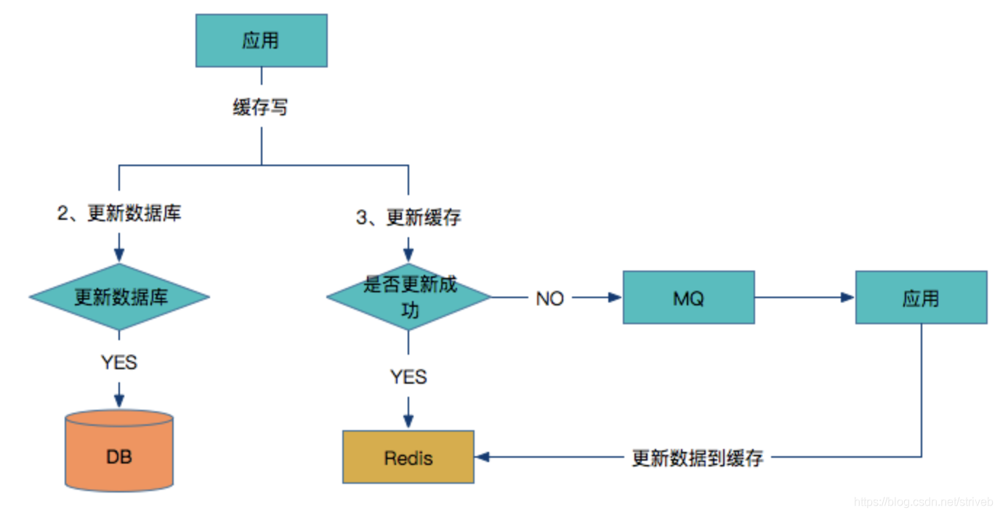

# 缓存和数据库的一致性

## **产生原因**

 主要有两种情况，会导致缓存和 DB 的一致性问题： 

1. 并发的场景下，导致读取老的 DB 数据，更新到缓存中。 
2.  缓存和 DB 的操作，不在一个事务中，可能只有一个操作成功，而另一个操作失败，导致不一致。 

 当然，有一点我们要注意，缓存和 DB 的一致性，我们**指的更多的是最终一致性**。我们**使用缓存只要是提高读操作的性能，真正在写操作的业务逻辑，还是以数据库为准。**例如说，我们可能缓存用户钱包的余额在缓存中，在前端查询钱包余额时，读取缓存，在使用钱包余额时，读取数据库。 

## 更新缓存的设计模式

### 1.Cache Aside Pattern(旁路缓存)

 这是最常用最常用的pattern了。其具体逻辑如下： 

- **失效**：应用程序先从cache取数据，没有得到，则从数据库中取数据，成功后，放到缓存中。

- **命中**：应用程序从cache中取数据，取到后返回。

- **更新**：先把数据存到数据库中，成功后，再让缓存失效。

 一个是查询操作，一个是更新操作的并发，首先，没有了删除cache数据的操作了，而是先更新了数据库中的数据，此时，缓存依然有效，所以，并发的查询操作拿的是没有更新的数据，但是，更新操作马上让缓存的失效了，后续的查询操作再把数据从数据库中拉出来。而不会像文章开头的那个逻辑产生的问题，后续的查询操作一直都在取老的数据。 

> **要么通过2PC或是Paxos协议保证一致性，要么就是拼命的降低并发时脏数据的概率，而Facebook使用了这个降低概率的玩法，因为2PC太慢，而Paxos太复杂。当然，最好还是为缓存设置上过期时间。** 

### 2.Read/Write Through Pattern

 在上面的Cache Aside套路中，我们的应用代码需要维护两个数据存储，**一个是缓存（Cache），一个是数据库（Repository）。**所以，应用程序比较啰嗦。而Read/Write Through套路是把更新数据库（Repository）的操作由缓存自己代理了，所以，对于应用层来说，就简单很多了。**可以理解为，应用认为后端就是一个单一的存储，而存储自己维护自己的Cache。** 

 Read Through 

 Read Through 套路就是**在查询操作中更新缓存**，也就是说，当缓存失效的时候（过期或LRU换出），Cache Aside是由调用方负责把数据加载入缓存，而Read Through则用缓存服务自己来加载，从而对应用方是透明的。 

 Write Through 

 Write Through 套路和Read Through相仿，**不过是在更新数据时发生。当有数据更新的时候，如果没有命中缓存，直接更新数据库，然后返回。如果命中了缓存，则更新缓存，然后再由Cache自己更新数据库（这是一个同步操作）** 

 下图自来Wikipedia的[Cache词条](https://en.wikipedia.org/wiki/Cache_(computing))。其中的Memory你可以理解为就是我们例子里的数据库。 

### 3.Write Behind Caching Pattern

 Write Behind 又叫 Write Back。**write back就是Linux文件系统的Page Cache的算法**。 

 Write Back套路，一句说就是，在更新数据的时候，只更新缓存，不更新数据库，而我们的缓存会异步地批量更新数据库。 

> 这个设计的好处就是让数据的I/O操作飞快无比（因为直接操作内存嘛 ），因为异步，write back还可以合并对同一个数据的多次操作，所以性能的提高是相当可观的。 

 但是，其带来的问题是，数据不是强一致性的，而且可能会丢失（我们知道Unix/Linux非正常关机会导致数据丢失，就是因为这个事）。在软件设计上，我们基本上不可能做出一个没有缺陷的设计，就像算法设计中的时间换空间，空间换时间一个道理，有时候，强一致性和高性能，高可用和高性性是有冲突的。软件设计从来都是取舍Trade-Off。 

 另外，Write Back实现逻辑比较复杂，因为他需要track有哪数据是被更新了的，需要刷到持久层上。操作系统的write back会在仅当这个cache需要失效的时候，才会被真正持久起来，比如，内存不够了，或是进程退出了等情况，这又叫lazy write。 

 在wikipedia上有一张write back的流程图，基本逻辑如下： 

## 缓存架构设计：

### 1.更新缓存 VS 淘汰缓存

更新缓存：数据不但写入数据库，还会写入缓存；优点：缓存不会增加一次miss，命中率高

淘汰缓存：数据只会写入数据库，不会写入缓存，只会把数据淘汰掉；优点：简单

 **这两者的选择主要取决于“更新缓存的复杂度”。** 

>
>
>如，上述场景，只是简单的把余额money设置成一个值，那么：
>
>（1）淘汰缓存的操作为deleteCache(uid)
>
>（2）更新缓存的操作为setCache(uid, money)
>
>更新缓存的代价很小，此时我们应该更倾向于更新缓存，以保证更高的缓存命中率
>
>如果余额是通过很复杂的数据计算得出来的，例如业务上除了账户表account，还有商品表product，折扣表discount
>
>account(uid, money)
>
>product(pid, type, price, pinfo)
>
>discount(type, zhekou)
>
>业务场景是用户买了一个商品product，这个商品的价格是price，这个商品从属于type类商品，type类商品在做促销活动要打折扣zhekou，购买了商品过后，这个余额的计算就复杂了，需要：
>
>（1）先把商品的品类，价格取出来：SELECT type, price FROM product WHERE pid=XXX
>
>（2）再把这个品类的折扣取出来：SELECT zhekou FROM discount WHERE type=XXX
>
>（3）再把原有余额从缓存中查询出来money = getCache(uid)
>
>（4）再把新的余额写入到缓存中去setCache(uid, money-price*zhekou)
>
>更新缓存的代价很大，此时我们应该更倾向于淘汰缓存。

 **总之，淘汰缓存操作简单，并且带来的副作用只是增加了一次cache miss，建议作为通用的处理方式。** 

### 2.先操作数据库 vs 先操作缓存

 当写操作发生时，假设淘汰缓存作为对缓存通用的处理方式，又面临两种抉择： 

（1）先写数据库，再淘汰缓存

（2）先淘汰缓存，再写数据库

对于一个不能保证事务性的操作，一定涉及“哪个任务先做，哪个任务后做”的问题，解决这个问题的方向是：**如果出现不一致，谁先做对业务的影响较小，就谁先执行。**

由于写数据库与淘汰缓存不能保证原子性，谁先谁后同样要遵循上述原则。

 假设先写数据库，再淘汰缓存：第一步写数据库操作成功，第二步淘汰缓存失败，则会出现DB中是新数据，Cache中是旧数据，数据不一致。 

 假设先淘汰缓存，再写数据库：第一步淘汰缓存成功，第二步写数据库失败，则只会引发一次Cache miss。 

 **结论：数据和缓存的操作时序：先淘汰缓存，再写数据库。** 

### 3.缓存架构优化

 上述缓存架构有一个**缺点**：业务方需要同时关注缓存与DB，主要有两种优化方案： 

 一种方案是服务化：加入一个服务层，向上游提供帅气的数据访问接口，向上游屏蔽底层数据存储的细节，这样业务线不需要关注数据是来自于cache还是DB。 

 另一种方案是**异步缓存更新**：业务线所有的写操作都走数据库，所有的读操作都总缓存，由一个异步的工具来做数据库与缓存之间数据的同步，具体细节是： 

（1）要有一个init cache的过程，将需要缓存的数据全量写入cache

（2）如果DB有写操作，异步更新程序读取binlog，更新cache

在（1）和（2）的合作下，cache中有全部的数据，这样：

（a）业务线读cache，一定能够hit（很短的时间内，可能有脏数据），无需关注数据库

（b）业务线写DB，cache中能得到异步更新，无需关注缓存

这样将**大大简化业务线的调用逻辑**，存在的缺点是，如果缓存的数据业务逻辑比较复杂，async-update异步更新的逻辑可能也会比较复杂。

### 4.结论：

（1）淘汰缓存是一种通用的缓存处理方式

（2）**先淘汰缓存，再写数据库**

（3）服务化是向业务方屏蔽底层数据库与缓存复杂性的一种通用方式

## 缓存和DB一致性的解决方案

### 1）先淘汰缓存，再写数据库

因为先淘汰缓存，所以数据的最终一致性是可以得到有效的保证的。因为先淘汰缓存，即使写数据库发生异常，也就是下次缓存读取时，多读取一次数据库。

但是，这种方案会存在缓存和 DB 的数据会不一致的情况，参照[《缓存与数据库一致性优化》](https://www.w3cschool.cn/architectroad/architectroad-consistency-of-cache-with-database.html) 所说。

我们需要解决缓存并行写，实现串行写。比较简单的方式，引入分布式锁。

- 在写请求时，先淘汰缓存之前，获取该分布式锁。
- 在读请求时，发现缓存不存在时，先获取分布式锁。

这样，缓存的并行写就成功的变成串行写落。写请求时，是否主动更新缓存，根据自己业务的需要，是否有，都没问题。

### 2）先写数据库，再更新缓存

 按照“先写数据库，再更新缓存”，我们要保证 DB 和缓存的操作，能够在“同一个事务”中，从而实现最终一致性。 

**基于定时任务来实现**

- 首先，写入数据库。
- 然后，在写入数据库所在的事务中，插入一条记录到任务表。该记录会存储需要更新的缓存 KEY 和 VALUE 。
- 【异步】最后，定时任务每秒扫描任务表，更新到缓存中，之后删除该记录。

**基于消息队列来实现**

- 首先，写入数据库。
- 然后，发送带有缓存 KEY 和 VALUE 的事务消息。此时，需要有支持事务消息特性的消息队列，或者我们自己封装消息队列，支持事务消息。
- 【异步】最后，消费者消费该消息，更新到缓存中。

 这两种方式，可以进一步优化，**可以先尝试更新缓存，如果失败，则插入任务表，或者事务消息。** 

 另外，极端情况下，如果并发写执行时，先更新成功 DB 的，结果后更新缓存： 

- 理论来说，希望的更新缓存顺序是，线程 1 快于线程 2 ，但是实际线程1 晚于线程 2 ，导致数据不一致。
- 图中一直是基于定时任务或消息队列来实现异步更新缓存，如果网络抖动，导致【插入任务表，或者事务消息】的顺序不一致。
- 那么怎么解决呢？需要做如下三件事情：
  - 1、在缓存值中，拼接上数据版本号或者时间戳。例如说：`value = {value: 原值, version: xxx}` 。
  - 2、在任务表的记录，或者事务消息中，增加上数据版本号或者时间戳的字段。
  - 3、在定时任务或消息队列执行更新缓存时，先读取缓存，对比版本号或时间戳，大于才进行更新。 当然，此处也会有并发问题，所以还是得引入分布式锁或 CAS 操作。
    - 关于 Redis 分布式锁，可以看看 [《精尽 Redis 面试题》](http://svip.iocoder.cn/Redis/Interview) 的 [「如何使用 Redis 实现分布式锁？」](http://svip.iocoder.cn/Cache/Interview/#) 问题。
    - 关于 Redis CAS 操作，可以看看 [《精尽 Redis 面试题》](http://svip.iocoder.cn/Redis/Interview) 的 [「什么是 Redis 事务？」](http://svip.iocoder.cn/Cache/Interview/#) 问题。

### 3) 基于数据库的 binlog 日志

 **1、重客户端** 

 **写入缓存：** 

- 应用同时更新数据库和缓存
- 如果数据库更新成功，则开始更新缓存，否则如果数据库更新失败，则整个更新过程失败。
- 判断更新缓存是否成功，如果成功则返回
- 如果缓存没有更新成功，则将数据发到MQ中
- 应用监控MQ通道，收到消息后继续更新Redis。

 **问题点：**如果更新Redis失败，同时在将数据发到MQ之前的时间，应用重启了，这时候MQ就没有需要更新的数据，如果Redis对所有数据没有设置过期时间，同时在读多写少的场景下，只能通过人工介入来更新缓存。 

**读缓存：**

如何来解决这个问题？那么**在写入Redis数据的时候，在数据中增加一个时间戳插入到Redis中。**在从Redis中读取数据的时候，首先要判断一下当前时间有没有过期，如果没有则从缓存中读取，如果过期了则从数据库中读取最新数据覆盖当前Redis数据并更新时间戳。具体过程如下图所示：

 **2、客户端数据库与缓存解耦** 

 上述方案对于应用的研发人员来讲比较重，需要研发人员同时考虑数据库和Redis是否成功来做不同方案，如何让研发人员只关注数据库层面，而不用关心缓存层呢？请看下图： 

- 应用直接写数据到数据库中。
- 数据库更新binlog日志。
- 利用Canal中间件读取binlog日志。
- Canal借助于限流组件按频率将数据发到MQ中。
- 应用监控MQ通道，将MQ的数据更新到Redis缓存中。

可以看到这种方案对研发人员来说比较轻量，不用关心缓存层面，而且这个方案虽然比较重，但是却容易形成统一的解决方案。

参照： [《技术专题讨论第五期：论系统架构设计中缓存的重要性》](http://www.spring4all.com/question/177)

> PS：下面这两种比较实用
>
> - “**先淘汰缓存，再写数据库**”的方案，并且无需引入分布式锁。
> - “**先写数据库，再更新缓存**”的方案，并且无需引入定时任务或者消息队列。
>
> 使用缓存过程中，经常会遇到缓存数据的不一致性和脏读现象。一般情况下，采取缓存双淘汰机制，在更新数据库的**前**淘汰缓存。此外，设定超时时间，例如三十分钟。
>
> **极端场景下，即使有脏数据进入缓存，这个脏数据也最存在一段时间后自动销毁。**

另外，在 DB 主从架构下，方案会更加复杂。详细可以看看 [《主从 DB 与 cache 一致性优化》](https://www.w3cschool.cn/architectroad/architectroad-consistency-of-cache-with-master-and-slave-database.html) 。