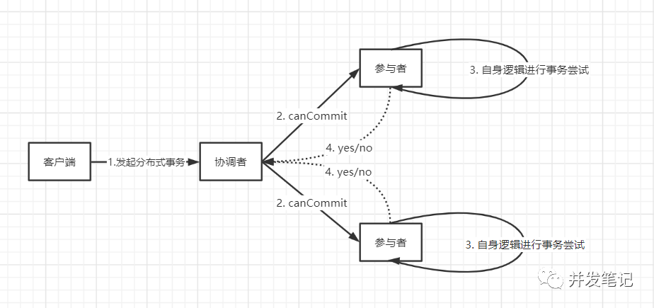

# 分布式事务

## 简述

分布式事务指事务的操作位于不同的节点上，需要保证事务的 AICD 特性。

例如在下单场景下，库存和订单如果不在同一个节点上，就涉及分布式事务。

## 解决方案

在分布式系统中，要实现分布式事务，无外乎那几种解决方案。

### 两阶段提交（2PC）

二阶段提交(Two-Phase Commit)，是一个非常经典的**强一致**、**中心化的原子提交协议**。目前，绝大多数关系型数据库都采用二阶段提交协议来完成分布式事务处理（例如mysql的XA协议）。因此二阶段提交协议也被广泛运用到分布式系统中。

顾名思义，算法流程就是分为两个阶段提交某一操作，其分为准备阶段、提交阶段。为了更好描述算法过程，为此定义了两种角色：协调者（Coordinator）、参与者（Participant）。

#### 阶段一：准备阶段

准备阶段，又被称为投票阶段（Vote Request），由协调者向参与者发送请求，询问当前事务能否处理成功。参与者则开启本地数据库事务，开始执行数据库操作，但是并不会提交。根据操作结果，返回给协调者“yes/no”，表示事务是否可以提交。

- 事务询问 协调者向所有参与者发送**事务内容**，询问是否可以执行事务的提交操作，并等待各参与者的响应
- 执行事务 各参与者执行事务操作，准备好事务资源，记录undo、redo信息
- 反馈询问结果 如果参与者成功执行了事务操作，那么返回给协调者yes（表示当前事务可以提交），否者返回给协调者no（表示当前事务不能执行）

#### 阶段二：提交阶段

在准备阶段，由于参与者可以返回yes/no，则在提交阶段也会出现两种可能，即全局提交事务、全局回滚事务。

##### 全局提交事务

当准备阶段所有参与者都返回yes的响应后，协调者将发起全局提交事务请求。

- 发送提交请求 由协调者向所有参与者发送global_commit请求，要求提交当前事务
- 事务提交 当参与者收到global_commit请求后，则执行事务提交操作，并释放整个分布式事务期间占用的事务资源
- 反馈提交结果 参与在执行完事务提交后，向协调者返回ack消息
- 完成事务提交 协调者收到所有参与者反馈的ack消息后，给客户端返回结果，完成本次事务

##### 全局回滚事务

当准备阶段有一个参与者都返回no的响应后，或者在协调者等待响应超时后，则协调者将发起全局回滚事务请求，中断事务。

- 发送回滚请求 由协调者向所有参与者发送global_rollback请求，要求中断当前事务
- 事务回滚 当参与者收到global_rollback请求后，会利用准备阶段记录的undo信息来进行回滚，并释放整个分布式事务期间占用的事务资源
- 反馈回滚结果 参与在执行完事务提交后，向协调者返回ack消息
- 中断事务 协调者收到所有参与者反馈的ack消息后，给客户端返回结果，完成中断事务

#### 优缺点

2PC协议明显的优点就是：原理简单、容易实现。但是它的缺点更加明显：

- 同步阻塞 每个参与者都需要等待其他参与者完成后，才能继续下一阶段，也就是说事务操作逻辑都是处于阻塞状态，极大限制了分布式系统性能
- 数据不一致 在第二阶段，如果出现网络异常导致一部分参与者收到了commit请求，一部分参与者没有收到commit请求，结果会是一部分参与者提交了事务，一部分参与者无法进行事务提交
- 单点问题/脑裂 协调者在2PC中，太过重要，当协调者宕机，整个集群将不可用。更可怕的是，协调者在第二阶段之前宕机，那么所有参与者将一直锁定准备阶段的事务资源。脑裂（动态选主情况下）是指因为网络原因，出现多个协调者。
- 太过保守 任何一个节点故障，都会导致整个事务协调失败，换句话说没有完善的容错机制。

### 3PC

上面小节讲解了二阶段提交协议的原理，也指出了它所存在的问题，因此有必要在2PC基础上进一步改进，提出三阶段提交协议。

3PC（Three-Phase Commit），在2PC的基础上，将准备阶段一分为二，形成由 **CanCommit、PreCommit、DoCommit**三个阶段组成的事务提交协议。并且在3PC**参与者也增加超时机制**（2PC只有协调者拥有超时机制），避免了参与者长时间无法与协调者节点通讯（协调者宕机）的情况下，无法释放资源的问题。在参与者超时后，会自动进行本地commit/rollback从而进行释放资源。这种机制也侧面降低了整个事务的阻塞时间和范围。

#### 阶段一：CanCommit

- 事务询问 由协调者向所有参与者发送一个**包含事务内容**的canCommit请求，询问是否可以执行事务提交操作，并等待参与者响应
- 反馈询问响应 参与者收到canCommit请求后，根据自身逻辑判断是否可以顺利执行事务，那么反馈yes，否则反馈no。说白了就是检查下自身状态的健康性，看有没有能力进行事务操作。

#### 阶段二：PreCommit

在阶段一结果中，如果所有参与者都返回yes，则执行事务预提交，协调者发起PreCommit请求。如果有任何一个参与者节点返回的结果是no，或者协调者在等待参与者节点反馈的过程中超时，整个分布式事务就会中断，协调者就会向所有的参与者发送“abort”请求。

**注意：**上面所说的参与者增加超时时间，在该阶段就可以派上用场了。在该阶段开始之前，如果协调者宕机，参与者在等待超时时间后，各自选择中断事务，最终达成一致。但是协调者在发出一部分preCommit请求后宕机，有一部分没有收到preCommit请求，那情况则是：一部分参与者执行了preCommit操作，一部分参与者没有执行preCommit操作，最终导致各节点之间数据不一致。

##### 执行事务预提交

- 发送preCommit请求 由协调者向所有参与者发送preCommit请求,并等待参与者响应
- 事务预提交 参与者收到preCommit请求后，会执行事务操作，将undo和redo信息写入事务日志中
- 反馈执行响应 参与者将执行结果反馈给协调者，同时等待最终指令提交（commit）或终止（abort）

##### 中断事务

该阶段中断事务相比阶段三中断事务要简单，只需要由协调者向所有参与者发送abort请求，通知中断事务。期间参与者在等待协调者的preCommit请求超时后也会主动中断本地事务。

#### 阶段三：DoCommit

同样，根据上一阶段的结果，该阶段也会存在两种情况。阶段二所有参与者成功反馈，则执行提交事务请求，否则中断事务。

**注意：**参与者增加的超时时间，在该阶段也有所体现。在该阶段，无论是协调者宕机了，还是网络原因导致参与者没有收到该阶段的（提交/中断）请求，参与者都会执行本地事务提交。倘若在该阶段，协调者需要发送的是提交事务请求，参与者自动提交本地事务，最后能达到一致性。倘若在该阶段，协调者需要发送的是中断事务请求，如果参与者没有收到该请求，则参与者也会自动提交本地事务，最终导致各节点之间数据不一致。

##### 提交事务

- 发送提交请求 协调者就会从“预提交状态”变为“提交状态”。然后向所有的参与者节点发送"global_commit"请求
- 事务提交 参与者收到global_commit请求后，将执行本地事务提交操作，并释放整个事务执行期间占用的事务资源
- 反馈提交结果 参与者向协调者反馈ack提交结果
- 完成事务 协调者收到所有参与者的ack消息后，完成事务

##### 中断事务

- 发送中断请求 协调者向所有参与者发送abort请求
- 事务回滚 参与者根据阶段二中记录的undo信息，来执行回滚操作，并释放占用事务资源
- 反馈回滚结果 参与者向协调者反馈ack回滚结果
- 中断事务 协调者收到所有参与者的ack消息后，中断事务

#### 优缺点

相比于2PC，3PC最大的优点就是减少了参与者的阻塞范围，并且能在协调者故障之后某些情况下继续达成一致。

3PC的缺点，也就是我在每个阶段描述中，注意的那一部分，在某些情况下，3PC必然会造成数据的不一致性。

### 补偿事务（TCC）

**TCC分布式事务**

- TCC是服务化的两阶段编程模型，其Try、Confirm、Cancel，3个方法均由业务编码实现
- TCC要求每个分支事务实现三个操作：预处理Try,确认Confirm,撤销Cancel。
- Try操作做业务检查及资源预留,
- Confirm做业务确认操作
- Cancel实现一个与Try相反的操作即回滚操作。
- TM首先发起所有的分支事务Try操作，任何一个分支事务的Try操作执行失败，TM将会发起所有分支事务的Cancel操作，
  若Try操作全部成功，TM将会发起所有分支事务的Confirm操作,其中Confirm/Cancel操作若执行失败,TM会进行重试。

**TCC的三个阶段**

- Try阶段是做业务检查(一致性)及资源预留(隔离),此阶段仅是一个初步操作，它和后续的Confirmy一起才能构成一个完整
  的业务逻辑
- Confirm阶段是做确认提交，Try阶段所有分支事务执行成功后开始执行Confirm，通常情况下，采用TCC则认为
  Confirm阶段是不会出错的,即：只要Try成功，Confirm一定成功，若Confirm阶段真的出错，需要引入重试机制或人工
  处理
- Cancel阶段是在业务执行错误需要回滚到状态下执行分支事务的取消，预留资源的释放，通常情况下，采用TCC则认为
  Cancel阶段也一定是真功的,若Cance阶段真的出错，需要引入重试机制或人工处理
- TM事务管理器：TM事务管理器可以实现为独立的服务，也可以让全局事务发起方充当TM的角色,TM独立出来是为了公
  用组件，是为了考虑系统结构和软件的复用
- TM在发起全局事务时生成全局事务记录，全局事务ID贯穿整个分布式事务调用链条，用来记录事务上下文，追踪和记录
  状态，用于Confirm和cacel失败需要进行重试,因此需要实现幂等

**TCC的三种异常处理情况**

幂等处理

- 因为网络抖动等原因，分布式事务框架可能会重复调用同一个分布式事务中的一个分支事务的二阶段接口。所以分支事务
  的二阶段接口Confirm/Cancel需要能够保证幂等性。如果二阶段接口不能保证幂等性，则会产生严重的问题，造成资源
  的重复使用或者重复释放，进而导致业务故障。
- 对于幂等类型的问题，通常的手段是引入幂等字段进行防重放攻击。对于分布式事务框架中的幂等问题，同样可以祭出
  这一利器。
- 幂等记录的插入时机是参与者的Try方法，此时的分支事务状态会被初始化为INIT。然后当二阶段的Confirm/Cancel执行
  时会将其状态置为CONFIRMED/ROLLBACKED。
- 当TC重复调用二阶段接口时，参与者会先获取事务状态控制表的对应记录查看其事务状态。如果状态已经为
  CONFIRMED/ROLLBACKED，那么表示参与者已经处理完其分内之事，不需要再次执行，可以直接返回幂等成功的结果
  给TC，帮助其推进分布式事务。

空回滚

- 当没有调用参与方Try方法的情况下，就调用了二阶段的Cancel方法，Cancel方法需要有办法识别出此时Try有没有执行。如果Try还没执行，表示这个Cancel操作是无效的，即本次Cancel属于空回滚；如果Try已经执行，那么执行的是正常的回滚逻辑。
- 要应对空回滚的问题，就需要让参与者在二阶段的Cancel方法中有办法识别到一阶段的Try是否已经执行。很显然，可以
  继续利用事务状态控制表来实现这个功能。
- 当Try方法被成功执行后，会插入一条记录，标识该分支事务处于INIT状态。所以后续当二阶段的Cancel方法被调用时，
  可以通过查询控制表的对应记录进行判断。如果记录存在且状态为INIT，就表示一阶段已成功执行，可以正常执行回滚操
  作，释放预留的资源；如果记录不存在则表示一阶段未执行，本次为空回滚，不释放任何资源。

资源悬挂

- 问题：TC回滚事务调用二阶段完成空回滚后，一阶段执行成功
- 解决：事务状态控制记录作为控制手段，二阶段发现无记录时插入记录，一阶段执行时检查记录是否存在

TCC和2PC比较

- 2PC通常都是在跨库的DB层面，而TCC则在应用层面处理，需要通过业务逻辑实现，这种分布式事务的实现方式优势在
  于，可以让应用自己定义数据操作的粒度，使得降低锁冲突，提高吞吐量成为可能
- 而不足之处则在于对应用的侵入性非常强，业务逻辑的每个分支都需要实现Try，confirm,cancel三个操作。此外，其实
  现难度也比较大，需要按照网络状态，系统故障的不同失败原因实现不同的回滚策略

### 本地消息表（异步确保）

本地消息表与业务数据表处于同一个数据库中，这样就能利用本地事务来保证在对这两个表的操作满足事务特性，并且使用了消息队列来保证最终一致性。

1. 在分布式事务操作的一方完成写业务数据的操作之后向本地消息表发送一个消息，本地事务能保证这个消息一定会被写入本地消息表中。
2. 之后将本地消息表中的消息转发到 Kafka 等消息队列中，如果转发成功则将消息从本地消息表中删除，否则继续重新转发。
3. 在分布式事务操作的另一方从消息队列中读取一个消息，并执行消息中的操作。

)

优点： 一种非常经典的实现，避免了分布式事务，实现了最终一致性。

缺点： 消息表会耦合到业务系统中，如果没有封装好的解决方案，会有很多杂活需要处理。

### MQ 事务消息

 有一些第三方的MQ是支持事务消息的，比如RocketMQ，他们支持事务消息的方式也是类似于采用的二阶段提交，但是市面上一些主流的MQ都是不支持事务消息的，比如 RabbitMQ 和 Kafka 都不支持。 

以阿里的 RocketMQ 中间件为例，其思路大致为：

第一阶段Prepared消息，会拿到消息的地址。 第二阶段执行本地事务，第三阶段通过第一阶段拿到的地址去访问消息，并修改状态。

也就是说在业务方法内要想消息队列提交两次请求，一次发送消息和一次确认消息。如果确认消息发送失败了RocketMQ会定期扫描消息集群中的事务消息，这时候发现了Prepared消息，它会向消息发送者确认，所以生产方需要实现一个check接口，RocketMQ会根据发送端设置的策略来决定是回滚还是继续发送确认消息。这样就保证了消息发送与本地事务同时成功或同时失败。

优点： 实现了最终一致性，不需要依赖本地数据库事务。

缺点： 实现难度大，主流MQ不支持

### **最大努力通知**

其实我觉得本地消息表也可以算最大努力，事务消息也可以算最大努力。

就本地消息表来说会有后台任务定时去查看未完成的消息，然后去调用对应的服务，当一个消息多次调用都失败的时候可以记录下然后引入人工，或者直接舍弃。这其实算是最大努力了。

事务消息也是一样，当半消息被commit了之后确实就是普通消息了，如果订阅者一直不消费或者消费不了则会一直重试，到最后进入死信队列。其实这也算最大努力。

所以**最大努力通知其实只是表明了一种柔性事务的思想**：我已经尽力我最大的努力想达成事务的最终一致了。

适用于对时间不敏感的业务，例如短信通知。

## **总结**

可以看出 2PC 是一种强一致性事务，不过还是有数据不一致，阻塞等风险，而且只能用在数据库层面。

而 TCC 是一种补偿性事务思想，适用的范围更广，在业务层面实现，因此对业务的侵入性较大，每一个操作都需要实现对应的三个方法。

本地消息、事务消息和最大努力通知其实都是最终一致性事务，因此适用于一些对时间不敏感的业务。