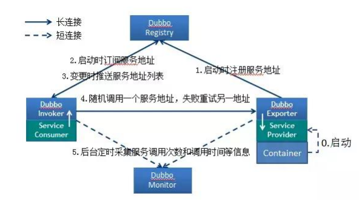
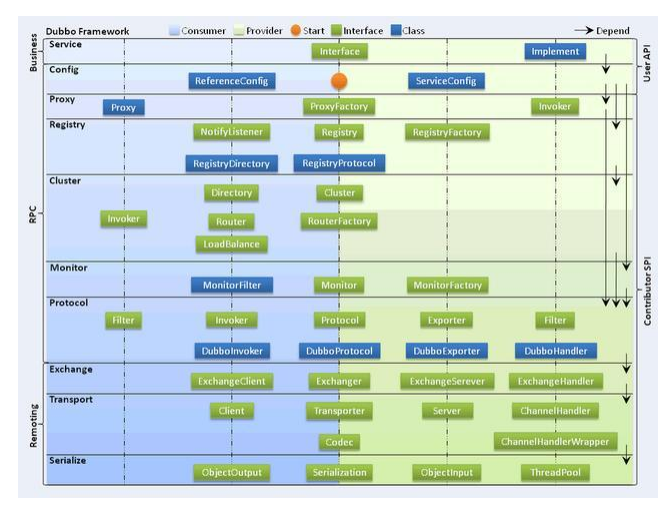
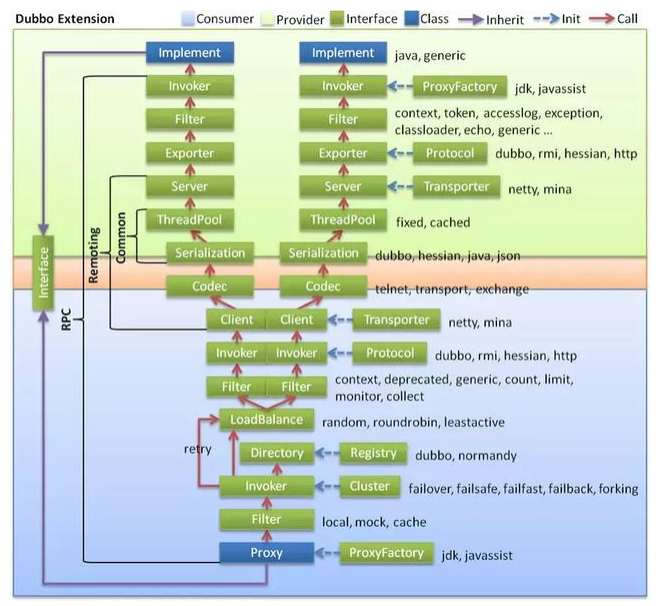
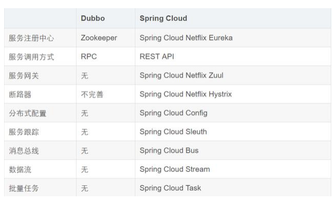
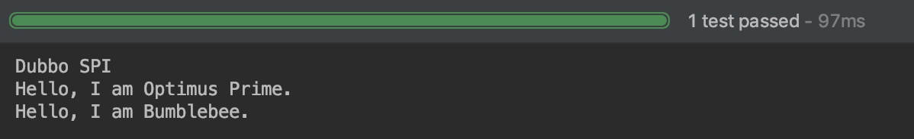

# Dubbo知识总结

##   为什么需要服务治理 

1.  过多的服务 URL 配置困难 
2.  负载均衡分配节点压力过大的情况下也需要部署集群 
3.  服务依赖混乱，启动顺序不清晰 
4.  过多服务导致性能指标分析难度较大，需要监控 

##  Dubbo 是什么

 Dubbo 是一个分布式、高性能、透明化的 RPC 服务框架，提 供服务自动注册、自动发现等高效服务治理方案， 可以和 Spring 框架无缝集成。 

## Dubbo 的主要应用场景 

1.  透明化的远程方法调用，就像调用本地方法一样调用远程方法， 只需简单配置，没有任何 API 侵入。  
2.  软负载均衡及容错机制，可在内网替代 F5 等硬件负载均衡器， 降低成本，减少单点。  
3.  服务自动注册与发现，不再需要写死服务提供方地址，注册中心 基于接口名查询服务提供者的 IP 地址，并且能够平滑添加或删 除服务提供者。  

##  Dubbo 的核心功能 

 主要就是如下 3 个核心功能 ：

1. Remoting：网络通信框架，提供对多种 NIO 框架抽象封装，包括 “同步转异步”和“请求-响应”模式的信息交换方式 
2.  Cluster：服务框架，提供基于接口方法的透明远程过程调用，包括多协议支持，以及软负载均衡，失败容错，地址路由，动态配置等集群 支持。  
3.  Registry：服务注册，基于注册中心目录服务，使服务消费方能动态 的查找服务提供方，使地址透明，使服务提供方可以平滑增加或减少 机器。 

##  Dubbo 的核心组件 

| 组件名称  | 说明                                   |
| --------- | -------------------------------------- |
| Provider  | 暴露服务的服务提供方                   |
| Consumer  | 调用远程服务的服务消费方               |
| Register  | 服务注册与发现的注册中心               |
| Monitor   | 统计服务的调用次数和调用时间的监控中心 |
| Container | 服务运行容器                           |

##  Dubbo 服务注册与发现的流程



 **流程说明**：

1.  Provider(提供者)绑定指定端口并启动服务 
2.  提供者连接注册中心，并发本机 IP、端口、应用信息和提供服务信息发送至注册中心存储 
3.  Consumer(消费者），连接注册中心 ，并发送应用信息、所求服务信 息至注册中心  
4.  注册中心根据 消费者所求服务信息匹配对应的提供者列表发送至 Consumer 应用缓存。  
5.  Consumer 在发起远程调用时基于缓存的消费者列表择其一发起调 用。  
6.  Provider 状态变更会实时通知注册中心、在由注册中心实时推送至 Consumer 

 **设计的原因**：

1.  Consumer 与 Provider 解偶，双方都可以横向增减节点数 
2.  注册中心对本身可做对等集群，可动态增减节点，并且任意一台宕掉 后，将自动切换到另一台 
3.  去中心化，双方不直接依懒注册中心，即使注册中心全部宕机短时间 内也不会影响服务的调用  
4.  服务提供者无状态，任意一台宕掉后，不影响使用 

##  Dubbo 的架构设计 



1. 服务接口层（Service）：该层是与实际业务逻辑相关的，根据服务提供方和服务消费方的业务设计对应的接口和实现。 
2. 配置层（Config）：对外配置接口，以 ServiceConfig 和 ReferenceConfig 为中心。 
3. 服务代理层（Proxy）：服务接口透明代理，生成服务的客户端 Stub 和服务器端 Skeleton。 
4.  服务注册层（Registry）：封装服务地址的注册与发现，以服务 URL 为中心。 
5. 集群层（Cluster）：封装多个提供者的路由及负载均衡，并桥接注册 中心，以 Invoker 为中心。 
6. 监控层（Monitor）：RPC 调用次数和调用时间监控。 
7. 远程调用层（Protocol）：封将 RPC 调用，以 Invocation 和 Result 为中心，扩展接口为 Protocol、Invoker 和 Exporter。 
8. 信息交换层（Exchange）：封装请求响应模式，同步转异步，以 Request 和 Response 为中心。 
9. 网络传输层（Transport）：抽象 mina 和 netty 为统一接口，以 Message 为中心。 

##  Dubbo 的服务调用流程 



## Dubbo 支持哪些协议，每种协议的应用场景，优缺点 

1. dubbo： 单一长连接和 NIO 异步通讯，适合大并发小数据量的服务调用， 以及消费者远大于提供者。传输协议 TCP，异步，Hessian 序列化； 
2. rmi： 采用 JDK 标准的 rmi 协议实现，传输参数和返回参数对象需要实现 Serializable 接口，使用 java 标准序列化机制，使用阻塞式短连接，传输数 据包大小混合，消费者和提供者个数差不多，可传文件，传输协议 TCP。 多个短连接，TCP 协议传输，同步传输，适用常规的远程服务调用和 rmi 互 操作。在依赖低版本的 Common-Collections 包，java 序列化存在安全漏 洞； 
3. webservice： 基于 WebService 的远程调用协议，集成 CXF 实现，提供和 原生 WebService 的互操作。多个短连接，基于 HTTP 传输，同步传输，适 用系统集成和跨语言调用； 
4. http： 基于 Http 表单提交的远程调用协议，使用 Spring 的 HttpInvoke 实 现。多个短连接，传输协议 HTTP，传入参数大小混合，提供者个数多于消 费者，需要给应用程序和浏览器 JS 调用； 
5. hessian： 集成 Hessian 服务，基于 HTTP 通讯，采用 Servlet 暴露服务， Dubbo 内嵌 Jetty 作为服务器时默认实现，提供与 Hession 服务互操作。多 个短连接，同步 HTTP 传输，Hessian 序列化，传入参数较大，提供者大于 消费者，提供者压力较大，可传文件； 
6. memcache： 基于 memcached 实现的 RPC 协议 
7. redis： 基于 redis 实现的 RPC 协议 


##  Dubbo 有些哪些注册中心 

1.  Multicast 注册中心： Multicast 注册中心不需要任何中心节点，只要广播地址，就能进行服务注册和发现。基于网络中组播传输实现； 
2.  Zookeeper 注册中心： 基于分布式协调系统 Zookeeper 实现，采用 Zookeeper 的 watch 机制实现数据变更；  
3.  redis 注册中心： 基于 redis 实现，采用 key/Map 存储，住 key 存储服务名 和类型，Map 中 key 存储服务 URL，value 服务过期时间。基于 redis 的发 布/订阅模式通知数据变更；  
4.  Simple 注册中心 

 **注意：** Dubbo 默认采用注册中心  Zookeeper ， Dubbo 的注册中心集群挂掉，发布者和订阅者之间还能通信， 启动 dubbo 时，消费者会从 zookeeper 拉取注册的生产者的地址接口等数据，缓存在本地。 每次调用时，按照本地存储的地址进行调用 

## Dubbo 集群的负载均衡有哪些策略

 Dubbo 提供了常见的集群策略实现，并预扩展点予以自行实现。 

1.  Random LoadBalance: 随机选取提供者策略，有利于动态调整提供者权 重。截面碰撞率高，调用次数越多，分布越均匀；  
2.  RoundRobin LoadBalance: 轮循选取提供者策略，平均分布，但是存在请求累积的问题； 
3.  LeastActive LoadBalance: 最少活跃调用策略，解决慢提供者接收更少的请求； 
4.  ConstantHash LoadBalance: 一致性 Hash 策略，使相同参数请求总是发到同一提供者，一台机器宕机，可以基于虚拟节点，分摊至其他提供者，避免引起提供者的剧烈变动； 

##  Dubbo 的集群容错方案有 

1. Failover Cluster  失败自动切换，当出现失败，重试其它服务器。通常用于读操作，但 重试会带来更长延迟。 
2. Failfast Cluster  快速失败，只发起一次调用，失败立即报错。通常用于非幂等性的写操作，比如新增记录。 
3. Failsafe Cluster 失败安全，出现异常时，直接忽略。通常用于写入审计日志等操作。  
4. Failback Cluster 失败自动恢复，后台记录失败请求，定时重发。通常用于消息通知操 作。 
5. Forking Cluster   并行调用多个服务器，只要一个成功即返回。通常用于实时性要求较高的读操作，但需要浪费更多服务资源。可通过 forks="2" 来设置最 大并行数。  
6.  Broadcast Cluster  广播调用所有提供者，逐个调用，任意一台报错则报错 。通常用于通 知所有提供者更新缓存或日志等本地资源信息。 

**注意：** Dubbo 的默认集群容错方案 ： Failover Cluster

## Dubbo 支持哪些序列化方式 

 默认使用 Hessian 序列化，还有 Duddo、FastJson、Java 自带序列 化。 

##  Dubbo 与 Spring 的关系 

 Dubbo 采用全 Spring 配置方式，透明化接入应用，对应用没有任何 API 侵入，只需用 Spring 加载 Dubbo 的配置即可，Dubbo 基于 Spring 的 Schema 扩展进行加载。  

##  Dubbo 使用的是什么通信框架 

 默认使用 NIO Netty 框架  

## Dubbo 超时时间怎样设置 

 Dubbo 超时时间设置有两种方式：  

1.  服务提供者端设置超时时间，在 Dubbo 的用户文档中，推荐如果能在服务端多配置就尽量多配置，因为服务提供者比消费者更清楚自己提供的服务特性。 
2.  服务消费者端设置超时时间，如果在消费者端设置了超时时间，以消费者端为主，即优先级更高。因为服务调用方设置超时时间控制性更灵活。如果消费方超时，服务端线程不会停止，会产生警告。 

##  Dubbo 在安全机制方面是如何解决 

 Dubbo 通过 Token 令牌防止用户绕过注册中心直连，然后在注册中 心上管理授权。Dubbo 还提供服务黑白名单，来控制服务所允许的调 用方。  

##  Dubbo 和 Dubbox 之间的区别 

 dubbox 基于 dubbo 上做了一些扩展，如加了服务可 restful 调 用，更新了开源组件等。 

 Dubbo 和 Spring Cloud 的关系 

 Dubbo 是 SOA 时代的产物，它的关注点主要在于服务的调用，流 量分发、流量监控和熔断。而 Spring Cloud 诞生于微服务架构时 代，考虑的是微服务治理的方方面面，另外由于依托了 Spirng、 Spirng Boot 的优势之上，两个框架在开始目标就不一致，Dubbo 定位服务治理、Spirng Cloud 是一个生态。  

##  Dubbo 和 Spring Cloud 的区别 



 最大的区别：Dubbo 底层是使用 Netty 这样的 NIO 框架，是基于 TCP 协议传输的，配合以 Hession 序列化完成 RPC 通信。 

而 SpringCloud 是基于 Http 协议+Rest 接口调用远程过程的通信， 相对来说，Http 请求会有更大的报文，占的带宽也会更多。但是 REST 相比 RPC 更为灵活，服务提供方和调用方的依赖只依靠一纸契 约，不存在代码级别的强依赖。 

##  dubbo 连接注册中心和直连的区别 

 在开发及测试环境下，经常需要绕过注册中心，只测试指定服务提供者，这时候可能需要点对点直连， 点对点直联方式，将以服务接口为单位，忽略注册中心的提供者列表。

 服务注册中心，动态的注册和发现服务，使服务的位置透明，并通过在消费方获取服务提供方地址列表，实现软负载 均衡和 Failover， 注册中心返回服务提供者地址列表给消费者，如果有变更，注册中心将基于长连接推送变更数据给消费者。 

 服务消费者，从提供者地址列表中，基于软负载均衡算法，选一台提供者进行调用，如果调用失败，再选另一台调 用。注册中心负责服务地址的注册与查找，相当于目录服务，服务提供者和消费者只在启动时与注册中心交互，注册 中心不转发请求，服务消费者向注册中心获取服务提供者地址列表，并根据负载算法直接调用提供者，注册中心，服 务提供者，服务消费者三者之间均为长连接，监控中心除外，注册中心通过长连接感知服务提供者的存在，服务提供 者宕机，注册中心将立即推送事件通知消费者 。

注册中心和监控中心全部宕机，不影响已运行的提供者和消费者，消费者在本地缓存了提供者列表 。

注册中心和监控中心都是可选的，服务消费者可以直连服务提供者。  

##  dubbo 通信协议 dubbo 协议适用范围和适用场景 

 **适用范围**：传入传出参数数据包较小（建议小于 100K），消费者比提供者个数 多，单一消费者无法压满提供者，尽量不要用 dubbo 协议传输大文件或超大字 符串。 

**适用场景**：常规远程服务方法调用 

 **dubbo 协议补充**： 

 连接个数：单连接 

连接方式：长连接 

传输协议：TCP 传输方式：

NIO 异步传输 

序列化：Hessian 二进制序列化 

##  dubbo 通信协议 dubbo 协议为什么采用异步单一长连接 

 因为服务的现状大都是服务提供者少，通常只有几台机器， 

而服务的消费者多，可能整个网站都在访问该服务， 比如 Morgan 的提供者只有 6 台提供者，却有上百台消费者，每天有 1.5 亿次调用， 

如果采用常规的 hessian 服务，服务提供者很容易就被压跨， 

通过单一连接，保证单一消费者不会压死提供者，

 长连接，减少连接握手验证等， 

并使用异步 IO，复用线程池，防止 C10K 问题。 

# Dubbo原理

## Dubbo SPI机制

SPI 全称为 Service Provider Interface，是一种服务发现机制。SPI 的本质是将接口实现类的全限定名配置在文件中，并由服务加载器读取配置文件，加载实现类。这样可以在运行时，动态为接口替换实现类。正因此特性，我们可以很容易的通过 SPI 机制为我们的程序提供拓展功能。SPI 机制在第三方框架中也有所应用，比如 Dubbo 就是通过 SPI 机制加载所有的组件。不过，Dubbo 并未使用 Java 原生的 SPI 机制，而是对其进行了增强，使其能够更好的满足需求。在 Dubbo 中，SPI 是一个非常重要的模块。基于 SPI，我们可以很容易的对 Dubbo 进行拓展。如果大家想要学习 Dubbo 的源码，SPI 机制务必弄懂。

### Java SPI 示例

#### 1、定义一个接口

```java
public interface Robot {
    void sayHello();
}
```

#### 2、定义实现类

定义两个实现类，分别为 OptimusPrime 和 Bumblebee

```java
public class OptimusPrime implements Robot {
    
    @Override
    public void sayHello() {
        System.out.println("Hello, I am Optimus Prime.");
    }
}

public class Bumblebee implements Robot {

    @Override
    public void sayHello() {
        System.out.println("Hello, I am Bumblebee.");
    }
}
```

#### 3、创建服务描述文件

接下来 META-INF/services 文件夹下创建一个文件，名称为 Robot 的全限定名 org.apache.spi.Robot。文件内容为实现类的全限定的类名，如下：

```
org.apache.spi.OptimusPrime
org.apache.spi.Bumblebee
```

#### 4、测试

```java
public class JavaSPITest {

    @Test
    public void sayHello() throws Exception {
        ServiceLoader<Robot> serviceLoader = ServiceLoader.load(Robot.class);
        System.out.println("Java SPI");
        serviceLoader.forEach(Robot::sayHello);
    }
}
```

测试结果


从测试结果可以看出，我们的两个实现类被成功的加载，并输出了相应的内容。

### Dubbo SPI 示例

Dubbo 并未使用 Java SPI，而是重新实现了一套功能更强的 SPI 机制。Dubbo SPI 的相关逻辑被封装在了 ExtensionLoader 类中，通过 ExtensionLoader，我们可以加载指定的实现类。Dubbo SPI 所需的配置文件需放置在 META-INF/dubbo 路径下，配置内容如下。

```
optimusPrime = org.apache.spi.OptimusPrime
bumblebee = org.apache.spi.Bumblebee
```

与 Java SPI 实现类配置不同，Dubbo SPI 是通过键值对的方式进行配置，这样我们可以按需加载指定的实现类。另外，在测试 Dubbo SPI 时，需要在 Robot 接口上标注 @SPI 注解。下面来演示 Dubbo SPI 的用法：

```java
public class DubboSPITest {

    @Test
    public void sayHello() throws Exception {
        ExtensionLoader<Robot> extensionLoader = 
            ExtensionLoader.getExtensionLoader(Robot.class);
        Robot optimusPrime = extensionLoader.getExtension("optimusPrime");
        optimusPrime.sayHello();
        Robot bumblebee = extensionLoader.getExtension("bumblebee");
        bumblebee.sayHello();
    }
}
```

测试结果



Dubbo SPI 除了支持按需加载接口实现类，还增加了 IOC 和 AOP 等特性。

### Dubbo SPI 源码分析

#### 1、获取ExtensionLoader对象

我们首先通过 ExtensionLoader 的 getExtensionLoader 方法获取一个 ExtensionLoader 实例，然后再通过 ExtensionLoader 的 getExtension 方法获取拓展类对象。这其中，getExtensionLoader 方法用于从缓存中获取与拓展类对应的 ExtensionLoader，若缓存未命中，则创建一个新的实例。

#### 2、创建拓展对象

首先检查缓存，缓存未命中则创建拓展对象。代码如下

```java
public T getExtension(String name) {
    if (name == null || name.length() == 0)
        throw new IllegalArgumentException("Extension name == null");
    if ("true".equals(name)) {
        // 获取默认的拓展实现类
        return getDefaultExtension();
    }
    // Holder，顾名思义，用于持有目标对象
    Holder<Object> holder = cachedInstances.get(name);
    if (holder == null) {
        cachedInstances.putIfAbsent(name, new Holder<Object>());
        holder = cachedInstances.get(name);
    }
    Object instance = holder.get();
    // 双重检查
    if (instance == null) {
        synchronized (holder) {
            instance = holder.get();
            if (instance == null) {
                // 创建拓展实例
                instance = createExtension(name);
                // 设置实例到 holder 中
                holder.set(instance);
            }
        }
    }
    return (T) instance;
}
```

创建拓展对象的过程包含了如下的步骤：

```java
private T createExtension(String name) {
    // 从配置文件中加载所有的拓展类，可得到“配置项名称”到“配置类”的映射关系表
    Class<?> clazz = getExtensionClasses().get(name);
    if (clazz == null) {
        throw findException(name);
    }
    try {
        T instance = (T) EXTENSION_INSTANCES.get(clazz);
        if (instance == null) {
            // 通过反射创建实例
            EXTENSION_INSTANCES.putIfAbsent(clazz, clazz.newInstance());
            instance = (T) EXTENSION_INSTANCES.get(clazz);
        }
        // 向实例中注入依赖
        injectExtension(instance);
        Set<Class<?>> wrapperClasses = cachedWrapperClasses;
        if (wrapperClasses != null && !wrapperClasses.isEmpty()) {
            // 循环创建 Wrapper 实例
            for (Class<?> wrapperClass : wrapperClasses) {
                // 将当前 instance 作为参数传给 Wrapper 的构造方法，并通过反射创建 Wrapper 实例。
                // 然后向 Wrapper 实例中注入依赖，最后将 Wrapper 实例再次赋值给 instance 变量
                instance = injectExtension(
                    (T) wrapperClass.getConstructor(type).newInstance(instance));
            }
        }
        return instance;
    } catch (Throwable t) {
        throw new IllegalStateException("...");
    }
}
```

1. 通过 getExtensionClasses 获取所有的拓展类
2. 通过反射创建拓展对象
3. 向拓展对象中注入依赖
4. 将拓展对象包裹在相应的 Wrapper 对象中

以上步骤中，第一个步骤是加载拓展类的关键，第三和第四个步骤是 Dubbo IOC 与 AOP 的具体实现。

#### 3、获取所有的拓展类

我们在通过名称获取拓展类之前，首先需要根据配置文件解析出拓展项名称到拓展类的映射关系表（Map<名称, 拓展类>），之后再根据拓展项名称从映射关系表中取出相应的拓展类即可。相关过程的代码分析如下：

```java
private Map<String, Class<?>> getExtensionClasses() {
    // 从缓存中获取已加载的拓展类
    Map<String, Class<?>> classes = cachedClasses.get();
    // 双重检查
    if (classes == null) {
        synchronized (cachedClasses) {
            classes = cachedClasses.get();
            if (classes == null) {
                // 加载拓展类
                classes = loadExtensionClasses();
                cachedClasses.set(classes);
            }
        }
    }
    return classes;
}
```

这里也是先检查缓存，若缓存未命中，则通过 synchronized 加锁。加锁后再次检查缓存，并判空。此时如果 classes 仍为 null，则通过 loadExtensionClasses 加载拓展类。下面分析 loadExtensionClasses 方法的逻辑。

```java
private Map<String, Class<?>> loadExtensionClasses() {
    // 获取 SPI 注解，这里的 type 变量是在调用 getExtensionLoader 方法时传入的
    final SPI defaultAnnotation = type.getAnnotation(SPI.class);
    if (defaultAnnotation != null) {
        String value = defaultAnnotation.value();
        if ((value = value.trim()).length() > 0) {
            // 对 SPI 注解内容进行切分
            String[] names = NAME_SEPARATOR.split(value);
            // 检测 SPI 注解内容是否合法，不合法则抛出异常
            if (names.length > 1) {
                throw new IllegalStateException("more than 1 default extension name on extension...");
            }

            // 设置默认名称，参考 getDefaultExtension 方法
            if (names.length == 1) {
                cachedDefaultName = names[0];
            }
        }
    }

    Map<String, Class<?>> extensionClasses = new HashMap<String, Class<?>>();
    // 加载指定文件夹下的配置文件
    loadDirectory(extensionClasses, DUBBO_INTERNAL_DIRECTORY);
    loadDirectory(extensionClasses, DUBBO_DIRECTORY);
    loadDirectory(extensionClasses, SERVICES_DIRECTORY);
    return extensionClasses;
}
```

loadExtensionClasses 方法总共做了两件事情，一是对 SPI 注解进行解析，二是调用 loadDirectory 方法加载指定文件夹配置文件。SPI 注解解析过程比较简单，无需多说。下面我们来看一下 loadDirectory 做了哪些事情。

```java
private void loadDirectory(Map<String, Class<?>> extensionClasses, String dir) {
    // fileName = 文件夹路径 + type 全限定名 
    String fileName = dir + type.getName();
    try {
        Enumeration<java.net.URL> urls;
        ClassLoader classLoader = findClassLoader();
        // 根据文件名加载所有的同名文件
        if (classLoader != null) {
            urls = classLoader.getResources(fileName);
        } else {
            urls = ClassLoader.getSystemResources(fileName);
        }
        if (urls != null) {
            while (urls.hasMoreElements()) {
                java.net.URL resourceURL = urls.nextElement();
                // 加载资源
                loadResource(extensionClasses, classLoader, resourceURL);
            }
        }
    } catch (Throwable t) {
        logger.error("...");
    }
}
```

loadDirectory 方法先通过 classLoader 获取所有资源链接，然后再通过 loadResource 方法加载资源。我们继续跟下去，看一下 loadResource 方法的实现。

```java
private void loadResource(Map<String, Class<?>> extensionClasses, 
	ClassLoader classLoader, java.net.URL resourceURL) {
    try {
        BufferedReader reader = new BufferedReader(
            new InputStreamReader(resourceURL.openStream(), "utf-8"));
        try {
            String line;
            // 按行读取配置内容
            while ((line = reader.readLine()) != null) {
                // 定位 # 字符
                final int ci = line.indexOf('#');
                if (ci >= 0) {
                    // 截取 # 之前的字符串，# 之后的内容为注释，需要忽略
                    line = line.substring(0, ci);
                }
                line = line.trim();
                if (line.length() > 0) {
                    try {
                        String name = null;
                        int i = line.indexOf('=');
                        if (i > 0) {
                            // 以等于号 = 为界，截取键与值
                            name = line.substring(0, i).trim();
                            line = line.substring(i + 1).trim();
                        }
                        if (line.length() > 0) {
                            // 加载类，并通过 loadClass 方法对类进行缓存
                            loadClass(extensionClasses, resourceURL, 
                                      Class.forName(line, true, classLoader), name);
                        }
                    } catch (Throwable t) {
                        IllegalStateException e = new IllegalStateException("Failed to load extension class...");
                    }
                }
            }
        } finally {
            reader.close();
        }
    } catch (Throwable t) {
        logger.error("Exception when load extension class...");
    }
}
```

loadResource 方法用于读取和解析配置文件，并通过反射加载类，最后调用 loadClass 方法进行其他操作。loadClass 方法用于主要用于操作缓存，该方法的逻辑如下：

```java
private void loadClass(Map<String, Class<?>> extensionClasses, java.net.URL resourceURL, 
    Class<?> clazz, String name) throws NoSuchMethodException {
    
    if (!type.isAssignableFrom(clazz)) {
        throw new IllegalStateException("...");
    }

    // 检测目标类上是否有 Adaptive 注解
    if (clazz.isAnnotationPresent(Adaptive.class)) {
        if (cachedAdaptiveClass == null) {
            // 设置 cachedAdaptiveClass缓存
            cachedAdaptiveClass = clazz;
        } else if (!cachedAdaptiveClass.equals(clazz)) {
            throw new IllegalStateException("...");
        }
        
    // 检测 clazz 是否是 Wrapper 类型
    } else if (isWrapperClass(clazz)) {
        Set<Class<?>> wrappers = cachedWrapperClasses;
        if (wrappers == null) {
            cachedWrapperClasses = new ConcurrentHashSet<Class<?>>();
            wrappers = cachedWrapperClasses;
        }
        // 存储 clazz 到 cachedWrapperClasses 缓存中
        wrappers.add(clazz);
        
    // 程序进入此分支，表明 clazz 是一个普通的拓展类
    } else {
        // 检测 clazz 是否有默认的构造方法，如果没有，则抛出异常
        clazz.getConstructor();
        if (name == null || name.length() == 0) {
            // 如果 name 为空，则尝试从 Extension 注解中获取 name，或使用小写的类名作为 name
            name = findAnnotationName(clazz);
            if (name.length() == 0) {
                throw new IllegalStateException("...");
            }
        }
        // 切分 name
        String[] names = NAME_SEPARATOR.split(name);
        if (names != null && names.length > 0) {
            Activate activate = clazz.getAnnotation(Activate.class);
            if (activate != null) {
                // 如果类上有 Activate 注解，则使用 names 数组的第一个元素作为键，
                // 存储 name 到 Activate 注解对象的映射关系
                cachedActivates.put(names[0], activate);
            }
            for (String n : names) {
                if (!cachedNames.containsKey(clazz)) {
                    // 存储 Class 到名称的映射关系
                    cachedNames.put(clazz, n);
                }
                Class<?> c = extensionClasses.get(n);
                if (c == null) {
                    // 存储名称到 Class 的映射关系
                    extensionClasses.put(n, clazz);
                } else if (c != clazz) {
                    throw new IllegalStateException("...");
                }
            }
        }
    }
}
```

如上，loadClass 方法操作了不同的缓存，比如 cachedAdaptiveClass、cachedWrapperClasses 和 cachedNames 等等。除此之外，该方法没有其他什么逻辑了。

到此，关于缓存类加载的过程就分析完了。

### Dubbo IOC

Dubbo IOC 是通过 setter 方法注入依赖。Dubbo 首先会通过反射获取到实例的所有方法，然后再遍历方法列表，检测方法名是否具有 setter 方法特征。若有，则通过 ObjectFactory 获取依赖对象，最后通过反射调用 setter 方法将依赖设置到目标对象中。整个过程对应的代码如下：

```java
private T injectExtension(T instance) {
    try {
        if (objectFactory != null) {
            // 遍历目标类的所有方法
            for (Method method : instance.getClass().getMethods()) {
                // 检测方法是否以 set 开头，且方法仅有一个参数，且方法访问级别为 public
                if (method.getName().startsWith("set")
                    && method.getParameterTypes().length == 1
                    && Modifier.isPublic(method.getModifiers())) {
                    // 获取 setter 方法参数类型
                    Class<?> pt = method.getParameterTypes()[0];
                    try {
                        // 获取属性名，比如 setName 方法对应属性名 name
                        String property = method.getName().length() > 3 ? 
                            method.getName().substring(3, 4).toLowerCase() + 
                            	method.getName().substring(4) : "";
                        // 从 ObjectFactory 中获取依赖对象
                        Object object = objectFactory.getExtension(pt, property);
                        if (object != null) {
                            // 通过反射调用 setter 方法设置依赖
                            method.invoke(instance, object);
                        }
                    } catch (Exception e) {
                        logger.error("fail to inject via method...");
                    }
                }
            }
        }
    } catch (Exception e) {
        logger.error(e.getMessage(), e);
    }
    return instance;
}
```

在上面代码中，objectFactory 变量的类型为 AdaptiveExtensionFactory，AdaptiveExtensionFactory 内部维护了一个 ExtensionFactory 列表，用于存储其他类型的 ExtensionFactory。Dubbo 目前提供了两种 ExtensionFactory，分别是 SpiExtensionFactory 和 SpringExtensionFactory。前者用于创建自适应的拓展，后者是用于从 Spring 的 IOC 容器中获取所需的拓展。这两个类的类的代码不是很复杂，这里就不一一分析了。

Dubbo IOC 目前仅支持 setter 方式注入，总的来说，逻辑比较简单易懂。


## 服务路由

服务路由包含一条路由规则，路由规则决定了服务消费者的调用目标，即规定了服务消费者可调用哪些服务提供者。Dubbo 目前提供了三种服务路由实现，分别为条件路由 ConditionRouter、脚本路由 ScriptRouter 和标签路由 TagRouter。其中条件路由是我们最常使用的，标签路由是一个新的实现，暂时还未发布，该实现预计会在 2.7.x 版本中发布。

### 条件路由源码分析

条件路由规则由两个条件组成，分别用于对服务消费者和提供者进行匹配。比如有这样一条规则：

```
host = 10.20.153.10 => host = 10.20.153.11
```

该条规则表示 IP 为 10.20.153.10 的服务消费者**只可**调用 IP 为 10.20.153.11 机器上的服务，不可调用其他机器上的服务。条件路由规则的格式如下：

```
[服务消费者匹配条件] => [服务提供者匹配条件]
```

如果服务消费者匹配条件为空，表示不对服务消费者进行限制。如果服务提供者匹配条件为空，表示对某些服务消费者禁用服务。官方文档中对条件路由进行了比较详细的介绍，大家可以参考下，这里就不过多说明了。

条件路由实现类 ConditionRouter 在进行工作前，需要先对用户配置的路由规则进行解析，得到一系列的条件。然后再根据这些条件对服务进行路由。

####  表达式解析

条件路由规则是一条字符串，对于 Dubbo 来说，它并不能直接理解字符串的意思，需要将其解析成内部格式才行。条件表达式的解析过程始于 ConditionRouter 的构造方法，下面一起看一下：

```java
public ConditionRouter(URL url) {
    this.url = url;
    // 获取 priority 和 force 配置
    this.priority = url.getParameter(Constants.PRIORITY_KEY, 0);
    this.force = url.getParameter(Constants.FORCE_KEY, false);
    try {
        // 获取路由规则
        String rule = url.getParameterAndDecoded(Constants.RULE_KEY);
        if (rule == null || rule.trim().length() == 0) {
            throw new IllegalArgumentException("Illegal route rule!");
        }
        rule = rule.replace("consumer.", "").replace("provider.", "");
        // 定位 => 分隔符
        int i = rule.indexOf("=>");
        // 分别获取服务消费者和提供者匹配规则
        String whenRule = i < 0 ? null : rule.substring(0, i).trim();
        String thenRule = i < 0 ? rule.trim() : rule.substring(i + 2).trim();
        // 解析服务消费者匹配规则
        Map<String, MatchPair> when = 
            StringUtils.isBlank(whenRule) || "true".equals(whenRule) 
                ? new HashMap<String, MatchPair>() : parseRule(whenRule);
        // 解析服务提供者匹配规则
        Map<String, MatchPair> then = 
            StringUtils.isBlank(thenRule) || "false".equals(thenRule) 
                ? null : parseRule(thenRule);
        // 将解析出的匹配规则分别赋值给 whenCondition 和 thenCondition 成员变量
        this.whenCondition = when;
        this.thenCondition = then;
    } catch (ParseException e) {
        throw new IllegalStateException(e.getMessage(), e);
    }
}
```

如上，ConditionRouter 构造方法先是对路由规则做预处理，然后调用 parseRule 方法分别对服务提供者和消费者规则进行解析，最后将解析结果赋值给 whenCondition 和 thenCondition 成员变量。ConditionRouter 构造方法不是很复杂，这里就不多说了。下面我们把重点放在 parseRule 方法上，在详细介绍这个方法之前，我们先来看一个内部类。

```java
private static final class MatchPair {
    final Set<String> matches = new HashSet<String>();
    final Set<String> mismatches = new HashSet<String>();
}
```

MatchPair 内部包含了两个 Set 类型的成员变量，分别用于存放匹配和不匹配的条件。这个类两个成员变量会在 parseRule 方法中被用到，下面来看一下。

```java
private static Map<String, MatchPair> parseRule(String rule)
        throws ParseException {
    // 定义条件映射集合
    Map<String, MatchPair> condition = new HashMap<String, MatchPair>();
    if (StringUtils.isBlank(rule)) {
        return condition;
    }
    MatchPair pair = null;
    Set<String> values = null;
    // 通过正则表达式匹配路由规则，ROUTE_PATTERN = ([&!=,]*)\s*([^&!=,\s]+)
    // 这个表达式看起来不是很好理解，第一个括号内的表达式用于匹配"&", "!", "=" 和 "," 等符号。
    // 第二括号内的用于匹配英文字母，数字等字符。举个例子说明一下：
    //    host = 2.2.2.2 & host != 1.1.1.1 & method = hello
    // 匹配结果如下：
    //     括号一      括号二
    // 1.  null       host
    // 2.   =         2.2.2.2
    // 3.   &         host
    // 4.   !=        1.1.1.1 
    // 5.   &         method
    // 6.   =         hello
    final Matcher matcher = ROUTE_PATTERN.matcher(rule);
    while (matcher.find()) {
       	// 获取括号一内的匹配结果
        String separator = matcher.group(1);
        // 获取括号二内的匹配结果
        String content = matcher.group(2);
        // 分隔符为空，表示匹配的是表达式的开始部分
        if (separator == null || separator.length() == 0) {
            // 创建 MatchPair 对象
            pair = new MatchPair();
            // 存储 <匹配项, MatchPair> 键值对，比如 <host, MatchPair>
            condition.put(content, pair); 
        } 
        
        // 如果分隔符为 &，表明接下来也是一个条件
        else if ("&".equals(separator)) {
            // 尝试从 condition 获取 MatchPair
            if (condition.get(content) == null) {
                // 未获取到 MatchPair，重新创建一个，并放入 condition 中
                pair = new MatchPair();
                condition.put(content, pair);
            } else {
                pair = condition.get(content);
            }
        } 
        
        // 分隔符为 =
        else if ("=".equals(separator)) {
            if (pair == null)
                throw new ParseException("Illegal route rule ...");

            values = pair.matches;
            // 将 content 存入到 MatchPair 的 matches 集合中
            values.add(content);
        } 
        
        //  分隔符为 != 
        else if ("!=".equals(separator)) {
            if (pair == null)
                throw new ParseException("Illegal route rule ...");

            values = pair.mismatches;
            // 将 content 存入到 MatchPair 的 mismatches 集合中
            values.add(content);
        }
        
        // 分隔符为 ,
        else if (",".equals(separator)) {
            if (values == null || values.isEmpty())
                throw new ParseException("Illegal route rule ...");
            // 将 content 存入到上一步获取到的 values 中，可能是 matches，也可能是 mismatches
            values.add(content);
        } else {
            throw new ParseException("Illegal route rule ...");
        }
    }
    return condition;
}
```

以上就是路由规则的解析逻辑，该逻辑由正则表达式和一个 while 循环以及数个条件分支组成。下面通过一个示例对解析逻辑进行演绎。示例为 `host = 2.2.2.2 & host != 1.1.1.1 & method = hello`。正则解析结果如下：

```fallback
 括号一      括号二
1.  null       host
2.   =         2.2.2.2
3.   &         host
4.   !=        1.1.1.1
5.   &         method
6.   =         hello
```

现在线程进入 while 循环：

第一次循环：分隔符 separator = null，content = “host”。此时创建 MatchPair 对象，并存入到 condition 中，condition = {“host”: MatchPair@123}

第二次循环：分隔符 separator = “="，content = “2.2.2.2”，pair = MatchPair@123。此时将 2.2.2.2 放入到 MatchPair@123 对象的 matches 集合中。

第三次循环：分隔符 separator = “&"，content = “host”。host 已存在于 condition 中，因此 pair = MatchPair@123。

第四次循环：分隔符 separator = “!="，content = “1.1.1.1”，pair = MatchPair@123。此时将 1.1.1.1 放入到 MatchPair@123 对象的 mismatches 集合中。

第五次循环：分隔符 separator = “&"，content = “method”。condition.get(“method”) = null，因此新建一个 MatchPair 对象，并放入到 condition 中。此时 condition = {“host”: MatchPair@123, “method”: MatchPair@ 456}

第六次循环：分隔符 separator = “="，content = “2.2.2.2”，pair = MatchPair@456。此时将 hello 放入到 MatchPair@456 对象的 matches 集合中。

循环结束，此时 condition 的内容如下：

路由规则的解析过程稍微有点复杂，大家可通过 ConditionRouter 的测试类对该逻辑进行测试。并且找一个表达式，对照上面的代码走一遍，加深理解。

#### 服务路由

服务路由的入口方法是 ConditionRouter 的 route 方法，该方法定义在 Router 接口中。实现代码如下：

```java
public <T> List<Invoker<T>> route(List<Invoker<T>> invokers, URL url, Invocation invocation) throws RpcException {
    if (invokers == null || invokers.isEmpty()) {
        return invokers;
    }
    try {
        // 先对服务消费者条件进行匹配，如果匹配失败，表明服务消费者 url 不符合匹配规则，
        // 无需进行后续匹配，直接返回 Invoker 列表即可。比如下面的规则：
        //     host = 10.20.153.10 => host = 10.0.0.10
        // 这条路由规则希望 IP 为 10.20.153.10 的服务消费者调用 IP 为 10.0.0.10 机器上的服务。
        // 当消费者 ip 为 10.20.153.11 时，matchWhen 返回 false，表明当前这条路由规则不适用于
        // 当前的服务消费者，此时无需再进行后续匹配，直接返回即可。
        if (!matchWhen(url, invocation)) {
            return invokers;
        }
        List<Invoker<T>> result = new ArrayList<Invoker<T>>();
        // 服务提供者匹配条件未配置，表明对指定的服务消费者禁用服务，也就是服务消费者在黑名单中
        if (thenCondition == null) {
            logger.warn("The current consumer in the service blacklist...");
            return result;
        }
        // 这里可以简单的把 Invoker 理解为服务提供者，现在使用服务提供者匹配规则对 
        // Invoker 列表进行匹配
        for (Invoker<T> invoker : invokers) {
            // 若匹配成功，表明当前 Invoker 符合服务提供者匹配规则。
            // 此时将 Invoker 添加到 result 列表中
            if (matchThen(invoker.getUrl(), url)) {
                result.add(invoker);
            }
        }
        
        // 返回匹配结果，如果 result 为空列表，且 force = true，表示强制返回空列表，
        // 否则路由结果为空的路由规则将自动失效
        if (!result.isEmpty()) {
            return result;
        } else if (force) {
            logger.warn("The route result is empty and force execute ...");
            return result;
        }
    } catch (Throwable t) {
        logger.error("Failed to execute condition router rule: ...");
    }
    
    // 原样返回，此时 force = false，表示该条路由规则失效
    return invokers;
}
```

route 方法先是调用 matchWhen 对服务消费者进行匹配，如果匹配失败，直接返回 Invoker 列表。如果匹配成功，再对服务提供者进行匹配，匹配逻辑封装在了 matchThen 方法中。下面来看一下这两个方法的逻辑：

```java
boolean matchWhen(URL url, Invocation invocation) {
    // 服务消费者条件为 null 或空，均返回 true，比如：
    //     => host != 172.22.3.91
    // 表示所有的服务消费者都不得调用 IP 为 172.22.3.91 的机器上的服务
    return whenCondition == null || whenCondition.isEmpty() 
        || matchCondition(whenCondition, url, null, invocation);  // 进行条件匹配
}

private boolean matchThen(URL url, URL param) {
    // 服务提供者条件为 null 或空，表示禁用服务
    return !(thenCondition == null || thenCondition.isEmpty()) 
        && matchCondition(thenCondition, url, param, null);  // 进行条件匹配
}
```

这两个方法长的有点像，不过逻辑上还是有差别的，大家注意看。这两个方法均调用了 matchCondition 方法，但它们所传入的参数是不同的。这个需要特别注意一下，不然后面的逻辑不好弄懂。下面我们对这几个参数进行溯源。matchWhen 方法向 matchCondition 方法传入的参数为 [whenCondition, url, null, invocation]，第一个参数 whenCondition 为服务消费者匹配条件，这个前面分析过。第二个参数 url 源自 route 方法的参数列表，该参数由外部类调用 route 方法时传入。比如：

```java
private List<Invoker<T>> route(List<Invoker<T>> invokers, String method) {
    Invocation invocation = new RpcInvocation(method, new Class<?>[0], new Object[0]);
    List<Router> routers = getRouters();
    if (routers != null) {
        for (Router router : routers) {
            if (router.getUrl() != null) {
                // 注意第二个参数
                invokers = router.route(invokers, getConsumerUrl(), invocation);
            }
        }
    }
    return invokers;
}
```

上面这段代码来自 RegistryDirectory，第二个参数表示的是服务消费者 url。matchCondition 的 invocation 参数也是从这里传入的。

接下来再来看看 matchThen 向 matchCondition 方法传入的参数 [thenCondition, url, param, null]。第一个参数不用解释了。第二个和第三个参数来自 matchThen 方法的参数列表，这两个参数分别为服务提供者 url 和服务消费者 url。搞清楚这些参数来源后，接下来就可以分析 matchCondition 方法了。

```java
private boolean matchCondition(Map<String, MatchPair> condition, URL url, URL param, Invocation invocation) {
    // 将服务提供者或消费者 url 转成 Map
    Map<String, String> sample = url.toMap();
    boolean result = false;
    // 遍历 condition 列表
    for (Map.Entry<String, MatchPair> matchPair : condition.entrySet()) {
        // 获取匹配项名称，比如 host、method 等
        String key = matchPair.getKey();
        String sampleValue;
        // 如果 invocation 不为空，且 key 为 mehtod(s)，表示进行方法匹配
        if (invocation != null && (Constants.METHOD_KEY.equals(key) || Constants.METHODS_KEY.equals(key))) {
            // 从 invocation 获取被调用方法的名称
            sampleValue = invocation.getMethodName();
        } else {
            // 从服务提供者或消费者 url 中获取指定字段值，比如 host、application 等
            sampleValue = sample.get(key);
            if (sampleValue == null) {
                // 尝试通过 default.xxx 获取相应的值
                sampleValue = sample.get(Constants.DEFAULT_KEY_PREFIX + key);
            }
        }
        
        // --------------------✨ 分割线 ✨-------------------- //
        
        if (sampleValue != null) {
            // 调用 MatchPair 的 isMatch 方法进行匹配
            if (!matchPair.getValue().isMatch(sampleValue, param)) {
                // 只要有一个规则匹配失败，立即返回 false 结束方法逻辑
                return false;
            } else {
                result = true;
            }
        } else {
            // sampleValue 为空，表明服务提供者或消费者 url 中不包含相关字段。此时如果 
            // MatchPair 的 matches 不为空，表示匹配失败，返回 false。比如我们有这样
            // 一条匹配条件 loadbalance = random，假设 url 中并不包含 loadbalance 参数，
            // 此时 sampleValue = null。既然路由规则里限制了 loadbalance 必须为 random，
            // 但 sampleValue = null，明显不符合规则，因此返回 false
            if (!matchPair.getValue().matches.isEmpty()) {
                return false;
            } else {
                result = true;
            }
        }
    }
    return result;
}
```

如上，matchCondition 方法看起来有点复杂，这里简单说明一下。分割线以上的代码实际上用于获取 sampleValue 的值，分割线以下才是进行条件匹配。条件匹配调用的逻辑封装在 isMatch 中，代码如下：

```java
private boolean isMatch(String value, URL param) {
    // 情况一：matches 非空，mismatches 为空
    if (!matches.isEmpty() && mismatches.isEmpty()) {
        // 遍历 matches 集合，检测入参 value 是否能被 matches 集合元素匹配到。
        // 举个例子，如果 value = 10.20.153.11，matches = [10.20.153.*],
        // 此时 isMatchGlobPattern 方法返回 true
        for (String match : matches) {
            if (UrlUtils.isMatchGlobPattern(match, value, param)) {
                return true;
            }
        }
        
        // 如果所有匹配项都无法匹配到入参，则返回 false
        return false;
    }

    // 情况二：matches 为空，mismatches 非空
    if (!mismatches.isEmpty() && matches.isEmpty()) {
        for (String mismatch : mismatches) {
            // 只要入参被 mismatches 集合中的任意一个元素匹配到，就返回 false
            if (UrlUtils.isMatchGlobPattern(mismatch, value, param)) {
                return false;
            }
        }
        // mismatches 集合中所有元素都无法匹配到入参，此时返回 true
        return true;
    }

    // 情况三：matches 非空，mismatches 非空
    if (!matches.isEmpty() && !mismatches.isEmpty()) {
        // matches 和 mismatches 均为非空，此时优先使用 mismatches 集合元素对入参进行匹配。
        // 只要 mismatches 集合中任意一个元素与入参匹配成功，就立即返回 false，结束方法逻辑
        for (String mismatch : mismatches) {
            if (UrlUtils.isMatchGlobPattern(mismatch, value, param)) {
                return false;
            }
        }
        // mismatches 集合元素无法匹配到入参，此时再使用 matches 继续匹配
        for (String match : matches) {
            // 只要 matches 集合中任意一个元素与入参匹配成功，就立即返回 true
            if (UrlUtils.isMatchGlobPattern(match, value, param)) {
                return true;
            }
        }
        
        // 全部失配，则返回 false
        return false;
    }
    
    // 情况四：matches 和 mismatches 均为空，此时返回 false
    return false;
}
```

isMatch 方法逻辑比较清晰，由三个条件分支组成，用于处理四种情况。这里对四种情况下的匹配逻辑进行简单的总结，如下：

| 条件   | 过程                          |                                                              |
| ------ | ----------------------------- | ------------------------------------------------------------ |
| 情况一 | matches 非空，mismatches 为空 | 遍历 matches 集合元素，并与入参进行匹配。只要有一个元素成功匹配入参，即可返回 true。若全部失配，则返回 false。 |
| 情况二 | matches 为空，mismatches 非空 | 遍历 mismatches 集合元素，并与入参进行匹配。只要有一个元素成功匹配入参，立即 false。若全部失配，则返回 true。 |
| 情况三 | matches 非空，mismatches 非空 | 优先使用 mismatches 集合元素对入参进行匹配，只要任一元素与入参匹配成功，就立即返回 false，结束方法逻辑。否则再使用 matches 中的集合元素进行匹配，只要有任意一个元素匹配成功，即可返回 true。若全部失配，则返回 false |
| 情况四 | matches 为空，mismatches 为空 | 直接返回 false                                               |

isMatch 方法是通过 UrlUtils 的 isMatchGlobPattern 方法进行匹配，因此下面我们再来看看 isMatchGlobPattern 方法的逻辑。

```java
public static boolean isMatchGlobPattern(String pattern, String value, URL param) {
    if (param != null && pattern.startsWith("$")) {
        // 引用服务消费者参数，param 参数为服务消费者 url
        pattern = param.getRawParameter(pattern.substring(1));
    }
    // 调用重载方法继续比较
    return isMatchGlobPattern(pattern, value);
}

public static boolean isMatchGlobPattern(String pattern, String value) {
    // 对 * 通配符提供支持
    if ("*".equals(pattern))
        // 匹配规则为通配符 *，直接返回 true 即可
        return true;
    if ((pattern == null || pattern.length() == 0)
            && (value == null || value.length() == 0))
        // pattern 和 value 均为空，此时可认为两者相等，返回 true
        return true;
    if ((pattern == null || pattern.length() == 0)
            || (value == null || value.length() == 0))
        // pattern 和 value 其中有一个为空，表明两者不相等，返回 false
        return false;

    // 定位 * 通配符位置
    int i = pattern.lastIndexOf('*');
    if (i == -1) {
        // 匹配规则中不包含通配符，此时直接比较 value 和 pattern 是否相等即可，并返回比较结果
        return value.equals(pattern);
    }
    // 通配符 "*" 在匹配规则尾部，比如 10.0.21.*
    else if (i == pattern.length() - 1) {
        // 检测 value 是否以“不含通配符的匹配规则”开头，并返回结果。比如:
        // pattern = 10.0.21.*，value = 10.0.21.12，此时返回 true
        return value.startsWith(pattern.substring(0, i));
    }
    // 通配符 "*" 在匹配规则头部
    else if (i == 0) {
        // 检测 value 是否以“不含通配符的匹配规则”结尾，并返回结果
        return value.endsWith(pattern.substring(i + 1));
    }
    // 通配符 "*" 在匹配规则中间位置
    else {
        // 通过通配符将 pattern 分成两半，得到 prefix 和 suffix
        String prefix = pattern.substring(0, i);
        String suffix = pattern.substring(i + 1);
        // 检测 value 是否以 prefix 开头，且以 suffix 结尾，并返回结果
        return value.startsWith(prefix) && value.endsWith(suffix);
    }
}
```

以上就是 isMatchGlobPattern 两个重载方法的全部逻辑，这两个方法分别对普通的匹配过程，以及”引用消费者参数“和通配符匹配等特性提供了支持。这两个方法的逻辑不是很复杂，且代码中也进行了比较详细的注释，因此就不多说了。

## Dubbo 服务的发布过程

#### 整体流程

- 1、暴露本地服务
- 2、暴露远程服务
- 3、启动netty
- 4、连接zookeeper
- 5、到zookeeper注册
- 6、监听zookeeper

#### 服务提供者暴露服务详细过程

1、首先serviceconfig 类拿到对外提供服务的类ref（如，HelloWorldImpl）

2、然后通过proxyFactory类的getInvoker方法使用ref生成一个AbstractProxyInvoker实例，到这一步就完成了具体服务到Invoker的转化。

3、接下里就是Invoker转换到Exporter的过程


## 参考资料

https://dubbo.apache.org/zh/docs/v2.7/dev/source/

https://blog.csdn.net/uniquewonderq/article/details/108056178