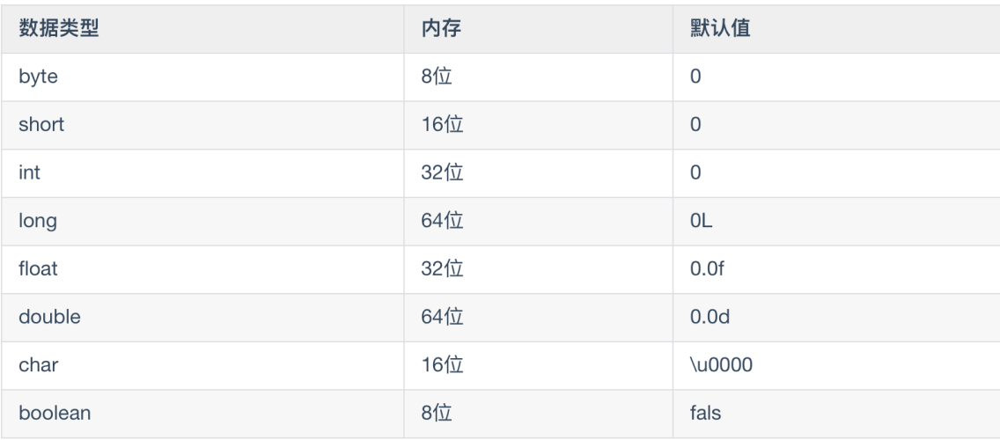
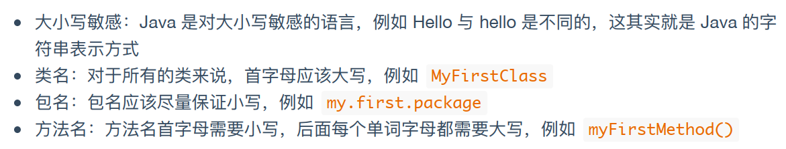
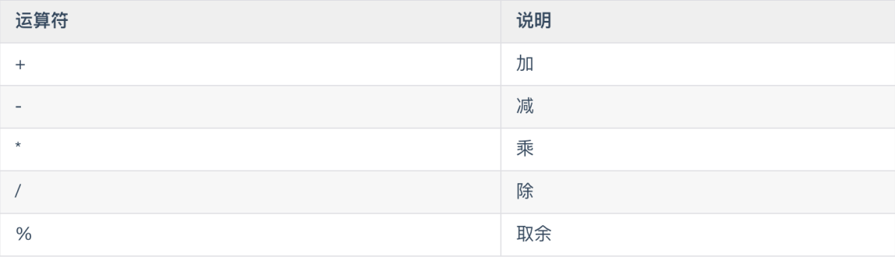
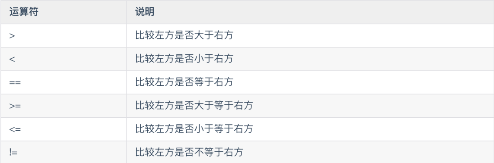
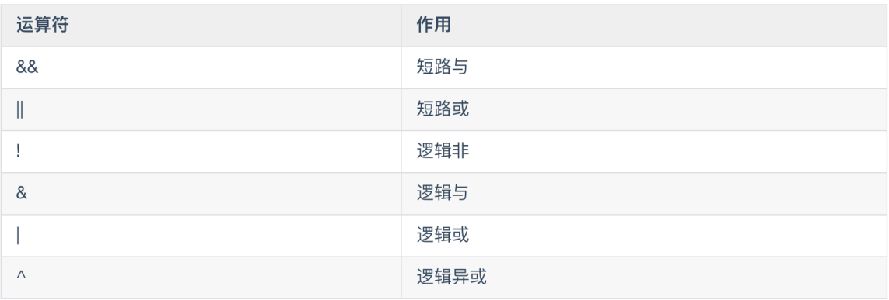
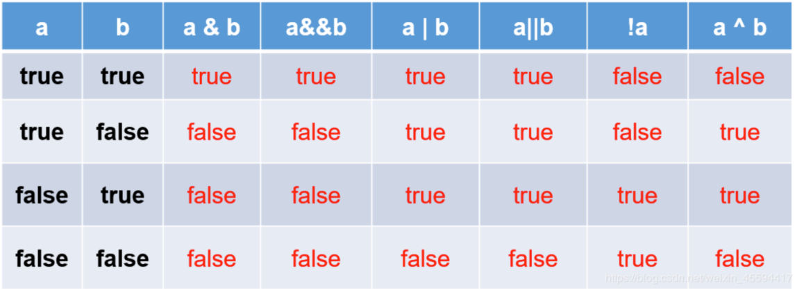

# Java 基础知识

## 1、Java基础语法

### 数据类型 -四类八种

#### 整数型

byte short int long

#### 浮点型

float double

#### 字符型

char 

#### 布尔型

boolean



### 基础语法



### 运算符

#### 赋值运算符

=

`int a=4;`

#### 算数运算符



#### 自增/减运算符

```
int a = 5;
b = ++a;
c = a++;
```

#### 比较运算符



#### 逻辑运算符





#### 位运算符

| 操作符 | 名称       | 描述                                                     |
| ------ | ---------- | -------------------------------------------------------- |
| &      | 与         | 如果对应位都是1，则结果为1，否则为0                      |
| \|     | 或         | 如果对应位都是0，则结果为0，否则为1                      |
| ^      | 异或       | 如果对应位相同，则结果为0，否则为1                       |
| ~      | 取反       | 对运算符翻转每一位，即0变成1，1变成0                     |
| <<     | 左移       | 按位左移运算符。左操作数按位左移右操作数指定的位数。     |
| >>     | 右移       | 按位右移运算符。左操作数按位右移右操作数制定的位数。     |
| >>>    | 无符号右移 | 按位右移补零操作符。在>>之后，移动的得到的空位以零填充。 |

10进制转二进制的时候，因为二进制数一般分8位、 16位、32位以及64位 表示一个十进制数，所以在转换过程中，最高位会补零。
计算机中负数使用二进制的补码表示。10进制转2进制的是源码，源码取反是反码，反码加1是补码。

```
A = 0011 1100
B = 0000 1101
------------------
A & B = 0000 1100
A | B = 0011 1101
A ^ B = 0011 0001
~ A = 1100 0011
A << 2 = 1111 0000
A >> 2 = 1111
A >>> 2 = 0000 1111
------------------
C = 1111 1111	// (补码的-1)
C >>> 4 = 0000 1111
```

##### 常用计算和位运算

1、取模运算转化成位运算 (在不产生溢出的情况下)

```
a % (2^n)
a & (2^n - 1) 
```

2、乘法运算转化成位运算 (在不产生溢出的情况下)

```
a * (2^n)
a < < n 
```

3、除法运算转化成位运算 (在不产生溢出的情况下)

```
a / (2^n) 
a >> n 
// 例: 12/8 == 12>>3 
```

4、 除以2的余数

```
a % 2 
a & 1
```

5、相反数

```
(~x+1)
```

6、判断一个数 x 的奇偶性

```
n&1 == 1 ? "奇数" : "偶数"
```

7、取int型变量 x 的第k位 (k=0,1,2……sizeof(int))

```
(x>>k) & 1
```

8、将int型变量a的第k位清0

```
x = x &~(1 << k) 
```

9、整数的平均数

对于两个整数x,y，如果用 (x+y)/2 求平均值，会产生溢出，因为 x+y 可能会大于INT_MAX，但是我们知道它们的平均值是肯定不会溢出的。

```
int average(int x, int y) {    
    return (x&y)+((x^y)>>1); 
} 
```

10、计算绝对值

```
int abs( int x ) { 
    int y ; 
    y = x >> 31 ; 
    return (x^y)-y ;        //or: (x+y)^y 
} 
```

11、去掉 x 的最后一个1

```
x = 1100
x-1 = 1011
x & (x-1) = 1000
```

#### 三元运算符

条件表达式？表达式1：表达式2

```
int a = 1;
int b = 2;
int c = a>b?a:b;
```

## 2、Java执行控制流程

#### 条件语句

##### if……else 条件语句

```
if(a > b){
	System.out.println("a>b")
}else if(a == b){
	System.out.println("a=b")
}else{
	System.out.println("a<b")
}
```

##### switch多分支语句

```
switch(week){
	case 1:
		System.out.println("Monday")
	break;
	case 2:
		System.out.println("Tuesday")
	break;
	……
	default :
		System.out.println("No else")
	break;
}
```

#### 循环语句

##### while循环语句

```
int a = 10;
while(a>5){
	a--;
}
```

##### do …… while循环语句

```
int b = 10;
do{
	b--;
}while(b==1)
```

##### for循环语句

```
for(int i=0;i<10;i++){
	System.out.println(i)
}
```

```
int array[] = {7,8,9};
for(int arr:array){
	System.out.println(arr)
}
```

#### 跳转语句

##### break

在for  while  do……while循环语句中，用于强制退出当前循环

```
for(int i=0;i<10;i++){
	System.out.println(i)
	if(i=5){
		break;
	}
}
```

##### continue

用于执行下一次循环

```
for(int i=0;i<10;i++){
	if(i=5){
		continue;
	}
	System.out.println(i)
}
```

##### return 

用于从一个方法返回

```
public String getName(){
	return "Jone";
}
```

## 3、面向对象

### 类

相当于一系列对象的抽象

```
class Car{
	//类的属性
	private String name;
	private String color;
	private int price;
	private Wheel wheel;
	//默认构造方法
	public Car(){}
	//带一个参数的构造方法
	public Cart(String name){
		this.name = name;
	}
	//带多个参数的构造方法
	public Cart(String name,String color){
		this.name = name;
		this.color = color;
	}
	//类的方法
	public void setName(String name){
		this.name = name;
	}
	public void getName(){
		return this.name;
	}
	//重载的方法
	public String getCartInfo(String name){
		return this.name;
	//重载的方法
	public int getCartInfo(int price){
		return this.price;
	}
	//重载的方法
	public Strng getCartInfo(String name,int price){
		return this.name +":"+this.price;
	}
	……
}
```

### 创建对象

```
Car car = new Car();
```

### 属性和方法

```
class Car{
	//类的属性
	private String name;
	private String color;
	private Wheel wheel;
	//类的方法
	public void setName(String name){
		this.name = name;
	}
	public void getName(){
		return this.name;
	}
	……
}
```

### 构造方法

```
class Car{
	private String name;
	private String color;
	private Wheel wheel;
	//默认构造方法
	public Car(){}
	//带一个参数的构造方法
	public Cart(String name){
		this.name = name;
	}
	//带多个参数的构造方法
	public Cart(String name,String color){
		this.name = name;
		this.color = color;
	}
	……
}
```

### 方法重载

```
class Car{
	private String name;
	private String color;
	private int price;
	private Wheel wheel;
	……
	//重载的方法
	public String getCartInfo(String name){
		return this.name;
	//重载的方法
	public int getCartInfo(int price){
		return this.price;
	}
	//重载的方法
	public Strng getCartInfo(String name,int price){
		return this.name +":"+this.price;
	}
	……
}
```

### 方法重写

```
class Car{
	private String name;
	private String color;
	private int price;
	private Wheel wheel;
	
	public String getCartInfo(String name){
		return this.name;
	}
	
}
class MyCar extends Car{
	//重写的方法
	@Override
	public String getCartInfo(String name){
		return this.name;
	}
	
}
```

