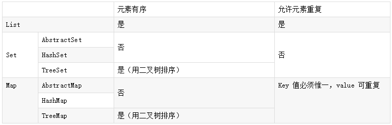

# Java 基础知识

## Java多线程

线程:程序执行流的最小单元【可以理解为：进程中独立运行的子任务】

多线程优点:最大限度的利阻塞用CPU的空闲时间来处理其他任务。

线程运行结果与执行顺序无关，线程的调度是由CPU决定，CPU执行子任务时间具有不确定性。

Java 程序每次运行至少启动两个线程，每当使用 Java 命令执行一个类时，实际上都会启动一个 JVM，每一个JVM实际上就是在操作系统中启动一个线程，Java 本身具备了垃圾的收集机制。所以在 Java 运行时至少会启动两个线程，一个是 main 线程，另外一个是垃圾收集线程。

### 创建线程

#### 继承Thread类

#### 实现Runnable接口

#### 实现Callable接口

### 线程的状态

#### 创建

在程序中用构造方法创建了一个线程对象后，新的线程对象便处于新建状态，此时它已经有了相应的内存空间和其他资源，但还处于不可运行状态。新建一个线程对象可采用Thread 类的构造方法来实现，例如 “Thread thread=new Thread()”。

#### 就绪

新建线程对象后，调用该线程的 start() 方法就可以启动线程。当线程启动时，线程进入就绪状态。此时，线程将进入线程队列排队，等待 CPU 服务，这表明它已经具备了运行条件。

#### 运行

当就绪状态被调用并获得处理器资源时，线程就进入了运行状态。此时，自动调用该线程对象的 run() 方法。run() 方法定义该线程的操作和功能。

#### 阻塞

一个正在执行的线程在某些特殊情况下，如被人为挂起或需要执行耗时的输入/输出操作，会让 CPU 暂时中止自己的执行，进入阻塞状态。在可执行状态下，如果调用sleep(),suspend(),wait() 等方法，线程都将进入阻塞状态，发生阻塞时线程不能进入排队队列，只有当引起阻塞的原因被消除后，线程才可以转入就绪状态。

#### 死亡

线程调用 stop() 方法时或 run() 方法执行结束后，即处于死亡状态。处于死亡状态的线程不具有继续运行的能力。

### 线程的操作方法

#### 线程的强制运行

在线程操作中，可以使用 join() 方法让一个线程强制运行，线程强制运行期间，其他线程无法运行，必须等待此线程完成之后才可以继续执行

#### 线程的休眠

在程序中允许一个线程进行暂时的休眠，直接使用 Thread.sleep() 即可实现休眠

#### 后台线程

在 Java 程序中，只要前台有一个线程在运行，则整个 Java 进程都不会消失，所以此时可以设置一个后台线程，这样即使 Java 线程结束了，此后台线程依然会继续执行，要想实现这样的操作，直接使用 setDaemon() 方法即可。

#### 线程优先级

线程优先级范围为1-10，API提供等级分为：低（MIN_PRIORITY = 1)，中（NORM_PRIORITY=5），高（MAX_PRIORITY=10）。

##### 特点

###### 1)继承特性

【线程A中启动线程B，线程B继承了A的优先级】

###### 2)随机性

【线程调度的顺序不一定是根据优先级，具有随机性】；

#### 线程的礼让

在线程操作中，也可以使用 yield() 方法将一个线程的操作暂时让给其他线程执行

#### 停止线程

1)使用退出标志,使线程正常的执行完run方法终止。

2)使用interrupt方法,使线程异常，线程进行捕获或抛异常，正常执行完run方法终止。

3)使用stop方法强制退出。

### 同步以及死锁

#### 同步

一个多线程的程序如果是通过 Runnable 接口实现的，则意味着类中的属性被多个线程共享，那么这样就会造成一种问题，如果这多个线程要操作同一个资源时就有可能出现资源同步问题。

同步代码块

```
synchronized(同步对象)｛ 
  需要同步的代码 
｝
```

同步方法

```
synchronized 方法返回值 方法名称（参数列表）｛ 

｝
```

#### 死锁

同步可以保证资源共享操作的正确性，但是过多同步也会产生问题。例如，现在张三想要李四的画，李四想要张三的书，张三对李四说“把你的画给我，我就给你书”，李四也对张三说“把你的书给我，我就给你画”两个人互相等对方先行动，就这么干等没有结果，这实际上就是死锁的概念

### volatile关键词

第一：使用volatile关键字会强制将修改的值立即写入主存；

第二：使用volatile关键字的话，当线程2进行修改时，会导致线程1的工作内存中缓存变量stop的缓存行无效（反映到硬件层的话，就是CPU的L1或者L2缓存中对应的缓存行无效）；

第三：由于线程1的工作内存中缓存变量stop的缓存行无效，所以线程1再次读取变量stop的值时会去主存读取。

### 线程池

线程池，本质上是一种对象池，用于管理线程资源。
在任务执行前，需要从线程池中拿出线程来执行。
在任务执行完成之后，需要把线程放回线程池。
通过线程的这种反复利用机制，可以有效地避免直接创建线程所带来的坏处。

#### 好处

降低资源的消耗。线程本身是一种资源，创建和销毁线程会有CPU开销；创建的线程也会占用一定的内存。

提高任务执行的响应速度。任务执行时，可以不必等到线程创建完之后再执行。

提高线程的可管理性。线程不能无限制地创建，需要进行统一的分配、调优和监控。

#### 线程池的主要参数

1、corePoolSize（线程池基本大小）：当向线程池提交一个任务时，若线程池已创建的线程数小于corePoolSize，即便此时存在空闲线程，也会通过创建一个新线程来执行该任务，直到已创建的线程数大于或等于corePoolSize时，（除了利用提交新任务来创建和启动线程（按需构造），也可以通过 prestartCoreThread() 或 prestartAllCoreThreads() 方法来提前启动线程池中的基本线程。）

2、maximumPoolSize（线程池最大大小）：线程池所允许的最大线程个数。当队列满了，且已创建的线程数小于maximumPoolSize，则线程池会创建新的线程来执行任务。另外，对于无界队列，可忽略该参数。

3、keepAliveTime（线程存活保持时间）当线程池中线程数大于核心线程数时，线程的空闲时间如果超过线程存活时间，那么这个线程就会被销毁，直到线程池中的线程数小于等于核心线程数。

4、workQueue（任务队列）：用于传输和保存等待执行任务的阻塞队列。

5、threadFactory（线程工厂）：用于创建新线程。threadFactory创建的线程也是采用new Thread()方式，threadFactory创建的线程名都具有统一的风格：pool-m-thread-n（m为线程池的编号，n为线程池内的线程编号）。

6、handler（线程饱和策略）：当线程池和队列都满了，再加入线程会执行此策略

#### 处理流程

判断核心线程池是否已满，如果不是，则创建线程执行任务

如果核心线程池满了，判断队列是否满了，如果队列没满，将任务放在队列中

如果队列满了，则判断线程池是否已满，如果没满，创建线程执行任务

如果线程池也满了，则按照拒绝策略对任务进行处理

#### Executors创建线程池

##### 创建单一线程的线程池

public static ExecutorService newSingleThreadExecutor();

##### 创建固定数量的线程池

public static ExecutorService newFixedThreadPool(int nThreads);

##### 创建带缓存的线程池

public static ExecutorService newCachedThreadPool();

##### 创建定时调度的线程池

public static ScheduledExecutorService newScheduledThreadPool(int corePoolSize);

##### 创建流式（fork-join）线程池

public static ExecutorService newWorkStealingPool();

#### 手动创建线程池

```
public ThreadPoolExecutor(int corePoolSize,
                          int maximumPoolSize,
                          long keepAliveTime,
                          TimeUnit unit,
                          BlockingQueue<Runnable> workQueue,
                          ThreadFactory threadFactory,
                          RejectedExecutionHandler handler);
```

corePoolSize，线程池中的核心线程数

maximumPoolSize，线程池中的最大线程数

keepAliveTime，空闲时间，当线程池数量超过核心线程数时，多余的空闲线程存活的时间，即：这些线程多久被销毁。

unit，空闲时间的单位，可以是毫秒、秒、分钟、小时和天，等等

workQueue，等待队列，线程池中的线程数超过核心线程数时，任务将放在等待队列，它是一个BlockingQueue类型的对象

* ArrayBlockingQueue，队列是有界的，基于数组实现的阻塞队列
* LinkedBlockingQueue，队列可以有界，也可以无界。基于链表实现的阻塞队列
* SynchronousQueue，不存储元素的阻塞队列，每个插入操作必须等到另一个线程调用移除操作，否则插入操作将一直处于阻塞状态。该队列也是Executors.newCachedThreadPool()的默认队列
* PriorityBlockingQueue，带优先级的无界阻塞队列

threadFactory，线程工厂，我们可以使用它来创建一个线程

* DefaultThreadFactory
* 很多时候，我们需要自定义线程名字。我们只需要自己实现ThreadFactory，用于创建特定场景的线程即可。

handler，拒绝策

* CallerRunsPolicy // 在调用者线程执行
* AbortPolicy // 直接抛出RejectedExecutionException异常
* DiscardPolicy // 任务直接丢弃，不做任何处理
* DiscardOldestPolicy // 丢弃队列里最旧的那个任务，再尝试执行当前任务

#### 提交任务的几种方式

##### execute()

用于提交不需要返回结果的任务

```
public static void main(String[] args) {
    ExecutorService executor = Executors.newFixedThreadPool(2);
    executor.execute(() -> System.out.println("hello"));
}
```

##### submit()

用于提交一个需要返回果的任务。该方法返回一个Future对象，通过调用这个对象的get()方法，我们就能获得返回结果。get()方法会一直阻塞，直到返回结果返回。另外，我们也可以使用它的重载方法get(long timeout, TimeUnit unit)，这个方法也会阻塞，但是在超时时间内仍然没有返回结果时，将抛出异常TimeoutException。

```
public static void main(String[] args) throws Exception {
    ExecutorService executor = Executors.newFixedThreadPool(2);
    Future<Long> future = executor.submit(() -> {
        System.out.println("task is executed");
        return System.currentTimeMillis();
    });
    System.out.println("task execute time is: " + future.get());
}
```

#### 关闭线程池

shutdown()会将线程池状态置为SHUTDOWN，不再接受新的任务，同时会等待线程池中已有的任务执行完成再结束。

shutdownNow()会将线程池状态置为SHUTDOWN，对所有线程执行interrupt()操作，清空队列，并将队列中的任务返回回来。

#### 正确配置线程池的参数

##### 任务的特性

任务的性质：CPU密集型、IO密集型和混杂型

任务的优先级：高中低

任务执行的时间：长中短

任务的依赖性：是否依赖数据库或者其他系统资源

通常来说，如果任务属于CPU密集型，那么我们可以将线程池数量设置成CPU的个数，以减少线程切换带来的开销。如果任务属于IO密集型，我们可以将线程池数量设置得更多一些，比如CPU个数*2。

**可以通过Runtime.getRuntime().availableProcessors()来获取CPU的个数。**

#### 线程池监控

ThreadPoolExecutor

long getTaskCount()，获取已经执行或正在执行的任务数

long getCompletedTaskCount()，获取已经执行的任务数

int getLargestPoolSize()，获取线程池曾经创建过的最大线程数，根据这个参数，我们可以知道线程池是否满过

int getPoolSize()，获取线程池线程数

int getActiveCount()，获取活跃线程数（正在执行任务的线程数）

####  Java 容器都有哪些

Java 容器分为 Collection 和 Map 两大类，其下又有很多子类，如下所示：

- Collection
- List
  - ArrayList
  - LinkedList
  - Vector
  - Stack
- Set
  - HashSet
  - LinkedHashSet
  - TreeSet
- Map
- HashMap
  - LinkedHashMap
- TreeMap
- ConcurrentHashMap
- Hashtable

#### Collection 和 Collections 有什么区别

- Collection 是一个集合接口，它提供了对集合对象进行基本操作的通用接口方法，所有集合都是它的子类，比如 List、Set 等。
- Collections 是一个包装类，包含了很多静态方法，不能被实例化，就像一个工具类，比如提供的排序方法： Collections. sort(list)。

####  List、Set、Map 之间的区别是什么

List、Set、Map 的区别主要体现在两个方面：元素是否有序、是否允许元素重复。

三者之间的区别，如下表：



#### HashMap 和 Hashtable 有什么区别

- 存储：HashMap 运行 key 和 value 为 null，而 Hashtable 不允许。
- 线程安全：Hashtable 是线程安全的，而 HashMap 是非线程安全的。
- 推荐使用：在 Hashtable 的类注释可以看到，Hashtable 是保留类不建议使用，推荐在单线程环境下使用 HashMap 替代，如果需要多线程使用则用 ConcurrentHashMap 替代。

#### 如何决定使用 HashMap 还是 TreeMap

 对于在 Map 中插入、删除、定位一个元素这类操作，HashMap 是最好的选择，因为相对而言 HashMap 的插入会更快，但如果你要对一个 key 集合进行有序的遍历，那 TreeMap 是更好的选择。 

#### HashMap 的实现原理

 HashMap 基于 Hash 算法实现的，我们通过 put(key,value)存储，get(key)来获取。当传入 key 时，HashMap 会根据 key. hashCode() 计算出 hash 值，根据 hash 值将 value 保存在 bucket 里。当计算出的 hash 值相同时，我们称之为 hash 冲突，HashMap 的做法是用链表和红黑树存储相同 hash 值的 value。当 hash 冲突的个数比较少时，使用链表否则使用红黑树。 

#### HashSet 的实现原理

 HashSet 是基于 HashMap 实现的，HashSet 底层使用 HashMap 来保存所有元素，因此 HashSet 的实现比较简单，相关 HashSet 的操作，基本上都是直接调用底层 HashMap 的相关方法来完成，HashSet 不允许重复的值 

#### ArrayList 和 LinkedList 的区别

- 数据结构实现：ArrayList 是动态数组的数据结构实现，而 LinkedList 是双向链表的数据结构实现。
- 随机访问效率：ArrayList 比 LinkedList 在随机访问的时候效率要高，因为 LinkedList 是线性的数据存储方式，所以需要移动指针从前往后依次查找。
- 增加和删除效率：在非首尾的增加和删除操作，LinkedList 要比 ArrayList 效率要高，因为 ArrayList 增删操作要影响数组内的其他数据的下标。

#### 如何实现数组和 List 之间的转换

- 数组转 List：使用 Arrays. asList(array) 进行转换。
- List 转数组：使用 List 自带的 toArray() 方法。

```
// list to array
List<String> list = new ArrayList<String>();
list. add("王磊");
list. add("的博客");
list. toArray();
// array to list
String[] array = new String[]{"王磊","的博客"};
Arrays. asList(array);
```

#### ArrayList 和 Vector 的区别是什么

- 线程安全：Vector 使用了 Synchronized 来实现线程同步，是线程安全的，而 ArrayList 是非线程安全的。
- 性能：ArrayList 在性能方面要优于 Vector。
- 扩容：ArrayList 和 Vector 都会根据实际的需要动态的调整容量，只不过在 Vector 扩容每次会增加 1 倍，而 ArrayList 只会增加 50%。

#### Array 和 ArrayList 有何区别

- Array 可以存储基本数据类型和对象，ArrayList 只能存储对象。
- Array 是指定固定大小的，而 ArrayList 大小是自动扩展的。
- Array 内置方法没有 ArrayList 多，比如 addAll、removeAll、iteration 等方法只有 ArrayList 有

#### 在 Queue 中 poll()和 remove()有什么区别

- 相同点：都是返回第一个元素，并在队列中删除返回的对象。
- 不同点：如果没有元素 poll()会返回 null，而 remove()会直接抛出 NoSuchElementException 异常。

```
Queue<String> queue = new LinkedList<String>();
queue. offer("string"); // add
System. out. println(queue. poll());
System. out. println(queue. remove());
System. out. println(queue. size());
```

####  哪些集合类是线程安全的

 Vector、Hashtable、Stack 都是线程安全的，而像 HashMap 则是非线程安全的，不过在 JDK 1.5 之后随着 Java. util. concurrent 并发包的出现，它们也有了自己对应的线程安全类，比如 HashMap 对应的线程安全类就是 ConcurrentHashMap。 

#### 迭代器 Iterator 是什么

 Iterator 接口提供遍历任何 Collection 的接口。我们可以从一个 Collection 中使用迭代器方法来获取迭代器实例。迭代器取代了 Java 集合框架中的 Enumeration，迭代器允许调用者在迭代过程中移除元素。 

#### Iterator 怎么使用？有什么特点

 Iterator 使用代码如下： 

```
List<String> list = new ArrayList<>();
Iterator<String> it = list. iterator();
while(it. hasNext()){
  String obj = it. next();
  System. out. println(obj);
}
```

 Iterator 的特点是更加安全，因为它可以确保，在当前遍历的集合元素被更改的时候，就会抛出 ConcurrentModificationException 异常。 

####  Iterator 和 ListIterator 有什么区别

- Iterator 可以遍历 Set 和 List 集合，而 ListIterator 只能遍历 List。
- Iterator 只能单向遍历，而 ListIterator 可以双向遍历（向前/后遍历）。
- ListIterator 从 Iterator 接口继承，然后添加了一些额外的功能，比如添加一个元素、替换一个元素、获取前面或后面元素的索引位置。

#### 怎么确保一个集合不能被修改

 可以使用 Collections. unmodifiableCollection(Collection c) 方法来创建一个只读集合，这样改变集合的任何操作都会抛出 Java. lang. UnsupportedOperationException 异常。 

```
List<String> list = new ArrayList<>();
list. add("x");
Collection<String> clist = Collections. unmodifiableCollection(list);
clist. add("y"); // 运行时此行报错
System. out. println(list. size());
```

