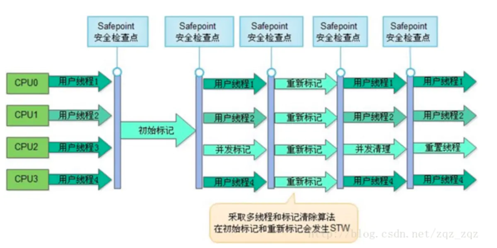

# Java 基础知识

## JAVA GC

及时的把不再使用的对象清除将内存释放出来

### GC的内存区域

程序计数器、虚拟机栈、本地方法栈都是随线程而生随线程而灭，栈帧随着方法的进入和退出做入栈和出栈操作，实现了自动的内存清理

内存垃圾回收主要集中于 java 堆和方法区中

### GC的对象

需要进行回收的对象就是已经没有存活的对象

### 判断一个对象是否存活常用的有两种办法

#### 1）引用计数：

每个对象有一个引用计数属性，新增一个引用时计数加1，引用释放时计数减1，计数为0时可以回收。此方法简单，无法解决对象相互循环引用的问题。

#### 2）可达性分析（Reachability Analysis）：

从GC Roots开始向下搜索，搜索所走过的路径称为引用链。当一个对象到GC Roots没有任何引用链相连时，则证明此对象是不可用的。不可达对象。

在Java语言中，GC Roots包括：

* 虚拟机栈中引用的对象。

* 方法区中类静态属性实体引用的对象。

* 方法区中常量引用的对象。

* 本地方法栈中JNI引用的对象。

### 什么时候触发GC

#### 1)程序调用System.gc时可以触发

#### 2)系统自身来决定GC触发的时机

根据Eden区和From Space区的内存大小来决定。当内存大小不足时，则会启动GC线程并停止应用线程

GC又分为 minor GC 和 Full GC (也称为 Major GC )

Minor GC触发条件：当Eden区满时，触发Minor GC。

Full GC触发条件：

a.调用System.gc时，系统建议执行Full GC，但是不必然执行

b.老年代空间不足

c.方法区空间不足

d.通过Minor GC后进入老年代的平均大小大于老年代的可用内存

 e.由Eden区、From Space区向To Space区复制时，对象大小大于To Space可用内存，则把该对象转存到老年代，且老年代的可用内存小于该对象大小

### GC常用算法

#### 标记-清除算法

为每个对象存储一个标记位，记录对象的状态（活着或是死亡）。分为两个阶段，一个是标记阶段，这个阶段内，为每个对象更新标记位，检查对象是否死亡；第二个阶段是清除阶段，该阶段对死亡的对象进行清除，执行 GC 操作。

**优点**
最大的优点是，标记—清除算法中每个活着的对象的引用只需要找到一个即可，找到一个就可以判断它为活的。此外，更重要的是，这个算法并不移动对象的位置。

**缺点**
它的缺点就是效率比较低（递归与全堆对象遍历）。每个活着的对象都要在标记阶段遍历一遍；所有对象都要在清除阶段扫描一遍，因此算法复杂度较高。没有移动对象，导致可能出现很多碎片空间无法利用的情况。

#### 标记-压缩算法（标记-整理）

标记-压缩法是标记-清除法的一个改进版。同样，在标记阶段，该算法也将所有对象标记为存活和死亡两种状态；不同的是，在第二个阶段，该算法并没有直接对死亡的对象进行清理，而是将所有存活的对象整理一下，放到另一处空间，然后把剩下的所有对象全部清除。这样就达到了标记-整理的目的。

**优点**
该算法不会像标记-清除算法那样产生大量的碎片空间。

**缺点**
如果存活的对象过多，整理阶段将会执行较多复制操作，导致算法效率降低。

#### 复制算法

该算法将内存平均分成两部分，然后每次只使用其中的一部分，当这部分内存满的时候，将内存中所有存活的对象复制到另一个内存中，然后将之前的内存清空，只使用这部分内存，循环下去。

**优点**
实现简单；不产生内存碎片

**缺点**
每次运行，总有一半内存是空的，导致可使用的内存空间只有原来的一半。

#### 分代收集算法

现在的虚拟机垃圾收集大多采用这种方式，它根据对象的生存周期，将堆分为新生代(Young)和老年代(Tenure)。在新生代中，由于对象生存期短，每次回收都会有大量对象死去，那么这时就采用复制算法。老年代里的对象存活率较高，没有额外的空间进行分配担保，所以可以使用标记-整理 或者 标记-清除。

新生代(Young)分为Eden区， survival 区(From区与To区)

当系统创建一个对象的时候，总是在Eden区操作，当这个区满了，那么就会触发一次YoungGC，也就是年轻代的垃圾回收。一般来说这时候不是所有的对象都没用了，所以就会把还能用的对象复制到From区。

这样整个Eden区就被清理干净了，可以继续创建新的对象，当Eden区再次被用完，就再触发一次YoungGC，然后呢，注意，这个时候跟刚才稍稍有点区别。这次触发YoungGC后，会将Eden区与From区还在被使用的对象复制到To区， 

再下一次YoungGC的时候，则是将Eden区与To区中的还在被使用的对象复制到From区。

经过若干次YoungGC后，有些对象在From与To之间来回游荡，这时候From区与To区亮出了底线（阈值），这些家伙要是到现在还没挂掉，对不起，一起滚到（复制）老年代吧。

老年代经过这么几次折腾，也就扛不住了（空间被用完），好，那就来次集体大扫除（Full GC），也就是全量回收。如果Full GC使用太频繁的话，无疑会对系统性能产生很大的影响。所以要合理设置年轻代与老年代的大小，尽量减少Full GC的操作。

### 垃圾收集器

垃圾收集器就是内存回收的具体实现

#### Serial收集器

串行收集器是最古老，最稳定以及效率高的收集器

可能会产生较长的停顿，只使用一个线程去回收

-XX:+UseSerialGC

新生代、老年代使用串行回收

新生代复制算法

老年代标记-压缩

####  ParNew

-XX:+UseParNewGC（new代表新生代，所以适用于新生代）

新生代并行

老年代串行

Serial收集器新生代的并行版本

在新生代回收时使用复制算法

多线程，需要多核支持

-XX:ParallelGCThreads 限制线程数量

#### Parallel收集器

类似ParNew

新生代复制算法

老年代标记-压缩

更加关注吞吐量

-XX:+UseParallelGC

使用Parallel收集器+ 老年代串行

-XX:+UseParallelOldGC

使用Parallel收集器+ 老年代并行

#### CMS收集器

Concurrent Mark Sweep 并发标记清除（应用程序线程和GC线程交替执行）

使用标记-清除算法

并发阶段会降低吞吐量（停顿时间减少，吞吐量降低）

老年代收集器（新生代使用ParNew）

-XX:+UseConcMarkSweepGC

CMS是老年代垃圾收集器，在收集过程中可以与用户线程并发操作。它可以与Serial收集器和Parallel New收集器搭配使用。CMS牺牲了系统的吞吐量来追求收集速度，适合追求垃圾收集速度的服务器上。可以通过JVM启动参数：`-XX:+UseConcMarkSweepGC`来开启CMS。

##### CMS收集过程

CMS 处理过程有七个步骤：

###### 1、初始标记(CMS-initial-mark) ,会导致stw;

这是CMS中两次stop-the-world事件中的一次。这一步的作用是标记存活的对象，有两部分：

1. 标记老年代中所有的GC Roots对象，如下图节点1；
2. 标记年轻代中活着的对象引用到的老年代的对象（指的是年轻带中还存活的引用类型对象，引用指向老年代中的对象）如下图节点2、3；

在Java语言里，可作为GC Roots对象的包括如下几种：

1. 虚拟机栈(栈桢中的本地变量表)中的引用的对象 ；
2. 方法区中的类静态属性引用的对象 ；
3. 方法区中的常量引用的对象 ；
4. 本地方法栈中JNI的引用的对象；
    ps：为了加快此阶段处理速度，减少停顿时间，可以开启初始标记并行化，-XX:+CMSParallelInitialMarkEnabled，同时调大并行标记的线程数，线程数不要超过cpu的核数。

###### 2、并发标记(CMS-concurrent-mark)，与用户线程同时运行；

从“初始标记”阶段标记的对象开始找出所有存活的对象;
 因为是并发运行的，在运行期间会发生新生代的对象晋升到老年代、或者是直接在老年代分配对象、或者更新老年代对象的引用关系等等，对于这些对象，都是需要进行重新标记的，否则有些对象就会被遗漏，发生漏标的情况。为了提高重新标记的效率，该阶段会把上述对象所在的Card标识为Dirty，后续只需扫描这些Dirty Card的对象，避免扫描整个老年代；
 并发标记阶段只负责将引用发生改变的Card标记为Dirty状态，不负责处理；
 如下图所示，也就是节点1、2、3，最终找到了节点4和5。并发标记的特点是和应用程序线程同时运行。并不是老年代的所有存活对象都会被标记，因为标记的同时应用程序会改变一些对象的引用等。

 由于这个阶段是和用户线程并发的，可能会导致concurrent mode failure。 


###### 3、预清理（CMS-concurrent-preclean），与用户线程同时运行；

前一个阶段已经说明，不能标记出老年代全部的存活对象，是因为标记的同时应用程序会改变一些对象引用，这个阶段就是用来处理前一个阶段因为引用关系改变导致没有标记到的存活对象的，它会扫描所有标记为Dirty的Card
 如下图所示，在并发清理阶段，节点3的引用指向了6；则会把节点3的card标记为Dirty；


 最后将6标记为存活,如下图所示： 


###### 4、可被终止的预清理（CMS-concurrent-abortable-preclean） 与用户线程同时运行；

这个阶段尝试着去承担下一个阶段Final Remark阶段足够多的工作。这个阶段持续的时间依赖好多的因素，由于这个阶段是重复的做相同的事情直到发生abort的条件（比如：重复的次数、多少量的工作、持续的时间等等）之一才会停止。
 ps:此阶段最大持续时间为5秒，之所以可以持续5秒，另外一个原因也是为了期待这5秒内能够发生一次ygc，清理年轻带的引用，为的下个阶段的重新标记阶段，扫描年轻带指向老年代的引用的时间减少；

###### 5、重新标记(CMS-remark) ，会导致swt；

这个阶段会导致第二次stop the word，该阶段的任务是完成标记整个年老代的所有的存活对象。
 这个阶段，重新标记的内存范围是整个堆，包含_young_gen和_old_gen。为什么要扫描新生代呢，因为对于老年代中的对象，如果被新生代中的对象引用，那么就会被视为存活对象，即使新生代的对象已经不可达了，也会使用这些不可达的对象当做cms的“gc root”，来扫描老年代； 因此对于老年代来说，引用了老年代中对象的新生代的对象，也会被老年代视作“GC ROOTS”:当此阶段耗时较长的时候，可以加入参数-XX:+CMSScavengeBeforeRemark，在重新标记之前，先执行一次ygc，回收掉年轻带的对象无用的对象，并将对象放入幸存带或晋升到老年代，这样再进行年轻带扫描时，只需要扫描幸存区的对象即可，一般幸存带非常小，这大大减少了扫描时间。
 由于之前的预处理阶段是与用户线程并发执行的，这时候可能年轻带的对象对老年代的引用已经发生了很多改变，这个时候，remark阶段要花很多时间处理这些改变，会导致很长stop the word，所以通常CMS尽量运行Final Remark阶段在年轻代是足够干净的时候。
 另外，还可以开启并行收集：-XX:+CMSParallelRemarkEnabled。

6、并发清除(CMS-concurrent-sweep)，与用户线程同时运行；

通过以上5个阶段的标记，老年代所有存活的对象已经被标记并且现在要通过Garbage Collector采用清扫的方式回收那些不能用的对象了。
 这个阶段主要是清除那些没有标记的对象并且回收空间；
 由于CMS并发清理阶段用户线程还在运行着，伴随程序运行自然就还会有新的垃圾不断产生，这一部分垃圾出现在标记过程之后，CMS无法在当次收集中处理掉它们，只好留待下一次GC时再清理掉。这一部分垃圾就称为“浮动垃圾”。

###### 7、并发重置状态等待下次CMS的触发(CMS-concurrent-reset)，与用户线程同时运行；

 其运行流程图如下所示：



##### 使用CMS需要注意的几点

###### 减少remark阶段停顿

一般CMS的GC耗时80%都在remark阶段，如果发现remark阶段停顿时间很长，可以尝试添加该参数：
 -XX:+CMSScavengeBeforeRemark。
 在执行remark操作之前先做一次Young GC，目的在于减少年轻代对老年代的无效引用，降低remark时的开销。

###### 内存碎片问题

CMS是基于标记-清除算法的，CMS只会删除无用对象，不会对内存做压缩，会造成内存碎片，这时候我们需要用到这个参数：
 -XX:CMSFullGCsBeforeCompaction=n
 意思是说在上一次CMS并发GC执行过后，到底还要再执行多少次full GC才会做压缩。默认是0，也就是在默认配置下每次CMS GC顶不住了而要转入full GC的时候都会做压缩。 如果把CMSFullGCsBeforeCompaction配置为10，就会让上面说的第一个条件变成每隔10次真正的full GC才做一次压缩。

##### concurrent mode failure

这个异常发生在cms正在回收的时候。执行CMS GC的过程中，同时业务线程也在运行，当年轻带空间满了，执行ygc时，需要将存活的对象放入到老年代，而此时老年代空间不足，这时CMS还没有机会回收老年带产生的，或者在做Minor GC的时候，新生代救助空间放不下，需要放入老年代，而老年代也放不下而产生的。

#### G1收集器

G1是目前技术发展的最前沿成果之一，HotSpot开发团队赋予它的使命是未来可以替换掉JDK1.5中发布的CMS收集器。

与CMS收集器相比G1收集器有以下特点：

(1) 空间整合，G1收集器采用标记整理算法，不会产生内存空间碎片。分配大对象时不会因为无法找到连续空间而提前触发下一次GC。

(2)可预测停顿，这是G1的另一大优势，降低停顿时间是G1和CMS的共同关注点，但G1除了追求低停顿外，还能建立可预测的停顿时间模型，能让使用者明确指定在一个长度为N毫秒的时间片段内，消耗在垃圾收集上的时间不得超过N毫秒，这几乎已经是实时Java（RTSJ）的垃圾收集器的特征了。

上面提到的垃圾收集器，收集的范围都是整个新生代或者老年代，而G1不再是这样。使用G1收集器时，Java堆的内存布局与其他收集器有很大差别，它将整个Java堆划分为多个大小相等的独立区域（Region），虽然还保留有新生代和老年代的概念，但新生代和老年代不再是物理隔阂了，它们都是一部分（可以不连续）Region的集合。

G1的新生代收集跟ParNew类似，当新生代占用达到一定比例的时候，开始出发收集。

###### 1、初始标记；

初始标记阶段仅仅只是标记一下GC Roots能直接关联到的对象，并且修改TAMS的值，让下一个阶段用户程序并发运行时，能在正确可用的Region中创建新对象，这一阶段需要停顿线程，但是耗时很短，

###### 2、并发标记；

并发标记阶段是从GC Root开始对堆中对象进行可达性分析，找出存活的对象，这阶段时耗时较长，但可与用户程序并发执行。

###### 3、最终标记；

最终标记阶段则是为了修正在并发标记期间因用户程序继续运作而导致标记产生变动的那一部分标记记录，虚拟机将这段时间对象变化记录在线程Remenbered Set Logs里面，最终标记阶段需要把Remembered Set Logs的数据合并到Remembered Set Logs里面，最终标记阶段需要把Remembered Set Logs的数据合并到Remembered Set中，这一阶段需要停顿线程，但是可并行执行。

###### 4、筛选回收

最后在筛选回收阶段首先对各个Region的回收价值和成本进行排序，根据用户所期望的GC停顿时间来制定回收计划。

### finalize()方法

(1)finalize()是Object的protected方法，子类可以覆盖该方法以实现资源清理工作，GC在回收对象之前调用该方法

(2)finalize()与C++中的析构函数不是对应的。C++中的析构函数调用的时机是确定的（对象离开作用域或delete掉），但Java中的finalize的调用具有不确定性

(3)不建议用finalize方法完成“非内存资源”的清理工作，但建议用于：① 清理本地对象(通过JNI创建的对象)；② 作为确保某些非内存资源(如Socket、文件等)释放的一个补充：在finalize方法中显式调用其他资源释放方法。其原因可见下文[finalize的问题]

## JVM

### JVM内存模型以及分区 

JVM 分为堆区和栈区，还有方法区，初始化的对象放在堆里面，引用放在栈里面， class 类信息常量池（static 常量和 static 变量）等放在方法区 

####  方法区

主要是存储类信息，常量池（static 常量和 static 变量），编译后的代码（字 节码）等数据 

####  堆

初始化的对象，成员变量 （那种非 static 的变量），所有的对象实例和数组都要 在堆上分配 

#### JVM栈

栈的结构是栈帧组成的，调用一个方法就压入一帧，帧上面存储局部变量表，操作数栈，方法出口等信息，局部变量表存放的是基础类型加上一个引用类型，所以还是一个指向地址的指针 

#### 本地方法栈

主要为 Native 方法服务 

#### 程序计数器

记录当前线程执行的行号 

###  堆里面的分区：Eden，survival （from+ to），老年代

 新生代包 含 Eden+Survivor 区，survivor 区里面分为 from 和 to 区

内存回收时，如果用的是复 制算法，从 from 复制到 to，当经过一次或者多次 GC 之后，存活下来的对象会被移动 到老年区，当 JVM 内存不够用的时候，会触发 Full GC，清理 JVM 老年区 当新生区满了之后会触发 YGC,先把存活的对象放到其中一个 Survice 区，然后进行垃圾清理。因为如果仅仅清理需要删除的对象，这样会导致内存碎 片，因此一般会把 Eden 进行完全的清理，然后整理内存。那么下次 GC 的时候， 就会使用下一个 Survive，这样循环使用。如果有特别大的对象，新生代放不下， 就会使用老年代的担保，直接放到老年代里面。因为 JVM 认为，一般大对象的存 活时间一般比较久远。  

###  几种常用的内存调试工具：jmap、jstack、jconsole、jhat 

 jstack 可以看当前栈的情况，jmap 查看内存，jhat 进行 dump 堆的信息 

###  类加载的几个过程  

 加载、验证、准备、解析、初始化。然后是使用和卸载

 通过全限定名来加载生成 class 对象到内存中，然后进行验证这个 class 文件，包括**文件格式校验**、**元数据验证**，**字节码校验**等。准备是对这个对象分配内存。解析是将符号引用转化为直接引用（指针引用），初始化就是开始执行构造器的代码 

###  类加载器双亲委派模型机制 

 当一个类收到了类加载请求时，不会自己先去加载这个类，而是将其委派给父类，由父类去加载，如果此时父类不能加载，反馈给子类，由子类去完成类的加载。  

###  类加载器 

 实现通过类的全限定名获取该类的二进制字节流的代码块叫做类加载器。 

 主要有一下四种类加载器 ：

1. 启动类加载器(Bootstrap ClassLoader)用来加载 java 核心类库，无法被 java 程序直接 引用。 
2. 扩展类加载器(extensions class loader):它用来加载 Java 的扩展库。Java 虚拟机的 实现会提供一个扩展库目录。该类加载器在此目录里面查找并加载 Java 类。 
3.  系统类加载器（system class loader）：它根据 Java 应用的类路径（CLASSPATH） 来加载 Java 类。一般来说，Java 应用的类都是由它来完成加载的。可以通过 ClassLoader.getSystemClassLoader()来获取它。 
4.  用户自定义类加载器，通过继承 java.lang.ClassLoader 类的方式实现。 

 java 内存分配与回收策率以及 Minor GC 和 Major GC 

1. 对象优先在堆的 Eden 区分配。  
2.  大对象直接进入老年代. 
3.  长期存活的对象将直接进入老年代. 

 当 Eden 区没有足够的空间进行分配时，虚拟机会执行一次 Minor GC.Minor Gc 通 常发生在新生代的 Eden 区，在这个区的对象生存期短，往往发生 Gc 的频率较高， 回收速度比较快;Full Gc/Major GC 发生在老年代，一般情况下，触发老年代 GC 的时候不会触发 Minor GC,但是通过配置，可以在 Full GC 之前进行一次 Minor GC 这样可以加快老年代的回收速度。 

## JVM调优

### JVM调优目标

使用较小的内存占用来获得较高的吞吐量或者较低的延迟。

使得程序在正常运行的前提下，获得更高的用户体验和运行效率。

#### **重要的指标**

内存占用：程序正常运行需要的内存大小

延迟：由于垃圾收集而引起的程序停顿时间。

吞吐量：用户程序运行时间占用户程序和垃圾收集占用总时间的比值。

### JVM调优工具

（1）调优可以依赖、参考的数据有系统运行日志、堆栈错误信息、gc日志、线程快照、堆转储快照等。

（2）JVM调优工具

①用 jps（JVM process Status）可以查看虚拟机启动的所有进程、执行主类的全名、JVM启动参数，比如当执行了JPSTest类中的main方法后（main方法持续执行），执行 jps -l可看到下面的JPSTest类的pid为31354，加上-v参数还可以看到JVM启动参数。

②用jstat（JVM Statistics Monitoring Tool）监视虚拟机信息 

jstat -gc pid 500 10 ：每500毫秒打印一次Java堆状况（各个区的容量、使用容量、gc时间等信息），打印10次

③用jmap（Memory Map for Java）查看堆内存信息 

执行jmap -histo pid可以打印出当前堆中所有每个类的实例数量和内存占用，如下，class name是每个类的类名（[B是byte类型，[C是char类型，[I是int类型），bytes是这个类的所有示例占用内存大小，instances是这个类的实例数量：

执行 jmap -dump 可以转储堆内存快照到指定文件，比如执行 jmap -dump:format=b,file=/data/jvm/dumpfile_jmap.hprof 3361 可以把当前堆内存的快照转储到dumpfile_jmap.hprof文件中，然后可以对内存快照进行分析。

④利用jconsole、jvisualvm分析内存信息(各个区如Eden、Survivor、Old等内存变化情况)，如果查看的是远程服务器的JVM，程序启动需要加上远程参数。

⑤分析堆转储快照

可以直接用 jhat（JVM Heap Analysis Tool） 命令来分析内存快照，它的本质实际上内嵌了一个微型的服务器，可以通过浏览器来分析对应的内存快照，比如执行 jhat -port 9810 -J-Xmx4G /data/jvm/dumpfile_jmap.hprof 表示以9810端口启动 jhat 内嵌的服务器：

###  JVM调优经验 

 JVM配置方面，一般情况可以先用默认配置（基本的一些初始参数可以保证一般的应用跑的比较稳定了），在测试中根据系统运行状况（会话并发情况、会话时间等），结合gc日志、内存监控、使用的垃圾收集器等进行合理的调整，当老年代内存过小时可能引起频繁Full GC，当内存过大时Full GC时间会特别长。 

 那么JVM的配置比如新生代、老年代应该配置多大最合适呢？答案是不一定，调优就是找答案的过程，物理内存一定的情况下，新生代设置越大，老年代就越小，Full GC频率就越高，但Full GC时间越短；相反新生代设置越小，老年代就越大，Full GC频率就越低，但每次Full GC消耗的时间越大 。

 建议如下： 

1. -Xms和-Xmx的值设置成相等，堆大小默认为-Xms指定的大小，默认空闲堆内存小于40%时，JVM会扩大堆到-Xmx指定的大小；空闲堆内存大于70%时，JVM会减小堆到-Xms指定的大小。如果在Full GC后满足不了内存需求会动态调整，这个阶段比较耗费资源。 
2.  新生代尽量设置大一些，让对象在新生代多存活一段时间，每次Minor GC 都要尽可能多的收集垃圾对象，防止或延迟对象进入老年代的机会，以减少应用程序发生Full GC的频率。 
3.  老年代如果使用CMS收集器，新生代可以不用太大，因为CMS的并行收集速度也很快，收集过程比较耗时的并发标记和并发清除阶段都可以与用户线程并发执行。 
4.  方法区大小的设置，1.6之前的需要考虑系统运行时动态增加的常量、静态变量等，1.7只要差不多能装下启动时和后期动态加载的类信息就行。 

 代码实现方面，性能出现问题比如程序等待、内存泄漏除了JVM配置可能存在问题，代码实现上也有很大关系： 

* 避免创建过大的对象及数组：过大的对象或数组在新生代没有足够空间容纳时会直接进入老年代，如果是短命的大对象，会提前出发Full GC。 
*  避免同时加载大量数据，如一次从数据库中取出大量数据，或者一次从Excel中读取大量记录，可以分批读取，用完尽快清空引用。 
*  当集合中有对象的引用，这些对象使用完之后要尽快把集合中的引用清空，这些无用对象尽快回收避免进入老年代。 
*  可以在合适的场景（如实现缓存）采用软引用、弱引用，比如用软引用来为ObjectA分配实例：SoftReference objectA=new SoftReference(); 在发生内存溢出前，会将objectA列入回收范围进行二次回收，如果这次回收还没有足够内存，才会抛出内存溢出的异常。  
*  避免产生死循环，产生死循环后，循环体内可能重复产生大量实例，导致内存空间被迅速占满。 
*  尽量避免长时间等待外部资源（数据库、网络、设备资源等）的情况，缩小对象的生命周期，避免进入老年代，如果不能及时返回结果可以适当采用异步处理的方式等。 

 常用JVM参数参考 

| 参数                    | 说明                                                         | 实例                     |
| :---------------------- | :----------------------------------------------------------- | :----------------------- |
| -Xms                    | 初始堆大小，默认物理内存的1/64                               | -Xms512M                 |
| -Xmx                    | 最大堆大小，默认物理内存的1/4                                | -Xms2G                   |
| -Xmn                    | 新生代内存大小，官方推荐为整个堆的3/8                        | -Xmn512M                 |
| -Xss                    | 线程堆栈大小，jdk1.5及之后默认1M，之前默认256k               | -Xss512k                 |
| -XX:NewRatio=n          | 设置新生代和年老代的比值。如:为3，表示年轻代与年老代比值为1：3，年轻代占整个年轻代年老代和的1/4 | -XX:NewRatio=3           |
| -XX:SurvivorRatio=n     | 年轻代中Eden区与两个Survivor区的比值。注意Survivor区有两个。如:8，表示Eden：Survivor=8:1:1，一个Survivor区占整个年轻代的1/8 | -XX:SurvivorRatio=8      |
| -XX:PermSize=n          | 永久代初始值，默认为物理内存的1/64                           | -XX:PermSize=128M        |
| -XX:MaxPermSize=n       | 永久代最大值，默认为物理内存的1/4                            | -XX:MaxPermSize=256M     |
| -verbose:class          | 在控制台打印类加载信息                                       |                          |
| -verbose:gc             | 在控制台打印垃圾回收日志                                     |                          |
| -XX:+PrintGC            | 打印GC日志，内容简单                                         |                          |
| -XX:+PrintGCDetails     | 打印GC日志，内容详细                                         |                          |
| -XX:+PrintGCDateStamps  | 在GC日志中添加时间戳                                         |                          |
| -Xloggc:filename        | 指定gc日志路径                                               | -Xloggc:/data/jvm/gc.log |
| -XX:+UseSerialGC        | 年轻代设置串行收集器Serial                                   |                          |
| -XX:+UseParallelGC      | 年轻代设置并行收集器Parallel Scavenge                        |                          |
| -XX:ParallelGCThreads=n | 设置Parallel Scavenge收集时使用的CPU数。并行收集线程数。     | -XX:ParallelGCThreads=4  |
| -XX:MaxGCPauseMillis=n  | 设置Parallel Scavenge回收的最大时间(毫秒)                    | -XX:MaxGCPauseMillis=100 |
| -XX:GCTimeRatio=n       | 设置Parallel Scavenge垃圾回收时间占程序运行时间的百分比。公式为1/(1+n) | -XX:GCTimeRatio=19       |
| -XX:+UseParallelOldGC   | 设置老年代为并行收集器ParallelOld收集器                      |                          |
| -XX:+UseConcMarkSweepGC | 设置老年代并发收集器CMS                                      |                          |
| -XX:+CMSIncrementalMode | 设置CMS收集器为增量模式，适用于单CPU情况。                   |                          |

## Java多线程

线程:程序执行流的最小单元【可以理解为：进程中独立运行的子任务】

多线程优点:最大限度的利阻塞用CPU的空闲时间来处理其他任务。

线程运行结果与执行顺序无关，线程的调度是由CPU决定，CPU执行子任务时间具有不确定性。

Java 程序每次运行至少启动两个线程，每当使用 Java 命令执行一个类时，实际上都会启动一个 JVM，每一个JVM实际上就是在操作系统中启动一个线程，Java 本身具备了垃圾的收集机制。所以在 Java 运行时至少会启动两个线程，一个是 main 线程，另外一个是垃圾收集线程。

### 创建线程

#### 继承Thread类

#### 实现Runnable接口

#### 实现Callable接口

### 线程的状态

#### 创建

在程序中用构造方法创建了一个线程对象后，新的线程对象便处于新建状态，此时它已经有了相应的内存空间和其他资源，但还处于不可运行状态。新建一个线程对象可采用Thread 类的构造方法来实现，例如 “Thread thread=new Thread()”。

#### 就绪

新建线程对象后，调用该线程的 start() 方法就可以启动线程。当线程启动时，线程进入就绪状态。此时，线程将进入线程队列排队，等待 CPU 服务，这表明它已经具备了运行条件。

#### 运行

当就绪状态被调用并获得处理器资源时，线程就进入了运行状态。此时，自动调用该线程对象的 run() 方法。run() 方法定义该线程的操作和功能。

#### 阻塞

一个正在执行的线程在某些特殊情况下，如被人为挂起或需要执行耗时的输入/输出操作，会让 CPU 暂时中止自己的执行，进入阻塞状态。在可执行状态下，如果调用sleep(),suspend(),wait() 等方法，线程都将进入阻塞状态，发生阻塞时线程不能进入排队队列，只有当引起阻塞的原因被消除后，线程才可以转入就绪状态。

#### 死亡

线程调用 stop() 方法时或 run() 方法执行结束后，即处于死亡状态。处于死亡状态的线程不具有继续运行的能力。

### 线程的操作方法

#### 线程的强制运行

在线程操作中，可以使用 join() 方法让一个线程强制运行，线程强制运行期间，其他线程无法运行，必须等待此线程完成之后才可以继续执行

#### 线程的休眠

在程序中允许一个线程进行暂时的休眠，直接使用 Thread.sleep() 即可实现休眠

#### 后台线程

在 Java 程序中，只要前台有一个线程在运行，则整个 Java 进程都不会消失，所以此时可以设置一个后台线程，这样即使 Java 线程结束了，此后台线程依然会继续执行，要想实现这样的操作，直接使用 setDaemon() 方法即可。

#### 线程优先级

线程优先级范围为1-10，API提供等级分为：低（MIN_PRIORITY = 1)，中（NORM_PRIORITY=5），高（MAX_PRIORITY=10）。

##### 特点

###### 1)继承特性

【线程A中启动线程B，线程B继承了A的优先级】

###### 2)随机性

【线程调度的顺序不一定是根据优先级，具有随机性】；

#### 线程的礼让

在线程操作中，也可以使用 yield() 方法将一个线程的操作暂时让给其他线程执行

#### 停止线程

1)使用退出标志,使线程正常的执行完run方法终止。

2)使用interrupt方法,使线程异常，线程进行捕获或抛异常，正常执行完run方法终止。

3)使用stop方法强制退出。

### 同步以及死锁

#### 同步

一个多线程的程序如果是通过 Runnable 接口实现的，则意味着类中的属性被多个线程共享，那么这样就会造成一种问题，如果这多个线程要操作同一个资源时就有可能出现资源同步问题。

同步代码块

```
synchronized(同步对象)｛ 
  需要同步的代码 
｝
```

同步方法

```
synchronized 方法返回值 方法名称（参数列表）｛ 

｝
```

#### 死锁

同步可以保证资源共享操作的正确性，但是过多同步也会产生问题。例如，现在张三想要李四的画，李四想要张三的书，张三对李四说“把你的画给我，我就给你书”，李四也对张三说“把你的书给我，我就给你画”两个人互相等对方先行动，就这么干等没有结果，这实际上就是死锁的概念

### volatile关键词

第一：使用volatile关键字会强制将修改的值立即写入主存；

第二：使用volatile关键字的话，当线程2进行修改时，会导致线程1的工作内存中缓存变量stop的缓存行无效（反映到硬件层的话，就是CPU的L1或者L2缓存中对应的缓存行无效）；

第三：由于线程1的工作内存中缓存变量stop的缓存行无效，所以线程1再次读取变量stop的值时会去主存读取。

### 线程池

线程池，本质上是一种对象池，用于管理线程资源。
在任务执行前，需要从线程池中拿出线程来执行。
在任务执行完成之后，需要把线程放回线程池。
通过线程的这种反复利用机制，可以有效地避免直接创建线程所带来的坏处。

#### 好处

降低资源的消耗。线程本身是一种资源，创建和销毁线程会有CPU开销；创建的线程也会占用一定的内存。

提高任务执行的响应速度。任务执行时，可以不必等到线程创建完之后再执行。

提高线程的可管理性。线程不能无限制地创建，需要进行统一的分配、调优和监控。

#### 线程池的主要参数

1、corePoolSize（线程池基本大小）：当向线程池提交一个任务时，若线程池已创建的线程数小于corePoolSize，即便此时存在空闲线程，也会通过创建一个新线程来执行该任务，直到已创建的线程数大于或等于corePoolSize时，（除了利用提交新任务来创建和启动线程（按需构造），也可以通过 prestartCoreThread() 或 prestartAllCoreThreads() 方法来提前启动线程池中的基本线程。）

2、maximumPoolSize（线程池最大大小）：线程池所允许的最大线程个数。当队列满了，且已创建的线程数小于maximumPoolSize，则线程池会创建新的线程来执行任务。另外，对于无界队列，可忽略该参数。

3、keepAliveTime（线程存活保持时间）当线程池中线程数大于核心线程数时，线程的空闲时间如果超过线程存活时间，那么这个线程就会被销毁，直到线程池中的线程数小于等于核心线程数。

4、workQueue（任务队列）：用于传输和保存等待执行任务的阻塞队列。

5、threadFactory（线程工厂）：用于创建新线程。threadFactory创建的线程也是采用new Thread()方式，threadFactory创建的线程名都具有统一的风格：pool-m-thread-n（m为线程池的编号，n为线程池内的线程编号）。

6、handler（线程饱和策略）：当线程池和队列都满了，再加入线程会执行此策略

#### 处理流程

判断核心线程池是否已满，如果不是，则创建线程执行任务

如果核心线程池满了，判断队列是否满了，如果队列没满，将任务放在队列中

如果队列满了，则判断线程池是否已满，如果没满，创建线程执行任务

如果线程池也满了，则按照拒绝策略对任务进行处理

#### Executors创建线程池

##### 创建单一线程的线程池

public static ExecutorService newSingleThreadExecutor();

##### 创建固定数量的线程池

public static ExecutorService newFixedThreadPool(int nThreads);

##### 创建带缓存的线程池

public static ExecutorService newCachedThreadPool();

##### 创建定时调度的线程池

public static ScheduledExecutorService newScheduledThreadPool(int corePoolSize);

##### 创建流式（fork-join）线程池

public static ExecutorService newWorkStealingPool();

#### 手动创建线程池

```
public ThreadPoolExecutor(int corePoolSize,
                          int maximumPoolSize,
                          long keepAliveTime,
                          TimeUnit unit,
                          BlockingQueue<Runnable> workQueue,
                          ThreadFactory threadFactory,
                          RejectedExecutionHandler handler);
```

corePoolSize，线程池中的核心线程数

maximumPoolSize，线程池中的最大线程数

keepAliveTime，空闲时间，当线程池数量超过核心线程数时，多余的空闲线程存活的时间，即：这些线程多久被销毁。

unit，空闲时间的单位，可以是毫秒、秒、分钟、小时和天，等等

workQueue，等待队列，线程池中的线程数超过核心线程数时，任务将放在等待队列，它是一个BlockingQueue类型的对象

* ArrayBlockingQueue，队列是有界的，基于数组实现的阻塞队列
* LinkedBlockingQueue，队列可以有界，也可以无界。基于链表实现的阻塞队列
* SynchronousQueue，不存储元素的阻塞队列，每个插入操作必须等到另一个线程调用移除操作，否则插入操作将一直处于阻塞状态。该队列也是Executors.newCachedThreadPool()的默认队列
* PriorityBlockingQueue，带优先级的无界阻塞队列

threadFactory，线程工厂，我们可以使用它来创建一个线程

* DefaultThreadFactory
* 很多时候，我们需要自定义线程名字。我们只需要自己实现ThreadFactory，用于创建特定场景的线程即可。

handler，拒绝策

* CallerRunsPolicy // 在调用者线程执行
* AbortPolicy // 直接抛出RejectedExecutionException异常
* DiscardPolicy // 任务直接丢弃，不做任何处理
* DiscardOldestPolicy // 丢弃队列里最旧的那个任务，再尝试执行当前任务

#### 提交任务的几种方式

##### execute()

用于提交不需要返回结果的任务

```
public static void main(String[] args) {
    ExecutorService executor = Executors.newFixedThreadPool(2);
    executor.execute(() -> System.out.println("hello"));
}
```

##### submit()

用于提交一个需要返回果的任务。该方法返回一个Future对象，通过调用这个对象的get()方法，我们就能获得返回结果。get()方法会一直阻塞，直到返回结果返回。另外，我们也可以使用它的重载方法get(long timeout, TimeUnit unit)，这个方法也会阻塞，但是在超时时间内仍然没有返回结果时，将抛出异常TimeoutException。

```
public static void main(String[] args) throws Exception {
    ExecutorService executor = Executors.newFixedThreadPool(2);
    Future<Long> future = executor.submit(() -> {
        System.out.println("task is executed");
        return System.currentTimeMillis();
    });
    System.out.println("task execute time is: " + future.get());
}
```

#### 关闭线程池

shutdown()会将线程池状态置为SHUTDOWN，不再接受新的任务，同时会等待线程池中已有的任务执行完成再结束。

shutdownNow()会将线程池状态置为SHUTDOWN，对所有线程执行interrupt()操作，清空队列，并将队列中的任务返回回来。

#### 正确配置线程池的参数

##### 任务的特性

任务的性质：CPU密集型、IO密集型和混杂型

任务的优先级：高中低

任务执行的时间：长中短

任务的依赖性：是否依赖数据库或者其他系统资源

通常来说，如果任务属于CPU密集型，那么我们可以将线程池数量设置成CPU的个数，以减少线程切换带来的开销。如果任务属于IO密集型，我们可以将线程池数量设置得更多一些，比如CPU个数*2。

**可以通过Runtime.getRuntime().availableProcessors()来获取CPU的个数。**

#### 线程池监控

ThreadPoolExecutor

long getTaskCount()，获取已经执行或正在执行的任务数

long getCompletedTaskCount()，获取已经执行的任务数

int getLargestPoolSize()，获取线程池曾经创建过的最大线程数，根据这个参数，我们可以知道线程池是否满过

int getPoolSize()，获取线程池线程数

int getActiveCount()，获取活跃线程数（正在执行任务的线程数）

####  Java 容器都有哪些

Java 容器分为 Collection 和 Map 两大类，其下又有很多子类，如下所示：

- Collection
- List
  - ArrayList
  - LinkedList
  - Vector
  - Stack
- Set
  - HashSet
  - LinkedHashSet
  - TreeSet
- Map
- HashMap
  - LinkedHashMap
- TreeMap
- ConcurrentHashMap
- Hashtable

#### Collection 和 Collections 有什么区别

- Collection 是一个集合接口，它提供了对集合对象进行基本操作的通用接口方法，所有集合都是它的子类，比如 List、Set 等。
- Collections 是一个包装类，包含了很多静态方法，不能被实例化，就像一个工具类，比如提供的排序方法： Collections. sort(list)。

####  List、Set、Map 之间的区别是什么

List、Set、Map 的区别主要体现在两个方面：元素是否有序、是否允许元素重复。

三者之间的区别，如下表：


#### HashMap 和 Hashtable 有什么区别

- 存储：HashMap 运行 key 和 value 为 null，而 Hashtable 不允许。
- 线程安全：Hashtable 是线程安全的，而 HashMap 是非线程安全的。
- 推荐使用：在 Hashtable 的类注释可以看到，Hashtable 是保留类不建议使用，推荐在单线程环境下使用 HashMap 替代，如果需要多线程使用则用 ConcurrentHashMap 替代。

#### 如何决定使用 HashMap 还是 TreeMap

 对于在 Map 中插入、删除、定位一个元素这类操作，HashMap 是最好的选择，因为相对而言 HashMap 的插入会更快，但如果你要对一个 key 集合进行有序的遍历，那 TreeMap 是更好的选择。 

#### HashMap 的实现原理

 HashMap 基于 Hash 算法实现的，我们通过 put(key,value)存储，get(key)来获取。当传入 key 时，HashMap 会根据 key. hashCode() 计算出 hash 值，根据 hash 值将 value 保存在 bucket 里。当计算出的 hash 值相同时，我们称之为 hash 冲突，HashMap 的做法是用链表和红黑树存储相同 hash 值的 value。当 hash 冲突的个数比较少时，使用链表否则使用红黑树。 

#### HashSet 的实现原理

 HashSet 是基于 HashMap 实现的，HashSet 底层使用 HashMap 来保存所有元素，因此 HashSet 的实现比较简单，相关 HashSet 的操作，基本上都是直接调用底层 HashMap 的相关方法来完成，HashSet 不允许重复的值 

#### ArrayList 和 LinkedList 的区别

- 数据结构实现：ArrayList 是动态数组的数据结构实现，而 LinkedList 是双向链表的数据结构实现。
- 随机访问效率：ArrayList 比 LinkedList 在随机访问的时候效率要高，因为 LinkedList 是线性的数据存储方式，所以需要移动指针从前往后依次查找。
- 增加和删除效率：在非首尾的增加和删除操作，LinkedList 要比 ArrayList 效率要高，因为 ArrayList 增删操作要影响数组内的其他数据的下标。

#### 如何实现数组和 List 之间的转换

- 数组转 List：使用 Arrays. asList(array) 进行转换。
- List 转数组：使用 List 自带的 toArray() 方法。

```
// list to array
List<String> list = new ArrayList<String>();
list. add("王磊");
list. add("的博客");
list. toArray();
// array to list
String[] array = new String[]{"王磊","的博客"};
Arrays. asList(array);
```

#### ArrayList 和 Vector 的区别是什么

- 线程安全：Vector 使用了 Synchronized 来实现线程同步，是线程安全的，而 ArrayList 是非线程安全的。
- 性能：ArrayList 在性能方面要优于 Vector。
- 扩容：ArrayList 和 Vector 都会根据实际的需要动态的调整容量，只不过在 Vector 扩容每次会增加 1 倍，而 ArrayList 只会增加 50%。

#### Array 和 ArrayList 有何区别

- Array 可以存储基本数据类型和对象，ArrayList 只能存储对象。
- Array 是指定固定大小的，而 ArrayList 大小是自动扩展的。
- Array 内置方法没有 ArrayList 多，比如 addAll、removeAll、iteration 等方法只有 ArrayList 有

#### 在 Queue 中 poll()和 remove()有什么区别

- 相同点：都是返回第一个元素，并在队列中删除返回的对象。
- 不同点：如果没有元素 poll()会返回 null，而 remove()会直接抛出 NoSuchElementException 异常。

```
Queue<String> queue = new LinkedList<String>();
queue. offer("string"); // add
System. out. println(queue. poll());
System. out. println(queue. remove());
System. out. println(queue. size());
```

####  哪些集合类是线程安全的

 Vector、Hashtable、Stack 都是线程安全的，而像 HashMap 则是非线程安全的，不过在 JDK 1.5 之后随着 Java. util. concurrent 并发包的出现，它们也有了自己对应的线程安全类，比如 HashMap 对应的线程安全类就是 ConcurrentHashMap。 

#### 迭代器 Iterator 是什么

 Iterator 接口提供遍历任何 Collection 的接口。我们可以从一个 Collection 中使用迭代器方法来获取迭代器实例。迭代器取代了 Java 集合框架中的 Enumeration，迭代器允许调用者在迭代过程中移除元素。 

#### Iterator 怎么使用？有什么特点

 Iterator 使用代码如下： 

```
List<String> list = new ArrayList<>();
Iterator<String> it = list. iterator();
while(it. hasNext()){
  String obj = it. next();
  System. out. println(obj);
}
```

 Iterator 的特点是更加安全，因为它可以确保，在当前遍历的集合元素被更改的时候，就会抛出 ConcurrentModificationException 异常。 

####  Iterator 和 ListIterator 有什么区别

- Iterator 可以遍历 Set 和 List 集合，而 ListIterator 只能遍历 List。
- Iterator 只能单向遍历，而 ListIterator 可以双向遍历（向前/后遍历）。
- ListIterator 从 Iterator 接口继承，然后添加了一些额外的功能，比如添加一个元素、替换一个元素、获取前面或后面元素的索引位置。

#### 怎么确保一个集合不能被修改

 可以使用 Collections. unmodifiableCollection(Collection c) 方法来创建一个只读集合，这样改变集合的任何操作都会抛出 Java. lang. UnsupportedOperationException 异常。 

```
List<String> list = new ArrayList<>();
list. add("x");
Collection<String> clist = Collections. unmodifiableCollection(list);
clist. add("y"); // 运行时此行报错
System. out. println(list. size());
```

