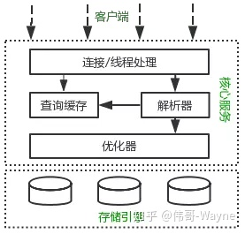
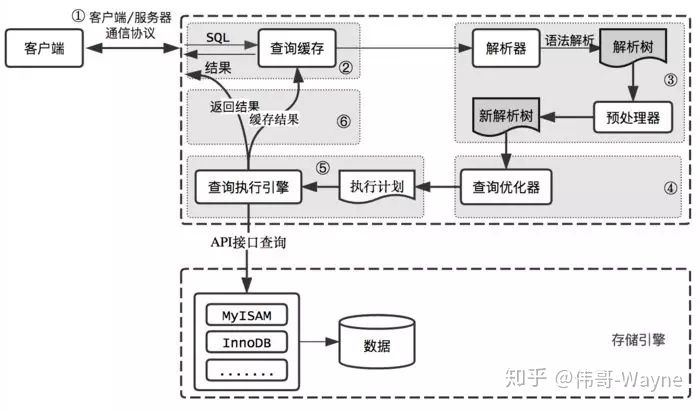
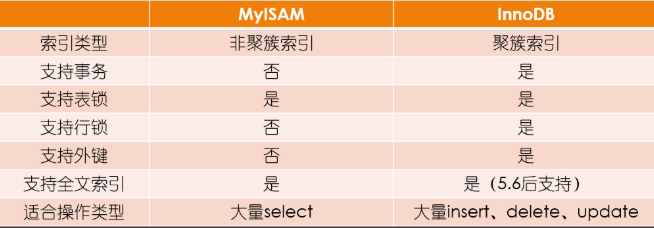
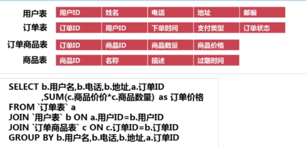
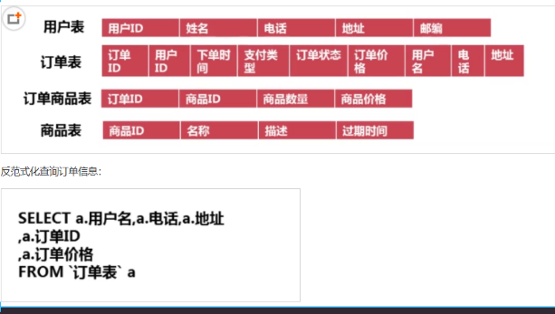

# Mysql

## myisam 和 innodb的区别

myisam引擎是5.1版本之前的默认引擎，支持全文检索、压缩、空间函数等，但是不支持事务和行级锁，所以一般用于有大量查询少量插入的场景来使用，而且myisam不支持外键，并且索引和数据是分开存储的。

innodb是基于聚簇索引建立的，和myisam相反它支持事务、外键，并且通过MVCC来支持高并发，索引和数据存储在一起。

### **如何选择：**

1. 是否要支持事务，如果要请选择innodb，如果不需要可以考虑MyISAM；
2. 如果表中绝大多数都只是读查询，可以考虑MyISAM，如果既有读写也挺频繁，请使用InnoDB
3. 系统奔溃后，MyISAM恢复起来更困难，能否接受；
4. MySQL5.5版本开始Innodb已经成为Mysql的默认引擎(之前是MyISAM)，说明其优势是有目共睹的，如果你不知道用什么，那就用InnoDB，至少不会差。

## mysql的索引，聚簇和非聚簇索引

索引按照数据结构来说主要包含B+树和Hash索引。

假设我们有张表，结构如下：

create table user( id int(11) not null, age int(11) not null, primary key(id), key(age) );

B+树是左小右大的顺序存储结构，节点只包含id索引列，而叶子节点包含索引列和数据，这种数据和索引在一起存储的索引方式叫做聚簇索引，一张表只能有一个聚簇索引。假设没有定义主键，InnoDB会选择一个唯一的非空索引代替，如果没有的话则会隐式定义一个主键作为聚簇索引。


这是主键聚簇索引存储的结构，那么非聚簇索引的结构是什么样子呢？非聚簇索引(二级索引)保存的是主键id值，这一点和myisam保存的是数据地址是不同的。


最终，我们一张图看看InnoDB和Myisam聚簇和非聚簇索引的区别


## 覆盖索引和回表

覆盖索引指的是在一次查询中，如果一个索引包含或者说覆盖所有需要查询的字段的值，我们就称之为覆盖索引，而不再需要回表查询。

而要确定一个查询是否是覆盖索引，我们只需要explain sql语句看Extra的结果是否是“Using index”即可。

以上面的user表来举例，我们再增加一个name字段，然后做一些查询试试。

explain select * from user where age=1; //查询的name无法从索引数据获取 explain select id,age from user where age=1; //可以直接从索引获取

## 锁的类型

mysql锁分为共享锁和排他锁，也叫做读锁和写锁。

读锁是共享的，可以通过lock in share mode实现，这时候只能读不能写。

写锁是排他的，它会阻塞其他的写锁和读锁。从颗粒度来区分，可以分为表锁和行锁两种。

表锁会锁定整张表并且阻塞其他用户对该表的所有读写操作，比如alter修改表结构的时候会锁表。

行锁又可以分为乐观锁和悲观锁，悲观锁可以通过for update实现，乐观锁则通过版本号实现。


## 事务的基本特性和隔离级别

事务基本特性ACID分别是：

1. 原子性指的是一个事务中的操作要么全部成功，要么全部失败。

2. 一致性指的是数据库总是从一个一致性的状态转换到另外一个一致性的状态。比如A转账给B100块钱，假设中间sql执行过程中系统崩溃A也不会损失100块，因为事务没有提交，修改也就不会保存到数据库。

3. 隔离性指的是一个事务的修改在最终提交前，对其他事务是不可见的。

4. 持久性指的是一旦事务提交，所做的修改就会永久保存到数据库中。


而隔离性有4个隔离级别，分别是：

1. read uncommit 读未提交，可能会读到其他事务未提交的数据，也叫做脏读。用户本来应该读取到id=1的用户age应该是10，结果读取到了其他事务还没有提交的事务，结果读取结果age=20，这就是脏读。

2. read commit 读已提交，两次读取结果不一致，叫做不可重复读。不可重复读解决了脏读的问题，他只会读取已经提交的事务。用户开启事务读取id=1用户，查询到age=10，再次读取发现结果=20，在同一个事务里同一个查询读取到不同的结果叫做不可重复读。

3. repeatable read 可重复读，这是mysql的默认级别，就是每次读取结果都一样，但是有可能产生幻读。

4. serializable 串行，一般是不会使用的，他会给每一行读取的数据加锁，会导致大量超时和锁竞争的问题。

## 如何保证ACID

A原子性由undo log日志保证，它记录了需要回滚的日志信息，事务回滚时撤销已经执行成功的sql

C  一致性是事务追求的最终目标：前面提到的原子性、持久性和隔离性，都是为了保证数据库状态的一致性, 。此外，除了数据库层面的保障，一致性的实现也需要应用层面进行保障。 

I 隔离性由MVCC来保证, 数据的隐藏列包括了该行数据的版本号、删除时间、指向 undo log 的指针等等 

D 持久性由内存+redo log来保证，mysql修改数据同时在内存和redo log记录这次操作，事务提交的时候通过redo log刷盘，宕机的时候可以从redo log恢复

## MVCC与幻读

 MySQL InnoDB存储引擎，实现的是基于多版本的并发控制协议——MVCC (Multi-Version Concurrency Control)  

MVCC叫做多版本并发控制，实际上就是保存了数据在某个时间节点的快照。

 **注**：与MVCC相对的，是基于锁的并发控制，Lock-Based Concurrency Control 

**MVCC最大的好处**：读不加锁，读写不冲突。在读多写少的OLTP应用中，读写不冲突是非常重要的，极大的增加了系统的并发性能，现阶段几乎所有的RDBMS，都支持了MVCC。

1. LBCC：Lock-Based Concurrency Control，基于锁的并发控制

2. MVCC：Multi-Version Concurrency Control

   基于多版本的并发控制协议。纯粹基于锁的并发机制并发量低，MVCC是在基于锁的并发控制上的改进，主要是在读操作上提高了并发量。

###  **在MVCC并发控制中，读操作可以分成两类** 

1. **快照读 (snapshot read)**：读取的是记录的可见版本 (有可能是历史版本)，不用加锁（共享读锁s锁也不加，所以不会阻塞其他事务的写）

   简单的select操作，属于快照读，不加锁。

   - select * from table where ?;

2. **当前读 (current read)**：读取的是记录的最新版本，并且，当前读返回的记录，都会加上锁，保证其他事务不会再并发修改这条记录

   特殊的读操作，插入/更新/删除操作，属于当前读，需要加锁。

   - select * from table where ? lock in share mode;
   - select * from table where ? for update;
   - insert into table values (…);
   - update table set ? where ?;
   - delete from table where ?;

### 相关概念

读锁：也叫共享锁、S锁，若事务T对数据对象A加上S锁，则事务T可以读A但不能修改A，其他事务只能再对A加S锁，而不能加X锁，直到T释放A上的S 锁。这保证了其他事务可以读A，但在T释放A上的S锁之前不能对A做任何修改。

写锁：又称排他锁、X锁。若事务T对数据对象A加上X锁，事务T可以读A也可以修改A，其他事务不能再对A加任何锁，直到T释放A上的锁。这保证了其他事务在T释放A上的锁之前不能再读取和修改A。

表锁：操作对象是数据表。Mysql大多数锁策略都支持，是系统开销最低但并发性最低的一个锁策略。事务t对整个表加读锁，则其他事务可读不可写，若加写锁，则其他事务增删改都不行。

行级锁：操作对象是数据表中的一行。是MVCC技术用的比较多的。行级锁对系统开销较大，但处理高并发较好。

MVCC使得大部分支持行锁的事务引擎，不再单纯的使用行锁来进行数据库的并发控制，取而代之的是把数据库的行锁与行的多个版本结合起来，只需要很小的开销,就可以实现非锁定读，从而大大提高数据库系统的并发性能。

### MVCC工作过程

InnoDB的MVCC，是通过在每行纪录后面保存两个隐藏的列来实现的。这两个列，一个保存了行的创建时间，一个保存了行的过期时间（或删除时间），当然存储的并不是实际的时间值，而是系统版本号。每开始一个新的事务，系统版本号都会自动递增。事务开始时刻的系统版本号会作为事务的版本号，用来和查询到的每行纪录的版本号进行比较。在REPEATABLE READ隔离级别下，MVCC具体的操作如下：

1、undo log 在不考虑redo log 的情况下利用undo log工作的简化过程为：

1）为了保证数据的持久性数据要在事务提交之前持久化

2）undo log的持久化必须在在数据持久化之前，这样才能保证系统崩溃时，可以用undo log来回滚事务

2、Innodb中的隐藏列
Innodb通过undo log保存了已更改行的旧版本的信息的快照。
InnoDB的内部实现中为每一行数据增加了三个隐藏列用于实现MVCC。


3、SELECT

InnoDB会根据以下两个条件检查每行纪录：

InnoDB只查找版本早于当前事务版本的数据行，即，行的系统版本号小于或等于事务的系统版本号，这样可以确保事务读取的行，要么是在事务开始前已经存在的，要么是事务自身插入或者修改过的。
行的删除版本，要么未定义，要么大于当前事务版本号。这样可以确保事务读取到的行，在事务开始之前未被删除。
只有符合上述两个条件的纪录，才能作为查询结果返回。

4、INSERT

InnoDB为插入的每一行保存当前系统版本号作为行版本号。

5、DELETE

InnoDB为删除的每一行保存当前系统版本号作为行删除标识。

6、UPDATE

InnoDB为插入一行新纪录，保存当前系统版本号作为行版本号，同时，保存当前系统版本号到原来的行作为行删除标识。

### MVCC优缺点

MVCC在大多数情况下代替了行锁，实现了对读的非阻塞，读不加锁，读写不冲突。缺点是每行记录都需要额外的存储空间，需要做更多的行维护和检查工作。

1.MVCC手段只适用于Msyql隔离级别中的读已提交（Read committed）和可重复读（Repeatable Read）。

2.Read uncommitted由于存在脏读，即能读到未提交事务的数据行，所以不适用MVCC.

原因是MVCC的创建版本和删除版本只要在事务提交后才会产生。

3.串行化由于是会对所涉及到的表加锁，并非行锁，自然也就不存在行的版本控制问题。

4.通过以上总结，可知，MVCC主要作用于事务性的，有行锁控制的数据库模型。

### 幻读

- **前提条件**：InnoDB引擎，可重复读隔离级别，使用**当前读**时。
-  **表现**：一个事务(同一个read view)在前后两次查询同一范围的时候，后一次查询看到了前一次查询没有看到的行。**两点需要说明**：
   　1、在可重复读隔离级别下，普通查询是快照读，是不会看到别的事务插入的数据的，幻读只在**当前读**下才会出现。
      　2、幻读专指**新插入的行**，读到原本存在行的更新结果不算。因为**当前读**的作用就是能读到所有已经提交记录的最新值。

#### 幻读的影响

- 会造成一个事务中先产生的锁，无法锁住后加入的满足条件的行。
- 产生数据一致性问题，在一个事务中，先对符合条件的目标行做变更，而在事务提交前有新的符合目标条件的行加入。这样通过binlog恢复的数据是会将所有符合条件的目标行都进行变更的。

#### 幻读产生的原因

- 行锁只能锁住行，即使把所有的行记录都上锁，也阻止不了新插入的记录。

#### 如何解决幻读

- 将两行记录间的空隙加上锁，阻止新记录的插入；这个锁称为**间隙锁**。

- 间隙锁与间隙锁之间没有冲突关系。跟间隙锁存在冲突关系的，是**往这个间隙中插入一个记录**这个操作。

#### 实例

在事务1中，查询User表id为1的是用户否存在，如果不存在则插入一条id为1的数据。
```

select * from User where id = 1;  
```

在事务1查询结束后，事务2往User表中插入了一条id为1的数据。 
```

 insert into `User`(`id`, `name`) values (1, 'Joonwhee');  
```

 此时，由于事务1查询到id为1的用户不存在，因此插入1条id为1的数据。 

```
insert into ` User`(`id`, `name`) values (1, 'Chillax');  
```

 但是由于事务2已经插入了1条id为1的数据，因此此时会报主键冲突，对于事务1 的业务来说是执行失败的，这里事务1 就是发生了幻读，因为事务1读取的数据状态并不能支持他的下一步的业务，见鬼了一样。这里要灵活的理解读取的意思，第一次select是读取，第二次的insert其实也属于隐式的读取，只不过是在mysql的机制中读取的，插入数据也是要先读取一下有没有主键冲突才能决定是否执行插入。 

#### 间隙锁

间隙锁（Gap Lock）是Innodb在提交下为了解决幻读问题时引入的锁机制，（下面的所有案例没有特意强调都使用可重复读隔离级别）幻读的问题存在是因为新增或者更新操作，这时如果进行范围查询的时候（加锁查询），会出现不一致的问题，这时使用不同的行锁已经没有办法满足要求，需要对一定范围内的数据进行加锁，间隙锁就是解决这类问题的。在可重复读隔离级别下，数据库是通过行锁和间隙锁共同组成的（next-key lock），来实现的。

 **间隙锁是封锁索引记录中的间隔**，或者第一条索引记录之前的范围，又或者最后一条索引记录之后的范围。 

 间隙锁是可重复读级别下才会有的锁，结合MVCC和间隙锁可以解决幻读的问题。我们还是以user举例，假设现在user表有几条记录 

id|age
---|:--:
1|10
2|20
3|30

  索引间隙 (negative infinity，10],(10,20],(20,30],(30,positive infinity) 

当我们执行： 

```
begin; 
select * from user where age=20 for update; 
begin; 
insert into user(age) values(10); #成功 
insert into user(age) values(11); #失败 
insert into user(age) values(20); #失败 
insert into user(age) values(21); #失败 
insert into user(age) values(30); #失败
```

 只有10可以插入成功，那么因为表的间隙mysql自动帮我们生成了区间(左开右闭) 

 由于20存在记录，所以(10,20]，(20,30]区间都被锁定了无法插入、删除。 

 如果查询21呢？就会根据21定位到(20,30)的区间(都是开区间)。 

 需要注意的是唯一索引是不会有间隙索引的。 

## 分库分表

 首先分库分表分为垂直和水平两个方式，一般来说我们拆分的顺序是先垂直后水平。 

###  **垂直分库** 

 基于现在微服务拆分来说，都是已经做到了垂直分库了。 

订单、用户、商品、支付、库存、预算

###  **垂直分表** 

 如果表字段比较多，将不常用的、数据较大的等等做拆分。 

订单表：基础信息+订单扩展+收货地址

###  **水平分表** 

首先根据业务场景来决定使用什么字段作为分表字段(sharding_key)，比如我们现在日订单1000万，我们大部分的场景来源于C端，我们可以用user_id作为sharding_key，数据查询支持到最近3个月的订单，超过3个月的做归档处理，那么3个月的数据量就是9亿，可以分1024张表，那么每张表的数据大概就在100万左右。

比如用户id为100，那我们都经过hash(100)，然后对1024取模，就可以落到对应的表上了。

### 分表后的ID怎么保证唯一性

 因为我们主键默认都是自增的，那么分表之后的主键在不同表就肯定会有冲突了。有几个办法考虑： 

1. 设定步长，比如1-1024张表我们分别设定1-1024的基础步长，这样主键落到不同的表就不会冲突了。
2. 分布式ID，自己实现一套分布式ID生成算法或者使用开源的比如雪花算法这种。
3. 分表后不使用主键作为查询依据，而是每张表单独新增一个字段作为唯一主键使用，比如订单表订单号是唯一的，不管最终落在哪张表都基于订单号作为查询依据，更新也一样。

### 分表后非sharding_key的查询怎么处理

1. 可以做一个mapping表，比如这时候商家要查询订单列表怎么办呢？不带user_id查询的话你总不能扫全表吧？所以我们可以做一个映射关系表，保存商家和用户的关系，查询的时候先通过商家查询到用户列表，再通过user_id去查询。
2. 打宽表，一般而言，商户端对数据实时性要求并不是很高，比如查询订单列表，可以把订单表同步到离线（实时）数仓，再基于数仓去做成一张宽表，再基于其他如es提供查询服务。
3. 数据量不是很大的话，比如后台的一些查询之类的，也可以通过多线程扫表，然后再聚合结果的方式来做。或者异步的形式也是可以的。

```
List<Callable<List<User>>> taskList = Lists.newArrayList();

for (int shardingIndex = 0; shardingIndex < 1024; shardingIndex++) { 
	taskList.add(() -> (userMapper.getProcessingAccountList(shardingIndex))); 
} 

List<ThirdAccountInfo> list = null; 
try { 
	list = taskExecutor.executeTask(taskList); 
} catch (Exception e) { 
//do something 
}

public class TaskExecutor { 
	public <T> List<T> executeTask(Collection<? extends Callable<T>> tasks) throws Exception { 
	List<T> result = Lists.newArrayList(); 
	List<Future<T>> futures = ExecutorUtil.invokeAll(tasks); 
	for (Future<T> future : futures) { 
		result.add(future.get()); 
	} 
	return result; 
	} 
}
```

## mysql主从同步

 首先先了解mysql主从同步的原理 

1. master提交完事务后，写入binlog
2. slave连接到master，获取binlog
3. master创建dump线程，推送binglog到slave
4. slave启动一个IO线程读取同步过来的master的binlog，记录到relay log中继日志中
5. slave再开启一个sql线程读取relay log事件并在slave执行，完成同步
6. slave记录自己的binglog


 由于mysql默认的复制方式是异步的，主库把日志发送给从库后不关心从库是否已经处理，这样会产生一个问题就是假设主库挂了，从库处理失败了，这时候从库升为主库后，日志就丢失了。由此产生两个概念。 

### **全同步复制**

主库写入binlog后强制同步日志到从库，所有的从库都执行完成后才返回给客户端，但是很显然这个方式的话性能会受到严重影响。

### **半同步复制**

和全同步不同的是，半同步复制的逻辑是这样，从库写入日志成功后返回ACK确认给主库，主库收到至少一个从库的确认就认为写操作完成。

### 主从的延迟

 需要走主库的强制走主库查询。 

例如：

```
/*FORCE_MASTER*/ SELECT * FROM table_name;
```

##  **为什么用自增列作为主键** 

1、如果我们定义了主键(PRIMARY KEY)，那么InnoDB会选择主键作为聚集索引。

如果没有显式定义主键，则InnoDB会选择第一个不包含有NULL值的唯一索引作为主键索引。

如果也没有这样的唯一索引，则InnoDB会选择内置6字节长的ROWID作为隐含的聚集索引(ROWID随着行记录的写入而主键递增，这个ROWID不像ORACLE的ROWID那样可引用，是隐含的)。

2、数据记录本身被存于主索引（一颗B+Tree）的叶子节点上，这就要求同一个叶子节点内（大小为一个内存页或磁盘页）的各条数据记录按主键顺序存放

因此每当有一条新的记录插入时，MySQL会根据其主键将其插入适当的节点和位置，如果页面达到装载因子（InnoDB默认为15/16），则开辟一个新的页（节点）

3、如果表使用自增主键，那么每次插入新的记录，记录就会顺序添加到当前索引节点的后续位置，当一页写满，就会自动开辟一个新的页

4、如果使用非自增主键（如果身份证号或学号等），由于每次插入主键的值近似于随机，因此每次新纪录都要被插到现有索引页得中间某个位置

此时MySQL不得不为了将新记录插到合适位置而移动数据，甚至目标页面可能已经被回写到磁盘上而从缓存中清掉，此时又要从磁盘上读回来，这增加了很多开销

同时频繁的移动、分页操作造成了大量的碎片，得到了不够紧凑的索引结构，后续不得不通过OPTIMIZE TABLE来重建表并优化填充页面。

##  **为什么使用数据索引能提高效率** 

1. 数据索引的存储是有序的
2. 在有序的情况下，通过索引查询一个数据是无需遍历索引记录的
3. 极端情况下，数据索引的查询效率为二分法查询效率，趋近于 log2(N)

##  **B+树索引和哈希索引的区别** 

B+树是一个平衡的多叉树，从根节点到每个叶子节点的高度差值不超过1，而且同层级的节点间有指针相互链接，是有序的，如下图：


 哈希索引就是采用一定的哈希算法，把键值换算成新的哈希值，检索时不需要类似B+树那样从根节点到叶子节点逐级查找，只需一次哈希算法即可,是无序的，如下图所示： 


###  **哈希索引的优势** 

 **等值查询，**哈希索引具有绝对优势（前提是：没有大量重复键值，如果大量重复键值时，哈希索引的效率很低，因为存在所谓的哈希碰撞问题。） 

###  **哈希索引不适用的场景** 

1. 不支持范围查询
2. 不支持索引完成排序
3. 不支持联合索引的最左前缀匹配规则

 通常，B+树索引结构适用于绝大多数场景，像下面这种场景用哈希索引才更有优势： 

通常，B+树索引结构适用于绝大多数场景，像下面这种场景用哈希索引才更有优势：

在HEAP表中，如果存储的数据重复度很低（也就是说基数很大），对该列数据以等值查询为主，没有范围查询、没有排序的时候，特别适合采用哈希索引，例如这种SQL：

\# 仅等值查询

select id, name from table where name='李明'; 

而常用的 InnoDB 引擎中默认使用的是B+树索引，它会实时监控表上索引的使用情况。

如果认为建立哈希索引可以提高查询效率，则自动在内存中的“自适应哈希索引缓冲区”建立哈希索引（在InnoDB中默认开启自适应哈希索引）。

通过观察搜索模式，MySQL会利用index key的前缀建立哈希索引，如果一个表几乎大部分都在缓冲池中，那么建立一个哈希索引能够加快等值查询。

**注意**：在某些工作负载下，通过哈希索引查找带来的性能提升远大于额外的监控索引搜索情况和保持这个哈希表结构所带来的开销。

但某些时候，在负载高的情况下，自适应哈希索引中添加的read/write锁也会带来竞争，比如高并发的join操作。like操作和%的通配符操作也不适用于自适应哈希索引，可能要关闭自适应哈希索引。

##  **B树和B+树的区别** 

### B树

 B树，每个节点都存储key和data，所有节点组成这棵树，并且叶子节点指针为nul，叶子结点不包含任何关键字信息。 


### B+树

B+树，所有的叶子结点中包含了全部关键字的信息，及指向含有这些关键字记录的指针，且叶子结点本身依关键字的大小自小而大的顺序链接

所有的非终端结点可以看成是索引部分，结点中仅含有其子树根结点中最大（或最小）关键字。 (而B 树的非终节点也包含需要查找的有效信息)


###  **为什么说B+比B树更适合实际应用中操作系统的文件索引和数据库索引** 

1、B+的磁盘读写代价更低。

B+的内部结点并没有指向关键字具体信息的指针，因此其内部结点相对B树更小。

如果把所有同一内部结点的关键字存放在同一盘块中，那么盘块所能容纳的关键字数量也越多。一次性读入内存中的需要查找的关键字也就越多。相对来说IO读写次数也就降低了。

2、B+-tree的查询效率更加稳定。

由于非终结点并不是最终指向文件内容的结点，而只是叶子结点中关键字的索引。所以任何关键字的查找必须走一条从根结点到叶子结点的路。所有关键字查询的路径长度相同，导致每一个数据的查询效率相当。

##  MYSQL索引 

 数据库索引，是数据库管理系统中一个排序的数据结构，以协助快速查询、更 新数据库表中数据。索引的实现通常使用 B 树及其变种 B+树 

### 索引分类

1. 普通索引: 即针对数据库表创建索引 
2. 唯一索引: 与普通索引类似，不同的就是：MySQL 数据库索引列的值 必须唯一，但允许有空值 
3. 主键索引: 它是一种特殊的唯一索引，不允许有空值。一般是在建表的 时候同时创建主键索引 
4.  组合索引: 为了进一步榨取 MySQL 的效率，就要考虑建立组合索引。 即将数据库表中的多个字段联合起来作为一个组合索引。 

### 联合索引

#### 1、左侧匹配规则

 联合索引是两个或更多个列上的索引 ，对于联合索引:Mysql从左到右的使用索引中的字段，一个查询可以只使用索引中的一部份，但只能是最左侧部分。

例如索引是key index (a,b,c). 可以支持a 、 a,b 、 a,b,c 3种组合进行查找，但不支持 b,c进行查找 .当最左侧字段是常量引用时，索引就十分有效。

#### 2、 具有两列的索引不同于使用两个单独的索引。 

利用索引中的附加列，您可以缩小搜索的范围，但使用一个具有两列的索引不同于使用两个单独的索引。

复合索引的结构与电话簿类似，人名由姓和名构成，电话簿首先按姓氏对进行排序，然后按名字对有相同姓氏的人进行排序。

如果您知道姓，电话簿将非常有用；如果您知道姓和名，电话簿则更为有用，但如果您只知道名不知道姓，电话簿将没有用处。

###  **什么情况下应不建或少建索引** 

1、表记录太少

2、经常插入、删除、修改的表

3、数据重复且分布平均的表字段，假如一个表有10万行记录，有一个字段A只有T和F两种值，且每个值的分布概率大约为50%，那么对这种表A字段建索引一般不会提高数据库的查询速度。

4、经常和主字段一块查询但主字段索引值比较多的表字段

##  **表分区** 

###  定义

表分区，是指根据一定规则，将数据库中的一张表分解成多个更小的，容易管理的部分。从逻辑上看，只有一张表，但是底层却是由多个物理分区组成。 

###  **表分区与分表的区别** 

**分表**：指的是通过一定规则，将一张表分解成多张不同的表。比如将用户订单记录根据时间成多个表。

**分表与分区的区别在于**：分区从逻辑上来讲只有一张表，而分表则是将一张表分解成多张表。

###  **表分区有什么好处** 

1、**存储更多数据**。分区表的数据可以分布在不同的物理设备上，从而高效地利用多个硬件设备。和单个磁盘或者文件系统相比，可以存储更多数据

2、**优化查询**。在where语句中包含分区条件时，可以只扫描一个或多个分区表来提高查询效率；涉及sum和count语句时，也可以在多个分区上并行处理，最后汇总结果。

3、**分区表更容易维护**。例如：想批量删除大量数据可以清除整个分区。

4、**避免某些特殊的瓶颈**，例如InnoDB的单个索引的互斥访问，ext3文件系统的inode锁竞争等。

###  **分区表的限制因素** 

1. 一个表最多只能有1024个分区
2. MySQL5.1中，分区表达式必须是整数，或者返回整数的表达式。在MySQL5.5中提供了非整数表达式分区的支持。
3. 如果分区字段中有主键或者唯一索引的列，那么多有主键列和唯一索引列都必须包含进来。即：分区字段要么不包含主键或者索引列，要么包含全部主键和索引列。
4. 分区表中无法使用外键约束
5. MySQL的分区适用于一个表的所有数据和索引，不能只对表数据分区而不对索引分区，也不能只对索引分区而不对表分区，也不能只对表的一部分数据分区。

###  **如何判断当前MySQL是否支持分区** 

命令：show variables like '%partition%' 运行结果:

have_partintioning 的值为YES，表示支持分区。

###  **MySQL支持的分区类型** 

1. **RANGE分区**： 这种模式允许将数据划分不同范围。例如可以将一个表通过年份划分成若干个分区
2. **LIST分区**： 这种模式允许系统通过预定义的列表的值来对数据进行分割。按照List中的值分区，与RANGE的区别是，range分区的区间范围值是连续的。
3. **HASH分区** ：这中模式允许通过对表的一个或多个列的Hash Key进行计算，最后通过这个Hash码不同数值对应的数据区域进行分区。例如可以建立一个对表主键进行分区的表。
4. **KEY分区** ：上面Hash模式的一种延伸，这里的Hash Key是MySQL系统产生的。

##  **MySQL优化** 

1. 开启查询缓存，优化查询

2. explain你的select查询，这可以帮你分析你的查询语句或是表结构的性能瓶颈。EXPLAIN 的查询结果还会告诉你你的索引主键被如何利用的，你的数据表是如何被搜索和排序的

3. 当只要一行数据时使用limit 1，MySQL数据库引擎会在找到一条数据后停止搜索，而不是继续往后查找下一条符合记录的数据

4. 为搜索字段建索引

5. 使用 ENUM 而不是 VARCHAR。如果你有一个字段，比如“性别”，“国家”，“民族”，“状态”或“部门”，你知道这些字段的取值是有限而且固定的，那么，你应该使用 ENUM 而不是VARCHAR

6. Prepared Statements  Prepared Statements很像存储过程，是一种运行在后台的SQL语句集合，我们可以从使用 prepared statements 获得很多好处，无论是性能问题还是安全问题。

   Prepared Statements 可以检查一些你绑定好的变量，这样可以保护你的程序不会受到“SQL注入式”攻击

7. 垂直分表

8. 选择正确的存储引擎

###  分析查询语句 

通过对查询语句的分析，可以了解查询语句执行的情况，找出查询语句执行的瓶颈，从而优化查询语句。mysql中提供了EXPLAIN语句和DESCRIBE语句，用来分析查询语句。
EXPLAIN语句的基本语法如下：
EXPLAIN [EXTENDED] SELECT select_options;
使用EXTENED关键字,EXPLAIN语句将产生附加信息。select_options是select语句的查询选项，包括from where子句等等。
执行该语句，可以分析EXPLAIN后面的select语句的执行情况，并且能够分析出所查询的表的一些特征。
例如：EXPLAIN SELECT * FROM user;

查询结果进行解释说明：
a、id：select识别符，这是select的查询序列号。
b、select_type：标识select语句的类型。
    它可以是以下几种取值：
        b1、SIMPLE（simple）表示简单查询，其中不包括连接查询和子查询。
        b2、PRIMARY（primary）表示主查询，或者是最外层的查询语句。
        b3、UNION（union）表示连接查询的第2个或者后面的查询语句。
        b4、DEPENDENT UNION（dependent union）连接查询中的第2个或者后面的select语句。取决于外面的查询。
        b5、UNION RESULT（union result）连接查询的结果。
        b6、SUBQUERY（subquery）子查询的第1个select语句。
        b7、DEPENDENT SUBQUERY（dependent subquery）子查询的第1个select,取决于外面的查询。
        b8、DERIVED（derived）导出表的SELECT(FROM子句的子查询)。
c、table：表示查询的表。
d、type：表示表的连接类型。
    下面按照从最佳类型到最差类型的顺序给出各种连接类型。
    d1、system，该表是仅有一行的系统表。这是const连接类型的一个特例。
    d2、const，数据表最多只有一个匹配行，它将在查询开始时被读取，并在余下的查询优化中作为常量对待。const表查询速度很快，因为它们只读一次。const用于使用常数值比较primary key或者unique索引的所有部分的场合。
        例如：EXPLAIN SELECT * FROM user WHERE id=1;
    d3、eq_ref，对于每个来自前面的表的行组合，从该表中读取一行。当一个索引的所有部分都在查询中使用并且索引是UNIQUE或者PRIMARY KEY时候，即可使用这种类型。eq_ref可以用于使用“=”操作符比较带索引的列。比较值可以为常量或者一个在该表前面所读取的表的列的表达式。
        例如：EXPLAIN SELECT * FROM user,db_company WHERE user.company_id = db_company.id;
    d4、ref对于来自前面的表的任意行组合，将从该表中读取所有匹配的行。这种类型用于所以既不是UNION也不是primaey key的情况，或者查询中使用了索引列的左子集，即索引中左边的部分组合。ref可以用于使用=或者<=>操作符的带索引的列。
    d5、ref_or_null，该连接类型如果ref，但是如果添加了mysql可以专门搜索包含null值的行，在解决子查询中经常使用该连接类型的优化。
    d6、index_merge，该连接类型表示使用了索引合并优化方法。在这种情况下，key列包含了使用的索引的清单，key_len包含了使用的索引的最长的关键元素。
    d7、unique_subquery，该类型替换了下面形式的in子查询的ref。是一个索引查询函数，可以完全替代子查询，效率更高。
    d8、index_subquery，该连接类型类似于unique_subquery，可以替换in子查询，但是只适合下列形式的子查询中非唯一索引。
    d9、range，只检索给定范围的行，使用一个索引来选择行。key列显示使用了那个索引。key_len包含所使用索引的最长关键元素。当使用=，<>,>,>=,<,<=,is null,<=>，between或者in操作符，用常量比较关键字列时，类型为range。
    d10、index,该连接类型与all相同，除了只扫描索引树。着通常比all快，引文索引问价通常比数据文件小。
    d11、all，对于前面的表的任意行组合，进行完整的表扫描。如果表是第一个没有标记const的表，这样不好，并且在其他情况下很差。通常可以增加更多的索引来避免使用all连接。
e、possible_keys:possible_keys列指出mysql能使用那个索引在该表中找到行。如果该列是null，则没有相关的索引。在这种情况下，可以通过检查where子句看它是否引起某些列或者适合索引的列来提高查询性能。如果是这样，可以创建适合的索引来提高查询的性能。
f、key：表示查询实际使用到的索引，如果没有选择索引，该列的值是null，要想强制mysql使用或者忽视possible_key列中的索引，在查询中使用force index、use index或者ignore index。
g、key_len：表示mysql选择索引字段按照字节计算的长度，如果健是null，则长度为null。注意通过key_len值可以确定mysql将实际使用一个多列索引中的几个字段。
h、ref:表示使用那个列或者常数或者索引一起来查询记录。
i、rows:显示mysql在表中进行查询必须检查的行数。
j、Extra:该列mysql在处理查询时的详细信息。

##  key和index的区别

1. key 是数据库的物理结构，它包含两层意义和作用，一是约束（偏重于约束和规范数据库的结构完整性），二是索引（辅助查询用的）。包括primary key, unique key, foreign key 等
2. index是数据库的物理结构，它只是辅助查询的，它创建时会在另外的表空间（mysql中的innodb表空间）以一个类似目录的结构存储。索引要分类的话，分为前缀索引、全文本索引等；

##  **数据库表创建注意事项** 

### **1、字段名及字段配制合理性**

- 剔除关系不密切的字段；
- 字段命名要有规则及相对应的含义（不要一部分英文，一部分拼音，还有类似a.b.c这样不明含义的字段）；
- 字段命名尽量不要使用缩写（大多数缩写都不能明确字段含义）；
- 字段不要大小写混用（想要具有可读性，多个英文单词可使用下划线形式连接）；
- 字段名不要使用保留字或者关键字；
- 保持字段名和类型的一致性；
- 慎重选择数字类型；
- 给文本字段留足余量；

### **2、系统特殊字段处理及建成后建议**

- 添加删除标记（例如操作人、删除时间）；
- 建立版本机制；

### **3、表结构合理性配置**

- 多型字段的处理，就是表中是否存在字段能够分解成更小独立的几部分（例如：人可以分为男人和女人）；
- 多值字段的处理，可以将表分为三张表，这样使得检索和排序更加有调理，且保证数据的完整性！

### **4、其它建议**

- 对于大数据字段，独立表进行存储，以便影响性能（例如：简介字段）；
- 使用varchar类型代替char，因为varchar会动态分配长度，char指定长度是固定的；
- 给表创建主键，对于没有主键的表，在查询和索引定义上有一定的影响；
- 避免表字段运行为null，建议设置默认值（例如：int类型设置默认值为0）在索引查询上，效率立显；
- 建立索引，最好建立在唯一和非空的字段上，建立太多的索引对后期插入、更新都存在一定的影响（考虑实际情况来创建）；

##  范式与逆范式 

为了建立冗余较小、结构合理的数据库，设计数据库时必须遵循一定的规则。在关系型数据库中这种规则就称为范式。范式是符合某一种设计要求的总结。要想设计一个结构合理的关系型数据库，必须满足一定的范式。

第一范式1NF，原子性

第二范式2NF，消除部分依赖

第三范式3NF，消除传递依赖

###  1、范式 

 (1）第一范式：具有原子性，确保每列保持原子性。 

 第一范式是最基本的范式。如果数据库表中的所有字段值都是不可分解的原子值，就说明该数据库表满足了第一范式。第一范式的合理遵循需要根据系统的实际需求来定。比如某些数据库系统中需要用到“地址”这个属性本来直接将“地址”属性设计成一个数据库表的字段就行。但是如果系统经常会访问“地址”属性中的“城市”部分，那么就非要将“地址”这个属性重新拆分为省份、城市、详细地址等多个部分进行存储，这样在对地址中某一部分操作的时候将非常方便。这样设计才算满足了数据库的第一范式。 

（2）第二范式：主键列与非主键列遵循完全函数依赖关系，确保表中的每列都和主键相关。 

 第二范式在第一范式的基础之上更进一层。第二范式需要确保数据库表中的每一列都和主键相关，而不能只与主键的某一部分相关（主要针对联合主键而言）。也就是说在一个数据库表中，一个表中只能保存一种数据，不可以把多种数据保存在同一张数据库表中。 

 （3）第三范式：非主键列之间没有传递函数依赖关系索引，确保每列都和主键列直接相关,而不是间接相关。 

所谓传递函数依赖，指的是如果存在"A&rarr;B&rarr;C"的决定关系，则C传递函数依赖于A。因此，满足第三范式的数据库表应该不存在如下依赖关系：

关键字段&rarr;非关键字段x&rarr;非关键字段y

比如在设计一个订单数据表的时候，可以将客户编号作为一个外键和订单表建立相应的关系。而不可以在订单表中添加关于客户其它信息（比如姓名、所属公司等）的字段。

先满足第一范式，再满足第二范式，才能满足第三范式。

###  2、逆范式 

逆范式是指打破范式，通过增加冗余或重复的数据来提高数据库的性能。

示例： 假如有一个商品表Goods：

字段有Goods_id(商品表), goods_name(商品名称), cat_id(所属类别的id)。

还有一个分类表Category：

字段有Cat_id(类别id), cat_name(类别名称)。

现在要查询类别id为3的商品的数量，例如分类列表查询：

分类ID 分类名称 商品数量

3 计算机 567

可以使用下列sql语句：

Select c.*, count(g.goods_id) as goods_count from category as c left join goods as g c.cat_id=g.cat_id group by c.cat_id;

但是，假如商品数量较大，那么就比较耗性能了。这时，我们可以考虑重新设计Category表：增加存当前分类下商品数量的字段。

Cat_id, cat_name, goods_count

每当商品改动时，修改对应分类的数量信息。

再查询分类列表时：Select * from category;

此时额外的消耗，出现在维护该字段的正确性上，保证商品的任何更新都正确的处理该数量才可以。


## **MySQL逻辑架构**



MySQL逻辑架构整体分为三层，最上层为客户端层，并非MySQL所独有，诸如：连接处理、授权认证、安全等功能均在这一层处理。

MySQL大多数核心服务均在中间这一层，包括查询解析、分析、优化、缓存、内置函数(比如：时间、数学、加密等函数)。所有的跨存储引擎的功能也在这一层实现：存储过程、触发器、视图等。

最下层为存储引擎，其负责MySQL中的数据存储和提取。和Linux下的文件系统类似，每种存储引擎都有其优势和劣势。中间的服务层通过API与存储引擎通信，这些API接口屏蔽了不同存储引擎间的差异。

## **MySQL查询过程**



## Mysql优化

### 存储引擎



### 表结构优化

#### 更小的通常更好

应该尽量使用可以正确存储数据的最小数据类型，更小的数据类型通常更快，因为它们占用更少的磁盘、内存和CPU缓存，并且处理时需要的CPU周期更少，但是要确保没有低估需要存储的值的范围，如果无法确认哪个数据类型，就选择你认为不会超过范围的最小类型

案例：

设计两张表，设计不同的数据类型，查看表的容量

#### 简单就好

简单数据类型的操作通常需要更少的CPU周期，例如，

1、整型比字符操作代价更低，因为字符集和校对规则是字符比较比整型比较更复杂，

2、使用mysql自建类型而不是字符串来存储日期和时间

3、用整型存储IP地址

案例：

创建两张相同的表，改变日期的数据类型，查看SQL语句执行的速度

#### 尽量避免null

如果查询中包含可为NULL的列，对mysql来说很难优化，因为可为null的列使得索引、索引统计和值比较都更加复杂，坦白来说，通常情况下null的列改为not null带来的性能提升比较小，所有没有必要将所有的表的schema进行修改，但是应该尽量避免设计成可为null的列

#### 实际细则

##### 整数类型

可以使用的几种整数类型：TINYINT，SMALLINT，MEDIUMINT，INT，BIGINT分别使用8，16，24，32，64位存储空间。

尽量使用满足需求的最小数据类型

##### 字符和字符串类型

###### varchar根据实际内容长度保存数据

1、使用最小的符合需求的长度。

2、varchar(n) n小于等于255使用额外一个字节保存长度，n>255使用额外两个字节保存长度。

3、varchar(5)与varchar(255)保存同样的内容，硬盘存储空间相同，但内存空间占用不同，是指定的大小 。

4、varchar在mysql5.6之前变更长度，或者从255一下变更到255以上时时，都会导致锁表。

应用场景

1、存储长度波动较大的数据，如：文章，有的会很短有的会很长

2、字符串很少更新的场景，每次更新后都会重算并使用额外存储空间保存长度

3、适合保存多字节字符，如：汉字，特殊字符等

###### char固定长度的字符串

1、最大长度：255

2、会自动删除末尾的空格

3、检索效率、写效率 会比varchar高，以空间换时间

应用场景

1、存储长度波动不大的数据，如：md5摘要

2、存储短字符串、经常更新的字符串

##### BLOB和TEXT类型

MySQL 把每个 BLOB 和 TEXT 值当作一个独立的对象处理。

两者都是为了存储很大数据而设计的字符串类型，分别采用二进制和字符方式存储。

##### datetime和timestamp

###### datetime

占用8个字节

与时区无关，数据库底层时区配置，对datetime无效

可保存到毫秒

可保存时间范围大

不要使用字符串存储日期类型，占用空间大，损失日期类型函数的便捷性

###### timestamp

占用4个字节

时间范围：1970-01-01到2038-01-19

精确到秒

采用整形存储

依赖数据库设置的时区

自动更新timestamp列的值

###### date

占用的字节数比使用字符串、datetime、int存储要少，使用date类型只需要3个字节

使用date类型还可以利用日期时间函数进行日期之间的计算

date类型用于保存1000-01-01到9999-12-31之间的日期

##### 使用枚举代替字符串类型

有时可以使用枚举类代替常用的字符串类型，mysql存储枚举类型会非常紧凑，会根据列表值的数据压缩到一个或两个字节中，mysql在内部会将每个值在列表中的位置保存为整数，并且在表的.frm文件中保存“数字-字符串”映射关系的查找表

 create table enum_test(e enum('fish','apple','dog') not null);

 insert into enum_test(e) values('fish'),('dog'),('apple');

 select e+0 from enum_test;

###### 特殊类型数据

人们经常使用varchar(15)来存储ip地址，然而，它的本质是32位无符号整数不是字符串，可以使用INET_ATON()和INET_NTOA函数在这两种表示方法之间转换

案例：

select inet_aton('1.1.1.1')

select inet_ntoa(16843009)

#### 合理使用范式和反范式

##### 范式

###### 优点

范式化的更新通常比反范式要快

当数据较好的范式化后，很少或者没有重复的数据

范式化的数据比较小，可以放在内存中，操作比较快

###### 缺点

通常需要进行关联

##### 反范式

###### 优点

所有的数据都在同一张表中，可以避免关联

可以设计有效的索引；

###### 缺点

表格内的冗余较多，删除数据时候会造成表有些有用的信息丢失


在企业中很好能做到严格意义上的范式或者反范式，一般需要混合使用

在一个网站实例中，这个网站，允许用户发送消息，并且一些用户是付费用户。现在想查看付费用户最近的10条信息。  在user表和message表中都存储用户类型(account_type)而不用完全的反范式化。这避免了完全反范式化的插入和删除问题，因为即使没有消息的时候也绝不会丢失用户的信息。这样也不会把user_message表搞得太大，有利于高效地获取数据。

另一个从父表冗余一些数据到子表的理由是排序的需要。

缓存衍生值也是有用的。如果需要显示每个用户发了多少消息（类似论坛的），可以每次执行一个昂贵的自查询来计算并显示它；也可以在user表中建一个num_messages列，每当用户发新消息时更新这个值。


范式设计



反范式设计



#### 主键的选择

##### 代理主键

与业务无关的，无意义的数字序列

##### 自然主键

事物属性中的自然唯一标识


##### 推荐使用代理主键

它们不与业务耦合，因此更容易维护

一个大多数表，最好是全部表，通用的键策略能够减少需要编写的源码数量，减少系统的总体拥有成本


#### 字符集的选择

1.纯拉丁字符能表示的内容，没必要选择 latin1 之外的其他字符编码，因为这会节省大量的存储空间。

2.如果我们可以确定不需要存放多种语言，就没必要非得使用UTF8或者其他UNICODE字符类型，这回造成大量的存储空间浪费。

3.MySQL的数据类型可以精确到字段，所以当我们需要大型数据库中存放多字节数据的时候，可以通过对不同表不同字段使用不同的数据类型来较大程度减小数据存储量，进而降低 IO 操作次数并提高缓存命中率。

#### 适当的数据冗余

1.被频繁引用且只能通过 Join 2张(或者更多)大表的方式才能得到的独立小字段。

2.这样的场景由于每次Join仅仅只是为了取得某个小字段的值，Join到的记录又大，会造成大量不必要的 IO，完全可以通过空间换取时间的方式来优化。不过，冗余的同时需要确保数据的一致性不会遭到破坏，确保更新的同时冗余字段也被更新。

#### 适当拆分

当我们的表中存在类似于 TEXT 或者是很大的 VARCHAR类型的大字段的时候，如果我们大部分访问这张表的时候都不需要这个字段，我们就该义无反顾的将其拆分到另外的独立表中，以减少常用数据所占用的存储空间。这样做的一个明显好处就是每个数据块中可以存储的数据条数可以大大增加，既减少物理 IO 次数，也能大大提高内存中的缓存命中率。

### 查询优化

#### mysql执行计划

​       在企业的应用场景中，为了知道优化SQL语句的执行，需要查看SQL语句的具体执行过程，以加快SQL语句的执行效率。

​       可以使用explain+SQL语句来模拟优化器执行SQL查询语句，从而知道mysql是如何处理sql语句的。

​	   官网地址： https://dev.mysql.com/doc/refman/5.5/en/explain-output.html 

1、执行计划中包含的信息

|    Column     |                    Meaning                     |
| :-----------: | :--------------------------------------------: |
|      id       |            The `SELECT` identifier             |
|  select_type  |               The `SELECT` type                |
|     table     |          The table for the output row          |
|  partitions   |            The matching partitions             |
|     type      |                 The join type                  |
| possible_keys |         The possible indexes to choose         |
|      key      |           The index actually chosen            |
|    key_len    |          The length of the chosen key          |
|      ref      |       The columns compared to the index        |
|     rows      |        Estimate of rows to be examined         |
|   filtered    | Percentage of rows filtered by table condition |
|     extra     |             Additional information             |

**id**

select查询的序列号，包含一组数字，表示查询中执行select子句或者操作表的顺序

id号分为三种情况：

​		1、如果id相同，那么执行顺序从上到下

```sql
explain select * from emp e join dept d on e.deptno = d.deptno join salgrade sg on e.sal between sg.losal and sg.hisal;
```

​		2、如果id不同，如果是子查询，id的序号会递增，id值越大优先级越高，越先被执行

```sql
explain select * from emp e where e.deptno in (select d.deptno from dept d where d.dname = 'SALES');
```

​		3、id相同和不同的，同时存在：相同的可以认为是一组，从上往下顺序执行，在所有组中，id值越大，优先级越高，越先执行

```sql
explain select * from emp e join dept d on e.deptno = d.deptno join salgrade sg on e.sal between sg.losal and sg.hisal where e.deptno in (select d.deptno from dept d where d.dname = 'SALES');
```

**select_type**

主要用来分辨查询的类型，是普通查询还是联合查询还是子查询

| `select_type` Value  |                           Meaning                            |
| :------------------: | :----------------------------------------------------------: |
|        SIMPLE        |        Simple SELECT (not using UNION or subqueries)         |
|       PRIMARY        |                       Outermost SELECT                       |
|        UNION         |         Second or later SELECT statement in a UNION          |
|   DEPENDENT UNION    | Second or later SELECT statement in a UNION, dependent on outer query |
|     UNION RESULT     |                      Result of a UNION.                      |
|       SUBQUERY       |                   First SELECT in subquery                   |
|  DEPENDENT SUBQUERY  |      First SELECT in subquery, dependent on outer query      |
|       DERIVED        |                        Derived table                         |
| UNCACHEABLE SUBQUERY | A subquery for which the result cannot be cached and must be re-evaluated for each row of the outer query |
|  UNCACHEABLE UNION   | The second or later select in a UNION that belongs to an uncacheable subquery (see UNCACHEABLE SUBQUERY) |

```sql
--sample:简单的查询，不包含子查询和union
explain select * from emp;

--primary:查询中若包含任何复杂的子查询，最外层查询则被标记为Primary
explain select staname,ename supname from (select ename staname,mgr from emp) t join emp on t.mgr=emp.empno ;

--union:若第二个select出现在union之后，则被标记为union
explain select * from emp where deptno = 10 union select * from emp where sal >2000;

--dependent union:跟union类似，此处的depentent表示union或union all联合而成的结果会受外部表影响
explain select * from emp e where e.empno  in ( select empno from emp where deptno = 10 union select empno from emp where sal >2000)

--union result:从union表获取结果的select
explain select * from emp where deptno = 10 union select * from emp where sal >2000;

--subquery:在select或者where列表中包含子查询
explain select * from emp where sal > (select avg(sal) from emp) ;

--dependent subquery:subquery的子查询要受到外部表查询的影响
explain select * from emp e where e.deptno in (select distinct deptno from dept);

--DERIVED: from子句中出现的子查询，也叫做派生类，
explain select staname,ename supname from (select ename staname,mgr from emp) t join emp on t.mgr=emp.empno ;

--UNCACHEABLE SUBQUERY：表示使用子查询的结果不能被缓存
 explain select * from emp where empno = (select empno from emp where deptno=@@sort_buffer_size);
 
--uncacheable union:表示union的查询结果不能被缓存：sql语句未验证
```

**table**

对应行正在访问哪一个表，表名或者别名，可能是临时表或者union合并结果集
		1、如果是具体的表名，则表明从实际的物理表中获取数据，当然也可以是表的别名

​		2、表名是derivedN的形式，表示使用了id为N的查询产生的衍生表

​		3、当有union result的时候，表名是union n1,n2等的形式，n1,n2表示参与union的id

**type**

type显示的是访问类型，访问类型表示我是以何种方式去访问我们的数据，最容易想的是全表扫描，直接暴力的遍历一张表去寻找需要的数据，效率非常低下，访问的类型有很多，效率从最好到最坏依次是：

system > const > eq_ref > ref > fulltext > ref_or_null > index_merge > unique_subquery > index_subquery > range > index > ALL 

一般情况下，得保证查询至少达到range级别，最好能达到ref

```sql
--all:全表扫描，一般情况下出现这样的sql语句而且数据量比较大的话那么就需要进行优化。
explain select * from emp;

--index：全索引扫描这个比all的效率要好，主要有两种情况，一种是当前的查询时覆盖索引，即我们需要的数据在索引中就可以索取，或者是使用了索引进行排序，这样就避免数据的重排序
explain  select empno from emp;

--range：表示利用索引查询的时候限制了范围，在指定范围内进行查询，这样避免了index的全索引扫描，适用的操作符： =, <>, >, >=, <, <=, IS NULL, BETWEEN, LIKE, or IN() 
explain select * from emp where empno between 7000 and 7500;

--index_subquery：利用索引来关联子查询，不再扫描全表
explain select * from emp where emp.job in (select job from t_job);

--unique_subquery:该连接类型类似与index_subquery,使用的是唯一索引
 explain select * from emp e where e.deptno in (select distinct deptno from dept);
 
--index_merge：在查询过程中需要多个索引组合使用，没有模拟出来

--ref_or_null：对于某个字段即需要关联条件，也需要null值的情况下，查询优化器会选择这种访问方式
explain select * from emp e where  e.mgr is null or e.mgr=7369;

--ref：使用了非唯一性索引进行数据的查找
 create index idx_3 on emp(deptno);
 explain select * from emp e,dept d where e.deptno =d.deptno;

--eq_ref ：使用唯一性索引进行数据查找
explain select * from emp,emp2 where emp.empno = emp2.empno;

--const：这个表至多有一个匹配行，
explain select * from emp where empno = 7369;
 
--system：表只有一行记录（等于系统表），这是const类型的特例，平时不会出现
```

 **possible_keys** 

​        显示可能应用在这张表中的索引，一个或多个，查询涉及到的字段上若存在索引，则该索引将被列出，但不一定被查询实际使用

```sql
explain select * from emp,dept where emp.deptno = dept.deptno and emp.deptno = 10;
```

**key**

​		实际使用的索引，如果为null，则没有使用索引，查询中若使用了覆盖索引，则该索引和查询的select字段重叠。

```sql
explain select * from emp,dept where emp.deptno = dept.deptno and emp.deptno = 10;
```

**key_len**

表示索引中使用的字节数，可以通过key_len计算查询中使用的索引长度，在不损失精度的情况下长度越短越好。

```sql
explain select * from emp,dept where emp.deptno = dept.deptno and emp.deptno = 10;
```

**ref**

显示索引的哪一列被使用了，如果可能的话，是一个常数

```sql
explain select * from emp,dept where emp.deptno = dept.deptno and emp.deptno = 10;
```

**rows**

根据表的统计信息及索引使用情况，大致估算出找出所需记录需要读取的行数，此参数很重要，直接反应的sql找了多少数据，在完成目的的情况下越少越好

```sql
explain select * from emp;
```

**extra**

包含额外的信息。

```sql
--using filesort:说明mysql无法利用索引进行排序，只能利用排序算法进行排序，会消耗额外的位置
explain select * from emp order by sal;

--using temporary:建立临时表来保存中间结果，查询完成之后把临时表删除
explain select ename,count(*) from emp where deptno = 10 group by ename;

--using index:这个表示当前的查询时覆盖索引的，直接从索引中读取数据，而不用访问数据表。如果同时出现using where 表名索引被用来执行索引键值的查找，如果没有，表面索引被用来读取数据，而不是真的查找
explain select deptno,count(*) from emp group by deptno limit 10;

--using where:使用where进行条件过滤
explain select * from t_user where id = 1;

--using join buffer:使用连接缓存，情况没有模拟出来

--impossible where：where语句的结果总是false
explain select * from emp where empno = 7469;
```


#### 索引优化

##### 索引分类

- 主键索引

- 唯一索引

- 普通索引

- 全文索引

- 组合索引

- 哈希索引

  基于哈希表的实现，只有精确匹配索引所有列的查询才有效,在mysql中，只有memory的存储引擎显式支持哈希索引,哈希索引自身只需存储对应的hash值，所以索引的结构十分紧凑，这让哈希索引查找的速度非常快。

##### 技术名词

- 回表
- 覆盖索引
- 最左匹配
- 索引下推

##### 索引采用的数据结构

- 哈希表
- B+树

##### 索引匹配方式

- 全值匹配-全值匹配指的是和索引中的所有列进行匹配

  explain select * from staffs where name = 'July' and age = '23' and pos = 'dev';

- 匹配最左前缀-只匹配前面的几列

  explain select * from staffs where name = 'July' and age = '23';

  explain select * from staffs where name = 'July';

- 匹配列前缀-可以匹配某一列的值的开头部分

  explain select * from staffs where name like 'J%';

  explain select * from staffs where name like '%y';

- 匹配范围值-可以查找某一个范围的数据

  explain select * from staffs where name > 'Mary';

- 精确匹配某一列并范围匹配另外一列-可以查询第一列的全部和第二列的部分

  explain select * from staffs where name = 'July' and age > 25;

- 只访问索引的查询-查询的时候只需要访问索引，不需要访问数据行，本质上就是覆盖索引

  explain select name,age,pos from staffs where name = 'July' and age = 25 and pos = 'dev';

##### 优化细节

- 当使用索引列进行查询的时候尽量不要使用表达式，把计算放到业务层而不是数据库层

  select actor_id from actor where actor_id=4;

  select actor_id from actor where actor_id+1=5;

- 尽量使用主键查询，而不是其他索引，因此主键查询不会触发回表查询

- 使用前缀索引

- 使用索引扫描来排序

- union all,in,or都能够使用索引，但是推荐使用in

  explain select * from actor where actor_id = 1 union all select * from actor where actor_id = 2;

  explain select * from actor where actor_id in (1,2);

   explain select * from actor where actor_id = 1 or actor_id =2;

- 范围列可以用到索引

  范围条件是：<、>

  范围列可以用到索引，但是范围列后面的列无法用到索引，索引最多用于一个范围列

- 强制类型转换会全表扫描

  explain select * from user where phone=13800001234;//不会触发索引

  explain select * from user where phone='13800001234';//触发索引

- 更新十分频繁，数据区分度不高的字段上不宜建立索引

  更新会变更B+树，更新频繁的字段建议索引会大大降低数据库性能

  类似于性别这类区分不大的属性，建立索引是没有意义的，不能有效的过滤数据

  一般区分度在80%以上的时候就可以建立索引，区分度可以使用 count(distinct(列名))/count(*) 来计算

- 创建索引的列，不允许为null，可能会得到不符合预期的结果

- 当需要进行表连接的时候，最好不要超过三张表，因为需要join的字段，数据类型必须一致

- 能使用limit的时候尽量使用limit

- 单表索引建议控制在5个以内

- 单索引字段数不允许超过5个（组合索引）

- 创建索引的时候应该避免以下错误概念

  1. 索引越多
  2. 过早优化，在不了解系统的情况下进行优化

#### 查询语句优化

##### 使用子查询优化

这种方式先定位偏移位置的 id，然后往后查询，这种方式适用于 id 递增的情况。

```sql
select * from orders_history where type=8 limit 100000,1;

select id from orders_history where type=8 limit 100000,1;

select * from orders_history where type=8 and 
id>=(select id from orders_history where type=8 limit 100000,1) 
limit 100;
```

##### 使用 id 限定优化

这种方式假设数据表的id是连续递增的，则我们根据查询的页数和查询的记录数可以算出查询的id的范围，可以使用 id between and 来查询：

```sql
select * from orders_history where type=2 
and id between 1000000 and 1000100 limit 100;
```

这种查询方式能够极大地优化查询速度，基本能够在几十毫秒之内完成。限制是只能使用于明确知道id的情况，不过一般建立表的时候，都会添加基本的id字段，这为分页查询带来很多便利。

还可以有另外一种写法：

```sql
select * from orders_history where id >= 1000001 limit 100;
```


当然还可以使用 in 的方式来进行查询，这种方式经常用在多表关联的时候进行查询，使用其他表查询的id集合，来进行查询：

```sql
select * from orders_history where id in
(select order_id from trade_2 where goods = 'pen')
limit 100;
```

这种 in 查询的方式要注意：某些 mysql 版本不支持在 in 子句中使用 limit。

##### 使用临时表优化

对于使用 id 限定优化中的问题，需要 id 是连续递增的，但是在一些场景下，比如使用历史表的时候，或者出现过数据缺失问题时，可以考虑使用临时存储的表来记录分页的id，使用分页的id来进行 in 查询。这样能够极大的提高传统的分页查询速度，尤其是数据量上千万的时候。

##### 关于数据表的id说明

一般情况下，在数据库中建立表的时候，强制为每一张表添加 id 递增字段，这样方便查询。

如果像是订单库等数据量非常庞大，一般会进行分库分表。这个时候不建议使用数据库的 id 作为唯一标识，而应该使用分布式的高并发唯一 id 生成器来生成，并在数据表中使用另外的字段来存储这个唯一标识。

使用先使用范围查询定位 id （或者索引），然后再使用索引进行定位数据，能够提高好几倍查询速度。即先 select id，然后再 select *；

### 分区优化

对于用户而言，分区表是一个独立的逻辑表，但是底层是由多个物理子表组成。分区表对于用户而言是一个完全封装底层实现的黑盒子，对用户而言是透明的，从文件系统中可以看到多个使用#分隔命名的表文件。

mysql在创建表时使用partition by子句定义每个分区存放的数据，在执行查询的时候，优化器会根据分区定义过滤那些没有我们需要数据的分区，这样查询就无须扫描所有分区。

分区的主要目的是将数据安好一个较粗的力度分在不同的表中，这样可以将相关的数据存放在一起。

#### 分区表的原理

分区表由多个相关的底层表实现，这个底层表也是由句柄对象标识，我们可以直接访问各个分区。存储引擎管理分区的各个底层表和管理普通表一样（所有的底层表都必须使用相同的存储引擎），分区表的索引知识在各个底层表上各自加上一个完全相同的索引。从存储引擎的角度来看，底层表和普通表没有任何不同，存储引擎也无须知道这是一个普通表还是一个分区表的一部分。

​		分区表的操作按照以下的操作逻辑进行：

​		**select查询**

​		当查询一个分区表的时候，分区层先打开并锁住所有的底层表，优化器先判断是否可以过滤部分分区，然后再调用对应的存储引擎接口访问各个分区的数据

​		**insert操作**

​		当写入一条记录的时候，分区层先打开并锁住所有的底层表，然后确定哪个分区接受这条记录，再将记录写入对应底层表

​		**delete操作**

​		当删除一条记录时，分区层先打开并锁住所有的底层表，然后确定数据对应的分区，最后对相应底层表进行删除操作

​		**update操作**

​		当更新一条记录时，分区层先打开并锁住所有的底层表，mysql先确定需要更新的记录再哪个分区，然后取出数据并更新，再判断更新后的数据应该再哪个分区，最后对底层表进行写入操作，并对源数据所在的底层表进行删除操作

​		有些操作时支持过滤的，例如，当删除一条记录时，MySQL需要先找到这条记录，如果where条件恰好和分区表达式匹配，就可以将所有不包含这条记录的分区都过滤掉，这对update同样有效。如果是insert操作，则本身就是只命中一个分区，其他分区都会被过滤掉。mysql先确定这条记录属于哪个分区，再将记录写入对应得曾分区表，无须对任何其他分区进行操作

​		虽然每个操作都会“先打开并锁住所有的底层表”，但这并不是说分区表在处理过程中是锁住全表的，如果存储引擎能够自己实现行级锁，例如innodb，则会在分区层释放对应表锁。

#### 分区表的类型

- 范围分区

  根据列值在给定范围内将行分配给分区

- 列表分区

  类似于按range分区，区别在于list分区是基于列值匹配一个离散值集合中的某个值来进行选择

- 列分区

  mysql从5.5开始支持column分区，可以认为i是range和list的升级版，在5.5之后，可以使用column分区替代range和list，但是column分区只接受普通列不接受表达式

- hash分区

  基于用户定义的表达式的返回值来进行选择的分区，该表达式使用将要插入到表中的这些行的列值进行计算。这个函数可以包含myql中有效的、产生非负整数值的任何表达式

- key分区

  类似于hash分区，区别在于key分区只支持一列或多列，且mysql服务器提供其自身的哈希函数，必须有一列或多列包含整数值

- 子分区

  在分区的基础之上，再进行分区后存储

#### 如何使用分区表

如果需要从非常大的表中查询出某一段时间的记录，而这张表中包含很多年的历史数据，数据是按照时间排序的，此时应该如何查询数据呢？

因为数据量巨大，肯定不能在每次查询的时候都扫描全表。考虑到索引在空间和维护上的消耗，也不希望使用索引，即使使用索引，会发现会产生大量的碎片，还会产生大量的随机IO，但是当数据量超大的时候，索引也就无法起作用了，此时可以考虑使用分区来进行解决

1. 全量扫描数据，不要任何索引

   使用简单的分区方式存放表，不要任何索引，根据分区规则大致定位需要的数据为止，通过使用where条件将需要的数据限制在少数分区中，这种策略适用于以正常的方式访问大量数据

2. 索引数据，并分离热点

   如果数据有明显的热点，而且除了这部分数据，其他数据很少被访问到，那么可以将这部分热点数据单独放在一个分区中，让这个分区的数据能够有机会都缓存在内存中，这样查询就可以只访问一个很小的分区表，能够使用索引，也能够有效的使用缓存

#### 在使用分区表的时候需要注意的问题

- null值会使分区过滤无效
- 分区列和索引列不匹配，会导致查询无法进行分区过滤
- 选择分区的成本可能很高
- 打开并锁住所有底层表的成本可能很高
- 维护分区的成本可能很高