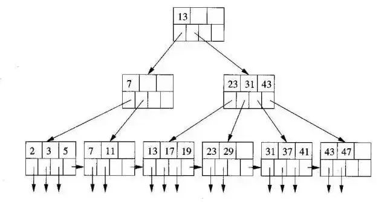
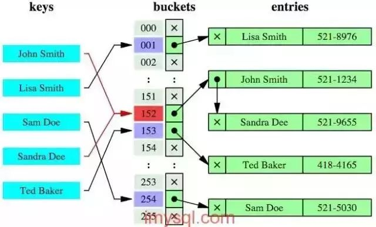
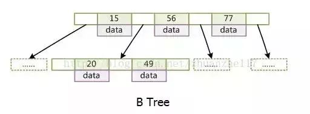
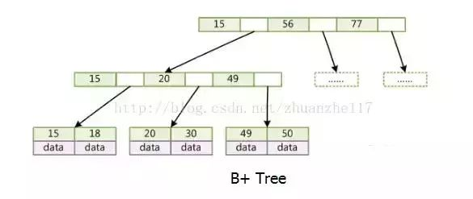

# Mysql

## myisam 和 innodb的区别

myisam引擎是5.1版本之前的默认引擎，支持全文检索、压缩、空间函数等，但是不支持事务和行级锁，所以一般用于有大量查询少量插入的场景来使用，而且myisam不支持外键，并且索引和数据是分开存储的。

innodb是基于聚簇索引建立的，和myisam相反它支持事务、外键，并且通过MVCC来支持高并发，索引和数据存储在一起。

## mysql的索引，聚簇和非聚簇索引

索引按照数据结构来说主要包含B+树和Hash索引。

假设我们有张表，结构如下：

create table user( id int(11) not null, age int(11) not null, primary key(id), key(age) );

B+树是左小右大的顺序存储结构，节点只包含id索引列，而叶子节点包含索引列和数据，这种数据和索引在一起存储的索引方式叫做聚簇索引，一张表只能有一个聚簇索引。假设没有定义主键，InnoDB会选择一个唯一的非空索引代替，如果没有的话则会隐式定义一个主键作为聚簇索引。


这是主键聚簇索引存储的结构，那么非聚簇索引的结构是什么样子呢？非聚簇索引(二级索引)保存的是主键id值，这一点和myisam保存的是数据地址是不同的。


最终，我们一张图看看InnoDB和Myisam聚簇和非聚簇索引的区别


## 覆盖索引和回表

覆盖索引指的是在一次查询中，如果一个索引包含或者说覆盖所有需要查询的字段的值，我们就称之为覆盖索引，而不再需要回表查询。

而要确定一个查询是否是覆盖索引，我们只需要explain sql语句看Extra的结果是否是“Using index”即可。

以上面的user表来举例，我们再增加一个name字段，然后做一些查询试试。

explain select * from user where age=1; //查询的name无法从索引数据获取 explain select id,age from user where age=1; //可以直接从索引获取

## 锁的类型

mysql锁分为共享锁和排他锁，也叫做读锁和写锁。

读锁是共享的，可以通过lock in share mode实现，这时候只能读不能写。

写锁是排他的，它会阻塞其他的写锁和读锁。从颗粒度来区分，可以分为表锁和行锁两种。

表锁会锁定整张表并且阻塞其他用户对该表的所有读写操作，比如alter修改表结构的时候会锁表。

行锁又可以分为乐观锁和悲观锁，悲观锁可以通过for update实现，乐观锁则通过版本号实现。


## 事务的基本特性和隔离级别

事务基本特性ACID分别是：

1. 原子性指的是一个事务中的操作要么全部成功，要么全部失败。

2. 一致性指的是数据库总是从一个一致性的状态转换到另外一个一致性的状态。比如A转账给B100块钱，假设中间sql执行过程中系统崩溃A也不会损失100块，因为事务没有提交，修改也就不会保存到数据库。

3. 隔离性指的是一个事务的修改在最终提交前，对其他事务是不可见的。

4. 持久性指的是一旦事务提交，所做的修改就会永久保存到数据库中。


而隔离性有4个隔离级别，分别是：

1. read uncommit 读未提交，可能会读到其他事务未提交的数据，也叫做脏读。用户本来应该读取到id=1的用户age应该是10，结果读取到了其他事务还没有提交的事务，结果读取结果age=20，这就是脏读。

2. read commit 读已提交，两次读取结果不一致，叫做不可重复读。不可重复读解决了脏读的问题，他只会读取已经提交的事务。用户开启事务读取id=1用户，查询到age=10，再次读取发现结果=20，在同一个事务里同一个查询读取到不同的结果叫做不可重复读。

3. repeatable read 可重复读，这是mysql的默认级别，就是每次读取结果都一样，但是有可能产生幻读。

4. serializable 串行，一般是不会使用的，他会给每一行读取的数据加锁，会导致大量超时和锁竞争的问题。

## 如何保证ACID

A原子性由undo log日志保证，它记录了需要回滚的日志信息，事务回滚时撤销已经执行成功的sql

C一致性一般由代码层面来保证

I隔离性由MVCC来保证

D持久性由内存+redo log来保证，mysql修改数据同时在内存和redo log记录这次操作，事务提交的时候通过redo log刷盘，宕机的时候可以从redo log恢复

## MVCC与幻读

 MySQL InnoDB存储引擎，实现的是基于多版本的并发控制协议——MVCC (Multi-Version Concurrency Control)  

MVCC叫做多版本并发控制，实际上就是保存了数据在某个时间节点的快照。

 **注**：与MVCC相对的，是基于锁的并发控制，Lock-Based Concurrency Control 

**MVCC最大的好处**：读不加锁，读写不冲突。在读多写少的OLTP应用中，读写不冲突是非常重要的，极大的增加了系统的并发性能，现阶段几乎所有的RDBMS，都支持了MVCC。

1. LBCC：Lock-Based Concurrency Control，基于锁的并发控制

2. MVCC：Multi-Version Concurrency Control

   基于多版本的并发控制协议。纯粹基于锁的并发机制并发量低，MVCC是在基于锁的并发控制上的改进，主要是在读操作上提高了并发量。

###  **在MVCC并发控制中，读操作可以分成两类** 

1. **快照读 (snapshot read)**：读取的是记录的可见版本 (有可能是历史版本)，不用加锁（共享读锁s锁也不加，所以不会阻塞其他事务的写）
2. **当前读 (current read)**：读取的是记录的最新版本，并且，当前读返回的记录，都会加上锁，保证其他事务不会再并发修改这条记录

### 相关概念

读锁：也叫共享锁、S锁，若事务T对数据对象A加上S锁，则事务T可以读A但不能修改A，其他事务只能再对A加S锁，而不能加X锁，直到T释放A上的S 锁。这保证了其他事务可以读A，但在T释放A上的S锁之前不能对A做任何修改。

写锁：又称排他锁、X锁。若事务T对数据对象A加上X锁，事务T可以读A也可以修改A，其他事务不能再对A加任何锁，直到T释放A上的锁。这保证了其他事务在T释放A上的锁之前不能再读取和修改A。

表锁：操作对象是数据表。Mysql大多数锁策略都支持，是系统开销最低但并发性最低的一个锁策略。事务t对整个表加读锁，则其他事务可读不可写，若加写锁，则其他事务增删改都不行。

行级锁：操作对象是数据表中的一行。是MVCC技术用的比较多的。行级锁对系统开销较大，但处理高并发较好。

MVCC使得大部分支持行锁的事务引擎，不再单纯的使用行锁来进行数据库的并发控制，取而代之的是把数据库的行锁与行的多个版本结合起来，只需要很小的开销,就可以实现非锁定读，从而大大提高数据库系统的并发性能。

### MVCC工作过程

InnoDB的MVCC，是通过在每行纪录后面保存两个隐藏的列来实现的。这两个列，一个保存了行的创建时间，一个保存了行的过期时间（或删除时间），当然存储的并不是实际的时间值，而是系统版本号。每开始一个新的事务，系统版本号都会自动递增。事务开始时刻的系统版本号会作为事务的版本号，用来和查询到的每行纪录的版本号进行比较。在REPEATABLE READ隔离级别下，MVCC具体的操作如下：

1、undo log 在不考虑redo log 的情况下利用undo log工作的简化过程为：

1）为了保证数据的持久性数据要在事务提交之前持久化

2）undo log的持久化必须在在数据持久化之前，这样才能保证系统崩溃时，可以用undo log来回滚事务

2、Innodb中的隐藏列
Innodb通过undo log保存了已更改行的旧版本的信息的快照。
InnoDB的内部实现中为每一行数据增加了三个隐藏列用于实现MVCC。


3、SELECT

InnoDB会根据以下两个条件检查每行纪录：

InnoDB只查找版本早于当前事务版本的数据行，即，行的系统版本号小于或等于事务的系统版本号，这样可以确保事务读取的行，要么是在事务开始前已经存在的，要么是事务自身插入或者修改过的。
行的删除版本，要么未定义，要么大于当前事务版本号。这样可以确保事务读取到的行，在事务开始之前未被删除。
只有符合上述两个条件的纪录，才能作为查询结果返回。

4、INSERT

InnoDB为插入的每一行保存当前系统版本号作为行版本号。

5、DELETE

InnoDB为删除的每一行保存当前系统版本号作为行删除标识。

6、UPDATE

InnoDB为插入一行新纪录，保存当前系统版本号作为行版本号，同时，保存当前系统版本号到原来的行作为行删除标识。

### MVCC优缺点

MVCC在大多数情况下代替了行锁，实现了对读的非阻塞，读不加锁，读写不冲突。缺点是每行记录都需要额外的存储空间，需要做更多的行维护和检查工作。

1.MVCC手段只适用于Msyql隔离级别中的读已提交（Read committed）和可重复读（Repeatable Read）。

2.Read uncimmitted由于存在脏读，即能读到未提交事务的数据行，所以不适用MVCC.

原因是MVCC的创建版本和删除版本只要在事务提交后才会产生。

3.串行化由于是会对所涉及到的表加锁，并非行锁，自然也就不存在行的版本控制问题。

4.通过以上总结，可知，MVCC主要作用于事务性的，有行锁控制的数据库模型。

### 幻读

- **前提条件**：InnoDB引擎，可重复读隔离级别，使用**当前读**时。
-  **表现**：一个事务(同一个read view)在前后两次查询同一范围的时候，后一次查询看到了前一次查询没有看到的行。**两点需要说明**：
   　1、在可重复读隔离级别下，普通查询是快照读，是不会看到别的事务插入的数据的，幻读只在**当前读**下才会出现。
      　2、幻读专指**新插入的行**，读到原本存在行的更新结果不算。因为**当前读**的作用就是能读到所有已经提交记录的最新值。

#### 幻读的影响

- 会造成一个事务中先产生的锁，无法锁住后加入的满足条件的行。
- 产生数据一致性问题，在一个事务中，先对符合条件的目标行做变更，而在事务提交前有新的符合目标条件的行加入。这样通过binlog恢复的数据是会将所有符合条件的目标行都进行变更的。

#### 幻读产生的原因

- 行锁只能锁住行，即使把所有的行记录都上锁，也阻止不了新插入的记录。

#### 如何解决幻读

- 将两行记录间的空隙加上锁，阻止新记录的插入；这个锁称为**间隙锁**。

- 间隙锁与间隙锁之间没有冲突关系。跟间隙锁存在冲突关系的，是**往这个间隙中插入一个记录**这个操作。

#### 实例

在事务1中，查询User表id为1的是用户否存在，如果不存在则插入一条id为1的数据。
```

select * from User where id = 1;  
```

在事务1查询结束后，事务2往User表中插入了一条id为1的数据。 
```

 insert into `User`(`id`, `name`) values (1, 'Joonwhee');  
```

 此时，由于事务1查询到id为1的用户不存在，因此插入1条id为1的数据。 

```
insert into ` User`(`id`, `name`) values (1, 'Chillax');  
```

 但是由于事务2已经插入了1条id为1的数据，因此此时会报主键冲突，对于事务1 的业务来说是执行失败的，这里事务1 就是发生了幻读，因为事务1读取的数据状态并不能支持他的下一步的业务，见鬼了一样。这里要灵活的理解读取的意思，第一次select是读取，第二次的insert其实也属于隐式的读取，只不过是在mysql的机制中读取的，插入数据也是要先读取一下有没有主键冲突才能决定是否执行插入。 

#### 间隙锁

间隙锁（Gap Lock）是Innodb在提交下为了解决幻读问题时引入的锁机制，（下面的所有案例没有特意强调都使用可重复读隔离级别）幻读的问题存在是因为新增或者更新操作，这时如果进行范围查询的时候（加锁查询），会出现不一致的问题，这时使用不同的行锁已经没有办法满足要求，需要对一定范围内的数据进行加锁，间隙锁就是解决这类问题的。在可重复读隔离级别下，数据库是通过行锁和间隙锁共同组成的（next-key lock），来实现的。

 **间隙锁是封锁索引记录中的间隔**，或者第一条索引记录之前的范围，又或者最后一条索引记录之后的范围。 

 间隙锁是可重复读级别下才会有的锁，结合MVCC和间隙锁可以解决幻读的问题。我们还是以user举例，假设现在user表有几条记录 

id|age
---|:--:
1|10
2|20
3|30

  索引间隙 (negative infinity，10],(10,20],(20,30],(30,positive infinity) 

当我们执行： 

```
begin; 
select * from user where age=20 for update; 
begin; 
insert into user(age) values(10); #成功 
insert into user(age) values(11); #失败 
insert into user(age) values(20); #失败 
insert into user(age) values(21); #失败 
insert into user(age) values(30); #失败
```

 只有10可以插入成功，那么因为表的间隙mysql自动帮我们生成了区间(左开右闭) 

 由于20存在记录，所以(10,20]，(20,30]区间都被锁定了无法插入、删除。 

 如果查询21呢？就会根据21定位到(20,30)的区间(都是开区间)。 

 需要注意的是唯一索引是不会有间隙索引的。 

## 分库分表

 首先分库分表分为垂直和水平两个方式，一般来说我们拆分的顺序是先垂直后水平。 

###  **垂直分库** 

 基于现在微服务拆分来说，都是已经做到了垂直分库了。 

订单、用户、商品、支付、库存、预算

###  **垂直分表** 

 如果表字段比较多，将不常用的、数据较大的等等做拆分。 

订单表：基础信息+订单扩展+收货地址

###  **水平分表** 

首先根据业务场景来决定使用什么字段作为分表字段(sharding_key)，比如我们现在日订单1000万，我们大部分的场景来源于C端，我们可以用user_id作为sharding_key，数据查询支持到最近3个月的订单，超过3个月的做归档处理，那么3个月的数据量就是9亿，可以分1024张表，那么每张表的数据大概就在100万左右。

比如用户id为100，那我们都经过hash(100)，然后对1024取模，就可以落到对应的表上了。

### 分表后的ID怎么保证唯一性

 因为我们主键默认都是自增的，那么分表之后的主键在不同表就肯定会有冲突了。有几个办法考虑： 

1. 设定步长，比如1-1024张表我们分别设定1-1024的基础步长，这样主键落到不同的表就不会冲突了。
2. 分布式ID，自己实现一套分布式ID生成算法或者使用开源的比如雪花算法这种。
3. 分表后不使用主键作为查询依据，而是每张表单独新增一个字段作为唯一主键使用，比如订单表订单号是唯一的，不管最终落在哪张表都基于订单号作为查询依据，更新也一样。

### 分表后非sharding_key的查询怎么处理

1. 可以做一个mapping表，比如这时候商家要查询订单列表怎么办呢？不带user_id查询的话你总不能扫全表吧？所以我们可以做一个映射关系表，保存商家和用户的关系，查询的时候先通过商家查询到用户列表，再通过user_id去查询。
2. 打宽表，一般而言，商户端对数据实时性要求并不是很高，比如查询订单列表，可以把订单表同步到离线（实时）数仓，再基于数仓去做成一张宽表，再基于其他如es提供查询服务。
3. 数据量不是很大的话，比如后台的一些查询之类的，也可以通过多线程扫表，然后再聚合结果的方式来做。或者异步的形式也是可以的。

```
List<Callable<List<User>>> taskList = Lists.newArrayList();

for (int shardingIndex = 0; shardingIndex < 1024; shardingIndex++) { 
	taskList.add(() -> (userMapper.getProcessingAccountList(shardingIndex))); 
} 

List<ThirdAccountInfo> list = null; 
try { 
	list = taskExecutor.executeTask(taskList); 
} catch (Exception e) { 
//do something 
}

public class TaskExecutor { 
	public <T> List<T> executeTask(Collection<? extends Callable<T>> tasks) throws Exception { 
	List<T> result = Lists.newArrayList(); 
	List<Future<T>> futures = ExecutorUtil.invokeAll(tasks); 
	for (Future<T> future : futures) { 
		result.add(future.get()); 
	} 
	return result; 
	} 
}
```

## mysql主从同步

 首先先了解mysql主从同步的原理 

1. master提交完事务后，写入binlog
2. slave连接到master，获取binlog
3. master创建dump线程，推送binglog到slave
4. slave启动一个IO线程读取同步过来的master的binlog，记录到relay log中继日志中
5. slave再开启一个sql线程读取relay log事件并在slave执行，完成同步
6. slave记录自己的binglog


 由于mysql默认的复制方式是异步的，主库把日志发送给从库后不关心从库是否已经处理，这样会产生一个问题就是假设主库挂了，从库处理失败了，这时候从库升为主库后，日志就丢失了。由此产生两个概念。 

### **全同步复制**

主库写入binlog后强制同步日志到从库，所有的从库都执行完成后才返回给客户端，但是很显然这个方式的话性能会受到严重影响。

### **半同步复制**

和全同步不同的是，半同步复制的逻辑是这样，从库写入日志成功后返回ACK确认给主库，主库收到至少一个从库的确认就认为写操作完成。

### 主从的延迟

 需要走主库的强制走主库查询。 

例如：

```
/*FORCE_MASTER*/ SELECT * FROM table_name;
```

##  **为什么用自增列作为主键** 

1、如果我们定义了主键(PRIMARY KEY)，那么InnoDB会选择主键作为聚集索引。

如果没有显式定义主键，则InnoDB会选择第一个不包含有NULL值的唯一索引作为主键索引。

如果也没有这样的唯一索引，则InnoDB会选择内置6字节长的ROWID作为隐含的聚集索引(ROWID随着行记录的写入而主键递增，这个ROWID不像ORACLE的ROWID那样可引用，是隐含的)。

2、数据记录本身被存于主索引（一颗B+Tree）的叶子节点上，这就要求同一个叶子节点内（大小为一个内存页或磁盘页）的各条数据记录按主键顺序存放

因此每当有一条新的记录插入时，MySQL会根据其主键将其插入适当的节点和位置，如果页面达到装载因子（InnoDB默认为15/16），则开辟一个新的页（节点）

3、如果表使用自增主键，那么每次插入新的记录，记录就会顺序添加到当前索引节点的后续位置，当一页写满，就会自动开辟一个新的页

4、如果使用非自增主键（如果身份证号或学号等），由于每次插入主键的值近似于随机，因此每次新纪录都要被插到现有索引页得中间某个位置

此时MySQL不得不为了将新记录插到合适位置而移动数据，甚至目标页面可能已经被回写到磁盘上而从缓存中清掉，此时又要从磁盘上读回来，这增加了很多开销

同时频繁的移动、分页操作造成了大量的碎片，得到了不够紧凑的索引结构，后续不得不通过OPTIMIZE TABLE来重建表并优化填充页面。

##  **为什么使用数据索引能提高效率** 

1. 数据索引的存储是有序的
2. 在有序的情况下，通过索引查询一个数据是无需遍历索引记录的
3. 极端情况下，数据索引的查询效率为二分法查询效率，趋近于 log2(N)

##  **B+树索引和哈希索引的区别** 

B+树是一个平衡的多叉树，从根节点到每个叶子节点的高度差值不超过1，而且同层级的节点间有指针相互链接，是有序的，如下图：



 哈希索引就是采用一定的哈希算法，把键值换算成新的哈希值，检索时不需要类似B+树那样从根节点到叶子节点逐级查找，只需一次哈希算法即可,是无序的，如下图所示： 



###  **哈希索引的优势** 

 **等值查询，**哈希索引具有绝对优势（前提是：没有大量重复键值，如果大量重复键值时，哈希索引的效率很低，因为存在所谓的哈希碰撞问题。） 

###  **哈希索引不适用的场景** 

1. 不支持范围查询
2. 不支持索引完成排序
3. 不支持联合索引的最左前缀匹配规则

 通常，B+树索引结构适用于绝大多数场景，像下面这种场景用哈希索引才更有优势： 

通常，B+树索引结构适用于绝大多数场景，像下面这种场景用哈希索引才更有优势：

在HEAP表中，如果存储的数据重复度很低（也就是说基数很大），对该列数据以等值查询为主，没有范围查询、没有排序的时候，特别适合采用哈希索引，例如这种SQL：

\# 仅等值查询

select id, name from table where name='李明'; 

而常用的 InnoDB 引擎中默认使用的是B+树索引，它会实时监控表上索引的使用情况。

如果认为建立哈希索引可以提高查询效率，则自动在内存中的“自适应哈希索引缓冲区”建立哈希索引（在InnoDB中默认开启自适应哈希索引）。

通过观察搜索模式，MySQL会利用index key的前缀建立哈希索引，如果一个表几乎大部分都在缓冲池中，那么建立一个哈希索引能够加快等值查询。

**注意**：在某些工作负载下，通过哈希索引查找带来的性能提升远大于额外的监控索引搜索情况和保持这个哈希表结构所带来的开销。

但某些时候，在负载高的情况下，自适应哈希索引中添加的read/write锁也会带来竞争，比如高并发的join操作。like操作和%的通配符操作也不适用于自适应哈希索引，可能要关闭自适应哈希索引。

##  **B树和B+树的区别** 

### B树

 B树，每个节点都存储key和data，所有节点组成这棵树，并且叶子节点指针为nul，叶子结点不包含任何关键字信息。 



### B+树

B+树，所有的叶子结点中包含了全部关键字的信息，及指向含有这些关键字记录的指针，且叶子结点本身依关键字的大小自小而大的顺序链接

所有的非终端结点可以看成是索引部分，结点中仅含有其子树根结点中最大（或最小）关键字。 (而B 树的非终节点也包含需要查找的有效信息)



###  **为什么说B+比B树更适合实际应用中操作系统的文件索引和数据库索引** 

1、B+的磁盘读写代价更低。

B+的内部结点并没有指向关键字具体信息的指针，因此其内部结点相对B树更小。

如果把所有同一内部结点的关键字存放在同一盘块中，那么盘块所能容纳的关键字数量也越多。一次性读入内存中的需要查找的关键字也就越多。相对来说IO读写次数也就降低了。

2、B+-tree的查询效率更加稳定。

由于非终结点并不是最终指向文件内容的结点，而只是叶子结点中关键字的索引。所以任何关键字的查找必须走一条从根结点到叶子结点的路。所有关键字查询的路径长度相同，导致每一个数据的查询效率相当。

##  MYSQL索引 

 数据库索引，是数据库管理系统中一个排序的数据结构，以协助快速查询、更 新数据库表中数据。索引的实现通常使用 B 树及其变种 B+树 

### 索引分类

1. 普通索引: 即针对数据库表创建索引 
2. 唯一索引: 与普通索引类似，不同的就是：MySQL 数据库索引列的值 必须唯一，但允许有空值 
3. 主键索引: 它是一种特殊的唯一索引，不允许有空值。一般是在建表的 时候同时创建主键索引 
4.  组合索引: 为了进一步榨取 MySQL 的效率，就要考虑建立组合索引。 即将数据库表中的多个字段联合起来作为一个组合索引。 

### 联合索引

#### 1、左侧匹配规则

 联合索引是两个或更多个列上的索引 ，对于联合索引:Mysql从左到右的使用索引中的字段，一个查询可以只使用索引中的一部份，但只能是最左侧部分。

例如索引是key index (a,b,c). 可以支持a 、 a,b 、 a,b,c 3种组合进行查找，但不支持 b,c进行查找 .当最左侧字段是常量引用时，索引就十分有效。

#### 2、 具有两列的索引不同于使用两个单独的索引。 

利用索引中的附加列，您可以缩小搜索的范围，但使用一个具有两列的索引不同于使用两个单独的索引。

复合索引的结构与电话簿类似，人名由姓和名构成，电话簿首先按姓氏对进行排序，然后按名字对有相同姓氏的人进行排序。

如果您知道姓，电话簿将非常有用；如果您知道姓和名，电话簿则更为有用，但如果您只知道名不知道姓，电话簿将没有用处。

###  **什么情况下应不建或少建索引** 

1、表记录太少

2、经常插入、删除、修改的表

3、数据重复且分布平均的表字段，假如一个表有10万行记录，有一个字段A只有T和F两种值，且每个值的分布概率大约为50%，那么对这种表A字段建索引一般不会提高数据库的查询速度。

4、经常和主字段一块查询但主字段索引值比较多的表字段

##  **表分区** 

###  定义

表分区，是指根据一定规则，将数据库中的一张表分解成多个更小的，容易管理的部分。从逻辑上看，只有一张表，但是底层却是由多个物理分区组成。 

###  **表分区与分表的区别** 

**分表**：指的是通过一定规则，将一张表分解成多张不同的表。比如将用户订单记录根据时间成多个表。

**分表与分区的区别在于**：分区从逻辑上来讲只有一张表，而分表则是将一张表分解成多张表。

###  **表分区有什么好处** 

1、**存储更多数据**。分区表的数据可以分布在不同的物理设备上，从而高效地利用多个硬件设备。和单个磁盘或者文件系统相比，可以存储更多数据

2、**优化查询**。在where语句中包含分区条件时，可以只扫描一个或多个分区表来提高查询效率；涉及sum和count语句时，也可以在多个分区上并行处理，最后汇总结果。

3、**分区表更容易维护**。例如：想批量删除大量数据可以清除整个分区。

4、**避免某些特殊的瓶颈**，例如InnoDB的单个索引的互斥访问，ext3文件系统的inode锁竞争等。

###  **分区表的限制因素** 

1. 一个表最多只能有1024个分区
2. MySQL5.1中，分区表达式必须是整数，或者返回整数的表达式。在MySQL5.5中提供了非整数表达式分区的支持。
3. 如果分区字段中有主键或者唯一索引的列，那么多有主键列和唯一索引列都必须包含进来。即：分区字段要么不包含主键或者索引列，要么包含全部主键和索引列。
4. 分区表中无法使用外键约束
5. MySQL的分区适用于一个表的所有数据和索引，不能只对表数据分区而不对索引分区，也不能只对索引分区而不对表分区，也不能只对表的一部分数据分区。

###  **如何判断当前MySQL是否支持分区** 

命令：show variables like '%partition%' 运行结果:

have_partintioning 的值为YES，表示支持分区。

###  **MySQL支持的分区类型** 

1. **RANGE分区**： 这种模式允许将数据划分不同范围。例如可以将一个表通过年份划分成若干个分区
2. **LIST分区**： 这种模式允许系统通过预定义的列表的值来对数据进行分割。按照List中的值分区，与RANGE的区别是，range分区的区间范围值是连续的。
3. **HASH分区** ：这中模式允许通过对表的一个或多个列的Hash Key进行计算，最后通过这个Hash码不同数值对应的数据区域进行分区。例如可以建立一个对表主键进行分区的表。
4. **KEY分区** ：上面Hash模式的一种延伸，这里的Hash Key是MySQL系统产生的。