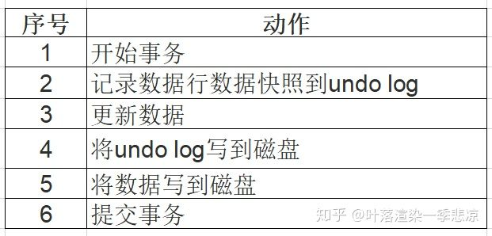
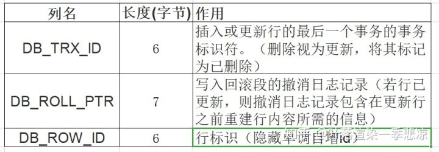

# Mysql

## myisam 和 innodb的区别

myisam引擎是5.1版本之前的默认引擎，支持全文检索、压缩、空间函数等，但是不支持事务和行级锁，所以一般用于有大量查询少量插入的场景来使用，而且myisam不支持外键，并且索引和数据是分开存储的。

innodb是基于聚簇索引建立的，和myisam相反它支持事务、外键，并且通过MVCC来支持高并发，索引和数据存储在一起。

## mysql的索引，聚簇和非聚簇索引

索引按照数据结构来说主要包含B+树和Hash索引。

假设我们有张表，结构如下：

create table user( id int(11) not null, age int(11) not null, primary key(id), key(age) );

B+树是左小右大的顺序存储结构，节点只包含id索引列，而叶子节点包含索引列和数据，这种数据和索引在一起存储的索引方式叫做聚簇索引，一张表只能有一个聚簇索引。假设没有定义主键，InnoDB会选择一个唯一的非空索引代替，如果没有的话则会隐式定义一个主键作为聚簇索引。

这是主键聚簇索引存储的结构，那么非聚簇索引的结构是什么样子呢？非聚簇索引(二级索引)保存的是主键id值，这一点和myisam保存的是数据地址是不同的。

最终，我们一张图看看InnoDB和Myisam聚簇和非聚簇索引的区别

## 覆盖索引和回表

覆盖索引指的是在一次查询中，如果一个索引包含或者说覆盖所有需要查询的字段的值，我们就称之为覆盖索引，而不再需要回表查询。

而要确定一个查询是否是覆盖索引，我们只需要explain sql语句看Extra的结果是否是“Using index”即可。

以上面的user表来举例，我们再增加一个name字段，然后做一些查询试试。

explain select * from user where age=1; //查询的name无法从索引数据获取 explain select id,age from user where age=1; //可以直接从索引获取

## 锁的类型

mysql锁分为共享锁和排他锁，也叫做读锁和写锁。

读锁是共享的，可以通过lock in share mode实现，这时候只能读不能写。

写锁是排他的，它会阻塞其他的写锁和读锁。从颗粒度来区分，可以分为表锁和行锁两种。

表锁会锁定整张表并且阻塞其他用户对该表的所有读写操作，比如alter修改表结构的时候会锁表。

行锁又可以分为乐观锁和悲观锁，悲观锁可以通过for update实现，乐观锁则通过版本号实现。

## 事务的基本特性和隔离级别

事务基本特性ACID分别是：

1. 原子性指的是一个事务中的操作要么全部成功，要么全部失败。

2. 一致性指的是数据库总是从一个一致性的状态转换到另外一个一致性的状态。比如A转账给B100块钱，假设中间sql执行过程中系统崩溃A也不会损失100块，因为事务没有提交，修改也就不会保存到数据库。

3. 隔离性指的是一个事务的修改在最终提交前，对其他事务是不可见的。

4. 持久性指的是一旦事务提交，所做的修改就会永久保存到数据库中。

而隔离性有4个隔离级别，分别是：

1. read uncommit 读未提交，可能会读到其他事务未提交的数据，也叫做脏读。用户本来应该读取到id=1的用户age应该是10，结果读取到了其他事务还没有提交的事务，结果读取结果age=20，这就是脏读。

2. read commit 读已提交，两次读取结果不一致，叫做不可重复读。不可重复读解决了脏读的问题，他只会读取已经提交的事务。用户开启事务读取id=1用户，查询到age=10，再次读取发现结果=20，在同一个事务里同一个查询读取到不同的结果叫做不可重复读。

3. repeatable read 可重复读，这是mysql的默认级别，就是每次读取结果都一样，但是有可能产生幻读。

4. serializable 串行，一般是不会使用的，他会给每一行读取的数据加锁，会导致大量超时和锁竞争的问题。

## 如何保证ACID

A原子性由undo log日志保证，它记录了需要回滚的日志信息，事务回滚时撤销已经执行成功的sql

C一致性一般由代码层面来保证

I隔离性由MVCC来保证

D持久性由内存+redo log来保证，mysql修改数据同时在内存和redo log记录这次操作，事务提交的时候通过redo log刷盘，宕机的时候可以从redo log恢复

## MVCC与幻读

要说幻读，首先要了解MVCC，MVCC叫做多版本并发控制，实际上就是保存了数据在某个时间节点的快照。

读锁：也叫共享锁、S锁，若事务T对数据对象A加上S锁，则事务T可以读A但不能修改A，其他事务只能再对A加S锁，而不能加X锁，直到T释放A上的S 锁。这保证了其他事务可以读A，但在T释放A上的S锁之前不能对A做任何修改。

写锁：又称排他锁、X锁。若事务T对数据对象A加上X锁，事务T可以读A也可以修改A，其他事务不能再对A加任何锁，直到T释放A上的锁。这保证了其他事务在T释放A上的锁之前不能再读取和修改A。

表锁：操作对象是数据表。Mysql大多数锁策略都支持，是系统开销最低但并发性最低的一个锁策略。事务t对整个表加读锁，则其他事务可读不可写，若加写锁，则其他事务增删改都不行。

行级锁：操作对象是数据表中的一行。是MVCC技术用的比较多的。行级锁对系统开销较大，但处理高并发较好。

MVCC使得大部分支持行锁的事务引擎，不再单纯的使用行锁来进行数据库的并发控制，取而代之的是把数据库的行锁与行的多个版本结合起来，只需要很小的开销,就可以实现非锁定读，从而大大提高数据库系统的并发性能。

### MVCC工作过程

InnoDB的MVCC，是通过在每行纪录后面保存两个隐藏的列来实现的。这两个列，一个保存了行的创建时间，一个保存了行的过期时间（或删除时间），当然存储的并不是实际的时间值，而是系统版本号。每开始一个新的事务，系统版本号都会自动递增。事务开始时刻的系统版本号会作为事务的版本号，用来和查询到的每行纪录的版本号进行比较。在REPEATABLE READ隔离级别下，MVCC具体的操作如下：

1、undo log 在不考虑redo log 的情况下利用undo log工作的简化过程为：

1）为了保证数据的持久性数据要在事务提交之前持久化

2）undo log的持久化必须在在数据持久化之前，这样才能保证系统崩溃时，可以用undo log来回滚事务

2、Innodb中的隐藏列
Innodb通过undo log保存了已更改行的旧版本的信息的快照。
InnoDB的内部实现中为每一行数据增加了三个隐藏列用于实现MVCC。

3、SELECT

InnoDB会根据以下两个条件检查每行纪录：

InnoDB只查找版本早于当前事务版本的数据行，即，行的系统版本号小于或等于事务的系统版本号，这样可以确保事务读取的行，要么是在事务开始前已经存在的，要么是事务自身插入或者修改过的。
行的删除版本，要么未定义，要么大于当前事务版本号。这样可以确保事务读取到的行，在事务开始之前未被删除。
只有符合上述两个条件的纪录，才能作为查询结果返回。

4、INSERT

InnoDB为插入的每一行保存当前系统版本号作为行版本号。

5、DELETE

InnoDB为删除的每一行保存当前系统版本号作为行删除标识。

6、UPDATE

InnoDB为插入一行新纪录，保存当前系统版本号作为行版本号，同时，保存当前系统版本号到原来的行作为行删除标识。

### MVCC优缺点

MVCC在大多数情况下代替了行锁，实现了对读的非阻塞，读不加锁，读写不冲突。缺点是每行记录都需要额外的存储空间，需要做更多的行维护和检查工作。

1.MVCC手段只适用于Msyql隔离级别中的读已提交（Read committed）和可重复读（Repeatable Read）。

2.Read uncimmitted由于存在脏读，即能读到未提交事务的数据行，所以不适用MVCC.

原因是MVCC的创建版本和删除版本只要在事务提交后才会产生。

3.串行化由于是会对所涉及到的表加锁，并非行锁，自然也就不存在行的版本控制问题。

4.通过以上总结，可知，MVCC主要作用于事务性的，有行锁控制的数据库模型。

