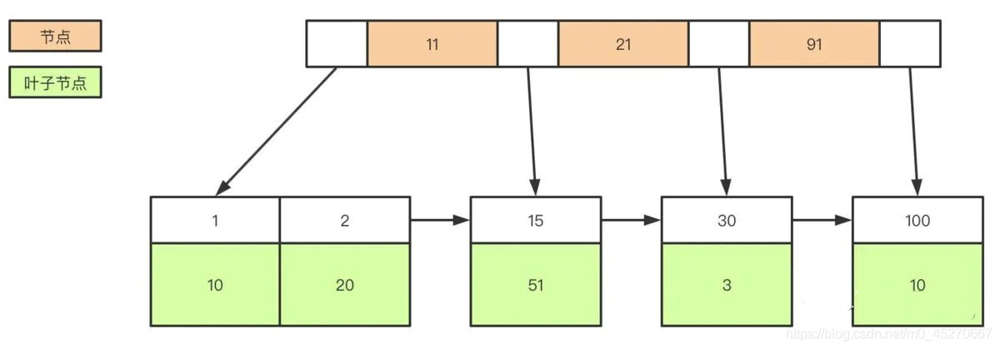
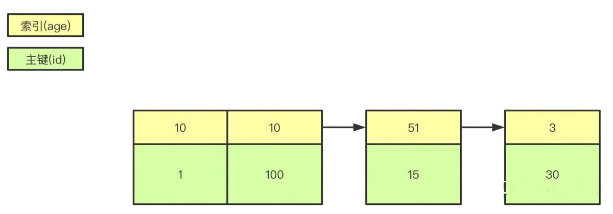
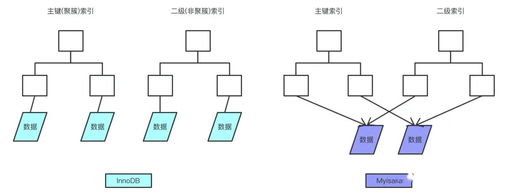

# Mysql

1、myisam 和 innodb的区别

myisam引擎是5.1版本之前的默认引擎，支持全文检索、压缩、空间函数等，但是不支持事务和行级锁，所以一般用于有大量查询少量插入的场景来使用，而且myisam不支持外键，并且索引和数据是分开存储的。

innodb是基于聚簇索引建立的，和myisam相反它支持事务、外键，并且通过MVCC来支持高并发，索引和数据存储在一起。

2、mysql的索引，聚簇和非聚簇索引

索引按照数据结构来说主要包含B+树和Hash索引。

假设我们有张表，结构如下：

create table user( id int(11) not null, age int(11) not null, primary key(id), key(age) );

B+树是左小右大的顺序存储结构，节点只包含id索引列，而叶子节点包含索引列和数据，这种数据和索引在一起存储的索引方式叫做聚簇索引，一张表只能有一个聚簇索引。假设没有定义主键，InnoDB会选择一个唯一的非空索引代替，如果没有的话则会隐式定义一个主键作为聚簇索引。

这是主键聚簇索引存储的结构，那么非聚簇索引的结构是什么样子呢？非聚簇索引(二级索引)保存的是主键id值，这一点和myisam保存的是数据地址是不同的。

最终，我们一张图看看InnoDB和Myisam聚簇和非聚簇索引的区别

