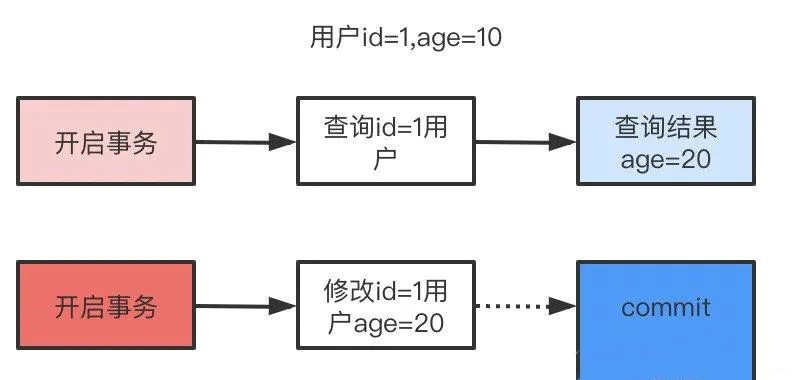
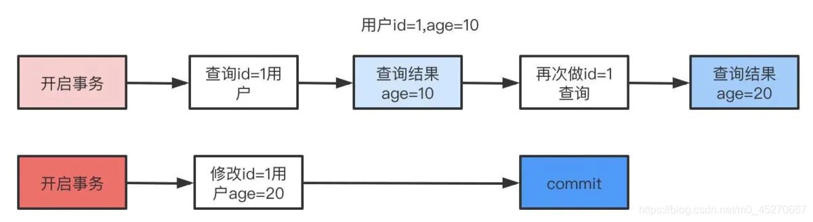

# Mysql

## myisam 和 innodb的区别

myisam引擎是5.1版本之前的默认引擎，支持全文检索、压缩、空间函数等，但是不支持事务和行级锁，所以一般用于有大量查询少量插入的场景来使用，而且myisam不支持外键，并且索引和数据是分开存储的。

innodb是基于聚簇索引建立的，和myisam相反它支持事务、外键，并且通过MVCC来支持高并发，索引和数据存储在一起。

## mysql的索引，聚簇和非聚簇索引

索引按照数据结构来说主要包含B+树和Hash索引。

假设我们有张表，结构如下：

create table user( id int(11) not null, age int(11) not null, primary key(id), key(age) );

B+树是左小右大的顺序存储结构，节点只包含id索引列，而叶子节点包含索引列和数据，这种数据和索引在一起存储的索引方式叫做聚簇索引，一张表只能有一个聚簇索引。假设没有定义主键，InnoDB会选择一个唯一的非空索引代替，如果没有的话则会隐式定义一个主键作为聚簇索引。

这是主键聚簇索引存储的结构，那么非聚簇索引的结构是什么样子呢？非聚簇索引(二级索引)保存的是主键id值，这一点和myisam保存的是数据地址是不同的。

最终，我们一张图看看InnoDB和Myisam聚簇和非聚簇索引的区别

## 覆盖索引和回表

覆盖索引指的是在一次查询中，如果一个索引包含或者说覆盖所有需要查询的字段的值，我们就称之为覆盖索引，而不再需要回表查询。

而要确定一个查询是否是覆盖索引，我们只需要explain sql语句看Extra的结果是否是“Using index”即可。

以上面的user表来举例，我们再增加一个name字段，然后做一些查询试试。

explain select * from user where age=1; //查询的name无法从索引数据获取 explain select id,age from user where age=1; //可以直接从索引获取

## 锁的类型

mysql锁分为共享锁和排他锁，也叫做读锁和写锁。

读锁是共享的，可以通过lock in share mode实现，这时候只能读不能写。

写锁是排他的，它会阻塞其他的写锁和读锁。从颗粒度来区分，可以分为表锁和行锁两种。

表锁会锁定整张表并且阻塞其他用户对该表的所有读写操作，比如alter修改表结构的时候会锁表。

行锁又可以分为乐观锁和悲观锁，悲观锁可以通过for update实现，乐观锁则通过版本号实现。

## 事务的基本特性和隔离级别

事务基本特性ACID分别是：

1. 原子性指的是一个事务中的操作要么全部成功，要么全部失败。

2. 一致性指的是数据库总是从一个一致性的状态转换到另外一个一致性的状态。比如A转账给B100块钱，假设中间sql执行过程中系统崩溃A也不会损失100块，因为事务没有提交，修改也就不会保存到数据库。

3. 隔离性指的是一个事务的修改在最终提交前，对其他事务是不可见的。

4. 持久性指的是一旦事务提交，所做的修改就会永久保存到数据库中。

而隔离性有4个隔离级别，分别是：

1. read uncommit 读未提交，可能会读到其他事务未提交的数据，也叫做脏读。

用户本来应该读取到id=1的用户age应该是10，结果读取到了其他事务还没有提交的事务，结果读取结果age=20，这就是脏读。

2. read commit 读已提交，两次读取结果不一致，叫做不可重复读。

不可重复读解决了脏读的问题，他只会读取已经提交的事务。

用户开启事务读取id=1用户，查询到age=10，再次读取发现结果=20，在同一个事务里同一个查询读取到不同的结果叫做不可重复读。

3. repeatable read 可重复读，这是mysql的默认级别，就是每次读取结果都一样，但是有可能产生幻读。

4. serializable 串行，一般是不会使用的，他会给每一行读取的数据加锁，会导致大量超时和锁竞争的问题。

