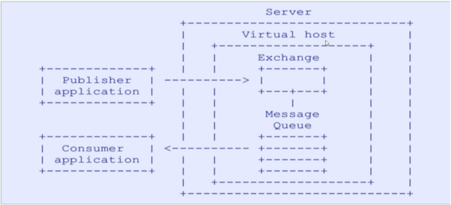

# RabbitMQ快速入门

## RabbitMQ简介

以熟悉的电商场景为例，如果商品服务和订单服务是两个不同的微服务，在下单的过程中订单服务需要调用商品服务进行扣库存操作。按照传统的方式，下单过程要等到调用完毕之后才能返回下单成功，如果网络产生波动等原因使得商品服务扣库存延迟或者失败，会带来较差的用户体验，如果在高并发的场景下，这样的处理显然是不合适的，那怎么进行优化呢？这就需要消息队列登场了。

消息队列提供一个异步通信机制，消息的发送者不必一直等待到消息被成功处理才返回，而是立即返回。消息中间件负责处理网络通信，如果网络连接不可用，消息被暂存于队列当中，当网络畅通的时候在将消息转发给相应的应用程序或者服务，当然前提是这些服务订阅了该队列。如果在商品服务和订单服务之间使用消息中间件，既可以提高并发量，又降低服务之间的耦合度。

RabbitMQ就是这样一款我们苦苦追寻的消息队列。RabbitMQ是一个开源的消息代理的队列服务器，用来通过普通协议在完全不同的应用之间共享数据。

RabbitMQ是使用Erlang语言来编写的，并且RabbitMQ是基于AMQP协议的。Erlang语言在数据交互方面性能优秀，有着和原生Socket一样的延迟，这也是RabbitMQ高性能的原因所在。可谓“人如其名”，RabbitMQ像兔子一样迅速。


RabbitMQ除了像兔子一样跑的很快以外，还有这些特点：

- 开源、性能优秀，稳定性保障
- 提供可靠性消息投递模式、返回模式
- 与Spring AMQP完美整合，API丰富
- 集群模式丰富，表达式配置，HA模式，镜像队列模型
- 保证数据不丢失的前提做到高可靠性、可用性

MQ典型应用场景：

- 异步处理。把消息放入消息中间件中，等到需要的时候再去处理。
- 流量削峰。例如秒杀活动，在短时间内访问量急剧增加，使用消息队列，当消息队列满了就拒绝响应(这里应该做限流)，跳转到错误页面，这样就可以使得系统不会因为超负载而崩溃。
- 日志处理
- 应用解耦。假设某个服务A需要给许多个服务（B、C、D）发送消息，当某个服务（例如B）不需要发送消息了，服务A需要改代码再次部署；当新加入一个服务（服务E）需要服务A的消息的时候，也需要改代码重新部署；另外服务A也要考虑其他服务挂掉，没有收到消息怎么办？要不要重新发送呢？是不是很麻烦，使用MQ发布订阅模式，服务A只生产消息发送到MQ，B、C、D从MQ中读取消息，需要A的消息就订阅，不需要了就取消订阅，服务A不再操心其他的事情，使用这种方式可以降低服务或者系统之间的耦合。

## AMQP协议和RabbitMQ

先了解一下AMQP协议中间的几个重要概念：

- Server：接收客户端的连接，实现AMQP实体服务。
- Connection：连接，应用程序与Server的网络连接，TCP连接。
- Channel：信道，消息读写等操作在信道中进行。客户端可以建立多个信道，每个信道代表一个会话任务。
- Message：消息，应用程序和服务器之间传送的数据，消息可以非常简单，也可以很复杂。有Properties和Body组成。Properties为外包装，可以对消息进行修饰，比如消息的优先级、延迟等高级特性；Body就是消息体内容。
- Virtual Host：虚拟主机，用于逻辑隔离。一个虚拟主机里面可以有若干个Exchange和Queue，同一个虚拟主机里面不能有相同名称的Exchange或Queue。
- Exchange：交换器，接收消息，按照路由规则将消息路由到一个或者多个队列。如果路由不到，或者返回给生产者，或者直接丢弃。RabbitMQ常用的交换器常用类型有direct、topic、fanout、headers四种，后面详细介绍。
- Binding：绑定，交换器和消息队列之间的虚拟连接，绑定中可以包含一个或者多个RoutingKey。
- RoutingKey：路由键，生产者将消息发送给交换器的时候，会发送一个RoutingKey，用来指定路由规则，这样交换器就知道把消息发送到哪个队列。路由键通常为一个“.”分割的字符串，例如“com.rabbitmq”。
- Queue：消息队列，用来保存消息，供消费者消费。

> 我们完全可以直接使用 Connection 就能完成信道的工作，为什么还要引入信道呢?

> 试想这样一个场景， 一个应用程序中有很多个线程需要从 RabbitMQ 中消费消息，或者生产消息，那么必然需要建立很多个 Connection，也就是许多个 TCP 连接。然而对于操作系统而言，建立和销毁 TCP 连接是非常昂贵的开销，如果遇到使用高峰，性能瓶颈也随之显现。 RabbitMQ 采用 TCP 连接复用的方式，不仅可以减少性能开销，同时也便于管理 。

下图是AMQP的协议模型：



正如图中所看到的，AMQP协议模型有三部分组成：生产者、消费者和服务端。

生产者是投递消息的一方，首先连接到Server，建立一个连接，开启一个信道；然后生产者声明交换器和队列，设置相关属性，并通过路由键将交换器和队列进行绑定。同理，消费者也需要进行建立连接，开启信道等操作，便于接收消息。

接着生产者就可以发送消息，发送到服务端中的虚拟主机，虚拟主机中的交换器根据路由键选择路由规则，然后发送到不同的消息队列中，这样订阅了消息队列的消费者就可以获取到消息，进行消费。

最后还要关闭信道和连接。

RabbitMQ是基于AMQP协议实现的，其结构如下图所示，和AMQP协议简直就是一模一样。


## 常用交换器

RabbitMQ常用的交换器类型有direct、topic、fanout、headers四种。

### Direct Exchange

该类型的交换器将所有发送到该交换器的消息被转发到RoutingKey指定的队列中，也就是说路由到BindingKey和RoutingKey完全匹配的队列中。


### Topic Exchange

该类型的交换器将所有发送到Topic Exchange的消息被转发到所有RoutingKey中指定的Topic的队列上面。

Exchange将RoutingKey和某Topic进行模糊匹配，其中“*”用来匹配一个词，“#”用于匹配一个或者多个词。例如“com.#”能匹配到“com.rabbitmq.oa”和“com.rabbitmq”；而"login.*"只能匹配到“com.rabbitmq”。


### Fanout Exchange

该类型不处理路由键，会把所有发送到交换器的消息路由到所有绑定的队列中。优点是转发消息最快，性能最好。


### Headers Exchange

该类型的交换器不依赖路由规则来路由消息，而是根据消息内容中的headers属性进行匹配。headers类型交换器性能差，在实际中并不常用。

## 安装和使用入门

本文使用Docker进行安装RabbitMQ,快速体验RabbitMQ的魅力。

- 进入[官方下载地址](https://www.rabbitmq.com/download.html)，选择使用Docker安装，可以跳转到[dockerhub](https://hub.docker.com/_/rabbitmq/)查看镜像。
- 我选择3-management进行安装，带有management是含有管理界面的。
- 拉取镜像和启动：docker run -it --rm --name rabbitmq -p 5672:5672 -p 15672:15672 rabbitmq:3-management
- 查看镜像：

```
[root@localhost ~]# docker images
REPOSITORY           TAG                 IMAGE ID            CREATED             SIZE
docker.io/rabbitmq   3-management        800294d91e31        5 weeks ago         198 MB

```

- 我的安装在了自己的虚拟机上，ip地址是：192.168.111.20,打开浏览器访问http://192.168.111.20:15672
- 
- 进行填写账号密码：默认账号密码都是guest.
- 

到此，RabbitMQ已经安装并运行起来了。

## Springboot集成RabbitMQ

通过在Spring Boot应用中整合RabbitMQ，并实现一个简单的发送、接收消息的例子来对RabbitMQ有一个直观的感受和理解。

在Spring Boot中整合RabbitMQ是一件非常容易的事，因为之前我们已经介绍过Starter POMs，其中的AMQP模块就可以很好的支持RabbitMQ，下面我们就来详细说说整合过程：

>  Spring-boot集成RabbitMq https://docs.spring.io/spring-boot/docs/current/reference/html/spring-boot-features.html#boot-features-amqp

### 1、POM依赖

在pom.xml中引入如下依赖内容，其中spring-boot-starter-amqp用于支持RabbitMQ。

```xml
<?xml version="1.0" encoding="UTF-8"?>
<project xmlns="http://maven.apache.org/POM/4.0.0" xmlns:xsi="http://www.w3.org/2001/XMLSchema-instance"
         xsi:schemaLocation="http://maven.apache.org/POM/4.0.0 https://maven.apache.org/xsd/maven-4.0.0.xsd">
    <modelVersion>4.0.0</modelVersion>
    <parent>
        <groupId>org.springframework.boot</groupId>
        <artifactId>spring-boot-starter-parent</artifactId>
        <version>2.3.5.RELEASE</version>
        <relativePath/> <!-- lookup parent from repository -->
    </parent>
    <groupId>com.zao</groupId>
    <artifactId>boot-rabbitmq</artifactId>
    <version>0.0.1-SNAPSHOT</version>
    <name>boot-rabbitmq</name>
    <description>Demo rabbitmq project for Spring Boot</description>
    <properties>
        <java.version>1.8</java.version>
    </properties>
    <dependencies>
        <dependency>
            <groupId>org.springframework.boot</groupId>
            <artifactId>spring-boot-starter-web</artifactId>
        </dependency>
        <dependency>
            <groupId>org.springframework.boot</groupId>
            <artifactId>spring-boot-starter-amqp</artifactId>
        </dependency>

        <dependency>
            <groupId>org.projectlombok</groupId>
            <artifactId>lombok</artifactId>
            <optional>true</optional>
        </dependency>
        <dependency>
            <groupId>org.springframework.boot</groupId>
            <artifactId>spring-boot-starter-test</artifactId>
            <scope>test</scope>
        </dependency>
        <dependency>
            <groupId>org.springframework.amqp</groupId>
            <artifactId>spring-rabbit-test</artifactId>
            <scope>test</scope>
        </dependency>
    </dependencies>

    <build>
        <plugins>
            <plugin>
                <groupId>org.springframework.boot</groupId>
                <artifactId>spring-boot-maven-plugin</artifactId>
                <configuration>
                    <excludes>
                        <exclude>
                            <groupId>org.projectlombok</groupId>
                            <artifactId>lombok</artifactId>
                        </exclude>
                    </excludes>
                </configuration>
            </plugin>
        </plugins>
    </build>

</project>

```

### 2、配置文件

在application.properties中配置关于RabbitMQ的连接和用户信息，用户可以回到上面的安装内容，在管理页面中创建用户。

```properties
spring.rabbitmq.host=192.168.111.20
spring.rabbitmq.port=5672
spring.rabbitmq.username=guest
spring.rabbitmq.password=guest
#必须指定一个vhost
spring.rabbitmq.virtual-host=/
```

**注意：vhost的配置，RabbitMq会有一个默认的vhost：`/`,不配置对应的vhost,是收不到消息的。**

### 3、Direct Exchange

多个listener会负载均衡的方式消费消息，每个消息只被消费一次。

#### RabbitMq配置消息路由规则

在RabbitMq控制台添加一个direct exchange,默认持久化储存消息，如下图


进入queue界面，新建一个queue队列，如下图：


返回exchange界面，点击新建的exchange进入绑定关系界面添加绑定关系，如下图


绑定关系如下图：


#### SpringBoot的配置类

```java
public class DirectConfig {
    public final static String exName = "ex.direct.order";
    public final static String queueName = "queue.direct.order";
}

```

#### 发送和接收消息

```java
@RestController
public class DirectController {

    @Resource
    private AmqpTemplate amqpTemplate;

    @GetMapping("/direct/send")
    public String send(String msg){
        System.out.println("send :" + msg);
        amqpTemplate.convertAndSend(DirectConfig.exName,null,msg);
        return "ok";
    }

    @RabbitListener(queues = DirectConfig.queueName)
    public void processA(String msg) {
        System.out.println("Receiver A:" + msg);
    }

    @RabbitListener(queues = DirectConfig.queueName)
    public void processB(String msg) {
        System.out.println("Receiver B:" + msg);
    }

}

```

启动项目，访问几次本地：http://localhost:8080/direct/send?msg=123

我们看到控制台上打印出消息,消费端以轮询的方式消费消息,如下：

```
send :123
Receiver A:123
send :123
Receiver B:123
send :123
Receiver A:123
send :123
Receiver B:123
```


### 4、Topic Exchange

topic 是RabbitMQ中最灵活的一种方式，可以根据routing_key自由的绑定不同的队列。 

#### RabbitMq配置消息路由规则

首先对topic规则配置，添加一个topic类型的exchage,如下图：


添加两个消息队列queue如下图：


为exchage 和queue建立绑定关系，如下图：


order1 的队列只接收fruit类型的消息，order2的队列接收所有order类型的消息。

#### SpringBoot的配置类

```
public class TopicConfig {

    public static  final  String exName = "ex.topic.order";
    public static  final  String queueOrder1 = "queue.topic.order1";
    public static  final  String queueOrder2 = "queue.topic.order2";

}

```


#### 发送和接收消息

```
@RestController
public class TopicController {

    @Resource
    private AmqpTemplate amqpTemplate;

    @GetMapping("/topic/send/fruit")
    public String sendFruit(String msg){
        System.out.println("send fruit order msg:"+msg);
        amqpTemplate.convertAndSend(TopicConfig.exName,"order.fruit."+msg,msg);
        return "ok";
    }

    @GetMapping("/topic/send/other")
    public String sendOther(String msg){
        System.out.println("send other order msg:"+msg);
        amqpTemplate.convertAndSend(TopicConfig.exName,"order.other."+msg,msg);
        return "ok";
    }

    @RabbitListener(queues = TopicConfig.queueOrder1)
    public void process1(String msg){
        System.out.println("Receiver fruit msg:"+ msg);
    }

    @RabbitListener(queues = TopicConfig.queueOrder2)
    public void process2(String msg){
        System.out.println("Receiver other msg:"+ msg);
    }

}

```


启动项目，分别访问如下地址：

http://localhost:8080/topic/send/fruit?msg=apple

http://localhost:8080/topic/send/other?msg=nick

得到如下结果

```
send fruit order msg:apple
Receiver other msg:apple
Receiver fruit msg:apple
send other order msg:nick
Receiver other msg:nick
```

我们看到控制台上打印出消息,消费队列order1值消费fruit的消息，消费队列order2消费了所有的消息。


### 5、Fanout Exchange

Fanout 就是我们熟悉的广播模式或者订阅模式，给Fanout交换机发送消息，绑定了这个交换机的所有队列都收到这个消息。

#### RabbitMq配置消息路由规则

新建一个fanout类型的exchange,如下图：


新建三个消费队列order1,order2,order3,如下图：


为exchange和消费队列queue建立绑定关系，如下图：


#### SpringBoot的配置类

```
public class FanoutConfig {

    public static  final  String exName = "ex.fanout.order";
    public static  final  String queueOrder1 = "queue.fanout.order1";
    public static  final  String queueOrder2 = "queue.fanout.order2";
    public static  final  String queueOrder3 = "queue.fanout.order3";

}
```


#### 发送和接收消息

```
@RestController
public class FanoutController {

    @Resource
    private AmqpTemplate amqpTemplate;

    @GetMapping("/fanout/send")
    public String send(String msg) {
        long time = System.currentTimeMillis();
        System.out.println("send fanout msg:"+msg+" at time:"+time);
        amqpTemplate.convertAndSend(FanoutConfig.exName, null, msg+" at time:"+time);
        return "ok";
    }

    @RabbitListener(queues = FanoutConfig.queueOrder1)
    public void processA(String message) {
        System.out.println("Receiver queue order1 msg: " + message);
    }

    @RabbitListener(queues = FanoutConfig.queueOrder2)
    public void processB(String message) {
        System.out.println("Receiver queue order2 msg: " + message);
    }

    @RabbitListener(queues = FanoutConfig.queueOrder3)
    public void processC(String message) {
        System.out.println("Receiver queue order2 msg: " + message);
    }

}

```


启动项目，访问如下地址：

http://localhost:8080/fanout/send?msg=nick

```
send fanout msg:nick at time:1615481221619
Receiver queue order2 msg: nick at time:1615481221619
Receiver queue order2 msg: nick at time:1615481221619
Receiver queue order1 msg: nick at time:1615481221619
send fanout msg:nick at time:1615481233865
Receiver queue order1 msg: nick at time:1615481233865
Receiver queue order2 msg: nick at time:1615481233865
Receiver queue order2 msg: nick at time:1615481233865
```

我们看到所有的消费队列都收到了消息。


以上案例关于消息路由的配置都是在RabbitMq控制台完成，当然我们也可以在程序中完成消息路由的配置，参考如下：

https://blog.csdn.net/zhenghuishengq/article/details/114003957?ops_request_misc=&request_id=&biz_id=102&utm_term=rabbit%20mq&utm_medium=distribute.pc_search_result.none-task-blog-2~all~sobaiduweb~default-6-114003957.pc_search_result_hbase_insert


### 6、在程序中声明exchage和queue

```
@RestController
public class DeclareController {

    @Resource
    AmqpTemplate amqpTemplate;

    @GetMapping("/declare/send")
    public Object send(String msg){
        System.out.println("Declare send msg:"+msg);
        amqpTemplate.convertAndSend("ex.declare.order","",msg);
        return "ok";
    }

    @RabbitListener(bindings = @QueueBinding(value = @Queue("queue.declare.order")
                ,exchange = @Exchange(name = "ex.declare.order",type="direct"))
    )
    public void receiveMessage(String msg){
        System.out.println("Receiver direct:" + msg);
    }
}
```

启动项目，我们可以在Rabbit控制台中自动创建了 对应的持久化的exchange和queue,如下图：


访问如下地址：

http://localhost:8080/declare/send?msg=nick

消息发送和消费情况如下：

```
Declare send msg:nick
Receiver direct:nick
```

## 参考资料

https://www.cnblogs.com/sgh1023/p/11217017.html

https://www.jianshu.com/p/c85ac0063dbf

# 延时队列？

# RPC？

# 消息安全不丢失?

## 事务

## 手动comfirm

## 手动ack


# RabbitMq核心概念和原理

## AMQP协议

AMQP，即Advanced Message Queuing Protocol，高级消息队列协议，是应用层协议的一个开放标准，为面向消息的中间件设计。消息中间件主要用于组件之间的解耦，消息的发送者无需知道消息使用者的存在，反之亦然。

AMQP的主要特征是面向消息、队列、路由（包括点对点和发布/订阅）、可靠性、安全。RabbitMQ是一个开源的AMQP实现，服务器端用Erlang语言编写，支持多种客户端，如：Python、Ruby、.NET、Java、JMS、C、PHP、ActionScript、XMPP、STOMP等，支持AJAX。用于在分布式系统中存储转发消息，在易用性、扩展性、高可用性等方面表现不俗。

## RabbitMq核心概念

### Broker

简单来说就是消息队列服务器实体。

### producer

消息生产者，就是投递消息的程序。

### consumer

消息消费者，就是接受消息的程序。

### vhost

虚拟主机，一个broker里可以开设多个vhost，用作权限分离，把不同的系统使用的rabbitmq区分开，共用一个消息队列服务器，但看上去就像各自在用不用的rabbitmq服务器一样。

### Connection

一个网络连接，比如TCP/IP套接字连接。

### channel

消息通道，是建立在真实的TCP连接内的虚拟连接（是我们与RabbitMQ打交道的最重要的一个接口）。仅仅创建了客户端到Broker之间的连接后，客户端还是不能发送消息的,需要为每一个Connection创建Channel，AMQP协议规定只有通过Channel才能执行AMQP的命令。AMQP的命令都是通过信道发送出去的（我们大部分的业务操作是在Channel这个接口中完成的，包括定义Queue、定义Exchange、绑定Queue与Exchange、发布消息等。）。每条信道都会被指派一个唯一ID。在客户端的每个连接里，可建立多个channel，每个channel代表一个会话任务,理论上无限制，减少TCP创建和销毁的开销，实现共用TCP的效果。之所以需要Channel，是因为TCP连接的建立和释放都是十分昂贵的，如果一个客户端每一个线程都需要与Broker交互，如果每一个线程都建立一个TCP连接，暂且不考虑TCP连接是否浪费，就算操作系统也无法承受每秒建立如此多的TCP连接。

**注1：一个生产者或一个消费者与MQ服务器之间只有一条TCP连接** 

**注2：RabbitMQ建议客户端线程之间不要共用Channel，至少要保证共用Channel的线程发送消息必须是串行的，但是建议尽量共用Connection。**

### Exchange

消息交换机，生产者不是直接将消息投递到Queue中的，实际上是生产者将消息发送到Exchange（交换器，下图中的X），由Exchange将消息路由到一个或多个Queue中（或者丢弃）。


#### Exchange Types 

RabbitMQ常用的Exchange Type有fanout、direct、topic、headers这四种（AMQP规范里还提到两种Exchange Type，分别为system与自定义，这里不予以描述），之后会分别进行介绍。

### Queue

消息队列载体，每个消息都会被投入到一个或多个队列。

Queue（队列）是RabbitMQ的内部对象，用于存储消息，用下图表示。


RabbitMQ中的消息都只能存储在Queue中，生产者（下图中的P）生产消息并最终投递到Queue中，消费者（下图中的C）可以从Queue中获取消息并消费。


多个消费者可以订阅同一个Queue，这时Queue中的消息会被平均分摊给多个消费者进行处理，而不是每个消费者都收到所有的消息并处理。


### Binding

绑定，它的作用就是把exchange和queue按照路由规则绑定起来，这样RabbitMQ就知道如何正确地将消息路由到指定的Queue了。


### Routing Key

路由关键字，生产者在将消息发送给Exchange的时候，一般会指定一个routing key，来指定这个消息的路由规则，而这个routing key需要与Exchange Type及binding key联合使用才能最终生效。


在Exchange Type与binding key固定的情况下（在正常使用时一般这些内容都是固定配置好的），我们的生产者就可以在发送消息给Exchange时，通过指定routing key来决定消息流向哪里。

### **Prefetch count**

 前面我们讲到如果有多个消费者同时订阅同一个Queue中的消息，Queue中的消息会被平摊给多个消费者。这时如果每个消息的处理时间不同，就有可能会导致某些消费者一直在忙，而另外一些消费者很快就处理完手头工作并一直空闲的情况。我们可以通过设置prefetchCount来限制Queue每次发送给每个消费者的消息数，比如我们设置prefetchCount=1，则Queue每次给每个消费者发送一条消息；消费者处理完这条消息后Queue会再给该消费者发送一条消息。


## 消息队列的使用过程

在AMQP模型中，Exchange是接受生产者消息并将消息路由到消息队列的关键组件。ExchangeType和Binding决定了消息的路由规则。所以生产者想要发送消息，首先必须要声明一个Exchange和该Exchange对应的Binding。

在Rabbit MQ中，声明一个Exchange需要三个参数：ExchangeName，ExchangeType和Durable。ExchangeName是该Exchange的名字，该属性在创建Binding和生产者通过publish推送消息时需要指定。ExchangeType，指Exchange的类型，在RabbitMQ中，有三种类型的Exchange：direct ，fanout和topic，不同的Exchange会表现出不同路由行为。Durable是该Exchange的持久化属性，这个会在消息持久化章节讨论。

### 建立一个Exchange


### 声明一个Binding

声明一个Binding需要提供一个QueueName，ExchangeName和BindingKey。


### 消息发送的过程


1. 建立连接Connection。由producer和consumer创建连接，连接到broker的物理节点上。
2. 建立消息Channel。Channel是建立在Connection之上的，一个Connection可以建立多个Channel。producer连接Virtual Host 建立Channel，Consumer连接到相应的queue上建立Channel。
3. 发送消息。由Producer发送消息到Broker中的Exchange中。
4. 路由转发。生产者Producer在发送消息时，都需要指定一个RoutingKey和Exchange，Exchange收到消息后可以看到消息中指定的RoutingKey，再根据当前Exchange的ExchangeType,按一定的规则将消息转发到相应的queue中去。
5. 消息接收。Consumer会监听相应的queue，一旦queue中有可以消费的消息，queue就将消息发送给Consumer端。
6. 消息确认。当Consumer完成某一条消息的处理之后，需要发送一条ACK消息给对应的Queue。Queue收到ACK信息后，才会认为消息处理成功，并将消息从Queue中移除；如果在对应的Channel断开后，Queue没有收到这条消息的ACK信息，该消息将被发送给另外的Channel。至此一个消息的发送接收流程走完了。消息的确认机制提高了通信的可靠性。

## exchange 与 Queue 的路由机制

Exchange根据消息的Routing Key和Exchange绑定Queue的Binding Key分配消息。生产者在将消息发送给Exchange的时候，一般会指定一个Routing Key，来指定这个消息的路由规则，而这个Routing Key需要与Exchange Type及Binding Key联合使用才能最终生效。
在Exchange Type与Binding Key固定的情况下（一般这些内容都是固定配置好的），我们的生产者就可以在发送消息给Exchange时，通过指定Routing Key来决定消息流向哪里。

exchange 将消息发送到哪一个queue是由exchange type 和bing 规则决定的，目前常用的有3种exchange，Direct exchange, Fanout exchange, Topic exchange 。Direct exchange 直接转发路由，其实现原理是通过消息中的routkey，与queue 中的routkey 进行比对，若二者匹配，则将消息发送到这个消息队列。通常使用这个。

### Direct exchange 路由


以上图的配置为例，我们以routingKey=”error”发送消息到Exchange，则消息会路由到Queue1（amqp.gen-S9b…，这是由RabbitMQ自动生成的Queue名称）和Queue2（amqp.gen-Agl…）；如果我们以routingKey=”info”或routingKey=”warning”来发送消息，则消息只会路由到Queue2。如果我们以其他routingKey发送消息，则消息不会路由到这两个Queue中。

### Fanout exchange 复制分发路由

该路由不需要routkey，当exchange收到消息后，将消息复制多份转发给与自己绑定的消息队列。


上图中，生产者（P）发送到Exchange（X）的所有消息都会路由到图中的两个Queue，并最终被两个消费者（C1与C2）消费。

### topic exchange 通配路由

topic exchange 通配路由，是direct exchange的通配符模式，消息中的routkey可以写成通配的模式，exchange支持“#”和“*” 的通配。收到消息后，将消息转发给所有符合匹配表达式的queue。


以上图中的配置为例，routingKey=”quick.orange.rabbit”的消息会同时路由到Q1与Q2，routingKey=”lazy.orange.fox”的消息会路由到Q1，routingKey=”lazy.brown.fox”的消息会路由到Q2，routingKey=”lazy.pink.rabbit”的消息会路由到Q2（只会投递给Q2一次，虽然这个routingKey与Q2的两个bindingKey都匹配）；routingKey=”quick.brown.fox”、routingKey=”orange”、routingKey=”quick.orange.male.rabbit”的消息将会被丢弃，因为它们没有匹配任何bindingKey。

**需要注意的一点只有queue具有 保持消息的功能，exchange不能保存消息。**

### headers 路由

headers类型的Exchange不依赖于routing key与binding key的匹配规则来路由消息，而是根据发送的消息内容中的headers属性进行匹配。在绑定Queue与Exchange时指定一组键值对；当消息发送到Exchange时，RabbitMQ会取到该消息的headers（也是一个键值对的形式），对比其中的键值对是否完全匹配Queue与Exchange绑定时指定的键值对；如果完全匹配则消息会路由到该Queue，否则不会路由到该Queue。


## RPC


MQ本身是基于异步的消息处理，生产者（P）将消息发送到RabbitMQ后不会知道消费者（C）处理成功或者失败，甚至连有没有消费者来处理这条消息都不知道。但实际的应用场景中，我们很可能需要一些同步处理，需要同步等待服务端将我的消息处理完成后再进行下一步处理。这相当于RPC（Remote Procedure Call，远程过程调用）。


RabbitMQ中实现RPC的机制是：
一. 生产者发送请求（消息）时，在消息的属性（MessageProperties，在AMQP协议中定义了14个属性，这些属性会随着消息一起发送）中设置两个属性值replyTo（一个Queue名称，用于告诉消费者处理完成后将通知我的消息发送到这个Queue中）和correlationId（此次请求的标识号，消费者处理完成后需要将此属性返还，生产者将根据这个id了解哪条请求被成功执行了或执行失败）。
二. 消费者收到消息并处理。
三. 消费者处理完消息后，将生成一条应答消息到replyTo指定的Queue，同时带上correlationId属性。
四. 生产者之前已订阅replyTo指定的Queue，从中收到服务器的应答消息后，根据其中的correlationId属性分析哪条请求被执行了，根据执行结果进行后续业务处理。


## 消息确认:Message acknowledgment

在实际应用中，可能会发生消费者收到Queue中的消息，但没有处理完成就宕机（或出现其他意外）的情况，这种情况下就可能会导致消息丢失。为了避免这种情况发生，我们可以要求消费者在消费完消息后发送一个回执给RabbitMQ，RabbitMQ收到消息回执（Message acknowledgment）后才将该消息从Queue中移除；如果RabbitMQ没有收到回执并检测到消费者的RabbitMQ连接断开，则RabbitMQ会将该消息发送给其他消费者（如果存在多个消费者）进行处理。这里不存在Timeout概念，一个消费者处理消息时间再长也不会导致该消息被发送给其他消费者，除非它的RabbitMQ连接断开。
这里会产生另外一个问题，如果我们的开发人员在处理完业务逻辑后，忘记发送回执给RabbitMQ，这将会导致严重的问题，Queue中堆积的消息会越来越多，消费者重启后会重复消费这些消息并重复执行业务逻辑。
如果我们采用no-ack的方式进行确认，也就是说，每次Consumer接到数据后，而不管是否处理完成，RabbitMQ会立即把这个Message标记为完成，然后从queue中删除了。


## durability 持久化与非持久化队列


如上图，在Features字段里有一个D,就是持久化队列，英文durable（持久的）。

持久化队列会被保存在磁盘中，固定并持久的存储，当Rabbit服务重启后，该队列会保持原来的状态在RabbitMQ中被管理，而非持久化队列不会被保存在磁盘中，Rabbit服务重启后队列就会消失。

如果需要队列的完整性，数据在队列中的保存是必须不允许丢失的，那么可以使用持久化。而当需要获取的信息是实时的，或者是随机的信息，不需要信息的精确性或完整性，但是追求获取性能，可以选择非持久化队列。


## 分发机制

我们在应用程序使用消息系统时，一般情况下生产者往队列里插入数据时速度是比较快的，但是消费者消费数据往往涉及到一些业务逻辑处理导致速度跟不上生产者生产数据。因此如果一个生产者对应一个消费者的话，很容易导致很多消息堆积在队列里。这时，就得使用工作队列了。一个队列有多个消费者同时消费数据。
工作队列有两种分发数据的方式：轮询分发（Round-robin）和 公平分发（Fair dispatch）。轮询分发：队列给每一个消费者发送数量一样的数据。公平分发：消费者设置每次从队列中取一条数据，并且消费完后手动应答，继续从队列取下一个数据。

### ①.轮询分发：Round-robin dispatching

如果工作队列中有两个消费者，两个消费者得到的数据量一样的，并不会因为两个消费者处理数据速度不一样使得两个消费者取得不一样数量的数据。但是这种分发方式存在着一些隐患，消费者虽然得到了消息，但是如果消费者没能成功处理业务逻辑，在RabbitMQ中也不存在这条消息。就会出现消息丢失并且业务逻辑没能成功处理的情况。

### ②.公平分发：Fair dispatch

消费者设置每次从队列里取一条数据，并且关闭自动回复机制，每次取完一条数据后，手动回复并继续取下一条数据。与轮询分发不同的是，当每个消费都设置了每次只会从队列取一条数据时，并且关闭自动应答，在每次处理完数据后手动给队列发送确认收到数据。这样队列就会公平给每个消息费者发送数据，消费一条再发第二条，而且可以在管理界面中看到数据是一条条随着消费者消费完从而减少的，并不是一下子全部分发完了。采用公平分发方式就不会出现消息丢失并且业务逻辑没能成功处理的情况。


## 事务

对事务的支持是AMQP协议的一个重要特性。假设当生产者将一个持久化消息发送给服务器时，因为consume命令本身没有任何Response返回，所以即使服务器崩溃，没有持久化该消息，生产者也无法获知该消息已经丢失。如果此时使用事务，即通过txSelect()开启一个事务，然后发送消息给服务器，然后通过txCommit()提交该事务，即可以保证，如果txCommit()提交了，则该消息一定会持久化，如果txCommit()还未提交即服务器崩溃，则该消息不会服务器接收。当然Rabbit MQ也提供了txRollback()命令用于回滚某一个事务。


## Confirm机制

使用事务固然可以保证只有提交的事务，才会被服务器执行。但是这样同时也将客户端与消息服务器同步起来，这背离了消息队列解耦的本质。Rabbit MQ提供了一个更加轻量级的机制来保证生产者可以感知服务器消息是否已被路由到正确的队列中——Confirm。如果设置channel为confirm状态，则通过该channel发送的消息都会被分配一个唯一的ID，然后一旦该消息被正确的路由到匹配的队列中后，服务器会返回给生产者一个Confirm，该Confirm包含该消息的ID，这样生产者就会知道该消息已被正确分发。对于持久化消息，只有该消息被持久化后，才会返回Confirm。Confirm机制的最大优点在于异步，生产者在发送消息以后，即可继续执行其他任务。而服务器返回Confirm后，会触发生产者的回调函数，生产者在回调函数中处理Confirm信息。如果消息服务器发生异常，导致该消息丢失，会返回给生产者一个nack，表示消息已经丢失，这样生产者就可以通过重发消息，保证消息不丢失。Confirm机制在性能上要比事务优越很多。但是Confirm机制，无法进行回滚，就是一旦服务器崩溃，生产者无法得到Confirm信息，生产者其实本身也不知道该消息是否已经被持久化，只有继续重发来保证消息不丢失，但是如果原先已经持久化的消息，并不会被回滚，这样队列中就会存在两条相同的消息，系统需要支持去重。


## Alternate Exchange（代替交换器）

Alternate Exchange是Rabbitmq自己扩展的功能，不是AMQP协议定义的。
创建Exchange指定该Exchange的Alternate Exchange，发送消息的时候如果Exchange没有成功把消息路由到队列中去，这就会将此消息路由到Alternate Exchange属性指定的Exchange上了。需要在创建Exchange时添加alternate-exchange属性。如果Alternate Exchange也没能成功把消息路由到队列中去，这个消息就会丢失。可以触发publish confirm机制，表示这个消息没有确认。
创建交换器时需要指定如下属性
Map<String,Object> argsMap = new HashMap<>();
argsMap.put(“alternate-exchange”,“Alternate Exchange Name”);


## TTL（生存时间）

RabbitMQ允许您为消息和队列设置TTL（生存时间）。 可以使用可选的队列参数或策略完成（推荐使用后一个选项）。 可以为单个队列，一组队列或单个消息应用消息TTL。

设置消息的过期时间
MessageProperties messageProperties = new MessageProperties();
messageProperties.setExpiration(“30000”);

设置队列中消息的过期时间
在声明一个队列时，可以指定队列中消息的过期时间，需要添加x-message-ttl属性。
Map<String, Object> arguments = new HashMap<>();
arguments.put(“x-message-ttl”,30000);
如果同时制定了Message TTL，Queue TTL，则时间短的生效。


## Queue Length Limit（队列长度限制）

可以设置队列中消息数量的限制，如果测试队列中最多只有5个消息，当第六条消息发送过来的时候，会删除最早的那条消息。队列中永远只有5条消息。
使用代码声明含有x-max-length和x-max-length-bytes属性的队列
Max length(x-max-length) 用来控制队列中消息的数量。
如果超出数量，则先到达的消息将会被删除掉。

Max length bytes(x-max-length-bytes) 用来控制队列中消息总的大小。
如果超过总大小，则最先到达的消息将会被删除，直到总大小不超过x-max-length-byte为止。

Map<String, Object> arguments = new HashMap<>();
//表示队列中最多存放三条消息
arguments.put(“x-max-length”,3);
Map<String, Object> arguments = new HashMap<>();
//队列中消息总的空间大小
arguments.put(“x-max-length-bytes”,10);


## Dead Letter Exchange（死信交换器）

在队列上指定一个Exchange，则在该队列上发生如下情况，
1.消息被拒绝（basic.reject or basic.nack)，且requeue=false
2.消息过期而被删除（TTL）
3.消息数量超过队列最大限制而被删除
4.消息总大小超过队列最大限制而被删除

就会把该消息转发到指定的这个exchange
需要定义了x-dead-letter-exchange属性，同时也可以指定一个可选的x-dead-letter-routing-key，表示默认的routing-key，如果没有指定，则使用消息原来的routeing-key进行转发

当定义队列时指定了x-dead-letter-exchange（x-dead-letter-routing-key视情况而定），并且消费端执行拒绝策略的时候将消息路由到指定的Exchange中去。
我们知道还有二种情况会造成消息转发到死信队列。
一种是消息过期而被删除，可以使用这个方式使的rabbitmq实现延迟队列的作用。还有一种就是消息数量超过队列最大限制而被删除或者消息总大小超过队列最大限制而被删除


## priority queue（优先级队列）

声明队列时需要指定x-max-priority属性，并设置一个优先级数值

消息优先级属性
MessageProperties messageProperties = new MessageProperties();
messageProperties.setPriority(priority);

如果设置的优先级小于等于队列设置的x-max-priority属性，优先级有效。
如果设置的优先级大于队列设置的x-max-priority属性，则优先级失效。

创建优先级队列，需要增加x-max-priority参数，指定一个数字。表示最大的优先级，建议优先级设置为1～10之间。
发送消息的时候，需要设置priority属性，最好不要超过上面指定的最大的优先级。
如果生产端发送很慢，消费者消息很快，则有可能不会严格的按照优先级来进行消费。
第一，如果发送的消息的优先级属性小于设置的队列属性x-max-priority值，则按优先级的高低进行消费，数字越高则优先级越高。
第二，如果发送的消息的优先级属性都大于设置的队列属性x-max-priority值，则设置的优先级失效，按照入队列的顺序进行消费。
第三，如果消费端一直进行监听，而发送端一条条的发送消息，优先级属性也会失效。


## 延迟队列

顾名思义，延迟队列就是进入该队列的消息会被延迟消费的队列。而一般的队列，消息一旦入队了之后就会被消费者马上消费。
延迟队列多用于需要延迟工作的场景。最常见的是以下两种场景：
①延迟消费。比如：
用户生成订单之后，需要过一段时间校验订单的支付状态，如果订单仍未支付则需要及时地关闭订单。
用户注册成功之后，需要过一段时间比如一周后校验用户的使用情况，如果发现用户活跃度较低，则发送邮件或者短信来提醒用户使用。
②延迟重试。比如消费者从队列里消费消息时失败了，但是想要延迟一段时间后自动重试。

我们可以利用RabbitMQ的两个特性，一个是Time-To-Live Extensions，另一个是Dead Letter Exchanges。实现延迟队列。

Time-To-Live Extensions
RabbitMQ允许我们为消息或者队列设置TTL（time to live），也就是过期时间。TTL表明了一条消息可在队列中存活的最大时间，单位为毫秒。也就是说，当某条消息被设置了TTL或者当某条消息进入了设置了TTL的队列时，这条消息会在经过TTL秒后“死亡”，成为Dead Letter。如果既配置了消息的TTL，又配置了队列的TTL，那么较小的那个值会被取用。

Dead Letter Exchange
刚才提到了，被设置了TTL的消息在过期后会成为Dead Letter。其实在RabbitMQ中，一共有三种消息的“死亡”形式：
1.消息被拒绝。通过调用basic.reject或者basic.nack并且设置的requeue参数为false。
2.消息因为设置了TTL而过期。
3.消息进入了一条已经达到最大长度的队列。
如果队列设置了Dead Letter Exchange（DLX），那么这些Dead Letter就会被重新publish到Dead Letter Exchange，通过Dead Letter Exchange路由到其他队列。


## 参考资料

https://blog.csdn.net/mingongge/article/details/99512557?ops_request_misc=&request_id=&biz_id=102&utm_term=rabbit%20mq%20%E9%9B%86%E7%BE%A4&utm_medium=distribute.pc_search_result.none-task-blog-2~all~sobaiduweb~default-0-99512557.pc_search_result_hbase_insert

https://blog.csdn.net/bestmy/article/details/84304964?ops_request_misc=&request_id=&biz_id=102&utm_term=rabbit%20mq&utm_medium=distribute.pc_search_result.none-task-blog-2~all~sobaiduweb~default-9-84304964.pc_search_result_hbase_insert


# RabbitMq分布式集群架构和高可用性


## 设计集群的目的

- 允许消费者和生产者在RabbitMQ节点崩溃的情况下继续运行

- 通过增加更多的节点来扩展消息通信的吞吐量

  

## Rabbit MQ的分布式部署方式

Rabbit MQ的分布式部署方式总共有三种，分别是**集群部署**、**Federation**(联邦)部署 和 **Shovel部署**。有趣的是，这三种部署方式并不是互斥的，而是可以联合使用的。用户可以根据实际情况，选择其中的一种或多种部署方式来满足自己的实际应用需求。这些部署方式的联合使用固然提高应用程序的性能和灵活性等，但同时也提高了部署的复杂性。

### cluster(集群部署):

1. 不支持跨网段，用于同一个网段内的局域网
2. 可以随意的动态增加或者减少
3. 节点之间需要运行相同版本的RabbitMQ和Erlang

### federation(联邦)

应用于广域网，允许单台服务器上的交换机或队列接收发布到另一台服务器上交换机或队列的消息，可以是单独机器或集群。federation队列类似于单向点对点连接，消息会在联盟队列之间转发任意次，直到被消费者接受。通常使用federation来连接internet上的中间服务器，用作订阅分发消息或工作队列。

### shovel

连接方式与federation的连接方式类似，但它工作在更低层次。可以应用于广域网

三种部署方式各有其优缺点，需要根据具体的业务场景确定具体的部署方式，现在就来具体看一下集群部署方式的应用场景和底层实现。

## 集群部署

在了解集群部署之前，先来介绍一下集群的概念吧。

集群就是将多个服务器部署在同一个网络区间内，集群的多个服务器可以看成是一个整体，一个逻辑上的服务器，因此集群可以提高应用程序的吞吐量和可靠性。

吞吐量很好理解，以前是一个机器干一个活，现在多了好几个机器，干的活肯定比以前多。
可靠性也很好理解，以前一个应用是部署在一个机器上，这个机器挂掉了，整个应用程序就不能工作。但是现在是多个机器，你挂掉一个，没事，还有其它机器可以继续工作，至少不会导致应用程序不能工作了。

那么什么时候需要用到集群部署呢，就是当你服务器抗不住你应用的程序的吞吐量时，比如你的应用程序一秒几十万的消息吞吐量，或者是更大，这个时候就需要用到Rabbit MQ的集群部署了。

Rabbit MQ的集群模式共分为以下两种：

- 普通集群部署
- 镜像集群模式

Rabbit MQ的集群配置方式也有三种：

- 通过 abbi mqct 工具配
- 通过rabbitmq config 配置文件配置
- 通过 bitmq-aut cluster 插件配置

### 普通集群模式(默认的集群模式)

普通集群模式就是将多台Rabbit MQ服务器连接组成一个集群，在连接过程中需要正确的Erlang Cookie和节点名称才能保证机器之间相互进行连接访问，并且集群需要要局域网内进行部署。

集群中的每一台服务器可以说成是集群的一个节点，同学们应该知道，每一个Rabbit MQ服务器都是由连接池、信道、交换机、队列等组成，Rabbit MQ服务器的结构组成如下图所示：


#### **多机集群结构**

多机集群结构图如下图所示：


但是Rabbit MQ的集群不是每个节点都有所有队列的完全拷贝。从上面的图中也可以看出，交换机A的的元数据信息在所有节点上都是一致的，但是存放消息的队列的完整信息都只存在它所创建的节点上，所有其他节点只知道队列的元数据和指向该队列存在的那个节点的指针，元数据信息包括以下内容：


- 队列元数据：队列的名称及属性
- 交换器：交换器的名称及属性
- 绑定关系元数据：交换器与队列或者交换器与交换器之 的绑定关系
- vhost元数据：为 vhost内的队列、交换器和绑定提供命名空间及安全属性。


为什么Rabbit MQ不把所有数据拷贝到所有节点上呢？而是只拷贝元数据信息呢？

- 存储空间：如果每个节点都拥有所有队列的完全拷贝，这样新增节点不但没有新增存储空间，反而增加了更多的冗余数据
- 性能：如果消息的发布需安全拷贝到每一个集群节点，那么新增节点对网络和磁盘负载都会有增加，这样违背了建立集群的初衷，新增节点并没有提升处理消息的能力，最多是保持和单节点相同的性能甚至是更糟。
  

#### **集群节点间的消息流转**

以三个节点(node1、node2、node3)的集群为例来进行说明。消息实体是存在于队列之中的，而节点之间只有相同的元数据信息，假设消息存在于node1节点的A队列上，当消费者从node2节点上的B队列消费时，这时RabbitMQ会临时在node1和node2节点进行消息传输，把A队列上的消息实体传到B队列上，然后发送给消费者。

这个过程其实会对node1节点产生性能瓶颈，因为无论consumer连node1或node2，都会从node1拉取数据。针对这种情况，有一个中庸的做法就是将consumer尽量连接每一个节点。


#### **集群节点类型**

集群节点类型分为以下两类：

- 磁盘节点
- 内存节点

磁盘节点的数据信息是存储在磁盘上的，内存节点的信息是存储在内存上的，因此内存节点的性能要高于磁盘节点。

**注意**： Rabbit MQ要求集群中至少有一个磁盘节点，所有其他节点可以是内存节点，当节点加入和离开集群时，必须通知磁盘节点。

当惟一的磁盘节点奔溃时，

集群可以继续发送或者接收消息，
但是不能执行创建队列、交换器、绑定关系、用户，以及更改权限、添加或删除集群节点的操作了。
也就是说，如果集群中唯一的磁盘节点崩溃，集群仍然可以保持运行，但是直到将该节点恢复到集群前，你无法更改任何东西。所以在建立集群的时候应该保证有两个或者多个磁盘节点的存在。


#### **集群节点异常处理**

当集群节点崩溃时，该节点的队列进程和关联的绑定都会消失。附加在那些队列上的消费者 会丢失其所订阅的信息 井且任何匹配该队列绑定信息的新消息也都会消失。那么面临这种情况应该如何处理呢：

- 持久化处理，当该节点重启的时候可以再次获取到该消息。
- 镜像模式，就是指创建一个镜像节点，镜像节点保存有崩溃节点的所有信息，那么该节点崩溃时，镜像节点可以接替它继续工作，直至崩溃节点重启。


#### 普通集群模式总结

多机集群提高了系统的**吞吐量和可靠性**。但是并没有做到**高可用性**，因为当磁盘节点崩溃的话，其它节点不能进行创建队列、创建交换器等，可以这样说吧，其它内存节点就是为磁盘节点服务的，下面介绍的镜像模式部署解决了这个缺点，实现了集群的**高可用**性。


### 镜像集群模式(RabbitMQ的HA方案)

镜像集群模式其实就是把需要的队列做成镜像队列，然后将镜像队列放在多个节点当中，这种镜像集群模式解决了普通集群模式没有做到的**高可用性**的缺点，镜像集群模式属于Rabbit MQ的高可用性的集群部署方案。

#### 镜像集群模式的结构

镜像集群模式的结构如下图所示：


其中master是主节点（存放消息实体的队列），slave是从节点（镜像队列），一个主节点可以有多个从节点，消息实体 经过GM(Guaranteed Multicast)协议在主从镜像节点之间进行广播同步，这样无论哪一台服务器节点宕机了，其它服务器节点照样可以工作，它们的关系如下图所示：


那么当master节点崩溃后，还有slave节点，slave节点会保存消息体，Rabbit MQ规定，当master节点宕机后，“资历最老"的 slave 会被提升为新的 master，根据 slave 加入的时间排序，时间最长的 slave 即为"资历最老”。


#### **镜像队列间的消息流转**

当消费者与master队列建立连接，消费者可以直接从master队列上获取信息，当消费者与slave队列建立连接呢？消费者是从slave队列直接获取数据的吗？当然不是的，消息的流转顺序如下所示：

- slave队列先将消费者的请求转发给master队列

- 然后再由master队列准备好数据返回给slave队列

- 最后由slave队列将消息返回给消费者

那这样就会有一个疑问？消费者的请求都是由master队列进行处理的，那么消息的负载是不是不能够做到有效的均衡呢？


#### **负载均衡**

Rabbit MQ的负载均衡是体现在物理机器层面上的，而不是体现在内存中的队列层面的。这样解释吧，现在有3台物理机，需要创建3个master队列和6个slave队列， 消息的请求负载都在3个master队列上，那么只需要将3个master队列和6个slave队列均匀的分布在3台物理机上，这样在很大程度上实现了每台机器的负载均衡。当然每个master队列消息请求的数量可能会有不同，无法保持绝对的负载均衡。


#### **消息的可靠性**

RabbitMQ的镜像队列使用 publisher confirm 和事务两种机制来保证其消息的可靠性。在事务机制中，只有当前事务在全部镜像中执行之后，客户端才会收到 Tx Commit-Ok 的消息。同样的，在 publisher confirm 机制中，生产者进行当前消息确认的前提是该消息被全部进行所接收了。


#### 镜像集群模式总结

镜像队列的引入可以极大地提升 RabbitMQ 的可用性及可靠性，提供了数据冗余备份、避免单点故障的功能，因此推荐在实际应用中为每个重要的队列都配置镜像。

说了这么多的镜像队列的优点，那么镜像队列就没有缺点了吗？当然不是，那么镜像集群的缺点是什么呢？

首先镜像队列需要为每一个节点都要同步所有的消息实体，所以会导致网络带宽压力很大。
提供了数据的冗余备份，会导致存储压力变大，可能会出现IO瓶颈。


## 参考资料

https://blog.csdn.net/qq_36526036/article/details/105182855?ops_request_misc=%257B%2522request%255Fid%2522%253A%2522161525275016780255246231%2522%252C%2522scm%2522%253A%252220140713.130102334.pc%255Fall.%2522%257D&request_id=161525275016780255246231&biz_id=0&utm_medium=distribute.pc_search_result.none-task-blog-2~all~first_rank_v2~rank_v29_name-13-105182855.pc_search_result_hbase_insert&utm_term=rabbit+mq

# RabbiiMq相关面试题？