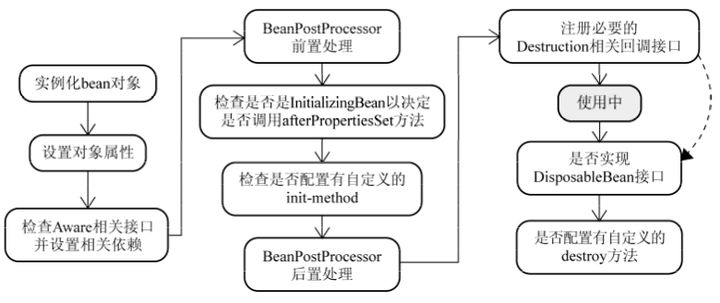
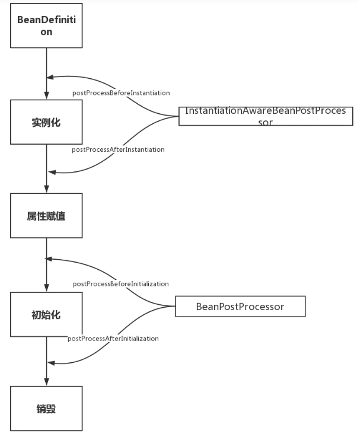
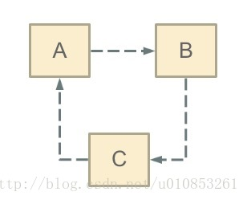
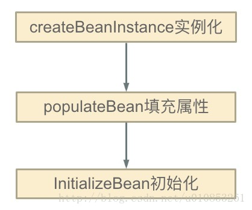

# Spring

##  什么是 Spring 框架 

 Spring 框架是一个为 Java 应用程序的开发提供了综合、广泛的基础性支持的 Java 平台。 

 Spring 帮助开发者解决了开发中基础性的问题，使得开发人员可以专注于应用程序的开发。 Spring 框架本身亦是按照设计模式精心打造，这使得我们可以在开发环境中安心的集成 Spring 框 架，不必担心 Spring 是如何在后台进行工作的。 Spring 框架至今已集成了 20 多个模块。这些模块主要被分如下图所示的核心容器、数据访问/集 成,、Web、AOP（面向切面编程）、工具、消息和测试模块。  

##  控制反转(IOC)和 依赖注入 

 控制反转是应用于软件工程领域中的，在运行时被装配器对象来绑定耦合对象的一种编程技巧，对 象之间耦合关系在编译时通常是未知的。在传统的编程方式中，业 务逻辑的流程是由应用程序中的 早已被设定好关联关系的对象来决定的。在使用控制反转的情况下，业务逻辑的流程是由对象关系 图来决定的，该对象关系图由装配 器负责实例化，这种实现方式还可以将对象之间的关联关系的定 义抽象化。而绑定的过程是通过“依赖注入”实现的。

 控制反转是一种以给予应用程序中目标组件更多控制为目的设计范式，并在我们的实际工作中起到 了有效的作用。 

依赖注入是在编译阶段尚未知所需的功能是来自哪个的类的情况下，将其他对象所依赖的功能对象 实例化的模式。这就需要一种机制用来激活相应的组件以提供特定的功能，所以依赖注入是控制反 转的基础。否则如果在组件不受框架控制的情况下，框架又怎么知道要创建哪个组件？ 

在 Java 中依然注入有以下三种实现方式：  

1.  构造器注入 
2. Setter 方法注入 
3. 接口注入 

###  Spring 框架中的 IoC 

 Spring 中的 org.springframework.beans 包和 org.springframework.context 包 构成了 Spring 框架 IoC 容器的基础。 

 BeanFactory 接口提供了一个先进的配置机制，使得任何类型的对象的配置成为可能。 ApplicationContext 接口对 BeanFactory（是一个子接口）进行了扩展，在 BeanFactory 的基础上添加了其他功能，比如与 Spring 的 AOP 更容易集成，也提供了处理 message resource 的机制（用于国际化）、事件传播以及应用层的特别配置，比如针对 Web 应用的 WebApplicationContext。  

 org.springframework.beans.factory.BeanFactory 是 Spring IoC 容器的具体实现， 用来包装和管理前面提到的各种 bean。BeanFactory 接口是 Spring IoC 容器的核心接口。 

 IOC:把对象的创建、初始化、销毁交给 spring 来管理，而不是由开发者控制，实现控制反转。 

###  BeanFactory 和 ApplicationContext 的区别

 BeanFactory 可以理解为含有 bean 集合的工厂类。BeanFactory 包含了种 bean 的定义，以便 在接收到客户端请求时将对应的 bean 实例化。  

 BeanFactory 还能在实例化对象的时生成协作类之间的关系。此举将 bean 自身与 bean 客户端的 配置中解放出来。BeanFactory 还包含 了 bean 生命周期的控制，调用客户端的初始化方法 （initialization methods）和销毁方法（destruction methods）。 

 从表面上看，application context 如同 bean factory 一样具有 bean 定义、bean 关联关系的设 置，根据请求分发 bean 的功能。但 applicationcontext 在此基础上还提供了其他的功能。 、

1.  提供了支持国际化的文本消息
2.  统一的资源文件读取方式 
3. 已在监听器中注册的 bean 的事件 

 **以下是三种较常见的 ApplicationContext 实现方式：** 

 1、ClassPathXmlApplicationContext：从 classpath 的 XML 配置文件中读取上下文，并生成上 下文定义。应用程序上下文从程序环境变量中

``` ApplicationContext context = new ClassPathXmlApplicationContext(“bean.xml”); ```

2、FileSystemXmlApplicationContext ：由文件系统中的 XML 配置文件读取上下文。 

```ApplicationContext context = new FileSystemXmlApplicationContext(“bean.xml”); ```

3、XmlWebApplicationContext：由 Web 应用的 XML 文件读取上下文。 

###  Spring 三种配置方式 

1.  基于 XML 的配置 
2. 基于注解的配置 
3. 基于 Java 的配置  

####  基于 XML 配置的方式配置 Spring 

 在 Spring 框架中，依赖和服务需要在专门的配置文件来实现，我常用的 XML 格式的配置文件。这 些配置文件的格式通常用开头，然后一系列的 bean 定义和专门的应用配置 选项组成。 

SpringXML 配置的主要目的时候是使所有的 Spring 组件都可以用 xml 文件的形式来进行配置。这 意味着不会出现其他的 Spring 配置类型（比如声明的方式或基于 Java Class 的配置方式） Spring 的 XML 配置方式是使用被 Spring 命名空间的所支持的一系列的 XML 标签来实现的。 

Spring 有以下主要的命名空间：context、beans、jdbc、tx、aop、mvc 和 aso。 

```
<beans>
 <!-- JSON Support -->
 <bean name="viewResolver"
class="org.springframework.web.servlet.view.BeanNameViewResolver"/>
 <bean name="jsonTemplate"
class="org.springframework.web.servlet.view.json.MappingJackson2JsonV
iew"/>
 <bean id="restTemplate"
class="org.springframework.web.client.RestTemplate"/>
</beans> 
```

 下面这个 web.xml 仅仅配置了 DispatcherServlet，这件最简单的配置便能满足应用程序配置运 行时组件的需求。 

```
<web-app>
 <display-name>Archetype Created Web Application</display-name>
 <servlet>
 <servlet-name>spring</servlet-name>
 <servletclass>org.springframework.web.servlet.DispatcherServlet</servletclass>
 <load-on-startup>1</load-on-startup>
 </servlet> 
 <servlet-mapping>
 <servlet-name>spring</servlet-name>
 <url-pattern>/</url-pattern>
 </servlet-mapping>
</web-app> 
```

####  基于 Java 配置的方式配置 Spring 

 Spring 对 Java 配置的支持是由@Configuration 注解和@Bean 注解来实现的。由@Bean 注解 的方法将会实例化、配置和初始化一个 新对象，这个对象将由 Spring 的 IoC 容器来管理。 @Bean 声明所起到的作用与 元素类似。被 @Configuration 所注解的类则表示这个类 的主要目的是作为 bean 定义的资源。被@Configuration 声明的类可以通过在同一个类的 内部调 用@bean 方法来设置嵌入 bean 的依赖关系。  

 最简单的@Configuration 声明类请参考下面的代码： 

```
@Configuration
public class AppConfig{
 @Bean
 public MyService myService() {
 return new MyServiceImpl();
 }
}
```

 对于上面的@Beans 配置文件相同的 XML 配置文件如下： 

```
<beans>
 <bean id="myService" class="com.somnus.services.MyServiceImpl"/>
</beans>
```

 上述配置方式的实例化方式如下：利用 AnnotationConfigApplicationContext 类进行实例化 

```
public static void main(String[] args) {
 ApplicationContext ctx = new AnnotationConfigApplicationContext(AppConfig.class);
 MyService myService = ctx.getBean(MyService.class);
 myService.doStuff(); 
}
```

 要使用组件组建扫描，仅需用@Configuration 进行注解即可： 

```
@Configuration
@ComponentScan(basePackages = "com.somnus")
public class AppConfig {
 ...
} 
```

 在上面的例子中，com.somnus 包首先会被扫到，然后再容器内查找被@Component 声明的类，找 到后将这些类按照 Sring bean 定义进行注册。  

 如果你要在你的 web 应用开发中选用上述的配置的方式的话，需要用 AnnotationConfigWebApplicationContext 类来读 取配置文件，可以用来配置 Spring 的 Servlet 监听器 ContextLoaderListener 或者 Spring MVC 的 DispatcherServlet。  

```
<web-app>
 <!-- Configure ContextLoaderListener to use
AnnotationConfigWebApplicationContext
 instead of the default XmlWebApplicationContext -->
 <context-param>
 <param-name>contextClass</param-name>
 <param-value>
	org.springframework.web.context.support.AnnotationConfigWebApplicationContext
 </param-value>
 </context-param>

 <!-- Configuration locations must consist of one or more comma- or
space-delimited
 fully-qualified @Configuration classes. Fully-qualified
packages may also be
 specified for component-scanning -->
 <context-param>
 <param-name>contextConfigLocation</param-name>
 <param-value>com.howtodoinjava.AppConfig</param-value>
 </context-param>

 <!-- Bootstrap the root application context as usual using
ContextLoaderListener --> 
<listener>
 <listenerclass>org.springframework.web.context.ContextLoaderListener</listener
-class>
 </listener>

 <!-- Declare a Spring MVC DispatcherServlet as usual -->
 <servlet>
 <servlet-name>dispatcher</servlet-name>
 <servletclass>org.springframework.web.servlet.DispatcherServlet</servletclass>
 <!-- Configure DispatcherServlet to use
AnnotationConfigWebApplicationContext
 instead of the default XmlWebApplicationContext -->
 <init-param>
 <param-name>contextClass</param-name>
 <param-value>

org.springframework.web.context.support.AnnotationConfigWebApplicatio
nContext
 </param-value>
 </init-param>
 <!-- Again, config locations must consist of one or more commaor space-delimited
 and fully-qualified @Configuration classes -->
 <init-param>
 <param-name>contextConfigLocation</param-name>
 <param-value>com.howtodoinjava.web.MvcConfig</paramvalue>
 </init-param>
 </servlet>

 <!-- map all requests for /app/* to the dispatcher servlet -->
 <servlet-mapping>
 <servlet-name>dispatcher</servlet-name>
 <url-pattern>/app/*</url-pattern>
 </servlet-mapping>
</web-app
```

####  注解的方式配置 Spring 

 Spring 在 2.5 版本以后开始支持用注解的方式来配置依赖注入。可以用注解的方式来替代 XML 方 式的 bean 描述，可以将 bean 描述转移到组件类的 内部，只需要在相关类上、方法上或者字段声 明上使用注解即可。注解注入将会被容器在 XML 注入之前被处理，所以后者会覆盖掉前者对于同一 个属性的处理结 果。 注解装配在 Spring 中是默认关闭的。所以需要在 Spring 文件中配置一下才能使用基于注解的装配 模式。如果你想要在你的应用程序中使用关于注解的方法的话，请参考如下的配置。 

```
<beans>
 <context:annotation-config/>
 <!-- bean definitions go here -->
</beans> 
```

 在 标签配置完成以后，就可以用注解的方式在 Spring 中向属 性、方法和构造方法中自动装配变量。 

 下面是几种比较重要的注解类型： 

1. @Required：该注解应用于设值方法。 
2. @Autowired：该注解应用于有值设值方法、非设值方法、构造方法和变量。
3. @Qualifier：该注解和@Autowired 注解搭配使用，用于消除特定 bean 自动装配的歧义。 
4.  JSR-250 Annotations：Spring 支持基于 JSR-250 注解的以下注解，@Resource、 @PostConstruct 和 @PreDestroy。  

###  Spring Bean 的生命周期 

Spring中每个Bean的生命周期如下：



#### 1. 实例化Bean

对于BeanFactory容器，当客户向容器请求一个尚未初始化的bean时，或初始化bean的时候需要注入另一个尚未初始化的依赖时，容器就会调用createBean进行实例化。 
对于ApplicationContext容器，当容器启动结束后，便实例化所有的bean。 
容器通过获取BeanDefinition对象中的信息进行实例化。并且这一步仅仅是简单的实例化，并未进行依赖注入。 
实例化对象被包装在BeanWrapper对象中，BeanWrapper提供了设置对象属性的接口，从而避免了使用反射机制设置属性。

#### 2. 设置对象属性（依赖注入）

实例化后的对象被封装在BeanWrapper对象中，并且此时对象仍然是一个原生的状态，并没有进行依赖注入。 
紧接着，Spring根据BeanDefinition中的信息进行依赖注入。 
并且通过BeanWrapper提供的设置属性的接口完成依赖注入。

#### 3. 注入Aware接口

紧接着，Spring会检测该对象是否实现了xxxAware接口，并将相关的xxxAware实例注入给bean。

#### 4. BeanPostProcessor

当经过上述几个步骤后，bean对象已经被正确构造，但如果你想要对象被使用前再进行一些自定义的处理，就可以通过BeanPostProcessor接口实现。 
该接口提供了两个函数：

- postProcessBeforeInitialzation( Object bean, String beanName ) 
  当前正在初始化的bean对象会被传递进来，我们就可以对这个bean作任何处理。 
  这个函数会先于InitialzationBean执行，因此称为前置处理。 
  所有Aware接口的注入就是在这一步完成的。
- postProcessAfterInitialzation( Object bean, String beanName ) 
  当前正在初始化的bean对象会被传递进来，我们就可以对这个bean作任何处理。 
  这个函数会在InitialzationBean完成后执行，因此称为后置处理。

#### 5. InitializingBean与init-method

当BeanPostProcessor的前置处理完成后就会进入本阶段。 
InitializingBean接口只有一个函数：

- afterPropertiesSet()

这一阶段也可以在bean正式构造完成前增加我们自定义的逻辑，但它与前置处理不同，由于该函数并不会把当前bean对象传进来，因此在这一步没办法处理对象本身，只能增加一些额外的逻辑。 
若要使用它，我们需要让bean实现该接口，并把要增加的逻辑写在该函数中。然后Spring会在前置处理完成后检测当前bean是否实现了该接口，并执行afterPropertiesSet函数。

当然，Spring为了降低对客户代码的侵入性，给bean的配置提供了init-method属性，该属性指定了在这一阶段需要执行的函数名。Spring便会在初始化阶段执行我们设置的函数。init-method本质上仍然使用了InitializingBean接口。

#### 6. DisposableBean和destroy-method

和init-method一样，通过给destroy-method指定函数，就可以在bean销毁前执行指定的逻辑。

### Spring生命周期相关扩展点

#### 第一大类：影响多个Bean的接口

实现了这些接口的Bean会切入到多个Bean的生命周期中。正因为如此，这些接口的功能非常强大，Spring内部扩展也经常使用这些接口，例如自动注入以及AOP的实现都和他们有关。

- BeanPostProcessor
- InstantiationAwareBeanPostProcessor

这两兄弟可能是Spring扩展中**最重要**的两个接口！InstantiationAwareBeanPostProcessor作用于**实例化**阶段的前后，BeanPostProcessor作用于**初始化**阶段的前后。正好和第一、第三个生命周期阶段对应。通过图能更好理解：



InstantiationAwareBeanPostProcessor实际上继承了BeanPostProcessor接口，严格意义上来看他们不是两兄弟，而是两父子。但是从生命周期角度我们重点关注其特有的对实例化阶段的影响，图中省略了从BeanPostProcessor继承的方法。

```java
InstantiationAwareBeanPostProcessor extends BeanPostProcessor
```

InstantiationAwareBeanPostProcessor源码分析：

- postProcessBeforeInstantiation调用点，忽略无关代码：

```tsx
@Override
    protected Object createBean(String beanName, RootBeanDefinition mbd, @Nullable Object[] args)
            throws BeanCreationException {

        try {
            // Give BeanPostProcessors a chance to return a proxy instead of the target bean instance.
            // postProcessBeforeInstantiation方法调用点，这里就不跟进了，
            // 有兴趣的同学可以自己看下，就是for循环调用所有的InstantiationAwareBeanPostProcessor
            Object bean = resolveBeforeInstantiation(beanName, mbdToUse);
            if (bean != null) {
                return bean;
            }
        }
        
        try {   
            // 上文提到的doCreateBean方法，可以看到
            // postProcessBeforeInstantiation方法在创建Bean之前调用
            Object beanInstance = doCreateBean(beanName, mbdToUse, args);
            if (logger.isTraceEnabled()) {
                logger.trace("Finished creating instance of bean '" + beanName + "'");
            }
            return beanInstance;
        }
        
    }
```

可以看到，postProcessBeforeInstantiation在doCreateBean之前调用，也就是在bean实例化之前调用的，英文源码注释解释道该方法的返回值会替换原本的Bean作为代理，这也是Aop等功能实现的关键点。

postProcessAfterInstantiation调用点，忽略无关代码：

```tsx
protected void populateBean(String beanName, RootBeanDefinition mbd, @Nullable BeanWrapper bw) {

   // Give any InstantiationAwareBeanPostProcessors the opportunity to modify the
   // state of the bean before properties are set. This can be used, for example,
   // to support styles of field injection.
   boolean continueWithPropertyPopulation = true;
    // InstantiationAwareBeanPostProcessor#postProcessAfterInstantiation()
    // 方法作为属性赋值的前置检查条件，在属性赋值之前执行，能够影响是否进行属性赋值！
   if (!mbd.isSynthetic() && hasInstantiationAwareBeanPostProcessors()) {
      for (BeanPostProcessor bp : getBeanPostProcessors()) {
         if (bp instanceof InstantiationAwareBeanPostProcessor) {
            InstantiationAwareBeanPostProcessor ibp = (InstantiationAwareBeanPostProcessor) bp;
            if (!ibp.postProcessAfterInstantiation(bw.getWrappedInstance(), beanName)) {
               continueWithPropertyPopulation = false;
               break;
            }
         }
      }
   }

   // 忽略后续的属性赋值操作代码
}
```

可以看到该方法在属性赋值方法内，但是在真正执行赋值操作之前。其返回值为boolean，返回false时可以阻断属性赋值阶段（`continueWithPropertyPopulation = false;`）。

关于BeanPostProcessor执行阶段的源码穿插在下文Aware接口的调用时机分析中，因为部分Aware功能的就是通过他实现的!只需要先记住BeanPostProcessor在初始化前后调用就可以了。

#### 第二大类：只调用一次的接口

这一大类接口的特点是功能丰富，常用于用户自定义扩展。
第二大类中又可以分为两类：

1. Aware类型的接口
2. 生命周期接口

Aware类型的接口的作用就是让我们能够拿到Spring容器中的一些资源。基本都能够见名知意，Aware之前的名字就是可以拿到什么资源，例如`BeanNameAware`可以拿到BeanName，以此类推。调用时机需要注意：所有的Aware方法都是在初始化阶段之前调用的！
 Aware接口众多，这里同样通过分类的方式帮助大家记忆。
 Aware接口具体可以分为两组，至于为什么这么分，详见下面的源码分析。如下排列顺序同样也是Aware接口的执行顺序，能够见名知意的接口不再解释。

Aware Group1

1. BeanNameAware
2. BeanClassLoaderAware
3. BeanFactoryAware

Aware Group2

1. EnvironmentAware
2. EmbeddedValueResolverAware 这个知道的人可能不多，实现该接口能够获取Spring EL解析器，用户的自定义注解需要支持spel表达式的时候可以使用，非常方便。
3. ApplicationContextAware(ResourceLoaderAware\ApplicationEventPublisherAware\MessageSourceAware) 这几个接口可能让人有点懵，实际上这几个接口可以一起记，其返回值实质上都是当前的ApplicationContext对象，因为ApplicationContext是一个复合接口，如下：

```kotlin
public interface ApplicationContext extends EnvironmentCapable, ListableBeanFactory, HierarchicalBeanFactory,
        MessageSource, ApplicationEventPublisher, ResourcePatternResolver {}
```

这里涉及到另一道面试题，ApplicationContext和BeanFactory的区别，可以从ApplicationContext继承的这几个接口入手，除去BeanFactory相关的两个接口就是ApplicationContext独有的功能，这里不详细说明。

##### Aware调用时机源码分析

详情如下，忽略了部分无关代码。代码位置就是我们上文提到的initializeBean方法详情，这也说明了Aware都是在初始化阶段之前调用的！

```dart
    // 见名知意，初始化阶段调用的方法
    protected Object initializeBean(final String beanName, final Object bean, @Nullable RootBeanDefinition mbd) {

        // 这里调用的是Group1中的三个Bean开头的Aware
        invokeAwareMethods(beanName, bean);

        Object wrappedBean = bean;
        
        // 这里调用的是Group2中的几个Aware，
        // 而实质上这里就是前面所说的BeanPostProcessor的调用点！
        // 也就是说与Group1中的Aware不同，这里是通过BeanPostProcessor（ApplicationContextAwareProcessor）实现的。
        wrappedBean = applyBeanPostProcessorsBeforeInitialization(wrappedBean, beanName);
        // 下文即将介绍的InitializingBean调用点
        invokeInitMethods(beanName, wrappedBean, mbd);
        // BeanPostProcessor的另一个调用点
        wrappedBean = applyBeanPostProcessorsAfterInitialization(wrappedBean, beanName);

        return wrappedBean;
    }
```

可以看到并不是所有的Aware接口都使用同样的方式调用。Bean××Aware都是在代码中直接调用的，而ApplicationContext相关的Aware都是通过BeanPostProcessor#postProcessBeforeInitialization()实现的。感兴趣的可以自己看一下ApplicationContextAwareProcessor这个类的源码，就是判断当前创建的Bean是否实现了相关的Aware方法，如果实现了会调用回调方法将资源传递给Bean。
 至于Spring为什么这么实现，应该没什么特殊的考量。也许和Spring的版本升级有关。基于对修改关闭，对扩展开放的原则，Spring对一些新的Aware采用了扩展的方式添加。

BeanPostProcessor的调用时机也能在这里体现，包围住invokeInitMethods方法，也就说明了在初始化阶段的前后执行。

关于Aware接口的执行顺序，其实只需要记住第一组在第二组执行之前就行了。每组中各个Aware方法的调用顺序其实没有必要记，有需要的时候点进源码一看便知。

##### 简单的两个生命周期接口

至于剩下的两个生命周期接口就很简单了，实例化和属性赋值都是Spring帮助我们做的，能够自己实现的有初始化和销毁两个生命周期阶段。

1. InitializingBean 对应生命周期的初始化阶段，在上面源码的`invokeInitMethods(beanName, wrappedBean, mbd);`方法中调用。
    有一点需要注意，因为Aware方法都是执行在初始化方法之前，所以可以在初始化方法中放心大胆的使用Aware接口获取的资源，这也是我们自定义扩展Spring的常用方式。
    除了实现InitializingBean接口之外还能通过注解或者xml配置的方式指定初始化方法，至于这几种定义方式的调用顺序其实没有必要记。因为这几个方法对应的都是同一个生命周期，只是实现方式不同，我们一般只采用其中一种方式。
2. DisposableBean 类似于InitializingBean，对应生命周期的销毁阶段，以ConfigurableApplicationContext#close()方法作为入口，实现是通过循环取所有实现了DisposableBean接口的Bean然后调用其destroy()方法 。感兴趣的可以自行跟一下源码。

###  BeanPostProcessor 注册时机与执行顺序

我们知道BeanPostProcessor也会注册为Bean，那么Spring是如何保证BeanPostProcessor在我们的业务Bean之前初始化完成呢？
 请看我们熟悉的refresh()方法的源码，省略部分无关代码：

```java
@Override
    public void refresh() throws BeansException, IllegalStateException {
        synchronized (this.startupShutdownMonitor) {

            try {
                // Allows post-processing of the bean factory in context subclasses.
                postProcessBeanFactory(beanFactory);

                // Invoke factory processors registered as beans in the context.
                invokeBeanFactoryPostProcessors(beanFactory);

                // Register bean processors that intercept bean creation.
                // 所有BeanPostProcesser初始化的调用点
                registerBeanPostProcessors(beanFactory);

                // Initialize message source for this context.
                initMessageSource();

                // Initialize event multicaster for this context.
                initApplicationEventMulticaster();

                // Initialize other special beans in specific context subclasses.
                onRefresh();

                // Check for listener beans and register them.
                registerListeners();

                // Instantiate all remaining (non-lazy-init) singletons.
                // 所有单例非懒加载Bean的调用点
                finishBeanFactoryInitialization(beanFactory);

                // Last step: publish corresponding event.
                finishRefresh();
            }

    }
```

可以看出，Spring是先执行registerBeanPostProcessors()进行BeanPostProcessors的注册，然后再执行finishBeanFactoryInitialization初始化我们的单例非懒加载的Bean。

##### 执行顺序

BeanPostProcessor有很多个，而且每个BeanPostProcessor都影响多个Bean，其执行顺序至关重要，必须能够控制其执行顺序才行。关于执行顺序这里需要引入两个排序相关的接口：PriorityOrdered、Ordered

PriorityOrdered是一等公民，首先被执行，PriorityOrdered公民之间通过接口返回值排序

Ordered是二等公民，然后执行，Ordered公民之间通过接口返回值排序

都没有实现是三等公民，最后执行

在以下源码中，可以很清晰的看到Spring注册各种类型BeanPostProcessor的逻辑，根据实现不同排序接口进行分组。优先级高的先加入，优先级低的后加入。

```kotlin
// First, invoke the BeanDefinitionRegistryPostProcessors that implement PriorityOrdered.
// 首先，加入实现了PriorityOrdered接口的BeanPostProcessors，顺便根据PriorityOrdered排了序
            String[] postProcessorNames =
                    beanFactory.getBeanNamesForType(BeanDefinitionRegistryPostProcessor.class, true, false);
            for (String ppName : postProcessorNames) {
                if (beanFactory.isTypeMatch(ppName, PriorityOrdered.class)) {
                    currentRegistryProcessors.add(beanFactory.getBean(ppName, BeanDefinitionRegistryPostProcessor.class));
                    processedBeans.add(ppName);
                }
            }
            sortPostProcessors(currentRegistryProcessors, beanFactory);
            registryProcessors.addAll(currentRegistryProcessors);
            invokeBeanDefinitionRegistryPostProcessors(currentRegistryProcessors, registry);
            currentRegistryProcessors.clear();

            // Next, invoke the BeanDefinitionRegistryPostProcessors that implement Ordered.
// 然后，加入实现了Ordered接口的BeanPostProcessors，顺便根据Ordered排了序
            postProcessorNames = beanFactory.getBeanNamesForType(BeanDefinitionRegistryPostProcessor.class, true, false);
            for (String ppName : postProcessorNames) {
                if (!processedBeans.contains(ppName) && beanFactory.isTypeMatch(ppName, Ordered.class)) {
                    currentRegistryProcessors.add(beanFactory.getBean(ppName, BeanDefinitionRegistryPostProcessor.class));
                    processedBeans.add(ppName);
                }
            }
            sortPostProcessors(currentRegistryProcessors, beanFactory);
            registryProcessors.addAll(currentRegistryProcessors);
            invokeBeanDefinitionRegistryPostProcessors(currentRegistryProcessors, registry);
            currentRegistryProcessors.clear();

            // Finally, invoke all other BeanDefinitionRegistryPostProcessors until no further ones appear.
// 最后加入其他常规的BeanPostProcessors
            boolean reiterate = true;
            while (reiterate) {
                reiterate = false;
                postProcessorNames = beanFactory.getBeanNamesForType(BeanDefinitionRegistryPostProcessor.class, true, false);
                for (String ppName : postProcessorNames) {
                    if (!processedBeans.contains(ppName)) {
                        currentRegistryProcessors.add(beanFactory.getBean(ppName, BeanDefinitionRegistryPostProcessor.class));
                        processedBeans.add(ppName);
                        reiterate = true;
                    }
                }
                sortPostProcessors(currentRegistryProcessors, beanFactory);
                registryProcessors.addAll(currentRegistryProcessors);
                invokeBeanDefinitionRegistryPostProcessors(currentRegistryProcessors, registry);
                currentRegistryProcessors.clear();
            }
```

根据排序接口返回值排序，默认升序排序，返回值越低优先级越高。

```dart
    /**
     * Useful constant for the highest precedence value.
     * @see java.lang.Integer#MIN_VALUE
     */
    int HIGHEST_PRECEDENCE = Integer.MIN_VALUE;

    /**
     * Useful constant for the lowest precedence value.
     * @see java.lang.Integer#MAX_VALUE
     */
    int LOWEST_PRECEDENCE = Integer.MAX_VALUE;
```

PriorityOrdered、Ordered接口作为Spring整个框架通用的排序接口，在Spring中应用广泛，也是非常重要的接口。

### Spring Bean 的作用域 

1. singleton：这种 bean 范围是默认的，这种范围确保不管接受到多少个请求，每个容器中只有一个 bean 的实例，单例的模式由 bean factory 自身来维护。  
2.  prototype：原形范围与单例范围相反，为每一个 bean 请求提供一个实例。 
3.  request：在请求 bean 范围内会每一个来自客户端的网络请求创建一个实例，在请求完成以后， bean 会失效并被垃圾回收器回收。  
4.  Session：与请求范围类似，确保每个 session 中有一个 bean 的实例，在 session 过期后，bean 会随之失效。  
5.  global- session：global-session 和 Portlet 应用相关。当你的应用部署在 Portlet 容器中工作 时，它包含很多 portlet。如果你想要声明让所有的 portlet共用全局的存储变量的话，那么这全局变量需要存储在 global-session 中。 

 全局作用域与 Servlet 中的 session 作用域效果相同。  

###  Spring inner beans 

 在 Spring 框架中，无论何时 bean 被使用时，当仅被调用了一个属性。一个明智的做法是将这个 bean 声明为内部 bean。内部 bean 可以用 setter 注入“属性”和构造方法注入“构造参数”的方式来 实现。 

```
public class Customer{
 private Person person;
 //Setters and Getters 
 }
public class Person{
 private String name;
 private String address;
 private int age;
 //Setters and Getters
} 
```

 内部 bean 的声明方式如下：  

```
<bean id="CustomerBean" class="com.somnus.common.Customer">
 <property name="person">
 <!-- This is inner bean -->
 <bean class="com.howtodoinjava.common.Person">
     <property name="name" value="lokesh" />
     <property name="address" value="India" />
     <property name="age" value="34" />
 </bean>
 </property>
</bean>
```

###  Spring 框架中的单例 Beans 是线程安全的么 

 Spring 框架并没有对单例 bean 进行任何多线程的封装处理。关于单例 bean 的线程安全和并发问 题需要开发者自行去搞定。但实际上，大部分的 Spring bean 并没有可变的状态(比如 Serview 类 和 DAO 类)，所以在某种程度上说 Spring 的单例 bean 是线程安全的。如果你的 bean 有多种状 态的话（比如 View Model 对象），就需要自行保证线程安全。  

 最浅显的解决办法就是将多态 bean 的作用域由“singleton”变更为“prototype”。 

###  在 Spring 中注入一个 Java Collection 

 Spring 提供了以下四种集合类的配置元素： 

*  <List>: 该标签用来装配可重复的 list 值。 
* <Set> : 该标签用来装配没有重复的 set 值。 
* \<Map>: 该标签可用来注入键和值可以为任何类型的键值对。 
* <Props> : 该标签支持注入键和值都是字符串类型的键值对。  

 下面看一下具体的例子：  

```
<beans>
 <!-- Definition for javaCollection -->
 <bean id="javaCollection" class="com.howtodoinjava.JavaCollection">
 <!-- java.util.List -->
 <property name="customList">
 <list>
 <value>INDIA</value>
 <value>Pakistan</value>
 <value>USA</value>
 <value>UK</value>
 </list>
 </property>

 <!-- java.util.Set -->
 <property name="customSet">
 <set>
 <value>INDIA</value>
 <value>Pakistan</value>
 <value>USA</value>
 <value>UK</value>
 </set>
 </property>

 <!-- java.util.Map -->
 <property name="customMap">
 <map>
 <entry key="1" value="INDIA"/>
 <entry key="2" value="Pakistan"/>
 <entry key="3" value="USA"/>
 <entry key="4" value="UK"/>
 </map> 
 </property>

 <!-- java.util.Properties -->
 <property name="customProperies">
 <props>
 <prop key="admin">admin@nospam.com</prop>
 <prop key="support">support@nospam.com</prop>
 </props>
 </property>

 </bean>
</beans>
```

Spring Bean 中注入一个 Java.util.Properties 

 第一种方法是使用如下面代码所示的 标签：  

```
<bean id="adminUser" class="com.somnus.common.Customer">

 <!-- java.util.Properties -->
 <property name="emails">
     <props>
         <prop key="admin">admin@nospam.com</prop>
         <prop key="support">support@nospam.com</prop>
     </props>
 </property>

</bean> 
```

 也可用”util:”命名空间来从 properties 文件中创建出一个 propertiesbean，然后利用 setter 方 法注入 bean 的引用。 

###  Spring Bean 的自动装配 

 在 Spring 框架中，在配置文件中设定 bean 的依赖关系是一个很好的机制，Spring 容器还可以自 动装配合作关系 bean 之间的关联关系。这意味着 Spring 可以通过向 Bean Factory 中注入的方式自动搞定 bean 之间的依赖关系。自动装配可以设置在每个 bean 上，也可以设定在特定的 bean 上。 

 下面的 XML 配置文件表明了如何根据名称将一个 bean 设置为自动装配： 

```
<bean id="employeeDAO" class="com.howtodoinjava.EmployeeDAOImpl"
autowire="byName" /> 
```

 除了 bean 配置文件中提供的自动装配模式，还可以使用@Autowired 注解来自动装配指定 的 bean。在使用@Autowired 注解之前需要在按照如下的配置方式在 Spring 配 置文件进行配置才可以使用。  

```
<context:annotation-config /> 
```

 也可以通过在配置文件中配置 AutowiredAnnotationBeanPostProcessor 达到相同的效果。  

   ```
<bean class
="org.springframework.beans.factory.annotation.AutowiredAnnotationBea
nPostProcessor"/> 
   ```

 配置好以后就可以使用@Autowired 来标注了。  

```
@Autowired
public EmployeeDAOImpl ( EmployeeManager manager ) {
 this.manager = manager;
} 
```

####   Spring 框架中五种自动装配模式

1. no：这是 Spring 框架的默认设置，在该设置下自动装配是关闭的，开发者需要自行在 bean 定义 中用标签明确的设置依赖关系。 
2.  byName：该选项可以根据 bean 名称设置依赖关系。当向一个 bean 中自动装配一个属性时，容器将根据 bean 的名称自动在在配置文件中查询一个匹配的 bean。如果找到的话，就装配这个属 性，如果没找到的话就报错。  
3.  byType：该选项可以根据 bean 类型设置依赖关系。当向一个 bean 中自动装配一个属性时，容器 将根据 bean 的类型自动在在配置文件中查询一个匹配的 bean。如果找到的话，就装配这个属性， 如果没找到的话就报错。  
4.  constructor：构造器的自动装配和 byType 模式类似，但是仅仅适用于与有构造器相同参数的 bean，如果在容器中没有找到与构造器参数类型一致的 bean，那么将会抛出异常。 
5.  autodetect：该模式自动探测使用构造器自动装配或者 byType 自动装配。首先，首先会尝试找合 适的带参数的构造器，如果找到的话就是用构造器自动装配，如果在 bean 内部没有找到相应的构 造器或者是无参构造器，容器就会自动选择 byTpe 的自动装配方式。 

####  开启基于注解的自动装配 

 要使用 @Autowired，需要注册 AutowiredAnnotationBeanPostProcessor，可以 有以下两种方式来实现： 

 有以下两种方式来实现： 

1、引入配置文件中的下引入  

```
<beans>
 <context:annotation-config />
</beans> 
```

 2、在 bean 配置文件中直接引入 AutowiredAnnotationBeanPostProcessor     

```
<beans>
 <bean
class="org.springframework.beans.factory.annotation.AutowiredAnnotati
onBeanPostProcessor"/>
</beans>
```

#####  @Required 注解 

 在产品级别的应用中，IoC 容器可能声明了数十万了 bean，bean 与 bean 之间有着复杂的依赖关 系。设值注解方法的短板之一就是验证所有的属性是否被注解是一项十分困难的操作。可以通过在 中设置“dependency-check”来解决这个问题。 

 在应用程序的生命周期中，你可能不大愿意花时间在验证所有 bean 的属性是否按照上下文文件正 确配置。或者你宁可验证某个 bean 的特定属性是否被正确的设置。即使是用“dependencycheck”属性也不能很好的解决这个问题，在这种情况下，你需要使用@Required 注解。 需要用如下的方式使用来标明 bean 的设值方法。 

```
public class EmployeeFactoryBean extends AbstractFactoryBean<Object>{
 private String designation;
 public String getDesignation() {
 return designation;
 }
 @Required
 public void setDesignation(String designation) {
 this.designation = designation;
 }
 //more code here
} 
```

 RequiredAnnotationBeanPostProcessor 是 Spring 中的后置处理用来验证被 @Required 注解的 bean 属性是否被正确的设置了。在使用 RequiredAnnotationBeanPostProcesso 来验证 bean 属性之前，首先要在 IoC 容器中对 其进行注册：  

```
<bean
class="org.springframework.beans.factory.annotation.RequiredAnnotatio
nBeanPostProcessor" /> 
```

 但是如果没有属性被用 @Required 注解过的话，后置处理器会抛出一个 BeanInitializationException 异常。  

#####  @Autowired 注解 

 @Autowired 注解对自动装配何时何处被实现提供了更多细粒度的控制。@Autowired 注解可 以像@Required 注解、构造器一样被用于在 bean 的设值方法上自动装配 bean 的属性，一个参数或者带有任意名称或带有多个参数的方法。 

 比如，可以在设值方法上使用@Autowired 注解来替代配置文件中的  <property>元 素。当 Spring 容器在 setter 方法上找到@Autowired 注解时，会尝试用 byType 自动装配。  

 当然我们也可以在构造方法上使用@Autowired 注解。带有@Autowired 注解的构造方法意味着 在创建一个 bean 时将会被自动装配，即便在配置文件中使用 <constructor-arg>元素。 

```
public class TextEditor {
 private SpellChecker spellChecker;
 @Autowired
 public TextEditor(SpellChecker spellChecker){
	 System.out.println("Inside TextEditor constructor." );
 	 this.spellChecker = spellChecker;
 }
 public void spellCheck(){
 	 spellChecker.checkSpelling();
 }
} 
```

 下面是没有构造参数的配置方式：  

```
<beans>

 <context:annotation-config/>

 <!-- Definition for textEditor bean without constructor-arg -->
 <bean id="textEditor" class="com.howtodoinjava.TextEditor"/>

 <!-- Definition for spellChecker bean -->
 <bean id="spellChecker" class="com.howtodoinjava.SpellChecker"/> 
</beans> 
```

#####  @Qualifier 注解 

 @Qualifier 注解意味着可以在被标注 bean 的字段上可以自动装配。Qualifier 注 解可以用来取消 Spring 不能取消的 bean 应用。  

 下面的示例将会在 Customer 的 person 属性中自动装配 person 的值。  

```
public class Customer{
 @Autowired
 private Person person;
} 
```

 下面我们要在配置文件中来配置 Person 类。 

```
<bean id="customer" class="com.somnus.common.Customer" />

<bean id="personA" class="com.somnus.common.Person" >
 <property name="name" value="lokesh" />
</bean>

<bean id="personB" class="com.somnus.common.Person" >
 <property name="name" value="alex" />
</bean> 
```

 Spring 会知道要自动装配哪个 person bean 么？不会的，但是运行上面的示例 时，会抛出下面的异常： 

```
Caused by:
org.springframework.beans.factory.NoSuchBeanDefinitionException:
 No unique bean of type [com.howtodoinjava.common.Person] is defined:
 expected single matching bean but found 2: [personA, personB]
```

 要解决上面的问题，需要使用 @Quanlifier 注解来告诉 Spring 容器要装配哪个 bean :

```
public class Customer{
 @Autowired
 @Qualifier("personA")
 private Person person;
} 
```

###  构造方法注入和设值注入有什么区别 

 请注意以下明显的区别： 

1. 在设值注入方法支持大部分的依赖注入，如果我们仅需 要注入 int、string 和 long 型的变量，我 们不要用设值的方法注入。对于基本类型，如果我们没有注入的话，可以为基本类型设置默认值。 在构造方法 注入不支持大部分的依赖注入，因为在调用构造方法中必须传入正确的构造参数，否则 的话为报错。 
2. 设值注入不会重写构造方法的值。如果我们对同一个变量同时使用了构造方法注入又使用了设置方 法注入的话，那么构造方法将不能覆盖由设值方法注入的值。很明显，因为构造方法尽在对象被创 建时调用。 
3. 在使用设值注入时有可能还不能保证某种依赖是否已经被注入，也就是说这时对象的依赖关系有可 能是不完整的。而在另一种情况下，构造器注入则不允许生成依赖关系不完整的对象。
4. 在设值注入时如果对象 A 和对象 B 互相依赖，在创建对象 A 时 Spring 会抛出 sObjectCurrentlyInCreationException 异常，因为在 B 对象被创建之前 A 对 象是不能被创建的，反之亦然。所以 Spring 用设值注入的方法解决了循环依赖 的问题，因对象的设值方法是在对象被创建之前被调用的。  

### Spring 如何解决循环依赖

循环依赖其实就是循环引用，也就是两个或则两个以上的bean互相持有对方，最终形成闭环。比如A依赖于B，B依赖于C，C又依赖于A。如下图：



 注意，这里不是函数的循环调用，是对象的相互依赖关系。循环调用其实就是一个死循环，除非有终结条件。 

 Spring中循环依赖场景有：
（1）构造器的循环依赖
（2）field属性的循环依赖。 

### 怎么检测是否存在循环依赖

 检测循环依赖相对比较容易，Bean在创建的时候可以给该Bean打标，如果递归调用回来发现正在创建中的话，即说明了循环依赖了。 

### 解决循环依赖

 Spring的循环依赖的理论依据其实是基于Java的引用传递，当我们获取到对象的引用时，对象的field或者属性是可以延后设置的(但是构造器必须是在获取引用之前)。 

 Spring的单例对象的初始化主要分为三步： 



（1）createBeanInstance：实例化，其实也就是调用对象的构造方法实例化对象

（2）populateBean：填充属性，这一步主要是多bean的依赖属性进行填充

（3）initializeBean：调用spring xml中的init 方法。

从上面讲述的单例bean初始化步骤我们可以知道，循环依赖主要发生在第一、第二部。也就是构造器循环依赖和field循环依赖。

那么我们要解决循环引用也应该从初始化过程着手，对于单例来说，在Spring容器整个生命周期内，有且只有一个对象，所以很容易想到这个对象应该存在Cache中，Spring为了解决单例的循环依赖问题，使用了**三级缓存**。

 首先我们看源码，三级缓存主要指： 

```
/** Cache of singleton objects: bean name --> bean instance */
private final Map<String, Object> singletonObjects = new ConcurrentHashMap<String, Object>(256);

/** Cache of singleton factories: bean name --> ObjectFactory */
private final Map<String, ObjectFactory<?>> singletonFactories = new HashMap<String, ObjectFactory<?>>(16);

/** Cache of early singleton objects: bean name --> bean instance */
private final Map<String, Object> earlySingletonObjects = new HashMap<String, Object>(16);
```

 这三级缓存分别指：
singletonFactories ： 单例对象工厂的cache
earlySingletonObjects ：提前暴光的单例对象的Cache
singletonObjects：单例对象的cache 

 我们在创建bean的时候，首先想到的是从cache中获取这个单例的bean，这个缓存就是singletonObjects。主要调用方法就就是： 

```
protected Object getSingleton(String beanName, boolean allowEarlyReference) {
    Object singletonObject = this.singletonObjects.get(beanName);
    if (singletonObject == null && isSingletonCurrentlyInCreation(beanName)) {
        synchronized (this.singletonObjects) {
            singletonObject = this.earlySingletonObjects.get(beanName);
            if (singletonObject == null && allowEarlyReference) {
                ObjectFactory<?> singletonFactory = this.singletonFactories.get(beanName);
                if (singletonFactory != null) {
                    singletonObject = singletonFactory.getObject();
                    this.earlySingletonObjects.put(beanName, singletonObject);
                    this.singletonFactories.remove(beanName);
                }
            }
        }
    }
    return (singletonObject != NULL_OBJECT ? singletonObject : null);
}
```

 上面的代码需要解释两个参数： 

- isSingletonCurrentlyInCreation()判断当前单例bean是否正在创建中，也就是没有初始化完成(比如A的构造器依赖了B对象所以得先去创建B对象， 或则在A的populateBean过程中依赖了B对象，得先去创建B对象，这时的A就是处于创建中的状态。)
- allowEarlyReference 是否允许从singletonFactories中通过getObject拿到对象

 **分析getSingleton()的整个过程，Spring首先从一级缓存singletonObjects中获取。如果获取不到，并且对象正在创建中，就再从二级缓存earlySingletonObjects中获取。如果还是获取不到且允许singletonFactories通过getObject()获取，就从三级缓存singletonFactory.getObject()(三级缓存)获取，如果获取到了则：** 

```
this.earlySingletonObjects.put(beanName, singletonObject);
                        this.singletonFactories.remove(beanName);
```

 **从singletonFactories中移除，并放入earlySingletonObjects中。其实也就是从三级缓存移动到了二级缓存。** 

 从上面三级缓存的分析，我们可以知道，Spring解决循环依赖的诀窍就在于singletonFactories这个三级cache。这个cache的类型是ObjectFactory，定义如下： 

```
public interface ObjectFactory<T> {
    T getObject() throws BeansException;
}
```

 这个接口在下面被引用 

```
protected void addSingletonFactory(String beanName, ObjectFactory<?> singletonFactory) {
    Assert.notNull(singletonFactory, "Singleton factory must not be null");
    synchronized (this.singletonObjects) {
        if (!this.singletonObjects.containsKey(beanName)) {
            this.singletonFactories.put(beanName, singletonFactory);
            this.earlySingletonObjects.remove(beanName);
            this.registeredSingletons.add(beanName);
        }
    }
}
```

 这里就是解决循环依赖的关键，这段代码发生在createBeanInstance之后，也就是说单例对象此时已经被创建出来(调用了构造器)。这个对象已经被生产出来了，虽然还不完美（还没有进行初始化的第二步和第三步），但是已经能被人认出来了（根据对象引用能定位到堆中的对象），所以Spring此时将这个对象提前曝光出来让大家认识，让大家使用。 

 这样做有什么好处呢？让我们来分析一下“A的某个field或者setter依赖了B的实例对象，同时B的某个field或者setter依赖了A的实例对象”这种循环依赖的情况。A首先完成了初始化的第一步，并且将自己提前曝光到singletonFactories中，此时进行初始化的第二步，发现自己依赖对象B，此时就尝试去get(B)，发现B还没有被create，所以走create流程，B在初始化第一步的时候发现自己依赖了对象A，于是尝试get(A)，尝试一级缓存singletonObjects(肯定没有，因为A还没初始化完全)，尝试二级缓存earlySingletonObjects（也没有），尝试三级缓存singletonFactories，由于A通过ObjectFactory将自己提前曝光了，所以B能够通过ObjectFactory.getObject拿到A对象(虽然A还没有初始化完全，但是总比没有好呀)，B拿到A对象后顺利完成了初始化阶段1、2、3，完全初始化之后将自己放入到一级缓存singletonObjects中。此时返回A中，A此时能拿到B的对象顺利完成自己的初始化阶段2、3，最终A也完成了初始化，进去了一级缓存singletonObjects中，而且更加幸运的是，由于B拿到了A的对象引用，所以B现在hold住的A对象完成了初始化。 

## Spring AOP介绍

AOP称为面向切面编程，在程序开发中主要用来解决一些系统层面上的问题，比如日志，事务，权限等待，Struts2的拦截器设计就是基于AOP的思想，是个比较经典的例子。

### 1、AOP的基本概念

(1)Aspect(切面):通常是一个类，里面可以定义切入点和通知

(2)JointPoint(连接点):程序执行过程中明确的点，一般是方法的调用

(3)Advice(通知):AOP在特定的切入点上执行的增强处理，有before,after,afterReturning,afterThrowing,around

(4)Pointcut(切入点):就是带有通知的连接点，在程序中主要体现为书写切入点表达式

(5)AOP代理：AOP框架创建的对象，代理就是目标对象的加强。Spring中的AOP代理可以使JDK动态代理，也可以是CGLIB代理，前者基于接口，后者基于子类

### 2、Spring AOP

Spring中的AOP代理还是离不开Spring的IOC容器，代理的生成，管理及其依赖关系都是由IOC容器负责，Spring默认使用JDK动态代理，在需要代理类而不是代理接口的时候，Spring会自动切换为使用CGLIB代理，不过现在的项目都是面向接口编程，所以JDK动态代理相对来说用的还是多一些。

Spring提供了两种方式来生成代理对象: JDKProxy和Cglib，具体使用哪种方式生成由AopProxyFactory根据AdvisedSupport对象的配置来决定。默认的策略是如果目标类是接口，则使用JDK动态代理技术，否则使用Cglib来生成代理。下面我们来研究一下Spring如何使用JDK来生成代理对象，具体的生成代码放在JdkDynamicAopProxy这个类中，直接上相关代码：

```java
/**
    * <ol>
    * <li>获取代理类要实现的接口,除了Advised对象中配置的,还会加上SpringProxy, Advised(opaque=false)
    * <li>检查上面得到的接口中有没有定义 equals或者hashcode的接口
    * <li>调用Proxy.newProxyInstance创建代理对象
    * </ol>
    */
   public Object getProxy(ClassLoader classLoader) {
       if (logger.isDebugEnabled()) {
           logger.debug("Creating JDK dynamic proxy: target source is " +this.advised.getTargetSource());
       }
       Class[] proxiedInterfaces =AopProxyUtils.completeProxiedInterfaces(this.advised);
       findDefinedEqualsAndHashCodeMethods(proxiedInterfaces);
       return Proxy.newProxyInstance(classLoader, proxiedInterfaces, this);
}

```

InvocationHandler是JDK动态代理的核心，生成的代理对象的方法调用都会委托到InvocationHandler.invoke()方法。而通过JdkDynamicAopProxy的签名我们可以看到这个类其实也实现了InvocationHandler，下面我们就通过分析这个类中实现的invoke()方法来具体看下Spring AOP是如何织入切面的。

```java
publicObject invoke(Object proxy, Method method, Object[] args) throwsThrowable {
       MethodInvocation invocation = null;
       Object oldProxy = null;
       boolean setProxyContext = false;
 
       TargetSource targetSource = this.advised.targetSource;
       Class targetClass = null;
       Object target = null;
 
       try {
           //eqauls()方法，具目标对象未实现此方法
           if (!this.equalsDefined && AopUtils.isEqualsMethod(method)){
                return (equals(args[0])? Boolean.TRUE : Boolean.FALSE);
           }
 
           //hashCode()方法，具目标对象未实现此方法
           if (!this.hashCodeDefined && AopUtils.isHashCodeMethod(method)){
                return newInteger(hashCode());
           }
 
           //Advised接口或者其父接口中定义的方法,直接反射调用,不应用通知
           if (!this.advised.opaque &&method.getDeclaringClass().isInterface()
                    &&method.getDeclaringClass().isAssignableFrom(Advised.class)) {
                // Service invocations onProxyConfig with the proxy config...
                return AopUtils.invokeJoinpointUsingReflection(this.advised,method, args);
           }
 
           Object retVal = null;
 
           if (this.advised.exposeProxy) {
                // Make invocation available ifnecessary.
                oldProxy = AopContext.setCurrentProxy(proxy);
                setProxyContext = true;
           }
 
           //获得目标对象的类
           target = targetSource.getTarget();
           if (target != null) {
                targetClass = target.getClass();
           }
 
           //获取可以应用到此方法上的Interceptor列表
           List chain = this.advised.getInterceptorsAndDynamicInterceptionAdvice(method,targetClass);
 
           //如果没有可以应用到此方法的通知(Interceptor)，此直接反射调用 method.invoke(target, args)
           if (chain.isEmpty()) {
                retVal = AopUtils.invokeJoinpointUsingReflection(target,method, args);
           } else {
                //创建MethodInvocation
                invocation = newReflectiveMethodInvocation(proxy, target, method, args, targetClass, chain);
                retVal = invocation.proceed();
           }
 
           // Massage return value if necessary.
           if (retVal != null && retVal == target &&method.getReturnType().isInstance(proxy)
                    &&!RawTargetAccess.class.isAssignableFrom(method.getDeclaringClass())) {
                // Special case: it returned"this" and the return type of the method
                // is type-compatible. Notethat we can't help if the target sets
                // a reference to itself inanother returned object.
                retVal = proxy;
           }
           return retVal;
       } finally {
           if (target != null && !targetSource.isStatic()) {
                // Must have come fromTargetSource.
               targetSource.releaseTarget(target);
           }
           if (setProxyContext) {
                // Restore old proxy.
                AopContext.setCurrentProxy(oldProxy);
           }
       }
}
```

主流程可以简述为：获取可以应用到此方法上的通知链（Interceptor Chain）,如果有,则应用通知,并执行joinpoint; 如果没有,则直接反射执行joinpoint。而这里的关键是通知链是如何获取的以及它又是如何执行的，下面逐一分析下。

 首先，从上面的代码可以看到，通知链是通过Advised.getInterceptorsAndDynamicInterceptionAdvice()这个方法来获取的,我们来看下这个方法的实现:

```java
public List<Object> getInterceptorsAndDynamicInterceptionAdvice(Method method, Class targetClass) {
                   MethodCacheKeycacheKey = new MethodCacheKey(method);
                   List<Object>cached = this.methodCache.get(cacheKey);
                   if(cached == null) {
                            cached= this.advisorChainFactory.getInterceptorsAndDynamicInterceptionAdvice(
                                               this,method, targetClass);
                            this.methodCache.put(cacheKey,cached);
                   }
                   returncached;
         }

```

可以看到实际的获取工作其实是由AdvisorChainFactory. getInterceptorsAndDynamicInterceptionAdvice()这个方法来完成的，获取到的结果会被缓存。

下面来分析下这个方法的实现：

```java
/**
    * 从提供的配置实例config中获取advisor列表,遍历处理这些advisor.如果是IntroductionAdvisor,
    * 则判断此Advisor能否应用到目标类targetClass上.如果是PointcutAdvisor,则判断
    * 此Advisor能否应用到目标方法method上.将满足条件的Advisor通过AdvisorAdaptor转化成Interceptor列表返回.
    */
    public List getInterceptorsAndDynamicInterceptionAdvice(Advised config, Methodmethod, Class targetClass) {
       // This is somewhat tricky... we have to process introductions first,
       // but we need to preserve order in the ultimate list.
       List interceptorList = new ArrayList(config.getAdvisors().length);
 
       //查看是否包含IntroductionAdvisor
       boolean hasIntroductions = hasMatchingIntroductions(config,targetClass);
 
       //这里实际上注册一系列AdvisorAdapter,用于将Advisor转化成MethodInterceptor
       AdvisorAdapterRegistry registry = GlobalAdvisorAdapterRegistry.getInstance();
 
       Advisor[] advisors = config.getAdvisors();
        for (int i = 0; i <advisors.length; i++) {
           Advisor advisor = advisors[i];
           if (advisor instanceof PointcutAdvisor) {
                // Add it conditionally.
                PointcutAdvisor pointcutAdvisor= (PointcutAdvisor) advisor;
                if(config.isPreFiltered() ||pointcutAdvisor.getPointcut().getClassFilter().matches(targetClass)) {
                    //TODO: 这个地方这两个方法的位置可以互换下
                    //将Advisor转化成Interceptor
                    MethodInterceptor[]interceptors = registry.getInterceptors(advisor);
 
                    //检查当前advisor的pointcut是否可以匹配当前方法
                    MethodMatcher mm =pointcutAdvisor.getPointcut().getMethodMatcher();
 
                    if (MethodMatchers.matches(mm,method, targetClass, hasIntroductions)) {
                        if(mm.isRuntime()) {
                            // Creating a newobject instance in the getInterceptors() method
                            // isn't a problemas we normally cache created chains.
                            for (intj = 0; j < interceptors.length; j++) {
                               interceptorList.add(new InterceptorAndDynamicMethodMatcher(interceptors[j],mm));
                            }
                        } else {
                            interceptorList.addAll(Arrays.asList(interceptors));
                        }
                    }
                }
           } else if (advisor instanceof IntroductionAdvisor){
                IntroductionAdvisor ia =(IntroductionAdvisor) advisor;
                if(config.isPreFiltered() || ia.getClassFilter().matches(targetClass)) {
                    Interceptor[] interceptors= registry.getInterceptors(advisor);
                    interceptorList.addAll(Arrays.asList(interceptors));
                }
           } else {
                Interceptor[] interceptors =registry.getInterceptors(advisor);
                interceptorList.addAll(Arrays.asList(interceptors));
           }
       }
       return interceptorList;
}
```

这个方法执行完成后，Advised中配置能够应用到连接点或者目标类的Advisor全部被转化成了MethodInterceptor.

接下来我们再看下得到的拦截器链是怎么起作用的。

```java
			if (chain.isEmpty()) {
                retVal = AopUtils.invokeJoinpointUsingReflection(target,method, args);
            } else {
                //创建MethodInvocation
                invocation = newReflectiveMethodInvocation(proxy, target, method, args, targetClass, chain);
                retVal = invocation.proceed();
            }

```

从这段代码可以看出，如果得到的拦截器链为空，则直接反射调用目标方法，否则创建MethodInvocation，调用其proceed方法，触发拦截器链的执行，来看下具体代码

```java
public Object proceed() throws Throwable {
       //  We start with an index of -1and increment early.
       if (this.currentInterceptorIndex == this.interceptorsAndDynamicMethodMatchers.size()- 1) {
           //如果Interceptor执行完了，则执行joinPoint
           return invokeJoinpoint();
       }
 
       Object interceptorOrInterceptionAdvice =
           this.interceptorsAndDynamicMethodMatchers.get(++this.currentInterceptorIndex);
       
       //如果要动态匹配joinPoint
       if (interceptorOrInterceptionAdvice instanceof InterceptorAndDynamicMethodMatcher){
           // Evaluate dynamic method matcher here: static part will already have
           // been evaluated and found to match.
           InterceptorAndDynamicMethodMatcher dm =
                (InterceptorAndDynamicMethodMatcher)interceptorOrInterceptionAdvice;
           //动态匹配：运行时参数是否满足匹配条件
           if (dm.methodMatcher.matches(this.method, this.targetClass,this.arguments)) {
                //执行当前Intercetpor
                returndm.interceptor.invoke(this);
           }
           else {
                //动态匹配失败时,略过当前Intercetpor,调用下一个Interceptor
                return proceed();
           }
       }
       else {
           // It's an interceptor, so we just invoke it: The pointcutwill have
           // been evaluated statically before this object was constructed.
           //执行当前Intercetpor
           return ((MethodInterceptor) interceptorOrInterceptionAdvice).invoke(this);
       }
}
```

代码也比较简单，这里不再赘述。 

### 3、基于注解的AOP配置方式

#### 3.1 启用@AsjectJ支持

在applicationContext.xml中配置下面一句:

```
<aop:aspectj-autoproxy />
```

#### 3.2 通知类型介绍

(1)Before:在目标方法被调用之前做增强处理,@Before只需要指定切入点表达式即可

(2)AfterReturning:在目标方法正常完成后做增强,@AfterReturning除了指定切入点表达式后，还可以指定一个返回值形参名returning,代表目标方法的返回值

(3)AfterThrowing:主要用来处理程序中未处理的异常,@AfterThrowing除了指定切入点表达式后，还可以指定一个throwing的返回值形参名,可以通过该形参名

来访问目标方法中所抛出的异常对象

(4)After:在目标方法完成之后做增强，无论目标方法时候成功完成。@After可以指定一个切入点表达式

(5)Around:环绕通知,在目标方法完成前后做增强处理,环绕通知是最重要的通知类型,像事务,日志等都是环绕通知,注意编程中核心是一个ProceedingJoinPoint

#### 3.3 实例

```java
Operator.java --> 切面类
@Component
@Aspect
public class Operator {
    
    @Pointcut("execution(* com.aijava.springcode.service..*.*(..))")
    public void pointCut(){}
    
    @Before("pointCut()")
    public void doBefore(JoinPoint joinPoint){
        System.out.println("AOP Before Advice...");
    }
    
    @After("pointCut()")
    public void doAfter(JoinPoint joinPoint){
        System.out.println("AOP After Advice...");
    }
    
    @AfterReturning(pointcut="pointCut()",returning="returnVal")
    public void afterReturn(JoinPoint joinPoint,Object returnVal){
        System.out.println("AOP AfterReturning Advice:" + returnVal);
    }
    
    @AfterThrowing(pointcut="pointCut()",throwing="error")
    public void afterThrowing(JoinPoint joinPoint,Throwable error){
        System.out.println("AOP AfterThrowing Advice..." + error);
        System.out.println("AfterThrowing...");
    }
    
    @Around("pointCut()")
    public void around(ProceedingJoinPoint pjp){
        System.out.println("AOP Aronud before...");
        try {
            pjp.proceed();
        } catch (Throwable e) {
            e.printStackTrace();
        }
        System.out.println("AOP Aronud after...");
    }
    
}

UserService.java --> 定义一些目标方法
@Service
public class UserService {
    
    public void add(){
        System.out.println("UserService add()");
    }
    
    public boolean delete(){
        System.out.println("UserService delete()");
        return true;
    }
    
    public void edit(){
        System.out.println("UserService edit()");
        int i = 5/0;
    }
    
}

applicationContext.xml
<context:component-scan base-package="com.aijava.springcode"/>    
<aop:aspectj-autoproxy />
```

**注意:做环绕通知的时候，调用ProceedingJoinPoint的proceed()方法才会执行目标方法。**

### 4、通知执行的优先级

进入目标方法时,先织入Around,再织入Before，退出目标方法时，先织入Around,再织入AfterReturning,最后才织入After。

**注意:Spring AOP的环绕通知会影响到AfterThrowing通知的运行,不要同时使用!同时使用也没啥意义。**

### 5、 切入点的定义和表达式

切入点表达式的定义算是整个AOP中的核心，有一套自己的规范

Spring AOP支持的切入点指示符：

#### (1)execution:用来匹配执行方法的连接点

A:`@Pointcut("execution(* com.aijava.springcode.service..*.*(..))")`

第一个`*`表示匹配任意的方法返回值，..(两个点)表示零个或多个，上面的第一个..表示service包及其子包,第二个`*`表示所有类,第三个`*`表示所有方法，第二个..表示方法的任意参数个数

#### (2)within包下的任意连接点

B:`@Pointcut("within(com.aijava.springcode.service.*)")`

within限定匹配方法的连接点,上面的就是表示匹配service包下的任意连接点

#### (3)this指定一个特定的实例

C:`@Pointcut("this(com.aijava.springcode.service.UserService)")`

this用来限定AOP代理必须是指定类型的实例，如上，指定了一个特定的实例，就是UserService

#### (4)bean指定IOC容器中的bean的名称

D:`@Pointcut("bean(userService)")`

bean也是非常常用的,bean可以指定IOC容器中的bean的名称

### 6、 基于XML形式的配置方式

开发中如果选用XML配置方式，通常就是POJO+XML来开发AOP,大同小异，无非就是在XML文件中写切入点表达式和通知类型

```
Log.java
public class Log {

    private Integer id;

    //操作名称，方法名
    private String operName;

    //操作人
    private String operator;

    //操作参数
    private String operParams;

    //操作结果 成功/失败
    private String operResult;

    //结果消息
    private String resultMsg;

    //操作时间
    private Date operTime = new Date();

    setter,getter

}

Logger.java

/**
 * 日志记录器 （AOP日志通知）
 */
public class Logger {
    
    @Resource
    private LogService logService;
    
    public Object record(ProceedingJoinPoint pjp){
        
        Log log = new Log();
        try {
            log.setOperator("admin");
            String mname = pjp.getSignature().getName();
            log.setOperName(mname);
            
            //方法参数,本例中是User user
            Object[] args = pjp.getArgs();
            log.setOperParams(Arrays.toString(args));
            
            //执行目标方法，返回的是目标方法的返回值，本例中 void
            Object obj = pjp.proceed();
            if(obj != null){
                log.setResultMsg(obj.toString());
            }else{
                log.setResultMsg(null);
            }
            
            log.setOperResult("success");
            log.setOperTime(new Date());
            
            return obj;
        } catch (Throwable e) {
            log.setOperResult("failure");
            log.setResultMsg(e.getMessage());
        } finally{
            logService.saveLog(log);
        }
        return null;
    }
}

applicationContext.xml

<aop:config>
        <aop:aspect id="loggerAspect" ref="logger">
            <aop:around method="record" pointcut="(execution(* com.aijava.distributed.ssh.service..*.add*(..))
                                              or   execution(* com.aijava.distributed.ssh.service..*.update*(..))
                                              or   execution(* com.aijava.distributed.ssh.service..*.delete*(..)))
                                            and !bean(logService)"/>
        </aop:aspect>
</aop:config>
```

**注意切入点表达式,!bean(logService) 做日志通知的时候，不要给日志本身做日志，否则会造成无限循环！**

### 7.JDK动态代理介绍

```java
UserService.java
public interface UserService {
    public void add();
}

UserServiceImpl.java
public class UserServiceImpl implements UserService{

    public void add() {
        System.out.println("User add()...");
    }
    
}

ProxyUtils.java
public class ProxyUtils implements InvocationHandler{
    
    private Object target;
    
    public ProxyUtils(Object target){
        this.target = target;
    }
    
    public Object getTarget() {
        return target;
    }
    
    public void setTarget(Object target) {
        this.target = target;
    }

    public Object invoke(Object proxy, Method method, Object[] args) throws Throwable {
        System.out.println("do sth before...");
        method.invoke(target, args);
        System.out.println("do sth after...");
        return null;
    }

}

Test.java
public class Test {
    public static void main(String[] args) {
        UserService userService = new UserServiceImpl();
        ProxyUtils proxyUtils = new ProxyUtils(userService);
        UserService proxyObject =(UserService)Proxy
            .newProxyInstance(Thread.currentThread().getContextClassLoader()
                         	  ,UserServiceImpl.class.getInterfaces()
                              , proxyUtils);
        proxyObject.add();
    }
}   

```


## Spring事务管理之几种方式实现事务

### 1、事务认识

大家所了解的事务Transaction，它是一些列严密操作动作，要么都操作完成，要么都回滚撤销。Spring事务管理基于底层数据库本身的事务处理机制。数据库事务的基础，是掌握Spring事务管理的基础。

事务具备ACID四种特性，ACID是Atomic（原子性）、Consistency（一致性）、Isolation（隔离性）和Durability（持久性）的英文缩写。

（1）原子性（Atomicity）

事务最基本的操作单元，要么全部成功，要么全部失败，不会结束在中间某个环节。事务在执行过程中发生错误，会被回滚到事务开始前的状态，就像这个事务从来没有执行过一样。

（2）一致性（Consistency）

事务的一致性指的是在一个事务执行之前和执行之后数据库都必须处于一致性状态。如果事务成功地完成，那么系统中所有变化将正确地应用，系统处于有效状态。如果在事务中出现错误，那么系统中的所有变化将自动地回滚，系统返回到原始状态。

（3）隔离性（Isolation）

指的是在并发环境中，当不同的事务同时操纵相同的数据时，每个事务都有各自的完整数据空间。由并发事务所做的修改必须与任何其他并发事务所做的修改隔离。事务查看数据更新时，数据所处的状态要么是另一事务修改它之前的状态，要么是另一事务修改它之后的状态，事务不会查看到中间状态的数据。

（4）持久性（Durability）

指的是只要事务成功结束，它对数据库所做的更新就必须永久保存下来。即使发生系统崩溃，重新启动数据库系统后，数据库还能恢复到事务成功结束时的状态。

### 2、事务的传播特性

事务传播行为就是多个事务方法调用时，如何定义方法间事务的传播。Spring定义了7中传播行为：

1. propagation_requierd：如果当前没有事务，就新建一个事务，如果已存在一个事务中，加入到这个事务中，这是Spring默认的选择。

2. propagation_required_new：新建事务，如果当前存在事务，把当前事务挂起。

3. propagation_supports：支持当前事务，如果没有当前事务，就以非事务方法执行。

4. propagation_not_supported：以非事务方式执行操作，如果当前存在事务，就把当前事务挂起。

5. propagation_never：以非事务方式执行操作，如果当前事务存在则抛出异常。

6. propagation_mandatory：使用当前事务，如果没有当前事务，就抛出异常。

7. propagation_nested：如果当前存在事务，则在嵌套事务内执行。如果当前没有事务，则执行与propagation_required类似的操作。

#### REQUIRED,REQUIRES_NEW,NESTED异同

**NESTED和REQUIRED修饰的内部方法都属于外围方法事务，如果外围方法抛出异常，这两种方法的事务都会被回滚。但是REQUIRED是加入外围方法事务，所以和外围事务同属于一个事务，一旦REQUIRED事务抛出异常被回滚，外围方法事务也将被回滚。而NESTED是外围方法的子事务，有单独的保存点，所以NESTED方法抛出异常被回滚，不会影响到外围方法的事务。**

**NESTED和REQUIRES_NEW都可以做到内部方法事务回滚而不影响外围方法事务。但是因为NESTED是嵌套事务，所以外围方法回滚之后，作为外围方法事务的子事务也会被回滚。而REQUIRES_NEW是通过开启新的事务实现的，内部事务和外围事务是两个事务，外围事务回滚不会影响内部事务。**

### 3、事务的隔离级别

#### read uncommited

是最低的事务隔离级别，它允许另外一个事务可以看到这个事务未提交的数据。

#### read commited

保证一个事物提交后才能被另外一个事务读取。另外一个事务不能读取该事物未提交的数据。

#### repeatable read

这种事务隔离级别可以防止脏读，不可重复读。但是可能会出现幻象读。它除了保证一个事务不能被另外一个事务读取未提交的数据之外还避免了以下情况产生（不可重复读）。

#### serializable

这是花费最高代价但最可靠的事务隔离级别。事务被处理为顺序执行。除了防止脏读，不可重复读之外，还避免了幻象读

#### 相关概念

a.脏读：指当一个事务正字访问数据，并且对数据进行了修改，而这种数据还没有提交到数据库中，这时，另外一个事务也访问这个数据，然后使用了这个数据。因为这个数据还没有提交那么另外一个事务读取到的这个数据我们称之为脏数据。依据脏数据所做的操作肯能是不正确的。

b.不可重复读：指在一个事务内，多次读同一数据。在这个事务还没有执行结束，另外一个事务也访问该同一数据，那么在第一个事务中的两次读取数据之间，由于第二个事务的修改第一个事务两次读到的数据可能是不一样的，这样就发生了在一个事物内两次连续读到的数据是不一样的，这种情况被称为是不可重复读。

c.幻象读：一个事务先后读取一个范围的记录，但两次读取的纪录数不同，我们称之为幻象读（两次执行同一条 select 语句会出现不同的结果，第二次读会增加一数据行，并没有说这两次执行是在同一个事务中）

#### spring事务隔离级别

| 隔离级别                   | 含义                                                         |
| -------------------------- | ------------------------------------------------------------ |
| ISOLATION_DEFAULT          | 使用后端数据库默认的隔离级别                                 |
| ISOLATION_READ_UNCOMMITTED | 允许读取尚未提交的更改。可能导致脏读、幻读或不可重复读。     |
| ISOLATION_READ_COMMITTED   | （Oracle 默认级别）允许从已经提交的并发事务读取。可防止脏读，但幻读和不可重复读仍可能会发生。 |
| ISOLATION_REPEATABLE_READ  | （MYSQL默认级别）对相同字段的多次读取的结果是一致的，除非数据被当前事务本身改变。可防止脏读和不可重复读，但幻读仍可能发生。 |
| ISOLATION_SERIALIZABLE     | 完全服从ACID的隔离级别，确保不发生脏读、不可重复读和幻影读。这在所有隔离级别中也是最慢的，因为它通常是通过完全锁定当前事务所涉及的数据表来完成的。 |

### 4、只读

如果一个事务只对数据库执行读操作，那么该数据库就可能利用那个事务的只读特性，采取某些优化措施。通过把一个事务声明为只读，可以给后端数据库一个机会来应用那些它认为合适的优化措施。由于只读的优化措施是在一个事务启动时由后端数据库实施的， 因此，只有对于那些具有可能启动一个新事务的传播行为（PROPAGATION_REQUIRES_NEW、PROPAGATION_REQUIRED、 ROPAGATION_NESTED）的方法来说，将事务声明为只读才有意义。

### 5、事务超时

为了使一个应用程序很好地执行，它的事务不能运行太长时间。因此，声明式事务的下一个特性就是它的超时。

假设事务的运行时间变得格外的长，由于事务可能涉及对数据库的锁定，所以长时间运行的事务会不必要地占用数据库资源。这时就可以声明一个事务在特定秒数后自动回滚，不必等它自己结束。

由于超时时钟在一个事务启动的时候开始的，因此，只有对于那些具有可能启动一个新事务的传播行为（PROPAGATION_REQUIRES_NEW、PROPAGATION_REQUIRED、ROPAGATION_NESTED）的方法来说，声明事务超时才有意义。

### 6、回滚规则

在默认设置下，事务只在出现运行时异常（runtime exception）时回滚，而在出现受检查异常（checked exception）时不回滚（这一行为和EJB中的回滚行为是一致的）。
不过，可以声明在出现特定受检查异常时像运行时异常一样回滚。同样，也可以声明一个事务在出现特定的异常时不回滚，即使特定的异常是运行时异常。

### 7、Spring事务几种实现方式

#### 编程式事务

编程式事务管理是侵入性事务管理，使用TransactionTemplate或者直接使用PlatformTransactionManager，对于编程式事务管理，Spring推荐使用TransactionTemplate。

#### 声明式事务

声明式事务管理建立在AOP之上，其本质是对方法前后进行拦截，然后在目标方法开始之前创建或者加入一个事务，执行完目标方法之后根据执行的情况提交或者回滚。
编程式事务每次实现都要单独实现，但业务量大功能复杂时，使用编程式事务无疑是痛苦的，而声明式事务不同，声明式事务属于无侵入式，不会影响业务逻辑的实现，只需要在配置文件中做相关的事务规则声明或者通过注解的方式，便可以将事务规则应用到业务逻辑中。
显然声明式事务管理要优于编程式事务管理，这正是Spring倡导的非侵入式的编程方式。唯一不足的地方就是声明式事务管理的粒度是方法级别，而编程式事务管理是可以到代码块的，但是可以通过提取方法的方式完成声明式事务管理的配置。

#### Spring声明式事务配置参考

事物配置中有哪些属性可以配置?以下只是简单的使用参考

1. 事务的传播性：
   @Transactional(propagation=Propagation.REQUIRED)
2. 事务的隔离级别：
   @Transactional(isolation = Isolation.READ_UNCOMMITTED)

> 读取未提交数据(会出现脏读, 不可重复读) 基本不使用

1. 只读：
   @Transactional(readOnly=true)
   该属性用于设置当前事务是否为只读事务，设置为true表示只读，false则表示可读写，默认值为false。
2. 事务的超时性：
   @Transactional(timeout=30)
3. 回滚：
   指定单一异常类：@Transactional(rollbackFor=RuntimeException.class)
   指定多个异常类：@Transactional(rollbackFor={RuntimeException.class, Exception.class})

##  Spring 框架中都用到了哪些设计模式 

 Spring 框架中使用到了大量的设计模式，下面列举了比较有代表性的：  

* 代理模式—在 AOP 和 remoting 中被用的比较多。
* 单例模式—在 spring 配置文件中定义的 bean 默认为单例模式。 
* 模板方法—用来解决代码重复的问题。比如. RestTemplate, JmsTemplate, JpaTempl ate。  
* 前端控制器—Spring 提供了 DispatcherServlet 来对请求进行分发。 
* 视图帮助(View Helper )—Spring 提供了一系列的 JSP 标签，高效宏来辅助将分散的代码 整合在视图里。  
* 依赖注入—贯穿于 BeanFactory / ApplicationContext 接口的核心理念。 
* 工厂模式—BeanFactory 用来创建对象的实例  

## 参考资料

https://blog.csdn.net/qq_42914528/article/details/83743726

https://blog.csdn.net/u010963948/article/details/82761383

https://www.cnblogs.com/mseddl/p/11577846.html

https://www.cnblogs.com/liuruowang/p/5711563.html

https://www.zhihu.com/question/38597960

https://www.jianshu.com/p/1dec08d290c1

https://www.cnblogs.com/liuruowang/p/5711563.html

https://blog.csdn.net/moreevan/article/details/11977115/