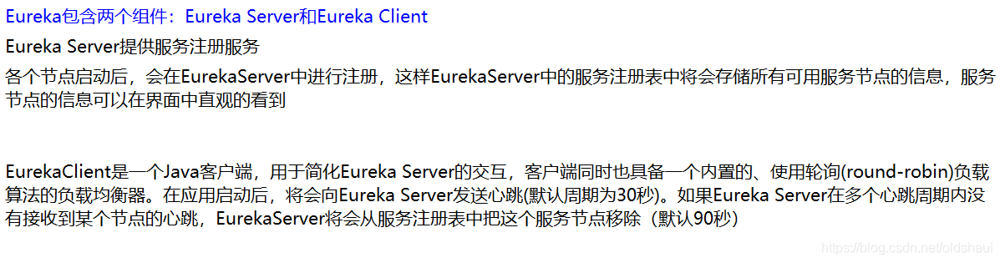

# Spring Cloud

## 微服务


## 微服务与微服务架构


## 微服务的优缺点


## Spring Cloud

 Spring cloud 流应用程序启动器是基于 Spring Boot 的 Spring 集成应用程序，提供与外部系统的集成。 Spring cloud Task，一个生命周期短暂的微服务框架，用于快速构建执行有限数据处理的应用程序。 

##  用 Spring Cloud 有什么优势 

 使用 Spring Boot 开发分布式微服务时，我们面临以下问题  

*  与分布式系统相关的复杂性-这种开销包括网络问题，延迟开销，带宽问题，安全问题。 
*  服务发现-服务发现工具管理群集中的流程和服务如何查找和互相交谈。它涉及一个服务目录，在该 目录中注册服务，然后能够查找并连接到该目录中的服务。 
*  冗余-分布式系统中的冗余问题。 
*  负载平衡 --负载平衡改善跨多个计算资源的工作负荷，诸如计算机，计算机集群，网络链路，中央 处理单元，或磁盘驱动器的分布。  
*  性能-问题 由于各种运营开销导致的性能问题。 
*  部署复杂性-Devops 技能的要求 

##  Spring Cloud 如何实现 服务注册和发现 

 当我们开始一个项目时，我们通常在属性文件中进行所有的配置。随着越来越多的服务开发和部署，添加 和修改这些属性变得更加复杂。有些服务可能会下降，而某些位置可能会发生变化。手动更改属性可能会 产生问题。  

 Eureka 服务注册和发现可以在这种情况下提供帮助。由于所有服务都在 Eureka 服务器上注 册并通过调用 Eureka 服务器完成查找，因此无需处理服务地点的任何更改和处理。  

##  负载平衡的意义 

 在计算中，负载平衡可以改善跨计算机，计算机集群，网络链接，中央处理单元或磁盘驱动器等多种计算 资源的工作负载分布。负载平衡旨在优化资源使用，最大化吞吐量，最小化响应时间并避免任何单一资源 的过载。使用多个组件进行负载平衡而不是单个组件可能会通过冗余来提高可靠性和可用性。负载平衡通 常涉及专用软件或硬件，例如多层交换机或域名系统服务器进程。  

 什么是 Hystrix？它如何实现容错？ 

 Hystrix 是一个延迟和容错库，旨在隔离远程系统，服务和第三方库的访问点，当出现故障是不可避免的 故障时，停止级联故障并在复杂的分布式系统中实现弹性。  

 通常对于使用微服务架构开发的系统，涉及到许多微服务。这些微服务彼此协作。 

## Spring Cloud 组件

### Eureka的服务注册与发现

#### Eureka


#### Eureka原理


#### 

#### 自我保护模式


#### 集群配置

#### 和zookeeper的对比


### Ribbon负载均衡

#### Ribbon


#### 负载均衡策略

 AbstractLoadBalancerRule：负载均衡策略的抽象类，在该抽象类中定义了负载均衡器`ILoadBalancer`对象，该对象能够在具体实现选择服务策略时，获取到一些负载均衡器中维护的信息来作为分配依据，并以此设计一些算法来实现针对特定场景的高效策略。 

#####  **RandomRule**

随机策略，从服务实例清单中随机选择一个服务实例。获得可用实例列表`upList`和所有实例列表`allList`，并通过`rand.nextInt(serverCount)`函数来获取一个随机数，并将该随机数作为upList的索引值来返回具体实例。 

#####  **RoundRobinRule** 

轮询策略，按照线性轮询的方式依次选择每个服务实例。通过`AtomicInteger nextServerCyclicCounter`对象实现，每次进行实例选择时通过调用`incrementAndGetModulo`函数实现递增。 

#####  **RetryRule**

重试策略，具备重试机制的实例选择。内部定义了`RoundRobinRule，并实现了对RoundRobinRule进行反复尝试的策略，若期间能够选择到具体的服务实例就返回，若选择不到就根据设置的尝试结束时间为阈值，当超过该阈值后就返回null。` 

#####  **WeightedResponseTimeRule**

权重策略，根据实例的运行情况来计算权重，并根据权重来挑选实例，以达到更优的分配效果。通过定时任务为每个服务进行权重计算，平均响应时间小的权重区间（总平均响应时间-实例平均响应时间）就大，实例选择根据权重范围随机选择，落在哪个区间则选择哪个实例。 

#####  **BestAvailableRule**

最佳策略，通过遍历负载均衡器中维护的所有服务实例，会过滤掉故障的实例，并找出并发请求数最小的一个，选出最空闲的实例。 

#####  **AvailabilityFilteringRule**

可用过滤策略：先过滤出故障的或并发请求大于阈值一部分服务实例，然后再以线性轮询的方式从过滤后的实例清单中选出一个。 

#####  **ZoneAvoidanceRule**

区域感知策略：使用主过滤条件（区域负载器，选择最优区域）对所有实例过滤并返回过滤后的实例清单，依次使用次过滤条件列表中的过滤条件对主过滤条件的结果进行过滤，判断最小过滤数（默认1）和最小过滤百分比（默认0），满足条件则使用RoundRobinRule选择实例。 

### Feign

Feign


### hystrix

####  服务雪崩 


#### hystrix


####  服务熔断 


####  服务的降级 

整体资源快不够用了，忍痛将某些服务先关掉，待度过难关，再回来开启。

### zuul路由网关


###  SpringCloud config 

####  分布式的配置问题 


#### Sping Cloud Config


# SpringBoot

Spring Boot 是 Spring 开源组织下的子项目，是 Spring 组件一站式解决方案，主要是简化了使用 Spring 的难度，简省了繁重xml的配置，提供了各种启动器，在运行过程中自定配置, 开发者能快速上手。

## SpringBoot优点

 1、自动配置(auto-configuration) 

 通过扫描 Starter 包的 META-INF 目录下 spring.factories 文件，实现加载自动化配置类。

 2、Starter 组件集成 
`独立运行 简化配置 自动配置 无代码生成和XML配置 无需部署war文件` 

## Spring Boot 的核心配置文件

 Spring Boot 的核心配置文件是 `application 和 bootstrap` 配置文件。 

 application 配置文件这个容易理解，主要用于 Spring Boot 项目的自动化配置。 

 bootstrap 配置文件有以下几个应用场景。 

1. 使用SpringCloudConfig配置中心时，这时需要在 bootstrap 配置文件中添加连接到配置中心的配置属性来加载外部配置中心的配置信息；
2. 一些固定的不能被覆盖的属性；
3. 一些加密/解密的场景；

## Spring Boot 的配置文件格式

 `.properties 和 .yml`，它们的区别主要是书写格式不同。 

 1).properties 

```properties
app.user.name = javastack
```

 2).yml 

```yaml
app:
 user:
    name: javastack
```

## SpringBoot的核心注解

 启动类上面的注解是@SpringBootApplication，它也是 Spring Boot 的核心注解，主要组合包含了以下 3 个注解： 

 @Configuration：组合了 @Configuration 注解，实现配置文件的功能。 

 @EnableAutoConfiguration：打开自动配置的功能，也可以关闭某个自动配置的选项，如关闭数据源自动配置功能：@SpringBootApplication(exclude = { DataSourceAutoConfiguration.class })。 

 @ComponentScan：Spring组件扫描。 

## Spring Boot 启动原理

### 启动类

```
1 @SpringBootApplication
2 public class Application {
3     public static void main(String[] args) {
4         SpringApplication.run(Application.class, args);
5     }
6 }
```

### @SpringBootApplication注解

SpringBootApplication注解有3个关键注解组成

####  1、@Configuration 

 @Configuration对我们来说不陌生，它就是JavaConfig形式的Spring Ioc容器的配置类使用的那个@Configuration，SpringBoot社区推荐使用基于JavaConfig的配置形式，所以，这里的启动类标注了@Configuration之后，本身其实也是一个IoC容器的配置类。 

 @Configuration的注解类标识一个类可以使用Spring IoC容器作为bean定义的来源。 

 @Bean注解告诉Spring，一个带有@Bean的注解方法将返回一个对象，该对象应该被注册为在Spring应用程序上下文中的bean。 

#### 2、@ComponentScan 

 @ComponentScan这个注解在Spring中很重要，它对应XML配置中的元素，@ComponentScan的功能其实就是自动扫描并加载符合条件的组件（比如@Component和@Repository等）或者bean定义，最终将这些bean定义加载到IoC容器中。 

 我们可以通过basePackages等属性来细粒度的定制@ComponentScan自动扫描的范围，如果不指定，则默认Spring框架实现会从声明@ComponentScan所在类的package进行扫描。 

 **注**：所以SpringBoot的启动类最好是放在root package下，因为默认不指定basePackages。 

####  3、@EnableAutoConfiguration 

 @EnableAutoConfiguration这个Annotation最为重要， Spring框架提供的各种名字为@Enable开头的Annotation定义，比如@EnableScheduling、@EnableCaching、@EnableMBeanExport等 ， EnableAutoConfiguration的理念和做事方式其实一脉相承，简单概括一下就是，**借助@Import的支持，收集和注册特定场景相关的bean定义 将所有符合自动配置条件的bean定义加载到IoC容器 。** 

 @EnableAutoConfiguration会根据类路径中的jar依赖为项目进行自动配置，如：添加了spring-boot-starter-web依赖，会自动添加Tomcat和Spring MVC的依赖，Spring Boot会对Tomcat和Spring MVC进行自动配置。 

 @EnableAutoConfiguration作为一个复合Annotation，其自身定义关键信息如下： 

```
 1 @SuppressWarnings("deprecation")
 2 @Target(ElementType.TYPE)
 3 @Retention(RetentionPolicy.RUNTIME)
 4 @Documented
 5 @Inherited
 6 @AutoConfigurationPackage
 7 @Import(EnableAutoConfigurationImportSelector.class)
 8 public @interface EnableAutoConfiguration {
 9     ...
10 }
```

 其中，最关键的要属@Import(EnableAutoConfigurationImportSelector.class)，借助EnableAutoConfigurationImportSelector，@EnableAutoConfiguration可以帮助SpringBoot应用将所有符合条件的@Configuration配置都加载到当前SpringBoot创建并使用的IoC容器。就像一只“八爪鱼”一样，借助于Spring框架原有的一个工具类：SpringFactoriesLoader的支持，@EnableAutoConfiguration可以智能的自动配置功效才得以大功告成！ 

##### **SpringFactoriesLoader详解** 

 SpringFactoriesLoader属于Spring框架私有的一种扩展方案，其主要功能就是从指定的配置文件META-INF/spring.factories加载配置。 

 配合@EnableAutoConfiguration使用的话，它更多是提供一种配置查找的功能支持，即根据@EnableAutoConfiguration的完整类名org.springframework.boot.autoconfigure.EnableAutoConfiguration作为查找的Key，获取对应的一组@Configuration类。 

 上图就是从SpringBoot的autoconfigure依赖包中的META-INF/spring.factories配置文件中摘录的一段内容，可以很好地说明问题。 

 所以，@EnableAutoConfiguration自动配置的魔法骑士就变成了：**从classpath中搜寻所有的META-INF/spring.factories配置文件，并将其中org.springframework.boot.autoconfigure.EnableutoConfiguration对应的配置项通过反射（Java Refletion）实例化为对应的标注了@Configuration的JavaConfig形式的IoC容器配置类，然后汇总为一个并加载到IoC容器。** 

### SpringApplication.run()

 SpringApplication的run方法的实现是我们本次旅程的主要线路，该方法的主要流程大体可以归纳如下： 

 1） 如果我们使用的是SpringApplication的静态run方法，那么，这个方法里面首先要创建一个SpringApplication对象实例，然后调用这个创建好的SpringApplication的实例方法。在SpringApplication实例初始化的时候，它会提前做几件事情： 

- 根据classpath里面是否存在某个特征类（org.springframework.web.context.ConfigurableWebApplicationContext）来决定是否应该创建一个为Web应用使用的ApplicationContext类型。
- 使用SpringFactoriesLoader在应用的classpath中查找并加载所有可用的ApplicationContextInitializer。
- 使用SpringFactoriesLoader在应用的classpath中查找并加载所有可用的ApplicationListener。
- 推断并设置main方法的定义类。

 2） SpringApplication实例初始化完成并且完成设置后，就开始执行run方法的逻辑了，方法执行伊始，首先遍历执行所有通过SpringFactoriesLoader可以查找到并加载的SpringApplicationRunListener。调用它们的started()方法，告诉这些SpringApplicationRunListener，“嘿，SpringBoot应用要开始执行咯！”。 

 3） 创建并配置当前Spring Boot应用将要使用的Environment（包括配置要使用的PropertySource以及Profile）。 

 4） 遍历调用所有SpringApplicationRunListener的environmentPrepared()的方法，告诉他们：“当前SpringBoot应用使用的Environment准备好了咯！”。 

 5） 如果SpringApplication的showBanner属性被设置为true，则打印banner。 

 6） 根据用户是否明确设置了applicationContextClass类型以及初始化阶段的推断结果，决定该为当前SpringBoot应用创建什么类型的ApplicationContext并创建完成，然后根据条件决定是否添加ShutdownHook，决定是否使用自定义的BeanNameGenerator，决定是否使用自定义的ResourceLoader，当然，最重要的，将之前准备好的Environment设置给创建好的ApplicationContext使用。 

 7） ApplicationContext创建好之后，SpringApplication会再次借助Spring-FactoriesLoader，查找并加载classpath中所有可用的ApplicationContext-Initializer，然后遍历调用这些ApplicationContextInitializer的initialize（applicationContext）方法来对已经创建好的ApplicationContext进行进一步的处理。 

 8） 遍历调用所有SpringApplicationRunListener的contextPrepared()方法。 

 9） 最核心的一步，将之前通过@EnableAutoConfiguration获取的所有配置以及其他形式的IoC容器配置加载到已经准备完毕的ApplicationContext。 

 10） 遍历调用所有SpringApplicationRunListener的contextLoaded()方法。 

 11） 调用ApplicationContext的refresh()方法，完成IoC容器可用的最后一道工序。 

 12） 查找当前ApplicationContext中是否注册有CommandLineRunner，如果有，则遍历执行它们。 

 13） 正常情况下，遍历执行SpringApplicationRunListener的finished()方法、（如果整个过程出现异常，则依然调用所有SpringApplicationRunListener的finished()方法，只不过这种情况下会将异常信息一并传入处理） 

## 自定义SpringBoot Starter

### 1、引入 SpringBoot 自动化配置依赖

```xml
<?xml version="1.0" encoding="UTF-8"?>
<project xmlns="http://maven.apache.org/POM/4.0.0"
         xmlns:xsi="http://www.w3.org/2001/XMLSchema-instance"
         xsi:schemaLocation="http://maven.apache.org/POM/4.0.0 http://maven.apache.org/xsd/maven-4.0.0.xsd">
    <modelVersion>4.0.0</modelVersion>

    <groupId>org.learn</groupId>
    <artifactId>spring-boot-starter-helloworld</artifactId>
    <version>1.0-SNAPSHOT</version>
    <packaging>jar</packaging>
    
    <dependencyManagement>
        <dependencies>
            <dependency>
                <groupId>org.springframework.boot</groupId>
                <artifactId>spring-boot-autoconfigure</artifactId>
                <version>2.0.3.RELEASE</version>
            </dependency>
        </dependencies>
    </dependencyManagement>

    <dependencies>
        <dependency>
            <groupId>org.springframework.boot</groupId>
            <artifactId>spring-boot-autoconfigure</artifactId>
        </dependency>
    </dependencies>
</project>
```

### 2、创建配置属性类

1、ConfigurationProperties 为配置属性类，application.properties 文件配置的所有属性都是通过它来读取的
2、prefix = “helloworld” 代表该属性对象在 application.properties 中的前缀，
3、在配置文件中 helloworld.name=springboot，就可以改变 name 的值。 

```java
@ConfigurationProperties(prefix = "helloworld")
public class HelloworldProperties {
    private String name;

    public String getName() {
        return name;
    }

    public void setName(String name) {
        this.name = name;
    }
}
```

 接下来我们就可以通过 @Autowired 进行注入并使用了。 

### 3、创建 Starter 包的服务类

```
public class HelloworldService {
    private String name;

    public String getName() {
        return name;
    }

    public void setName(String name) {
        this.name = name;
    }

    public String sayHello() {
        return "hello," + name;
    }
}

```

### 4、创建自动配置类

```java
@Configuration
/// 当 HelloworldService 在类路径的条件下
@ConditionalOnClass({HelloworldService.class})
/// 将 application.properties 文件配置的属性进行映射
@EnableConfigurationProperties(HelloworldProperties.class)
public class HelloworldAutoConfiguration {
    @Autowired
    private HelloworldProperties hellowordProperties;

    @Bean
    /// 当容器不存在 HelloworldService 类的时候进行创建
    @ConditionalOnMissingBean(HelloworldService.class)
    public HelloworldService helloworldService() {
        HelloworldService helloworldService = new HelloworldService();
        helloworldService.setName(hellowordProperties.getName());
        return helloworldService;
    }
}
```

### 5、配置 spring.factories

 在 META-INF 目录下创建 spring.factories 文件， SpringBoot 通过扫描 META-INF/spring.factories 文件来加载项目的自动化配置类。 

```properties
org.springframework.boot.autoconfigure.EnableAutoConfiguration=org.learn.HelloworldAutoConfiguration 
```

 执行 mvn install 将应用打包只本地工程，接下来我们创建一个新工程测试我们的 Starter。 

### 测试 Starter

####  1、配置 pom 文件 

```xml
<?xml version="1.0" encoding="UTF-8"?>
<project xmlns="http://maven.apache.org/POM/4.0.0"
         xmlns:xsi="http://www.w3.org/2001/XMLSchema-instance"
         xsi:schemaLocation="http://maven.apache.org/POM/4.0.0 http://maven.apache.org/xsd/maven-4.0.0.xsd">
    <modelVersion>4.0.0</modelVersion>

    <groupId>org.learn</groupId>
    <artifactId>springboot-demo</artifactId>
    <version>1.0-SNAPSHOT</version>

    <properties>
        <maven.compiler.target>1.8</maven.compiler.target>
        <maven.compiler.source>1.8</maven.compiler.source>
    </properties>

    <parent>
        <groupId>org.springframework.boot</groupId>
        <artifactId>spring-boot-starter-parent</artifactId>
        <version>1.4.7.RELEASE</version>
        <relativePath/>
    </parent>

    <dependencyManagement>
        <dependencies>
            <dependency>
                <groupId>org.learn</groupId>
                <artifactId>spring-boot-starter-helloworld</artifactId>
                <version>1.0-SNAPSHOT</version>
            </dependency>
            <dependency>
                <groupId>org.springframework.boot</groupId>
                <artifactId>spring-boot-starter-web</artifactId>
                <version>1.5.14.RELEASE</version>
                <scope>compile</scope>
            </dependency>
        </dependencies>
    </dependencyManagement>

    <dependencies>
        <dependency>
            <groupId>org.learn</groupId>
            <artifactId>spring-boot-starter-helloworld</artifactId>
        </dependency>
        <dependency>
            <groupId>org.springframework.boot</groupId>
            <artifactId>spring-boot-starter-web</artifactId>
        </dependency>
    </dependencies>
</project>
```

####  2、配置 application.properties 文件 

```properties
helloworld.name = springboot
```

####  3、编写启动类 

```
ackage org.learn;

import org.springframework.beans.factory.annotation.Autowired;
import org.springframework.boot.SpringApplication;
import org.springframework.boot.autoconfigure.SpringBootApplication;
import org.springframework.web.bind.annotation.GetMapping;
import org.springframework.web.bind.annotation.RestController;

/**
 * @author zhibo
 * @date 2019/5/15 17:28
 */

@RestController
@SpringBootApplication
public class HelloworldApplication {
    @Autowired
    private HelloworldService helloworldService;

    @GetMapping("/")
    public String sayHello() {
        return helloworldService.sayHello();
    }

    public static void main(String[] args) {
        SpringApplication.run(HelloworldApplication.class, args);
    }
}
```

####  4、启动工程

通过 main 方法启动工程，在浏览器地址栏中输入`http://localhost:8080/`，显示结果如下图所示： 

##  **开启 Spring Boot 特性有2方式** 

1. 继承spring-boot-starter-parent项目
2. 导入spring-boot-dependencies项目依赖 

##  **Spring Boot实现异常处理** 

Spring提供了一种使用ControllerAdvice处理异常的非常有用的方法。 我们通过实现一个ControlerAdvice类，来处理控制器类抛出的所有异常。

##  RequestMapping 和 GetMapping 的不同之处

RequestMapping 具有类属性的，可以进行 GET,POST,PUT 或者其它的注释中具有的请求方法。
 GetMapping 是 GET 请求方法中的一个特例。它只是 ResquestMapping 的一个延伸，目的是为了提高清晰度。

## **spring-boot-maven-plugin**

spring-boot-maven-plugin 提供了一些像 jar 一样打包或者运行应用程序的命令。

- spring-boot:run 运行你的 SpringBooty 应用程序。
- spring-boot：repackage 重新打包你的 jar 包或者是 war 包使其可执行
- spring-boot：start 和 spring-boot：stop 管理 Spring Boot 应用程序的生命周期（也可以说是为了集成测试）。
- spring-boot:build-info 生成执行器可以使用的构造信息。