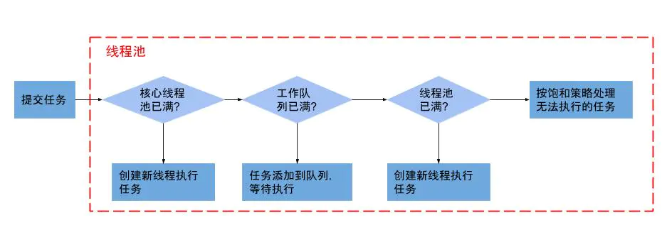
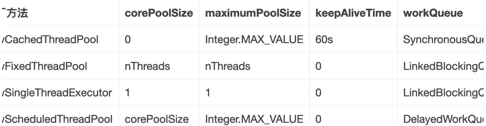

# 线程池

## 线程池的优势

（1）、降低系统资源消耗，通过重用已存在的线程，降低线程创建和销毁造成的消耗；

（2）、提高系统响应速度，当有任务到达时，通过复用已存在的线程，无需等待新线程的创建便能立即执行；

（3）、方便线程并发数的管控。因为线程若是无限制的创建，可能会导致内存占用过多而产生OOM，并且会造成cpu过度切换（cpu切换线程是有时间成本的（需要保持当前执行线程的现场，并恢复要执行线程的现场））。

（4）、提供更强大的功能，延时定时线程池。

## 线程池的主要参数

```
public ThreadPoolExecutor(int corePoolSize, int maximumPoolSize, long keepAliveTime, TimeUnit unit, BlockingQueue<Runnable> workQueue) {
    this(corePoolSize, maximumPoolSize, keepAliveTime, unit, workQueue,
         Executors.defaultThreadFactory(), defaultHandler);
}
```

1、corePoolSize（线程池基本大小）：当向线程池提交一个任务时，若线程池已创建的线程数小于corePoolSize，即便此时存在空闲线程，也会通过创建一个新线程来执行该任务，直到已创建的线程数大于或等于corePoolSize时，（除了利用提交新任务来创建和启动线程（按需构造），也可以通过 prestartCoreThread() 或 prestartAllCoreThreads() 方法来提前启动线程池中的基本线程。）


2、maximumPoolSize（线程池最大大小）：线程池所允许的最大线程个数。当队列满了，且已创建的线程数小于maximumPoolSize，则线程池会创建新的线程来执行任务。另外，对于无界队列，可忽略该参数。


 3、keepAliveTime（线程存活保持时间）当线程池中线程数大于核心线程数时，线程的空闲时间如果超过线程存活时间，那么这个线程就会被销毁，直到线程池中的线程数小于等于核心线程数。 


 4、workQueue（任务队列）：用于传输和保存等待执行任务的阻塞队列。

 

5、threadFactory（线程工厂）：用于创建新线程。threadFactory创建的线程也是采用new Thread()方式，threadFactory创建的线程名都具有统一的风格：pool-m-thread-n（m为线程池的编号，n为线程池内的线程编号）。


 6、handler（线程饱和策略）：当线程池和队列都满了，再加入线程会执行此策略。 

## 线程池流程



 1、判断核心线程池是否已满，没满则创建一个新的工作线程来执行任务。已满则。

 2、判断任务队列是否已满，没满则将新提交的任务添加在工作队列，已满则。

 3、判断整个线程池是否已满，没满则创建一个新的工作线程来执行任务，已满则执行饱和策略。


## 线程池的等待队列

在使用ThreadPoolExecutor线程池的时候，需要指定一个实现了BlockingQueue接口的任务等待队列。在ThreadPoolExecutor线程池的API文档中，一共推荐了三种等待队列，它们是：SynchronousQueue、LinkedBlockingQueue和ArrayBlockingQueue；

### 有限队列

#### SynchronousQueue

是这样 一种阻塞队列，其中每个 put 必须等待一个 take，反之亦然。同步队列没有任何内部容量。翻译一下：这是一个内部没有任何容量的阻塞队列，任何一次插入操作的元素都要等待相对的删除/读取操作，否则进行插入操作的线程就要一直等待，反之亦然。

#### ArrayBlockingQueue

一个由数组支持的有界阻塞队列。此队列按 FIFO（先进先出）原则对元素进行排序。新元素插入到队列的尾部，队列获取操作则是从队列头部开始获得元素。这是一个典型的“有界缓存区”，固定大小的数组在其中保持生产者插入的元素和使用者提取的元素。一旦创建了这样的缓存区，就不能再增加其容量。试图向已满队列中放入元素会导致操作受阻塞；试图从空队列中提取元素将导致类似阻塞。

### 无限队列

#### LinkedBlockingQueue

LinkedBlockingQueue是我们在ThreadPoolExecutor线程池中常用的等待队列。它可以指定容量也可以不指定容量。由于它具有“无限容量”的特性，所以我还是将它归入了无限队列的范畴（实际上任何无限容量的队列/栈都是有容量的，这个容量就是Integer.MAX_VALUE）。 
LinkedBlockingQueue的实现是基于链表结构，而不是类似ArrayBlockingQueue那样的数组。但实际使用过程中，不需要关心它的内部实现，如果指定了LinkedBlockingQueue的容量大小，那么它反映出来的使用特性就和ArrayBlockingQueue类似了。

### 线程池为什么需要使用（阻塞）队列？

回到了非线程池缺点中的第3点：
 1、因为线程若是无限制的创建，可能会导致内存占用过多而产生OOM，并且会造成cpu过度切换。

另外回到了非线程池缺点中的第1点：

 2、创建线程池的消耗较高。
 或者下面这个网上并不高明的回答：

 2、线程池创建线程需要获取mainlock这个全局锁，影响并发效率，阻塞队列可以很好的缓冲。

#### 线程池为什么要使用阻塞队列而不使用非阻塞队列？

阻塞队列可以保证任务队列中没有任务时阻塞获取任务的线程，使得线程进入wait状态，释放cpu资源。
 当队列中有任务时才唤醒对应线程从队列中取出消息进行执行。
 使得在线程不至于一直占用cpu资源。

（线程执行完任务后通过循环再次从任务队列中取出任务进行执行，代码片段如下
 while (task != null || (task = getTask()) != null) {}）。

## java中提供的线程池

Executors类（不推荐使用）提供了4种不同的线程池：newCachedThreadPool, newFixedThreadPool, newScheduledThreadPool, newSingleThreadExecutor



1、newCachedThreadPool：用来创建一个可以无限扩大的线程池，适用于负载较轻的场景，执行短期异步任务。（可以使得任务快速得到执行，因为任务时间执行短，可以很快结束，也不会造成cpu过度切换）


2、newFixedThreadPool：创建一个固定大小的线程池，因为采用无界的阻塞队列，所以实际线程数量永远不会变化，适用于负载较重的场景，对当前线程数量进行限制。（保证线程数可控，不会造成线程过多，导致系统负载更为严重）


3、newSingleThreadExecutor：创建一个单线程的线程池，适用于需要保证顺序执行各个任务。


4、newScheduledThreadPool：适用于执行延时或者周期性任务。

## execute()和submit()方法

1、execute()，执行一个任务，没有返回值。

 2、submit()，提交一个线程任务，有返回值。

 submit(Callable<T> task)能获取到它的返回值，通过future.get()获取（阻塞直到任务执行完）。一般使用FutureTask+Callable配合使用（IntentService中有体现）。


submit(Runnable task, T result)能通过传入的载体result间接获得线程的返回值。

 submit(Runnable task)则是没有返回值的，就算获取它的返回值也是null。


Future.get方法会使取结果的线程进入阻塞状态，知道线程执行完成之后，唤醒取结果的线程，然后返回结果。

##  handler的拒绝策略 

第一种AbortPolicy:不执行新任务，直接抛出异常，提示线程池已满


第二种DisCardPolicy:不执行新任务，也不抛出异常


第三种DisCardOldestPolicy:将消息队列中的第一个任务替换为当前新进来的任务执行


第四种CallerRunsPolicy:直接调用execute来执行当前任务


> **注意**：推荐实现自己的拒绝策略 **RejectedExecutionHandler**

## **线程池状态**

- RUNNING ：能接受新提交的任务，并且也能处理阻塞队列中的任务。
- SHUTDOWN：关闭状态，不再接受新提交的任务，但却可以继续处理阻塞队列中已保存的任务。在线程池处于 RUNNING 状态时，调用 shutdown() 方法会使线程池进入到该状态。（finalize() 方法在执行过程中也会调用 shutdown() 方法进入该状态）。
- STOP：不能接受新任务，也不处理队列中的任务，会中断正在处理任务的线程。在线程池处于 RUNNING 或 SHUTDOWN 状态时，调用 shutdownNow() 方法会使线程池进入到该状态。
- TIDYING：如果所有的任务都已终止了，workerCount (有效线程数) 为0，线程池进入该状态后会调用 terminated() 方法进入 TERMINATED 状态。
- TERMINATED：在 terminated() 方法执行完后进入该状态，默认 terminated() 方法中什么也没有做。

## 合理使用线程池

### 如何设置合理的线程数

**任务一般分为：CPU密集型、IO密集型、混合型，对于不同类型的任务需要分配不同大小的线程池**

- CPU密集型：尽量使用较小的线程池，一般Cpu核心数+1；因为CPU密集型任务CPU的使用率很高，若开过多的线程，只能增加线程上下文的切换次数，带来额外的开销
- IO密集型：方法一：可以使用较大的线程池，一般CPU核心数 * 2；IO密集型CPU使用率不高，可以让CPU等待IO的时候处理别的任务，充分利用cpu时间；方法二：线程等待时间所占比例越高，需要越多线程。线程CPU时间所占比例越高，需要越少线程。举个例子：比如平均每个线程CPU运行时间为0.5s，而线程等待时间（非CPU运行时间，比如IO）为1.5s，CPU核心数为8，那么根据上面这个公式估算得到：((0.5+1.5)/0.5)*8=32。这个公式进一步转化为：
  **最佳线程数目 = （线程等待时间与线程CPU时间之比 + 1）\* CPU数目**

### 如何设置合理的队列大小

**时间空间的限制**

- 基于空间 ：比如队列可以占用10M内存，每个请求大小10K ，那么**workQueue**队列长度为1000合适
- 基于时间 ：对于单个线程，如果请求超时时间为1s，单个请求平均处理时间10ms，那么队列长度为100合适

### **不成文强制规定**

1、线程池不允许使用Executors去创建，而是通过ThreadPoolExecutor的方式，这样的处理方式让写的同学更明确线程池的运行规则，规避资源耗尽的风险。
说明：Executors返回的线程池对象弊端如下：

- FixedThreadPool和SingleThreadPool：允许的请求队列长度为Integer.MAX_VALUE，可能会堆积大量的请求，从而导致OOM。
- CacheThreadPool和ScheduledThreadPool：允许创建线程数量为Integer.MAX_VALUE，可能会创建大量线程，从而导致OOM。

2、给线程起个名字

线上不出bug，随便起啥名字你都无所谓，但如果产生bug了，大量的日志中，合理的线程名对于问题的定位还是很有帮助的。

3、重视线程中抛出的异常

为啥要重视，看个例子：

```java
package com.thread.test;
 
import java.util.concurrent.ExecutorService;
import java.util.concurrent.Executors;
 
public class LostThreadException  implements Runnable{
    @Override
    public void run() {
        throw new RuntimeException();
    }
    //现象：控制台打印出异常信息，并运行一段时间后才停止
    public static void main(String[] args){
        //就算把线程的执行语句放到try-catch块中也无济于事
        try{
            System.out.println("Begin executor.....!");
            ExecutorService exec = Executors.newCachedThreadPool();
            exec.execute(new LostThreadException());
            System.out.println("Finish executor.....!");
        }catch(RuntimeException e){
            System.out.println("Exception happened!");
        }
    }
}
```

运行结果：

```java
Begin executor.....!
Exception in thread "pool-1-thread-1" java.lang.RuntimeException
	at com.thread.test.LostThreadException.run(LostThreadException.java:14)
	at java.util.concurrent.ThreadPoolExecutor.runWorker(ThreadPoolExecutor.java:1149)
	at java.util.concurrent.ThreadPoolExecutor$Worker.run(ThreadPoolExecutor.java:624)
	at java.lang.Thread.run(Thread.java:748)
Finish executor.....!
```

我们发现System.out.println("Exception happened!");并没有打印出来，即：**异常在main线程中没有catch到**；这就是你为什么要自己主动去处理线程中抛出的异常；开个玩笑，如果你在生产中产生了上述的现象，唯一的线索是："pool-1-thread-1“，这是线程名，自动生成的名称，是不是很崩溃，如果你有良好的习惯，按照2中所说，自定义线程名，最起码你知道这个异常是哪个类型的线程池中的线程抛出来的，否则只能望洋兴叹，愁眉苦脸～

## 参考

https://www.jianshu.com/p/7726c70cdc40

https://blog.csdn.net/zhengchao1991/article/details/84927774

https://blog.csdn.net/u014634309/article/details/107012160

https://blog.csdn.net/lipc_/article/details/52025993

