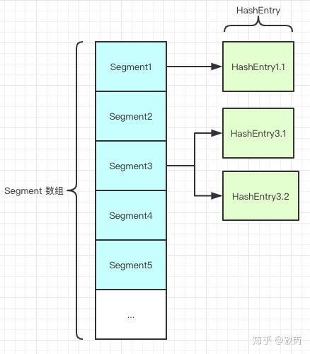

# 多线程与并发

## 一、进程与线程

**进程**：是代码在数据集合上的一次运行活动，是系统进行资源分配和调度的基本单位。

**线程**：是进程的一个执行路径，一个进程中至少有一个线程，进程中的多个线程共享进程的 资源。

 虽然系统是把资源分给进程，但是CPU很特殊，是被分配到线程的，所以线程是CPU分配的基本单位。 


二者关系：

一个进程中有多个线程，多个线程共享进程的堆和方法区资源，但是每个线程有自己的程序计数器和栈区域。

  **程序计数器**：是一块内存区域，用来记录线程当前要执行的指令地址 。 

 **栈**：用于存储该线程的局部变量，这些局部变量是该线程私有的，除此之外还用来存放线程的调用栈祯。 

 **堆**：是一个进程中最大的一块内存，堆是被进程中的所有线程共享的。 

 **方法区**：则用来存放 NM 加载的类、常量及静态变量等信息，也是线程共享的 。 

二者区别：

**进程**：有独立的地址空间，一个进程崩溃后，在保护模式下不会对其它进程产生影响。

**线程**：是一个进程中的不同执行路径。线程有自己的堆栈和局部变量，但线程之间没有单独的地址空间，一个线程死掉就等于整个进程死掉。


1) 简而言之,一个程序至少有一个进程,一个进程至少有一个线程.

2) 线程的划分尺度小于进程，使得多线程程序的并发性高。

3) 另外，进程在执行过程中拥有独立的内存单元，而多个线程共享内存，从而极大地提高了程序的运行效率。

4) 每个独立的线程有一个程序运行的入口、顺序执行序列和程序的出口。但是线程不能够独立执行，必须依存在应用程序中，由应用程序提供多个线程执行控制。

5) 从逻辑角度来看，多线程的意义在于一个应用程序中，有多个执行部分可以同时执行。但操作系统并没有将多个线程看做多个独立的应用，来实现进程的调度和管理以及资源分配。这就是进程和线程的重要区别

## 二、并发与并行

### **并发**：

是指同一个时间段内多个任务同时都在执行，并且都没有执行结束。并发任务强调在一个时间段内同时执行，而一个时间段由多个单位时间累积而成，所以说并发的多个任务在单位时间内不一定同时在执行 。

### **并行**：

是说在单位时间内多个任务同时在执行 。

在多线程编程实践中，线程的个数往往多于CPU的个数，所以一般都称多线程并发编程而不是多线程并行编程。

###  **并发过程中常见的问题：** 

####  1、线程安全问题： 


 多个线程同时操作共享变量1时，会出现线程1更新共享变量1的值，但是其他线程获取到的是共享变量没有被更新之前的值。就会导致数据不准确问题。 

####  2、共享内存不可见性问题 


 Java 内存模型规定，将所有的变量都存放在主内存中，当线程使用变量时，会把主内存里面的变量复制到自己的工作空间或者叫作工作内存，线程读写变量时操作的是自己工作内存中的变量 。（如上图所示） 

 上图中所示是一个双核 CPU 系统架构，每个核有自己的控制器和运算器，其中控制器包含一组寄存器和操作控制器，运算器执行算术逻辅运算。CPU的每个核都有自己的一级缓存，在有些架构里面还有一个所有CPU都共享的二级缓存。 那么Java内存模型里面的工作内存，就对应这里的 Ll或者 L2 缓存或者 CPU 的寄存器 

 1、线程A首先获取共享变量X的值，由于两级Cache都没有命中，所以加载主内存中X的值，假如为0。然后把X=0的值缓存到两级缓存，线程A修改X的值为1,然后将其写入两级Cache，并且刷新到主内存。线程A操作完毕后，线程A所在的CPU的两级Cache内和主内存里面的X的值都是l。 

 2、线程B获取X的值，首先一级缓存没有命中，然后看二级缓存，二级缓存命中了，所以返回X=1；到这里一切都是正常的，因为这时候主内存中也是X=l。然后线程B修改X的值为2，并将其存放到线程2所在的一级Cache和共享二级Cache中，最后更新主内存中X的值为2，到这里一切都是好的。 

 3、线程A这次又需要修改X的值，获取时一级缓存命中，并且X=l这里问题就出现了，明明线程B已经把X的值修改为2，为何线程A获取的还是l呢？这就是共享变量的内存不可见问题，也就是线程B写入的值对线程A不可见。 

### synchronized 关键字

#### synchronized 的内存语义

 这个内存语义就可以解决共享变量内存可见性问题。进入synchronized块的内存语义是把在synchronized块内使用到的变量从线程的工作内存中清除，这样在synchronized块内使用到该变量时就不会从线程的工作内存中获取，而是直接从主内存中获取。退出synchronized块的内存语义是把在synchronized块内对共享变量的修改刷新到主内存。会造成上下文切换的开销，独占锁，降低并发性 

#### synchronized 特性

##### synchronized锁对象

1. 对象锁 锁对象 synchronized(this) ; public synchronized void test(){}
2. 类锁 锁class对象 synchronized(xxx.class); public synchronized static void test(){}
3. 私有锁 锁lock对象 synchronized(lock)

> 注意

##### synchronized 可重入概念

##### synchronized 异常会释放锁

#### synchronized 底层实现

JDK早期，重量级，后来改进锁升级。

###### 锁升级

JVM 使用了锁升级的优化方式，就是先使用**偏向锁**优先同一线程然后再次获取锁，如果失败，就升级为 **CAS 轻量级锁**，如果失败就会短暂**自旋**，防止线程被系统挂起。最后如果以上都失败就升级为**重量级锁**。

例如：sync(object)

- markword 记录这个线程ID 偏向锁
- 如果有线程征用升级为CAS轻量级锁, 然后自旋（用户态，CPU自旋）
- 10后还得不到锁 升级为 重量级锁 - OS 进入等待队列

#### 锁的选择

- 执行时间短，线程数少 用自旋锁
- 执行时间长，线程数多 重量级锁

#### synchronized 优化

##### 锁细化

##### 锁粗化

###  volatile 关键字

 该关键字可以确保对一个变量的更新对其他线程马上可见。当一个变量被声明为volatile时，线程在写入变量时不会把值缓存在寄存器或者其他地方，而是会把值刷新回主内存。当其他线程读取该共享变量时－，会从主内存重新获取最新值，而不是使用当前线程的工作内存中的值。volatile的内存语义和synchronized有相似之处，具体来说就是，当线程写入了volatile变量值时就等价于线程退出synchronized同步块（把写入工作内存的变量值同步到主内存），读取volatile变量值时就相当于进入同步块（先清空本地内存变量值，再从主内存获取最新值）。不能保证原子性 

#### 保证线程可见性

- MESI 缓存一致性协议

#### 禁止指令重排序（CPU）

- 例如 DCL 单例
- Double Check Lock

### CAS 无锁优化（自旋）

#### Compare And Swap

```
cas(Expected,NewValue) 
if v==Expected
v=NewValue
otherwise try again or fail

# CPU源语支持
```

#### ABA问题

```
-加version
-A 1.0
-B 2.0
-A 3.0
-cas(version)
-如果基础类型无所谓，如果引用类型要注意
```

#### Unsafe直接操作jvm内存

#### Atomic开头的类(例如AtomicInteger)底层都是用到了cas

#### CAS 新类型锁

###### ReentrantLock

###### CountDownLatch

###### CyclicBarrier

###### Phaser

###### ReadWriteLock

###### Semaphore

###### Exchanger

###### LockSupport

###### ThreadLocal

## 三、创建线程

1、继承Thread类

重写run方法：使用继承方式的好处是，在run（）方法内获取当前线程直接使用this就可以了，无须使用Thread.currentThread（）方法；不好的地方是Java不支持多继承，如果继承了Thread类，那么就不能再继承其他类。另外任务与代码没有分离，当多个线程执行一样的任务时需要多份任务代码。

```java
public class ThreadRuning extends Thread{

    public ThreadRuning(String name){  
//重写构造，可以对线程添加名字
        super(name);
    }
    @Override
    public void run() {
        while(true){
            System.out.println("good time");
//在run方法里，this代表当前线程
            System.out.println(this);
        }
    }
    public static void main(String[] args){
        ThreadRuning threadRuning = new ThreadRuning("1111");
        threadRuning.start();
    }
}
```

 2、实现Runable接口

 实现run方法：解决继承Thread的缺点，没有返回值 

```java
public class RunableTest implements Runnable {
  @Override
  public void run() {
    while (true) {
      System.out.println("good time");
    }
  }
  public static void main(String[] args) {
    RunableTest runableTest1 = new RunableTest();
    RunableTest runableTest2 = new RunableTest();
    new Thread(runableTest1).start();
    new Thread(runableTest1).start();
    new Thread(runableTest2).start();
  }
}
```

 3、实现Callable接口 

 实现call方法： 

```java
public class CallTest implements Callable {
    @Override
    public Object call() throws Exception {
        return "hello world";
    }
 
    public static void main(String[] args){
        FutureTask<String> futureTask = new FutureTask<String>(new CallTest());
        new Thread(futureTask).start();
        try {
            String result = futureTask.get();
            System.out.println(result);
        } catch (InterruptedException e) {
            e.printStackTrace();
        } catch (ExecutionException e) {
            e.printStackTrace();
        }
    }
}
```

 使用继承方式的好处是方便传参，你可以在子类里面添加成员变量，通过set方法设置参数或者通过构造函数进行传递，而如果使用Runnable方式，则只能使用主线程里面被声明为final的变量。不好的地方是Java不支持多继承，如果继承了Thread类，那么子类不能再继承其他类，而Runable则没有这个限制。前两种方式都没办法拿到任务的返回结果，但是Callable方式可以 

## 四、Thread类详解

 **线程特性：** 

1、线程能被标记为守护线程，也可以是用户线程

2、每个线程均分配一个name，默认为（Thread-自增数字）的组合

3、每个线程都有优先级.高优先级线程优先于低优先级线程执行. 1-10，默认为5

4、main所在的线程组为main，构造线程的时候没有现实的指定线程组，线程组默认和父线程一样

5、当线程中的run()方法代码里面又创建了一个新的线程对象时,新创建的线程优先级和父线程优先级一样.

6、当且仅当父线程为守护线程时,新创建的线程才会是守护线程.

7、当JVM启动时,通常会有唯一的一个非守护线程(这一线程用于调用指定类的main()方法)

JVM会持续执行线程直到下面情况某一个发生为止:

1）类运行时exit()方法被调用 且 安全机制允许此exit()方法的调用.

2）所有非守护类型的线程均已经终止,or run()方法调用返回or在run()方法外部抛出了一些可传播性的异常.

###  **Init方法：** 

```java
/**
 * Initializes a Thread.
 * @param g 线程组
 * @param target 执行对象
 * @param name 线程名
 * @param stackSize 新线程栈大小，为0表示忽略
 * @param acc用于继承的访问控制上下文
 * @param inheritThreadLocals如果值为true,从构造线程继承可继承线程局部变量的初始值
*/
private void init(ThreadGroup g, Runnable target, String name,
                  long stackSize, AccessControlContext acc,
                  boolean inheritThreadLocals) {
    if (name == null) {
        throw new NullPointerException("name cannot be null");
    }
    this.name = name;
    Thread parent = currentThread();
    SecurityManager security = System.getSecurityManager();
   //如果所属线程组为null
if (g == null) {
        /* Determine if it's an applet or not */
 
        /* If there is a security manager, ask the security manager
   //如果有安全管理,查询安全管理需要做的工作
           what to do. */
        if (security != null) {
            g = security.getThreadGroup();
        }
 
        /* If the security doesn't have a strong opinion of the matter
           use the parent thread group. */
//如果安全管理在线程所属父线程组的问题上没有什么强制的要求
        if (g == null) {
            g = parent.getThreadGroup();
        }
    }
 
    /* checkAccess regardless of whether or not threadgroup is
       explicitly passed in. */
//无论所属线程组是否显示传入,都要进行检查访问.
    g.checkAccess();
    /*
     * Do we have the required permissions?
     */
    if (security != null) {
        if (isCCLOverridden(getClass())) {
            security.checkPermission(SUBCLASS_IMPLEMENTATION_PERMISSION);
        }
    }
    g.addUnstarted();
    this.group = g;
    this.daemon = parent.isDaemon();//如果父线程为守护线程,则此线程也被 设置为守护线程.
    this.priority = parent.getPriority();//获取父进程的优先级
    if (security == null || isCCLOverridden(parent.getClass()))
        this.contextClassLoader = parent.getContextClassLoader();
    else
        this.contextClassLoader = parent.contextClassLoader;
    this.inheritedAccessControlContext =
            acc != null ? acc : AccessController.getContext();
    this.target = target;
    setPriority(priority);
    if (inheritThreadLocals && parent.inheritableThreadLocals != null)
        this.inheritableThreadLocals =
            ThreadLocal.createInheritedMap(parent.inheritableThreadLocals);
    /* Stash the specified stack size in case the VM cares */
    this.stackSize = stackSize;
 
    /* Set thread ID 设置线程id*/
    tid = nextThreadID();
}
```

###  **构造方法：**所有的构造方法都是调用init()方法 

```
public Thread() {
    init(null, null, "Thread-" + nextThreadNum(), 0);
}
 
public Thread(Runnable target) {
    init(null, target, "Thread-" + nextThreadNum(), 0);
}
 
 
public Thread(Runnable target, AccessControlContext acc) {
    init(null, target, "Thread-" + nextThreadNum(), 0, acc, false);
}
 
public Thread(ThreadGroup group, Runnable target) {
    init(group, target, "Thread-" + nextThreadNum(), 0);
}
 
 
public Thread(String name) {
    init(null, null, name, 0);
}
 
 
public Thread(ThreadGroup group, String name) {
    init(group, null, name, 0);
}
 
 
public Thread(Runnable target, String name) {
    init(null, target, name, 0);
}
 
 
public Thread(ThreadGroup group, Runnable target, String name,
              long stackSize) {
    init(group, target, name, stackSize);
}
```

 **线程状态：** 

```
public enum State {
        NEW,
        RUNNABLE,
        BLOCKED,
        WAITING,
        TIMED_WAITING,
        TERMINATED;
    }
```


**NEW：**状态是指线程刚创建, 尚未启动

**RUNNABLE：**状态是线程正在正常运行中, 当然可能会有某种耗时计算/IO等待的操作/CPU时间片切换等, 这个状态下发生的等待一般是其他系统资源, 而不是锁, Sleep等

**BLOCKED：**这个状态下, 是在多个线程有同步操作的场景, 比如正在等待另一个线程的synchronized 块的执行释放, 或者可重入的 synchronized块里别人调用wait() 方法, 也就是这里是线程在等待进入临界区

**WAITING：**这个状态下是指线程拥有了某个锁之后, 调用了他的wait方法, 等待其他线程/锁拥有者调用 notify / notifyAll 一遍该线程可以继续下一步操作, 这里要区分 BLOCKED 和 WATING 的区别, 一个是在临界点外面等待进入, 一个是在理解点里面wait等待别人notify, 线程调用了join方法 join了另外的线程的时候, 也会进入WAITING状态, 等待被他join的线程执行结束

**TIMED_WAITING：**这个状态就是有限的(时间限制)的WAITING, 一般出现在调用wait(long), join(long)等情况下, 另外一个线程sleep后, 也会进入TIMED_WAITING状态

**TERMINATED：** 这个状态下表示 该线程的run方法已经执行完毕了, 基本上就等于死亡了(当时如果线程被持久持有, 可能不会被回收)

（在很多文章中都写了running状态，其实源码里面只有六种的，当自己写一个线程通过while一直保持执行状态，然后使用jconsole工具去查看线程的状态，确实是Runable状态）


 Api文档是这么说的： 


 其实我们可以理解为两种状态，一个是running，表示正在执行，一个是runable，表示准备就绪了，只是在等待其他的系统资源。然后我们就可以理解如下图 


###  **Start方法：** 

```java
public synchronized void start() {
        /**
         * 此方法并不会被主要方法线程or由虚拟机创建的系统组线程所调用.
         * 任何向此方法添加的新功能方法在未来都会被添加到虚拟机中.
         * 0状态值代表了NEW的状态.
         */
        if (threadStatus != 0) // 线程不能重复start
            throw new IllegalThreadStateException();
 
        /* Notify the group that this thread is about to be started
         * so that it can be added to the group's list of threads
         * and the group's unstarted count can be decremented. */
        group.add(this);
 
        boolean started = false;
        try {
            start0(); //本地方法
            started = true;
        } finally {
            try {
                if (!started) {
                    group.threadStartFailed(this);
                }
            } catch (Throwable ignore) {
                /* do nothing. If start0 threw a Throwable then
                  it will be passed up the call stack */
            }
        }
    }
 
    private native void start0();
```

###  **yield方法:** 

```
public static native void yield();
```

 是一个本地方法，提示线程调度器当前线程愿意放弃当前CPU的使用。如果当前资源不紧张，调度器可以忽略这个提示。本质上线程状态一直是RUNNABLE,但是我可以理解为RUNNABLE到RUNNING的转换 

###  **sleep方法：** 

```java
/**
     * 此方法会引起当前执行线程sleep(临时停止执行)指定毫秒数.
     * 此方法的调用不会引起当前线程放弃任何监听器(monitor)的所有权(ownership).
     */
public static native void sleep(long millis) throws InterruptedException;
 
public static void sleep(long millis, int nanos)
throws InterruptedException {
    if (millis < 0) {
        throw new IllegalArgumentException("timeout value is negative");
    }
 
    if (nanos < 0 || nanos > 999999) {
        throw new IllegalArgumentException(
                            "nanosecond timeout value out of range");
    }
 
    if (nanos >= 500000 || (nanos != 0 && millis == 0)) {
        millis++;
    }
 
    sleep(millis);
}
```

 sleep方法，有一个重载方法，sleep方法会释放cpu的时间片，但是不会释放锁，调用sleep()之后从RUNNABLE状态转为TIMED_WAITING状态 

###  **join方法**  

```java
/**
     * 最多等待参数millis(ms)时长当前线程就会死亡.参数为0时则要持续等待.
     * 此方法在实现上:循环调用以this.isAlive()方法为条件的wait()方法.
     * 当线程终止时notifyAll()方法会被调用.
     * 建议应用程序不要在线程实例上使用wait,notify,notifyAll方法.
     */
    public final synchronized void join(long millis)
            throws InterruptedException {
        long base = System.currentTimeMillis();
        long now = 0;
 
        //如果等待时间<0,则抛出异常
        if (millis < 0) {
            throw new IllegalArgumentException("timeout value is negative");
        }
 
        //如果等待时间为0
        if (millis == 0) {
            while (isAlive()) {
                wait(0);
            }
        } else {
            while (isAlive()) {
                long delay = millis - now;
                if (delay <= 0) {
                    break;
                }
                wait(delay);
                now = System.currentTimeMillis() - base;
            }
        }
    }
 
    //等待时间单位为纳秒,其它解释都和上面方法一样
    public final synchronized void join(long millis, int nanos)
            throws InterruptedException {
 
        if (millis < 0) {
            throw new IllegalArgumentException("timeout value is negative");
        }
 
        if (nanos < 0 || nanos > 999999) {
            throw new IllegalArgumentException(
                    "nanosecond timeout value out of range");
        }
 
        if (nanos >= 500000 || (nanos != 0 && millis == 0)) {
            millis++;
        }
 
        join(millis);
    }
 
    //方法功能:等待一直到线程死亡.
    public final void join() throws InterruptedException {
        join(0);
    }
```

 join某个线程A，会使得线程B进入等待，知道线程A结束，或者到达给定的时间，那么期间线程B处于BLOCKED的状态，而不是线程A 

## 五、其他方法

 接下来聊一下Object类的wait，notify和notifyAll方法 

###  **wait方法** 

```java
public final native void wait(long timeout) throws InterruptedException; //本地方法 参数为毫秒
public final void wait(long timeout, int nanos) throws InterruptedException {//参数为毫秒和纳秒
        if (timeout < 0) {
            throw new IllegalArgumentException("timeout value is negative");
        }
 
        if (nanos < 0 || nanos > 999999) {
            throw new IllegalArgumentException(
                                "nanosecond timeout value out of range");
        }
 
        if (nanos > 0) {
            timeout++;
        }
 
        wait(timeout);
    }
    public final void wait() throws InterruptedException {
        wait(0);
    }
```

可见wait()和wait(long timeout, int nanos)都在在内部调用了wait(long timeout)方法。
下面主要是说说wait(long timeout)方法
wait方法会引起当前线程阻塞，直到另外一个线程在对应的对象上调用notify或者notifyAll()方法，或者达到了方法参数中指定的时间。
调用wait方法的当前线程一定要拥有对象的监视器锁。
wait方法会把当前线程T放置在对应的object上的等待队列中，在这个对象上的所有同步请求都不会得到响应。线程调度将不会调用线程T，在以下四件事发生之前，线程T会被唤醒（线程T是在其代码中调用wait方法的那个线程）

1、当其他的线程在对应的对象上调用notify方法，而在此对象的对应的等待队列中将会任意选择一个线程进行唤醒。
2、其他的线程在此对象上调用了notifyAll方法
3、其他的线程调用了interrupt方法来中断线程T
4、等待的时间已经超过了wait中指定的时间。如果参数timeout的值为0，不是指真实的等待时间是0，而是线程等待直到被另外一个线程唤醒为止。


被唤醒的线程T会被从对象的等待队列中移除并且重新能够被线程调度器调度。之后，线程T会像平常一样跟其他的线程竞争获取对象上的锁；一旦线程T获得了此对象上的锁，那么在此对象上的所有同步请求都会恢复到之前的状态，也就是恢复到wait被调用的情况下。然后线程T从wait方法的调用中返回。因此，当从wait方法返回时，对象的状态以及线程T的状态跟wait方法被调用的时候一样。
线程在没有被唤醒，中断或者时间耗尽的情况下仍然能够被唤醒，这叫做**伪唤醒**。虽然在实际中，这种情况很少发生，但是程序一定要测试这个能够唤醒线程的条件，并且在条件不满足时，线程继续等待。换言之，wait操作总是出现在循环中，就像下面这样：

```
`synchronized``(对象){``  ``while``(条件不满足){``   ``对象.wait();`` ``}`` ``对应的逻辑处理``}`
```

  如果当前的线程被其他的线程在当前线程等待之前或者正在等待时调用了interrupt()中断了，那么会抛出InterruptedExcaption异常。直到这个对象上面的锁状态恢复到上面描述的状态以前，这个异常是不会抛出的。
   要注意的是，wait方法把当前线程放置到这个对象的等待队列中，解锁也仅仅是在这个对象上；当前线程在其他对象上面上的锁在当前线程等待的过程中仍然持有其他对象的锁。
  这个方法应该仅仅被持有对象监视器的线程调用。
  wait(long timeout, int nanos)方法的实现中只要nanos大于0，那么timeout时间就加上一毫秒，主要是更精确的控制时间，其他的跟wait(long timeout)一样

###  **notify方法** 

```
public final native void notify(); //本地方法
```

 通知可能等待该对象的对象锁的其他线程。由JVM(与优先级无关)随机挑选一个处于wait状态的线程。
 在调用notify()之前，线程必须获得该对象的对象级别锁
 执行完notify()方法后，不会马上释放锁，要直到退出synchronized代码块，当前线程才会释放锁
 notify()一次只随机通知一个线程进行唤醒 

###  **notifyAll()方法** 

```
public final native void notifyAll();//本地方法
```

 和notify()差不多，只不过是使所有正在等待池中等待同一共享资源的全部线程从等待状态退出，进入可运行状态
让它们竞争对象的锁，只有获得锁的线程才能进入就绪状态
每个锁对象有两个队列：就绪队列和阻塞队列
\- 就绪队列：存储将要获得锁的线程
\- 阻塞队列：存储被阻塞的线程

## 六、实例

###  1、sleep 

```java
public class ThreadDemo1 {
    public static void main(String[] args) {
        MyThread mt = new MyThread();
 
        //推荐
        MyRunnable mr = new MyRunnable();
        Thread t2 = new Thread(mr);
 
        mt.start();//启动线程
        t2.start();
 
 
        for (int i = 0; i < 100; i++) {
            System.out.println(Thread.currentThread().getName() + "-" + i);
            try {
                Thread.sleep(500);
            } catch (InterruptedException e) {
                e.printStackTrace();
            }
        }
 
    }
}
 
/**
 * 实现线程的第一种方式：继承thread类
 */
class MyThread extends Thread {
    @Override
    public void run() {
        for (int i = 0; i < 100; i++) {
            if (this.isInterrupted()) {
                break;
            }
            System.out.println(Thread.currentThread().getName() + "-" + i);
            try {
                Thread.sleep(500);
            } catch (InterruptedException e) {
                e.printStackTrace();
                this.interrupt();
            }
 
        }
    }
}
 
/**
 * 实现线程的第二种方式：实现Runnable接口
 */
class MyRunnable implements Runnable {
    @Override
    public void run() {
        for (int i = 0; i < 100; i++) {
            System.out.println(Thread.currentThread().getName() + "-" + i);
            try {
                Thread.sleep(500);
            } catch (InterruptedException e) {
                e.printStackTrace();
            }
        }
    }
}
```

###  2、join和中断（推荐用标记中断） 

```java
public class ThreadDemo2 {
 
    public static void main(String[] args){
 
        MyRunable2 mr2 = new MyRunable2();
        Thread t = new Thread(mr2);
//        t.start();
 
        MyRunable3 mr3 = new MyRunable3();
        Thread t2 = new Thread(mr3);
        t2.start();
 
        for (int i = 0; i < 50; i++) {
            System.out.println(Thread.currentThread().getName()+"--"+i);
            try {
                Thread.sleep(300);
            } catch (InterruptedException e) {
                e.printStackTrace();
            }
            if(i==20){
//                try {  //这些打开用来测试join
//                    t.join();//让t线程执行完毕
//                } catch (InterruptedException e) {
//                    e.printStackTrace();
//                }
//                t.interrupt();//中断线程,只是作了一个中断标记，用于测试interrupt方法
                mr3.flag = false; //用于测试标记中断
            }
        }
    }
}
 
class MyRunable2 implements Runnable{
    @Override
    public void run() {
        for (int i = 0; i < 50; i++) {
            if(Thread.interrupted()){//测试中断状态，此方法会把中断状态清除
                //....
                break;
            }
            System.out.println(Thread.currentThread().getName()+"--"+i);
            try {
                Thread.sleep(300);
            } catch (InterruptedException e) {
                e.printStackTrace();
                Thread.currentThread().interrupt();
            }
        }
    }
}
//标记中断
class MyRunable3 implements Runnable{
    public boolean flag = true;
    public MyRunable3(){
        flag = true;
    }
    @Override
    public void run() {
        int i=0;
        while(flag){
            System.out.println(Thread.currentThread().getName()+"==="+(i++));
            try {
                Thread.sleep(300);
            } catch (InterruptedException e) {
                e.printStackTrace();
            }
        }
    }
}
```

###  3、优先级和守护进程 

```java
public class ThreadDemo3 {
 
    public static void main(String[] args){
        MyRunnable4 mr4 = new MyRunnable4();
        Thread t = new Thread(mr4);
        t.setName("Thread-t");
        //优先级高可以提高该线程抢点CPU时间片的概率大
        t.setPriority(Thread.MAX_PRIORITY);
        //线程可以分成守护线程和 用户线程，当进程中没有用户线程时，JVM会退出
        t.setDaemon(true);//把线程设置为守护线程
        System.out.println(t.isAlive());
        t.start();
        System.out.println(t.isAlive());
 
        for (int i = 0; i < 50; i++) {
            System.out.println("main--"+i);
            try {
                Thread.sleep(200);
            } catch (InterruptedException e) {
                e.printStackTrace();
            }
            if (i==5){
                Thread.yield();//让出本次CPU执行时间片
            }
        }
 
 
    }
}
 
 
class MyRunnable4 implements Runnable{
    @Override
    public void run() {
        for (int i = 0; i < 50; i++) {
            System.out.println("--"+i);
            try {
                Thread.sleep(500);
            } catch (InterruptedException e) {
                e.printStackTrace();
            }
        }
    }
}
```

 4、生产者与消费者

 定义一个接口： 

```
package threadtest.procon;
 
public interface AbstractStorage {
    void consume(int num);
    void product(int num);
}
```

 定义一个类实现接口，用于存放生产的东西 

```java
package threadtest.procon;
 
import java.util.LinkedList;
 
/**
 * @author: LUGH1
 * @date: 2019-7-4
 * @description:
 */
public class Storage implements AbstractStorage{
    private final int MAX_SIZE = 100;
    private LinkedList list = new LinkedList();
 
    @Override
    public void consume(int num) {
        synchronized (list){
            while (list.size()<num){
                System.out.println("【要消费的产品数量】:" + num + "\t【库存量】:"+ list.size() + "\t暂时不能执行消费任务!");
                try {
                    list.wait(2000);
                } catch (InterruptedException e) {
                    e.printStackTrace();
                }
            }
 
            for(int i=0;i<num;i++){
                list.remove();
            }
            System.out.println("【已经消费产品数】:" + num + "\t【现仓储量为】:" + list.size());
 
            list.notifyAll();
        }
    }
 
    @Override
    public void product(int num) {
        synchronized (list){
            while(list.size()+num > MAX_SIZE){
                System.out.println("【要生产的产品数量】:" + num + "\t【库存量】:" + list.size() + "\t暂时不能执行生成任务!");
                try {
                    list.wait(2000);
                } catch (InterruptedException e) {
                    e.printStackTrace();
                }
 
            }
            for(int i=0;i<num;i++){
                list.add(new Object());
            }
 
            System.out.println("【已经生产产品数】:" + num + "\t【现仓储量为】:" + list.size());
            list.notifyAll();
        }
    }
}
```

 生产者类： 

```
package threadtest.procon;
 
/**
 * @author: LUGH1
 * @date: 2019-7-4
 * @description:
 */
public class Producer extends Thread {
    private int num;
    public AbstractStorage abstractStorage;
 
    public Producer(AbstractStorage abstractStorage){
        this.abstractStorage = abstractStorage;
    }
 
    public void setNum(int num) {
        this.num = num;
    }
 
    public void produce(int num){
        abstractStorage.product(num);
    }
 
    @Override
    public void run() {
        produce(num);
    }
}
```

 消费者类： 

```
package threadtest.procon;
 
/**
 * @author: LUGH1
 * @date: 2019-7-4
 * @description:
 */
public class Consumer extends Thread {
    private int num;
    public AbstractStorage abstractStorage;
 
    public Consumer(AbstractStorage abstractStorage){
        this.abstractStorage = abstractStorage;
    }
 
    public void setNum(int num){
        this.num = num;
    }
    public void consume(int num){
        this.abstractStorage.consume(num);
    }
 
    @Override
    public void run() {
        consume(num);
    }
}
```

 测试类： 

```java
package threadtest.procon;
 
/**
 * @author: LUGH1
 * @date: 2019-7-4
 * @description:
 */
public class Test {
    public static void main(String[] args){
        AbstractStorage abstractStorage = new Storage();
 
        // 生产者对象
        Producer p1 = new Producer(abstractStorage);
        Producer p2 = new Producer(abstractStorage);
        Producer p3 = new Producer(abstractStorage);
        Producer p4 = new Producer(abstractStorage);
        Producer p5 = new Producer(abstractStorage);
        Producer p6 = new Producer(abstractStorage);
        Producer p7 = new Producer(abstractStorage);
 
        // 消费者对象
        Consumer c1 = new Consumer(abstractStorage);
        Consumer c2 = new Consumer(abstractStorage);
        Consumer c3 = new Consumer(abstractStorage);
 
        // 设置生产者产品生产数量
        p1.setNum(10);
        p2.setNum(20);
        p3.setNum(30);
        p4.setNum(40);
        p5.setNum(30);
        p6.setNum(20);
        p7.setNum(80);
 
        // 设置消费者产品消费数量
        c1.setNum(50);
        c2.setNum(70);
        c3.setNum(20);
 
        c1.start();
        c2.start();
        c3.start();
 
        p1.start();
        p2.start();
        p3.start();
        p4.start();
        p5.start();
        p6.start();
        p7.start();
    }
 
}
```


##  七、 Java常用的并发类

### **1、常用的并发集合类**

- ConcurrentHashMap：线程安全的HashMap的实现
- CopyOnWriteArrayList：线程安全且在读操作时无锁的ArrayList
- CopyOnWriteArraySet：基于CopyOnWriteArrayList，不添加重复元素
- ArrayBlockingQueue：基于数组、先进先出、线程安全，可实现指定时间的阻塞读写，并且容量可以限制
- LinkedBlockingQueue：基于链表实现，读写各用一把锁，在高并发**读写操作都多**的情况下，性能优于ArrayBlockingQueue

### **2、原子类**

- AtomicInteger：线程安全的Integer，基于CAS（无阻塞，CPU原语），优于使用同步锁的Integer

### **3、线程池**

- ThreadPoolExecutor：一个高效的支持并发的线程池，可以很容易的讲一个实现了Runnable接口的任务放入线程池执行，但要用好这个线程池，必须合理配置corePoolSize、最大线程数、任务缓冲队列，以及队列满了+线程池满时的回绝策略，一般而言**对于这些参数的配置，需考虑两类需求：高性能和缓冲执行**。
- Executors：提供了一些方便的创建ThreadPoolExecutor的方法。(不推荐使用)
- FutureTask：可用于异步获取执行结果或取消执行任务的场景，基于CAS，避免锁的使用

### **4、锁**

- ReentrantLock：**与synchronized效果一致，但是又更加灵活，支持公平/非公平锁、支持可中断的锁、支持非阻塞的tryLock(可超时)、支持锁条件等**，需要手工释放锁，基于AbstractQueueSynchronizer
- ReentrantReadWriteLock：与ReentrantLock没有关系，采用两把锁，用于**读多写少**的情形

## 八、四大引用之强软弱虚

### 强引用

- Object o = new Object();
- 有指向，不回收

### 软引用

```
SoftReference<byte[]> m = new SoftReference<>(new byte[1024*1024]);
```

- 内存不够时垃圾回收回收掉
- 可用作缓存

### 弱引用

- 只要垃圾回收就回收掉
- 一般用在容器（阅读WeakHashMap源码）

```
WeakReference<M> m = new SoftReference<>(new M());

# Entry extends WeakReference  ,不然会有内存泄漏
# 写remove  不然会有内存泄漏
ThreaLocal<M> tl = new ThreadLocal();
tl.set(new M());
tl.remove();
```

### 虚引用

- 管理堆外内存
- 基本没用
- 写JVM人用的,管理堆外内存
- 回收虚引用时，到QUEUE中通知
- 只要有垃圾回收就回收掉

```
RefereceQueue<M> QUEUE = new ReferenceQueue<>();

PhantomReference<M> phantomReference = new PhantomReference(new M(),QUEUE);
```

> 直接内存->堆外内存 操作系统用的 Netty

## 九、原理篇

### HashMap原理

#### 1、HashMap的节点

HashMap是一个集合，键值对的集合,源码中每个节点用Node<K,V>表示

```java
static class Node<K,V> implements Map.Entry<K,V> {
   final int hash;
   final K key;
   V value;
   Node<K,V> next;
```

Node是一个内部类，这里的key为键，value为值，next指向下一个元素，可以看出HashMap中的元素不是一个单纯的键值对，**还包含下一个元素的引用**。

#### 2、HashMap的数据结构

HashMap的数据结构为 **数组+(链表或红黑树)**，如图：


为什么采用这种结构来存储元素呢？

**数组的特点：查询效率高，插入，删除效率低**。

**数组的范围是有限的，引入链表/红黑树来解决hash冲突的问题**

**长链表的查询需要挨个遍历元素，效率也是不高的，因此引入了红黑树，红黑树查询效率接近二分查找且查询效率稳定**

#### 3、HashMap存储元素的过程

```
map.put(key,value)
```

第一步：计算出key的hashcode，该值用来定位要将这个元素存放到数组中的什么位置.

**什么是hashcode？**

在Object类中有一个方法:

```text
public native int hashCode();
```

该方法用native修饰，所以是一个本地方法，所谓本地方法就是非java代码，这个代码通常用c或c++写成，在java中可以去调用它。

调用这个方法会生成一个int型的整数，我们叫它哈希码，哈希码和调用它的对象地址和内容有关.

**通过hashcode值和数组长度取模我们可以得到元素存储的下标。**

可以分两种情况:

1. 如果数组下标对应的位置是空的，这种情况很简单，直接将元素放进去就好了。
2. 已经有元素占据了数组下标对应的位置，这种情况下我们需要判断一下该位置的元素和当前元素是否相等。(hash是否等，key是否相等，key不为null时是否equals)

**如果两者相等则直接覆盖**，**如果不等则在原元素下面使用链表的结构存储该元素**

每个元素节点都有一个next属性指向下一个节点，这里由数组结构变成了数组+链表结构

因为链表中元素太多的时候会影响查找效率，所以当链表的元素个数达到8的时候使用链表存储就转变成了使用红黑树存储，原因就是**红黑树是平衡二叉树，在查找性能方面比链表要高**.

#### 4、HashMap中的两个重要的参数

**初始容量大小和加载因子**，初始容量大小是创建时给数组分配的容量大小，默认值为16（new HashMap时不会初始化数组，第一次put元素时调用resize()方法设置为DEFAULT_INITIAL_CAPACITY，并初始化数组），**用数组容量大小乘以加载因子得到一个值，一旦数组中存储的元素个数超过该值就会调用rehash方法将数组容量增加到原来的两倍，专业术语叫做扩容**.

**在做扩容的时候会生成一个新的数组，原来的所有数据需要重新计算哈希码值重新分配到新的数组，所以扩容的操作非常消耗性能.**

创建HashMap时我们可以通过合理的设置初始容量大小来达到尽量少的扩容的目的。加载因子也可以设置，但是除非特殊情况不建议设置.

#### 5、put的过程

- 计算hash
- 判断数组是否初始化,未初始化则调用resize方法，初始化数组DEFAULT_INITIAL_CAPACITY长度
- hash对数组取模后，计算出该位置是否有元素，如果没有则在该位置上设置newNode
- 否则该位置有元素p（Node的实例），判断两个元素hash是否相等key是否相等，相等则把局部变量e（Node的实例）==p
- 如果不相等，则判断p是否是TreeNode的实例，如果是则加入到红黑树中
- 如果不是则遍历到链表的尾部加入到链表中，还要判断链表长度是否超过8，超过8会调用treeifyBin方法把链表转成红黑树
- 如果遍历链表时找到了相对应的e,则break直接退出遍历
- 如果e不为null说明，// existing mapping for key，把e.value = value;
- 最后在判断++size是否大于threshold，大于则调用resize()，方法扩容


### ConcurrentHashMap原理

ConcurrentHashMap 底层是基于 `数组 + 链表` 组成的，不过在 jdk1.7 和 1.8 中具体实现稍有不同。

#### JDK1.7ConcurrentHashMap原理

数据结构



如图所示，是由 Segment 数组、HashEntry 组成，和 HashMap 一样，仍然是**数组加链表**。

Segment 是 ConcurrentHashMap 的一个内部类，主要的组成如下：

```
static final class Segment<K,V> extends ReentrantLock implements Serializable {

    private static final long serialVersionUID = 2249069246763182397L;

    // 和 HashMap 中的 HashEntry 作用一样，真正存放数据的桶
    transient volatile HashEntry<K,V>[] table;

    transient int count;
        // 记得快速失败（fail—fast）么？
    transient int modCount;
        // 大小
    transient int threshold;
        // 负载因子
    final float loadFactor;

}
```

HashEntry跟HashMap 中的Node 差不多的，但是不同点是，他使用volatile去修饰了他的数据Value还有下一个节点next。

原理上来说，ConcurrentHashMap 采用了**分段锁**技术，其中 Segment 继承于 ReentrantLock。

ConcurrentHashMap 支持 CurrencyLevel (Segment 数组数量)的线程并发。

每当一个线程占用锁访问一个 Segment 时，不会影响到其他的 Segment。

就是说如果容量大小是16他的并发度就是16，可以同时允许16个线程操作16个Segment而且还是线程安全的。

```
public V put(K key, V value) {
    Segment<K,V> s;
    if (value == null)
        throw new NullPointerException();//这就是为啥他不可以put null值的原因
    int hash = hash(key);
    int j = (hash >>> segmentShift) & segmentMask;
    if ((s = (Segment<K,V>)UNSAFE.getObject          
         (segments, (j << SSHIFT) + SBASE)) == null) 
        s = ensureSegment(j);
    return s.put(key, hash, value, false);
}
```

他先定位到Segment，然后再进行put操作。

看看他的put源代码，你就知道他是怎么做到线程安全的了，关键句子我注释了。

```

final V put(K key, int hash, V value, boolean onlyIfAbsent) {
          // 将当前 Segment 中的 table 通过 key 的 hashcode 定位到 HashEntry
            HashEntry<K,V> node = tryLock() ? null :
                scanAndLockForPut(key, hash, value);
            V oldValue;
            try {
                HashEntry<K,V>[] tab = table;
                int index = (tab.length - 1) & hash;
                HashEntry<K,V> first = entryAt(tab, index);
                for (HashEntry<K,V> e = first;;) {
                    if (e != null) {
                        K k;
 // 遍历该 HashEntry，如果不为空则判断传入的 key 和当前遍历的 key 是否相等，相等则覆盖旧的 value。
                        if ((k = e.key) == key ||
                            (e.hash == hash && key.equals(k))) {
                            oldValue = e.value;
                            if (!onlyIfAbsent) {
                                e.value = value;
                                ++modCount;
                            }
                            break;
                        }
                        e = e.next;
                    }
                    else {
                 // 不为空则需要新建一个 HashEntry 并加入到 Segment 中，同时会先判断是否需要扩容。
                        if (node != null)
                            node.setNext(first);
                        else
                            node = new HashEntry<K,V>(hash, key, value, first);
                        int c = count + 1;
                        if (c > threshold && tab.length < MAXIMUM_CAPACITY)
                            rehash(node);
                        else
                            setEntryAt(tab, index, node);
                        ++modCount;
                        count = c;
                        oldValue = null;
                        break;
                    }
                }
            } finally {
               //释放锁
                unlock();
            }
            return oldValue;
        }
```

首先第一步的时候会尝试获取锁，如果获取失败肯定就有其他线程存在竞争，则利用 `scanAndLockForPut()` 自旋获取锁。

1. 尝试自旋获取锁。
2. 如果重试的次数达到了 `MAX_SCAN_RETRIES` 则改为阻塞锁获取，保证能获取成功。

获取锁成功才能继续往下进行put操作。

get 逻辑比较简单，只需要将 Key 通过 Hash 之后定位到具体的 Segment ，再通过一次 Hash 定位到具体的元素上。

由于 HashEntry 中的 value 属性是用 volatile 关键词修饰的，保证了内存可见性，所以每次获取时都是最新值。

ConcurrentHashMap 的 get 方法是非常高效的，**因为整个过程都不需要加锁**。

#### JDK1.8ConcurrentHashMap原理

其中抛弃了原有的 Segment 分段锁，而采用了 `CAS + synchronized` 来保证并发安全性。

跟HashMap很像，也把之前的HashEntry改成了Node，但是作用不变，把值和next采用了volatile去修饰，保证了可见性，并且也引入了红黑树，在链表大于一定值的时候会转换（默认是8）。

ConcurrentHashMap在进行put操作的还是比较复杂的，大致可以分为以下步骤：

- 根据 key 计算出 hashcode 。

- 判断是否需要进行初始化。

- 即为当前 key 定位出的 Node，如果为空表示当前位置可以写入数据，利用 CAS 尝试写入，失败则自旋保证成功。

- 如果当前位置的 `hashcode == MOVED == -1`,则需要进行扩容。

- 如果都不满足即该位置有元素，则利用 synchronized 锁写入数据。（key是否相等，替换value,或者加入链表或者加入TreeBin）

- 如果数量大于 `TREEIFY_THRESHOLD` 则要转换为红黑树。


ConcurrentHashMap的get操作

- 根据计算出来的 hashcode 寻址，如果就在桶上那么直接返回值。
- 如果是红黑树那就按照树的方式获取值。
- 就不满足那就按照链表的方式遍历获取值。


CAS性能很高，但是我知道synchronized性能可不咋地，为啥jdk1.8升级之后反而多了synchronized？

synchronized之前一直都是重量级的锁，但是后来java官方是对他进行过升级的，他现在采用的是锁升级的方式去做的。

针对 synchronized 获取锁的方式，JVM 使用了锁升级的优化方式，就是先使用**偏向锁**优先同一线程然后再次获取锁，如果失败，就升级为 **CAS 轻量级锁**，如果失败就会短暂**自旋**，防止线程被系统挂起。最后如果以上都失败就升级为**重量级锁**。

所以是一步步升级上去的，最初也是通过很多轻量级的方式锁定的。


### **快速失败**

**（fail—fast）**是java集合中的一种机制， 在用迭代器遍历一个集合对象时，如果遍历过程中对集合对象的内容进行了修改（增加、删除、修改），则会抛出Concurrent Modification Exception。

>  他的原理是啥？
>  

迭代器在遍历时直接访问集合中的内容，并且在遍历过程中使用一个 modCount 变量。

集合在被遍历期间如果内容发生变化，就会改变modCount的值。

每当迭代器使用hashNext()/next()遍历下一个元素之前，都会检测modCount变量是否为expectedmodCount值，是的话就返回遍历；否则抛出异常，终止遍历。

**Tip**：这里异常的抛出条件是检测到 modCount！=expectedmodCount 这个条件。如果集合发生变化时修改modCount值刚好又设置为了expectedmodCount值，则异常不会抛出。

因此，不能依赖于这个异常是否抛出而进行并发操作的编程，这个异常只建议用于检测并发修改的bug。

### 安全失败

**（fail-safe）**采用安全失败机制的集合容器，在遍历时不是直接在集合内容上访问的，而是先复制原有集合内容，在拷贝的集合上进行遍历。

由于迭代时是对原集合的拷贝进行遍历，所以在遍历过程中对原集合所作的修改并不能被迭代器检测到，故不会抛 ConcurrentModificationException 异常

快速失败和安全失败是对迭代器而言的。并发环境下建议使用 java.util.concurrent 包下的容器类，除非没有修改操作。